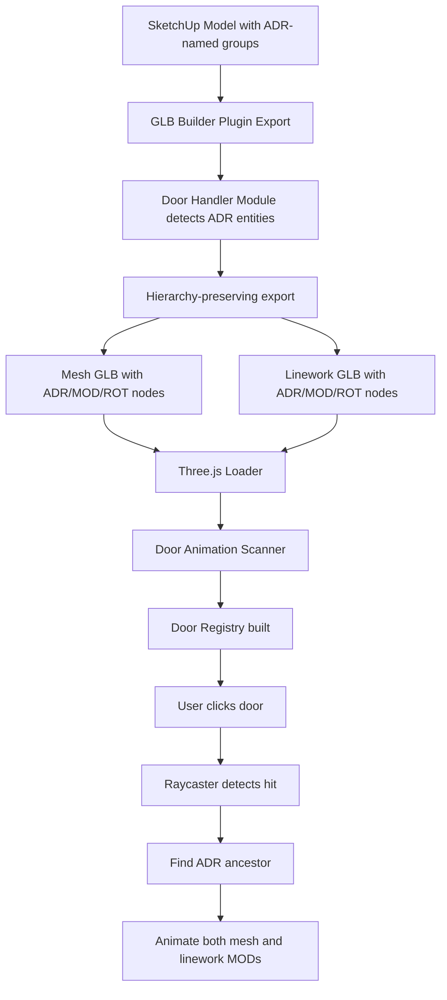

# Door Animation System - Technical Documentation
# =============================================================================
**Feature:** Click-to-Open Door Animation for ValeVision3D  
**Created:** 14-Feb-2026  
**Author:** Adam Noble - Noble Architecture  

---

## Table of Contents

1. [Overview](#overview)
2. [System Architecture](#system-architecture)
3. [Naming Conventions](#naming-conventions)
4. [SketchUp Model Setup](#sketchup-model-setup)
5. [GLB Export Process](#glb-export-process)
6. [Three.js Animation System](#threejs-animation-system)
7. [Coordinate System Transformations](#coordinate-system-transformations)
8. [Dual Model Animation](#dual-model-animation)
9. [Integration Guide](#integration-guide)
10. [Troubleshooting](#troubleshooting)

---

## Overview

The Door Animation System enables interactive door opening/closing in the ValeVision3D web viewer. Doors are modeled in SketchUp using a specific naming convention, exported with preserved hierarchy via the GLB Builder Utility, and animated in Three.js on user click.

**Key Features:**
- Click any door to open/close with smooth eased animation
- Simultaneous animation of mesh (solid) and linework (edges) models
- Mid-animation reversal support (click again to reverse direction)
- Configurable rotation angles per door (encoded in naming)
- No model modification — works via scene graph node transforms
- Automatic detection and registration of all door assemblies

**Components:**
- **SketchUp Ruby Plugin:** `Na__TrueVision__GlbBuilder__SpecialObject__DoorObjectHandling__.rb`
- **Three.js Animation Script:** `Test__ModelInteraction__Animation__ClickToOpenDoors__.js`

---

## System Architecture



---

## Naming Conventions

The system uses a three-tier naming convention in SketchUp to identify door components:

### **ADR (Door Assembly)**
- **Prefix:** `ADR`
- **Format:** `ADR###__[Description]`
- **Example:** `ADR002__InternalDoor__GroundFloor__PorchToLounge`
- **Purpose:** Top-level container for a door assembly
- **3-Digit Code:** Unique identifier for the door (001, 002, 003, etc.)
- **Description:** Arbitrary descriptive text using double-underscore delimiters

### **MOD (Modifier Object - Door Panel)**
- **Prefix:** `MOD`
- **Format:** `MOD###__ROT__[N]-Deg__[Description]`
- **Example:** `MOD001__ROT__90-Deg__DoorPanel`
- **Purpose:** Contains all geometry that rotates with the door (panel, handles, hinges, etc.)
- **3-Digit Code:** Padding only (not unique, may be arbitrary like 001)
- **`__ROT__` Tag:** Required identifier for rotation modifiers
- **`[N]-Deg` Pattern:** Rotation angle in degrees (e.g., `90-Deg`, `45-Deg`, `120-Deg`)
- **Description:** Arbitrary name for the door panel container

**Parsed by regex:** `/(\d+)-Deg/i` extracts the rotation value

### **ROT (Rotation/Hinge Point)**
- **Prefix:** `ROT`
- **Format:** `ROT###__[Description]`
- **Example:** `ROT001__RotationPoint__DoorHingeCentre`
- **Purpose:** Defines the 3D pivot point for door rotation (hinge location)
- **3-Digit Code:** Padding only (not unique)
- **Description:** Arbitrary descriptive text
- **Note:** Can be empty (no geometry) — its position vector is used as the pivot

### **Additional Child Objects**
Any other named child in the ADR assembly (e.g., `OuterShell`, `DoorFrame`) will be preserved in the hierarchy but **NOT** animated. Only the MOD object rotates.

---

## SketchUp Model Setup

### **Hierarchy Structure in SketchUp:**

```
SketchUp Model
├─ 01__OrbitHelperCube (tag: 01__)
├─ 07__Landscape (tag: 07__)
├─ 25__ProposedBuilding__Doors (tag: 25__) ← Door tag layer
│  └─ ADR002__InternalDoor__GroundFloor__PorchToLounge ← Door assembly group
│     ├─ MOD001__ROT__90-Deg__DoorPanel ← Rotating door panel (contains faces/edges)
│     │  ├─ [Nested groups with door panel geometry]
│     │  ├─ [Door handle 1 geometry]
│     │  └─ [Door handle 2 geometry]
│     ├─ OuterShell ← Fixed door frame (contains faces/edges)
│     │  └─ [Frame geometry]
│     └─ ROT001__RotationPoint__DoorHingeCentre ← Hinge pivot (position only)
```

### **Entity Naming:**

Set names in SketchUp by:
1. Select the group/component instance in the Outliner
2. Right-click → Entity Info
3. Set the **Instance Name** field to the required format (e.g., `ADR002__InternalDoor__GroundFloor__PorchToLounge`)

For component instances, the instance name takes priority over the definition name.

### **Tag/Layer Assignment:**

- Place all door assemblies on tag **`25__ProposedBuilding__Doors`**
- This exports to: `Na__NaModel__MainBuildingModel__ProposedDoors__MeshModel__.glb` and `*__LineworkModel__.glb`
- The tag determines the GLB filename, the ADR/MOD/ROT names determine the internal hierarchy

---

## GLB Export Process

### **Door Handler Module:** `Na__TrueVision__GlbBuilder__SpecialObject__DoorObjectHandling__.rb`

Located in:
```
C:\Users\Administrator\AppData\Roaming\SketchUp\SketchUp 2026\SketchUp\Plugins\
Na__TrueVision__WhitecardModel__GlbBuilderUtility__Modules__\
Na__TrueVision__GlbBuilder__SpecialObject__DoorObjectHandling__.rb
```

### **Detection Phase:**

During the recursive scene graph traversal in `TraverseEntities` and `TraverseEdges`:

1. **Top-level detection:** In `ExportEntitiesToGlb` and `ExportLineworkToGlb`, before recursing into each top-level entity, check if its name starts with `ADR`
2. **Nested detection:** During recursive traversal, check each group/component for `ADR` prefix
3. **Diversion:** When an ADR entity is detected, it's added to a `door_assemblies` list and **skipped** from normal virtual flattening
4. **Zero overhead:** When `door_assemblies` parameter is `nil` (default), no detection occurs

### **Hierarchy Preservation:**

Normal geometry (non-doors):
```ruby
# Virtual flattening (existing behavior)
All geometry → material buckets → flat glTF nodes → one mesh per material
```

Door assemblies (ADR-prefixed):
```ruby
# Hierarchy preservation (new behavior)
ADR entity → build ADR glTF node with world transform
  ├─ Iterate ADR children (MOD, ROT, OuterShell, etc.)
  ├─ Create child glTF nodes with local transforms
  └─ Extract geometry into child nodes (reuses TraverseEntities with Y-up root)
```

### **Transform Conjugation:**

SketchUp uses **Z-up** coordinates, glTF uses **Y-up**. The door handler uses **conjugation** to preserve local coordinate spaces:

```ruby
# Z_UP_TO_Y_UP_MATRIX = rotation -90° around X axis
# Y_UP_TO_Z_UP_MATRIX = inverse (rotation +90° around X axis)

# For ADR node:
adr_gltf_transform = accumulated_su_transform * Y_UP_TO_Z_UP_MATRIX

# For child nodes (MOD, ROT, etc.):
child_gltf_transform = Z_UP_TO_Y_UP * child_su_local_transform * Y_UP_TO_Z_UP

# Result: M_yup = Z_UP * M_su * inv(Z_UP)
# This is a similarity transform that preserves local coordinate frame relationships
```

**Why conjugation?**
- Simple multiplication `Z_UP * M` only converts world space, not local spaces
- Conjugation `Z_UP * M * inv(Z_UP)` converts **both** position and orientation to Y-up
- Child nodes can then use Y-axis `(0, 1, 0)` for vertical rotations in Three.js

### **Geometry Extraction:**

For each child of ADR (MOD, OuterShell, etc.):

**Mesh export:**
```ruby
# Use existing TraverseEntities with Z_UP_TO_Y_UP as root
Na__GlbEngine__TraverseEntities(
    child_entity.definition.entities,
    Z_UP_TO_Y_UP_MATRIX,        # Root transform
    child_entity.layer,
    local_buckets               # Isolated bucket store per child
)
# Result: vertices in Y-up local space, in meters
# Build mesh primitives and attach to child glTF node
```

**Linework export:**
```ruby
# Use existing TraverseEdges with Z_UP_TO_Y_UP as root
Na__LineworkEngine__TraverseEdges(
    child_entity.definition.entities,
    Z_UP_TO_Y_UP_MATRIX,        # Root transform
    child_entity.layer,
    positions,                  # Edge positions array
    colors                      # Edge colors array
)
# Result: edge endpoints in Y-up local space, in meters
# Build LINES primitive and attach to child glTF node
```

### **Output Structure:**

**Mesh GLB:**
```
Scene
└─ ADR002__InternalDoor__GroundFloor__PorchToLounge [node with world matrix]
   ├─ MOD001__ROT__90-Deg__DoorPanel [node with local matrix]
   │  └─ Layer0Default [mesh node with TRIANGLES primitive]
   ├─ OuterShell [node with local matrix]
   │  └─ Layer0Default_1 [mesh node with TRIANGLES primitive]
   └─ ROT001__RotationPoint__DoorHingeCentre [node with local matrix, no mesh]
```

**Linework GLB:**
```
Scene
└─ ADR002__InternalDoor__GroundFloor__PorchToLounge [node with world matrix]
   ├─ MOD001__ROT__90-Deg__DoorPanel [node with local matrix]
   │  └─ Linework [mesh node with LINES primitive]
   ├─ OuterShell [node with local matrix]
   │  └─ Linework_1 [mesh node with LINES primitive]
   └─ ROT001__RotationPoint__DoorHingeCentre [node with local matrix]
      └─ Linework_2 [mesh node with LINES primitive]
```

---

## Three.js Animation System

### **Module:** `Test__ModelInteraction__Animation__ClickToOpenDoors__.js`

Located in:
```
D:\80__External__LiveRepos\ValeCodebase\WebApps\ValeVision3D\
80__Testing__PrototypeEnvironment\TestEnv__CurrentFeatureTestScripts\
Test__ModelInteraction__Animation__ClickToOpenDoors__.js
```

### **Initialization:**

```javascript
// Called from main app after GLB models are loaded
Na__DoorAnimation__Initialize(
    scene,                   // Three.js scene
    camera,                  // Three.js camera
    renderer.domElement,     // Canvas DOM element for pointer events
    meshModelGroup,          // Group containing *__MeshModel__.glb
    lineworkModelGroup,      // Group containing *__LineworkModel__.glb
    config                   // Config object with animation settings
);
```

**Configuration options:**
```json
{
    "DoorAnimation__Enabled": true,
    "DoorAnimation__AnimationDurationMs": 600,
    "DoorAnimation__DefaultRotationDeg": 90,
    "DoorAnimation__ClickThresholdPx": 4
}
```

### **Door Scanning Process:**

**Phase 1: Scan mesh model**
```javascript
meshModelGroup.traverse((object) => {
    if (object.name.startsWith('ADR')) {
        // Find MOD child with __ROT__ tag
        const modObject = findModRotChild(object);
        
        // Find ROT child for hinge position
        const rotObject = findChildByPrefix(object, 'ROT');
        
        // Parse rotation angle from MOD name
        const targetAngleDeg = parseDegreesFromName(modObject.name); // e.g., "90" from "90-Deg"
        
        // Capture initial transforms
        const initialPosition = modObject.position.clone();
        const initialQuaternion = modObject.quaternion.clone();
        const pivotLocalPosition = rotObject.position.clone();
        
        // Create door record
        doorRegistry.set(adrName, {
            adrObjectMesh,
            modObjectMesh,
            rotObjectMesh,
            targetAngleRad,
            initialPosition,
            initialQuaternion,
            pivotLocalPosition,
            state: 'CLOSED',
            // ... animation state
        });
    }
});
```

**Phase 2: Link linework model**
```javascript
lineworkModelGroup.traverse((object) => {
    if (object.name.startsWith('ADR')) {
        const doorRecord = doorRegistry.get(object.name);
        
        if (doorRecord) {
            // Link linework objects to existing door record
            doorRecord.adrObjectLinework = object;
            doorRecord.modObjectLinework = findModRotChild(object);
            doorRecord.rotObjectLinework = findChildByPrefix(object, 'ROT');
        }
    }
});
```

### **Click Detection:**

**Pointer tracking:**
- Records pointer position on `pointerdown`
- On `pointerup`, calculates movement delta
- If movement > threshold (default 4px), ignores as orbit drag

**Raycasting:**
```javascript
// Convert pointer to NDC coordinates [-1, 1]
pointerNDC.x = ((clientX - canvasLeft) / canvasWidth) * 2 - 1;
pointerNDC.y = -((clientY - canvasTop) / canvasHeight) * 2 + 1;

// Cast ray from camera through pointer
raycaster.setFromCamera(pointerNDC, camera);

// Collect all door meshes (from both mesh and linework models)
const doorMeshes = collectDoorMeshes();

// Find intersections
const intersections = raycaster.intersectObjects(doorMeshes, false);

// Walk up from hit mesh to find ADR ancestor
const adrAncestor = findAdrAncestor(intersections[0].object);

// Look up door record and toggle
const doorRecord = doorRegistry.get(adrAncestor.name);
toggleDoor(doorRecord);
```

### **Animation Engine:**

**Per-frame update (called from render loop):**
```javascript
function Na__DoorAnimation__Update(deltaMs) {
    doorRegistry.forEach((doorRecord) => {
        if (doorRecord.state === 'OPENING' || doorRecord.state === 'CLOSING') {
            // Advance timer
            doorRecord.animElapsedMs += deltaMs;
            
            // Calculate normalized progress [0, 1]
            const rawT = animElapsedMs / animDurationMs;
            const easedT = easeInOutCubic(rawT);
            
            // Interpolate angle
            const currentAngle = startAngle + (endAngle - startAngle) * easedT;
            
            // Apply rotation to BOTH mesh and linework MOD objects
            applyPivotRotation(doorRecord, currentAngle);
            
            // Update state when complete
            if (rawT >= 1.0) {
                doorRecord.state = (state === 'OPENING') ? 'OPEN' : 'CLOSED';
            }
        }
    });
}
```

**Pivot rotation algorithm:**
```javascript
function applyPivotRotation(doorRecord, angleRad) {
    const pivot = doorRecord.pivotLocalPosition;  // From ROT position
    const rotQuat = new THREE.Quaternion().setFromAxisAngle(
        new THREE.Vector3(0, 1, 0),  // Y-axis (vertical)
        angleRad
    );
    
    // Apply to BOTH mesh and linework MOD objects:
    for (const modObject of [modObjectMesh, modObjectLinework]) {
        if (!modObject) continue;
        
        // Reset to initial transform
        modObject.position.copy(initialPosition);
        modObject.quaternion.copy(initialQuaternion);
        
        // Translate so pivot is at origin
        modObject.position.sub(pivot);
        
        // Rotate position vector
        modObject.position.applyQuaternion(rotQuat);
        
        // Translate back
        modObject.position.add(pivot);
        
        // Apply rotation to orientation
        modObject.quaternion.premultiply(rotQuat);
    }
}
```

---

## Coordinate System Transformations

### **SketchUp Coordinate System:**
- **Right-handed:** X = right, Y = forward, Z = up
- **Units:** Inches (internal, regardless of UI display units)

### **glTF Coordinate System:**
- **Right-handed:** X = right, Y = up, Z = backward
- **Units:** Meters

### **Conversion Matrix:**

```ruby
Z_UP_TO_Y_UP_MATRIX = Geom::Transformation.new([
    1.0,  0.0,  0.0, 0.0,   # X stays X
    0.0,  0.0, -1.0, 0.0,   # Y becomes -Z
    0.0,  1.0,  0.0, 0.0,   # Z becomes Y
    0.0,  0.0,  0.0, 1.0
])
# This is a -90° rotation around the X axis
# Maps: SketchUp (x, y, z) → glTF (x, z, -y)
```

### **Conjugation for Local Spaces:**

For door assemblies, we need local coordinate spaces to also be in Y-up:

```ruby
# Simple multiplication (WRONG for local spaces):
M_gltf = Z_UP_TO_Y_UP * M_sketchup
# This only converts world position, child rotations are still Z-up

# Conjugation (CORRECT for local spaces):
M_gltf = Z_UP_TO_Y_UP * M_sketchup * inv(Z_UP_TO_Y_UP)
# This converts both position and orientation axes to Y-up
# Child nodes can now use (0, 1, 0) as vertical axis
```

**Why this matters:**
- Without conjugation: Three.js would need to use `(0, 0, 1)` for door rotation (Z-axis)
- With conjugation: Three.js uses standard `(0, 1, 0)` for door rotation (Y-axis)
- This makes the Three.js code cleaner and matches glTF conventions

### **Unit Conversion:**

```ruby
# Translation components (matrix indices 12, 13, 14)
m[12] *= INCHES_TO_METERS  # 0.0254
m[13] *= INCHES_TO_METERS
m[14] *= INCHES_TO_METERS
```

---

## Dual Model Animation

### **Problem:**

ValeVision3D exports two GLB files per model series:
- **Mesh Model:** Solid geometry (faces)
- **Linework Model:** Edge geometry (visible edges as LINES primitives)

Both need to animate together when a door opens.

### **Solution:**

**1. Dual hierarchy export:**
- Both mesh and linework exporters detect ADR assemblies
- Both preserve the ADR > MOD/ROT hierarchy
- Same naming conventions in both GLB files

**2. Linked door registry:**
- Scan mesh model first, create door records
- Scan linework model second, link to existing records
- Each door record stores references to BOTH versions

**3. Synchronized animation:**
- `ApplyPivotRotation` applies transforms to both `modObjectMesh` and `modObjectLinework`
- Same pivot point, same angle, same timing
- Perfect visual sync between solid and edges

### **Door Record Structure:**

```javascript
{
    // Mesh model references
    adrObjectMesh:      Object3D,  // ADR node (mesh GLB)
    modObjectMesh:      Object3D,  // MOD node (mesh GLB)
    rotObjectMesh:      Object3D,  // ROT node (mesh GLB)
    
    // Linework model references
    adrObjectLinework:  Object3D,  // ADR node (linework GLB)
    modObjectLinework:  Object3D,  // MOD node (linework GLB)
    rotObjectLinework:  Object3D,  // ROT node (linework GLB)
    
    // Animation data (shared by both)
    adrName:            string,
    targetAngleRad:     number,
    initialPosition:    Vector3,   // MOD initial position
    initialQuaternion:  Quaternion, // MOD initial rotation
    pivotLocalPosition: Vector3,   // ROT position (hinge)
    state:              string,    // CLOSED/OPENING/OPEN/CLOSING
    currentAngleRad:    number,    // Current rotation angle
    animStartAngleRad:  number,
    animEndAngleRad:    number,
    animElapsedMs:      number,
    animDurationMs:     number
}
```

---

## Integration Guide

### **Step 1: Model Setup in SketchUp**

1. Create door assembly groups with ADR naming:
   - `ADR001__FrontDoor__MainEntrance`
   - `ADR002__InternalDoor__GroundFloor__PorchToLounge`
   - `ADR003__BedroomDoor__FirstFloor__MasterSuite`

2. Inside each ADR group, create:
   - `MOD001__ROT__90-Deg__DoorPanel` (contains all rotating geometry)
   - `OuterShell` or `DoorFrame` (contains fixed frame geometry)
   - `ROT001__RotationPoint__DoorHingeCentre` (empty group positioned at hinge)

3. Place all door assemblies on tag `25__ProposedBuilding__Doors`

### **Step 2: Export from SketchUp**

1. Extensions menu → TrueVision GLB Builder → Export GLBs
2. Select export directory
3. Check Ruby Console for door detection messages:
   ```
   [DoorHandler] Detected top-level door assembly: ADR002__InternalDoor__...
   [DoorHandler] Exporting 3 door assembly(ies)...
   [DoorHandler] Building door assembly: ADR002__InternalDoor__...
   ```

4. Generated files:
   - `Na__NaModel__MainBuildingModel__ProposedDoors__MeshModel__.glb`
   - `Na__NaModel__MainBuildingModel__ProposedDoors__LineworkModel__.glb`

### **Step 3: Load in Three.js**

```javascript
import { GLTFLoader } from 'three/addons/loaders/GLTFLoader.js';

const loader = new GLTFLoader();
const scene = new THREE.Scene();
const loadedModels = new THREE.Group();
scene.add(loadedModels);

// Load mesh model
const meshGltf = await loader.loadAsync('./models/Na__NaModel__MainBuildingModel__ProposedDoors__MeshModel__.glb');
meshGltf.scene.name = 'Na__NaModel__MainBuildingModel__ProposedDoors__MeshModel__';
loadedModels.add(meshGltf.scene);

// Load linework model
const lineworkGltf = await loader.loadAsync('./models/Na__NaModel__MainBuildingModel__ProposedDoors__LineworkModel__.glb');
lineworkGltf.scene.name = 'Na__NaModel__MainBuildingModel__ProposedDoors__LineworkModel__';
loadedModels.add(lineworkGltf.scene);
```

### **Step 4: Initialize Door Animation**

```javascript
import {
    Na__DoorAnimation__Initialize,
    Na__DoorAnimation__Update
} from './Test__ModelInteraction__Animation__ClickToOpenDoors__.js';

// Find door model groups
const doorMeshGroup = scene.getObjectByName('Na__NaModel__MainBuildingModel__ProposedDoors__MeshModel__');
const doorLineworkGroup = scene.getObjectByName('Na__NaModel__MainBuildingModel__ProposedDoors__LineworkModel__');

// Initialize door animation
const doorConfig = {
    DoorAnimation__AnimationDurationMs: 600,
    DoorAnimation__DefaultRotationDeg: 90,
    DoorAnimation__ClickThresholdPx: 4
};

Na__DoorAnimation__Initialize(
    scene,
    camera,
    renderer.domElement,
    doorMeshGroup,           // Mesh version
    doorLineworkGroup,       // Linework version
    doorConfig
);
```

### **Step 5: Animation Loop**

```javascript
function animate() {
    requestAnimationFrame(animate);
    
    const now = performance.now();
    const deltaMs = now - prevTimestamp;
    prevTimestamp = now;
    
    // Update door animations
    Na__DoorAnimation__Update(deltaMs);
    
    // Update controls
    controls.update();
    
    // Render
    renderer.render(scene, camera);
}

animate();
```

---

## Coordinate System Transformations

### **Why Y-up Matters for Animation:**

In Three.js, rotating an object around an axis uses:
```javascript
const quaternion = new THREE.Quaternion().setFromAxisAngle(
    new THREE.Vector3(0, 1, 0),  // Y-axis for vertical rotation
    angleInRadians
);
```

**Without Y-up conjugation in export:**
- glTF nodes would have Z-up local spaces
- Would need to rotate around `(0, 0, 1)` (Z-axis)
- Confusing and non-standard

**With Y-up conjugation in export:**
- glTF nodes have proper Y-up local spaces
- Rotate around `(0, 1, 0)` (Y-axis) — standard glTF convention
- Animation code is clean and matches glTF/Three.js best practices

### **Transform Flow:**

```
SketchUp Model (Z-up, inches)
    ↓ [GLB Builder Export with Conjugation]
glTF File (Y-up, meters, hierarchical nodes)
    ↓ [Three.js GLTFLoader]
Three.js Scene Graph (Y-up, meters)
    ↓ [Door Animation Script]
Animated Doors (rotate around Y-axis)
```

---

## Dual Model Animation

### **Mesh vs Linework:**

**Mesh Model:**
- Solid geometry (TRIANGLES primitives)
- Materials with colors/textures
- Raycaster can detect clicks on solid surfaces

**Linework Model:**
- Edge geometry (LINES primitives)
- Vertex colors (per-edge)
- Raycaster can detect clicks on lines (less common)

**Animation strategy:**
- Both models have identical hierarchy with identical node names
- Door record links to both versions
- Single animation state drives both transforms
- Visual result: solid geometry and edges rotate together perfectly

### **Mesh Collection for Raycasting:**

```javascript
function collectDoorMeshes() {
    const meshes = [];
    
    doorRegistry.forEach((doorRecord) => {
        // Collect from mesh model
        if (doorRecord.modObjectMesh) {
            doorRecord.modObjectMesh.traverse((child) => {
                if (child.isMesh) meshes.push(child);
            });
        }
        
        // Collect from linework model
        if (doorRecord.modObjectLinework) {
            doorRecord.modObjectLinework.traverse((child) => {
                if (child.isMesh) meshes.push(child);  // LINES are also THREE.Mesh
            });
        }
    });
    
    return meshes;
}
```

---

## Integration Guide

### **Main Application Integration:**

In `TestEnv__PrototypeTestingSandbox__Main__.js`:

```javascript
// After GLB models are loaded...

// Initialize door animation
const doorMeshGroup = TestEnv__Scene.getObjectByName('Na__NaModel__MainBuildingModel__ProposedDoors__MeshModel__');
const doorLineworkGroup = TestEnv__Scene.getObjectByName('Na__NaModel__MainBuildingModel__ProposedDoors__LineworkModel__');

if (doorMeshGroup || doorLineworkGroup) {
    Na__DoorAnimation__Initialize(
        TestEnv__Scene,
        TestEnv__Camera,
        TestEnv__Renderer.domElement,
        doorMeshGroup,           // Can be null if not loaded
        doorLineworkGroup,       // Can be null if not loaded
        TestEnv__Config.DoorAnimation
    );
    console.log('[TestEnv] Door animation initialized');
}

// In animation loop...
function animate() {
    const deltaMs = performance.now() - prevTimestamp;
    prevTimestamp = performance.now();
    
    Na__DoorAnimation__Update(deltaMs);  // Update all door animations
    
    // ... rest of animation loop
}
```

### **Configuration File:**

In `TestEnv__SubAppData__Config.json`:

```json
{
    "DoorAnimation": {
        "DoorAnimation__Enabled": true,
        "DoorAnimation__AnimationDurationMs": 600,
        "DoorAnimation__DefaultRotationDeg": 90,
        "DoorAnimation__ClickThresholdPx": 4
    }
}
```

---

## Troubleshooting

### **Door doesn't animate when clicked**

**Check 1: Hierarchy exported correctly?**
- Use Node Graph Explorer to verify ADR > MOD/ROT structure
- Should see: `[Object3D] ADR002__...` with `[Object3D] MOD001__ROT__...` as child
- If flattened to single mesh: re-export GLB after plugin update

**Check 2: Console messages during GLB export?**
```
[DoorHandler] Detected top-level door assembly: ADR002__...
[DoorHandler] Building door assembly: ADR002__...
```
If missing: door names in SketchUp don't start with `ADR`

**Check 3: Console messages during Three.js load?**
```
[DoorAnimation] Registered door (mesh): "ADR002__..." (90 deg)
[DoorAnimation] Linked linework for door: "ADR002__..."
[DoorAnimation] Scan complete. 1 door(s) found.
```
If missing: initialization not called or model groups not found

**Check 4: Model groups passed to initializer?**
```javascript
// WRONG (old signature):
Na__DoorAnimation__Initialize(scene, camera, canvas, rootGroup, config);

// CORRECT (new signature):
Na__DoorAnimation__Initialize(scene, camera, canvas, meshGroup, lineworkGroup, config);
```

### **Door rotates but in wrong direction**

**Check rotation axis:**
- Should be `new THREE.Vector3(0, 1, 0)` (Y-up)
- NOT `new THREE.Vector3(0, 0, 1)` (Z-up, old workaround)

**Check GLB export:**
- Must use updated GLB Builder plugin with conjugation
- Older GLB exports may have Z-up local spaces

### **Only mesh animates, linework doesn't move**

**Check linework linking:**
- Console should show: `[DoorAnimation] Linked linework for door: "ADR002__..."`
- If missing: linework GLB not loaded or has different ADR names

**Check model group names:**
- Mesh group: `Na__NaModel__MainBuildingModel__ProposedDoors__MeshModel__`
- Linework group: `Na__NaModel__MainBuildingModel__ProposedDoors__LineworkModel__`
- Must match exactly (set via `gltf.scene.name` after loading)

### **Door names in SketchUp:**

**Entity name precedence:**
1. Group instance name: `entity.name` (if set)
2. Component instance name: `entity.name` (if set)
3. Component definition name: `entity.definition.name` (fallback)

Always set the **instance name** in SketchUp's Entity Info panel for reliable detection.

### **MOD rotation angle not parsing:**

**Regex pattern:** `/(\d+)-Deg/i`

**Valid formats:**
- `MOD001__ROT__90-Deg__DoorPanel` ✅
- `MOD001__ROT__45-Deg__DoorPanel` ✅
- `MOD001__ROT__120-deg__DoorPanel` ✅ (case insensitive)

**Invalid formats:**
- `MOD001__ROT__90__DoorPanel` ❌ (missing `-Deg`)
- `MOD001__ROT__ninety-Deg__DoorPanel` ❌ (not a number)

If parsing fails, uses `DoorAnimation__DefaultRotationDeg` (default 90°).

---

## Performance Notes

### **Raycasting Optimization:**

- Only door meshes are included in raycast intersection tests
- Non-door geometry is excluded from click detection
- O(n) where n = number of door panel meshes (typically 1-10 per door)

### **Animation Updates:**

- Per-frame loop only processes doors in `OPENING` or `CLOSING` states
- Idle doors (CLOSED or OPEN) are skipped
- O(m) where m = number of actively animating doors

### **Memory:**

- Each door stores ~200 bytes of state (transforms, angles, state)
- Minimal overhead: 100 doors ≈ 20 KB

---

## Future Enhancements

### **Planned Features:**
- Proximity-based door opening (auto-open when camera approaches)
- Audio cues (hinge creak, latch click)
- Collision detection (prevent camera passing through closed doors)
- Door state persistence (remember open/closed state)
- Animated door swings (double doors, sliding doors)

### **Advanced Naming Patterns:**
- `MOD__SLIDE__[Distance]mm__[Description]` for sliding doors
- `MOD__ROTATE__[Angle]-Deg__[Axis]__[Description]` for arbitrary rotation axes
- Multiple MOD objects per ADR for double doors

---

## API Reference

### **Public Functions:**

#### `Na__DoorAnimation__Initialize(scene, camera, rendererDomElement, modelGroupMesh, modelGroupLinework, config)`

Initializes the door animation system.

**Parameters:**
- `scene` (THREE.Scene): Three.js scene reference
- `camera` (THREE.Camera): Three.js camera reference
- `rendererDomElement` (HTMLElement): Canvas element for pointer events
- `modelGroupMesh` (THREE.Group | null): Group containing mesh model GLB
- `modelGroupLinework` (THREE.Group | null): Group containing linework model GLB
- `config` (Object): Configuration object with animation settings

**Config properties:**
- `DoorAnimation__AnimationDurationMs` (number): Animation duration in milliseconds
- `DoorAnimation__DefaultRotationDeg` (number): Fallback rotation if parsing fails
- `DoorAnimation__ClickThresholdPx` (number): Max pointer movement for click detection

**Returns:** void

---

#### `Na__DoorAnimation__Update(deltaMs)`

Updates all door animations. Call every frame in the render loop.

**Parameters:**
- `deltaMs` (number): Time elapsed since last frame in milliseconds

**Returns:** void

---

#### `Na__DoorAnimation__ScanForDoors()`

Re-scans the scene graph for door assemblies. Useful if GLB models are dynamically loaded/unloaded.

**Parameters:** none

**Returns:** void

---

## Version History

**Version 1.0.0** (14-Feb-2026)
- Initial implementation
- Single model group support
- Z-axis rotation workaround

**Version 1.1.0** (14-Feb-2026)
- Dual model group support (mesh + linework)
- Y-axis rotation (proper Y-up coordinate space)
- Hierarchy-preserving GLB export integration
- Synchronized mesh and linework animation
- Top-level door detection support

---

## Related Files

**SketchUp Plugin:**
- `Na__TrueVision__GlbBuilder__SpecialObject__DoorObjectHandling__.rb` — Door export handler
- `Na__TrueVision__GlbBuilder__EngineCore__GeometryHandling__.rb` — Mesh traversal with door detection
- `Na__TrueVision__GlbBuilder__EngineCore__LineworkModelHandling__.rb` — Linework traversal with door detection
- `Na__TrueVision__GlbBuilder__EngineCore__.rb` — Main export orchestrator
- `Na__TrueVision__GlbBuilder__Main__.rb` — Module loader and TAG_RANGES configuration

**Three.js Application:**
- `Test__ModelInteraction__Animation__ClickToOpenDoors__.js` — Door animation module
- `TestEnv__PrototypeTestingSandbox__Main__.js` — Main app bootstrap and initialization
- `TestEnv__SubAppData__Config.json` — Animation configuration

---

## Contact & Support

For questions or issues with the door animation system, contact:
- **Adam Noble** - Noble Architecture
- ValeDesignSuite Project

---

# =============================================================================
# END OF DOCUMENTATION
# =============================================================================
