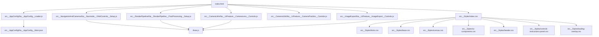

# ValeVision3D Dependency Chart

## High-Level Module Graph

```mermaid
flowchart TD
    indexHtml[index.html] --> appConfigLoader[src__AppConfig/Na__AppConfig__Loader.js]
    appConfigLoader --> appConfigJson[src__AppConfig/Na__AppConfig__Main.json]

    indexHtml --> navControls[src__NavigationAndCameras/Na__Navmode__OrbitControls__Setup.js]
    indexHtml --> renderPipeline[src__RenderPipeline/Na__RenderPipeline__PostProcessing__Setup.js]
    indexHtml --> cameraLens[src__CameraUtils/Na__UiFeature__CameraLens__Controls.js]
    indexHtml --> cameraPosition[src__CameraUtils/Na__UiFeature__CameraPosition__Controls.js]
    indexHtml --> imageExport[src__ImageExport/Na__UiFeature__ImageExport__Controls.js]

    indexHtml --> stylesIndex[src__Styles/index.css]
    stylesIndex --> stylesFonts[src__Styles/fonts.css]
    stylesIndex --> stylesBase[src__Styles/base.css]
    stylesIndex --> stylesCanvas[src__Styles/canvas.css]
    stylesIndex --> stylesUi[src__Styles/ui-components.css]
    stylesIndex --> stylesHeader[src__Styles/header.css]
    stylesIndex --> stylesControls[src__Styles/controls-instructions-panel.css]
    stylesIndex --> stylesLoading[src__Styles/loading-overlay.css]

    navControls --> threeLib[three.js]
    renderPipeline --> threeLib
    cameraLens --> threeLib
    imageExport --> threeLib
```

## Notes
- `index.html` is the only entry point and imports all modules.
- Three.js is loaded via import map in `index.html`.
