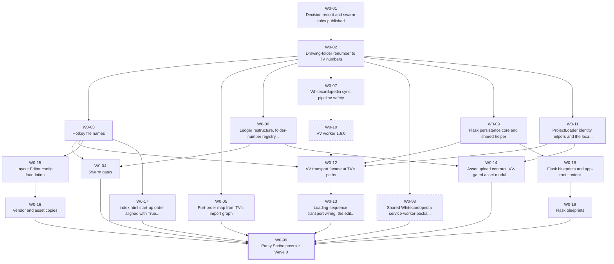
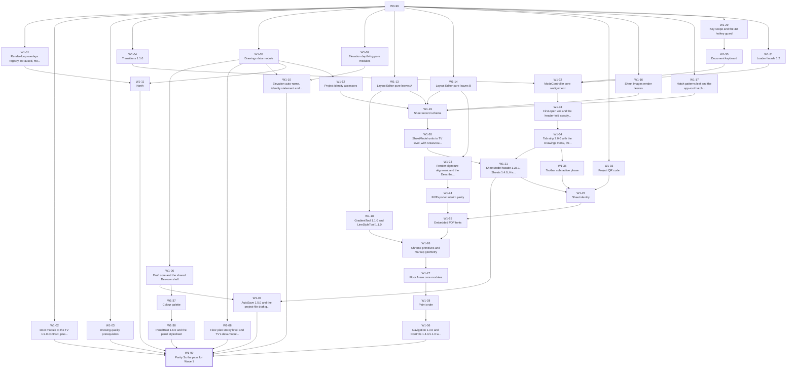
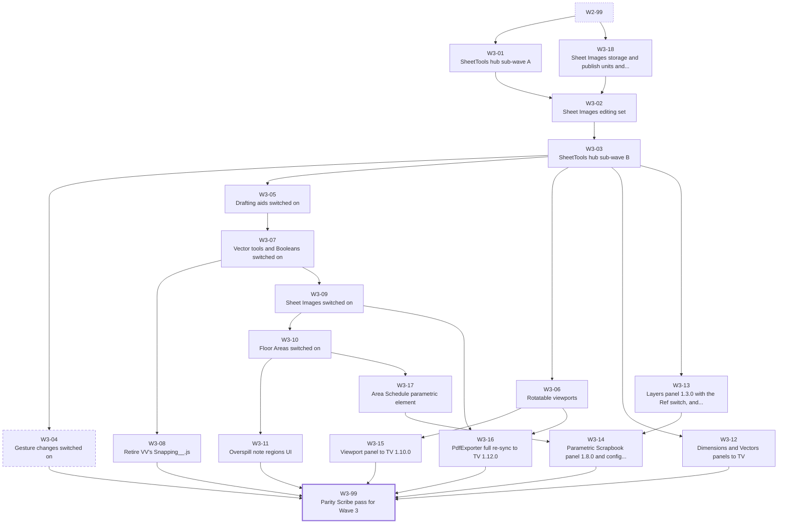
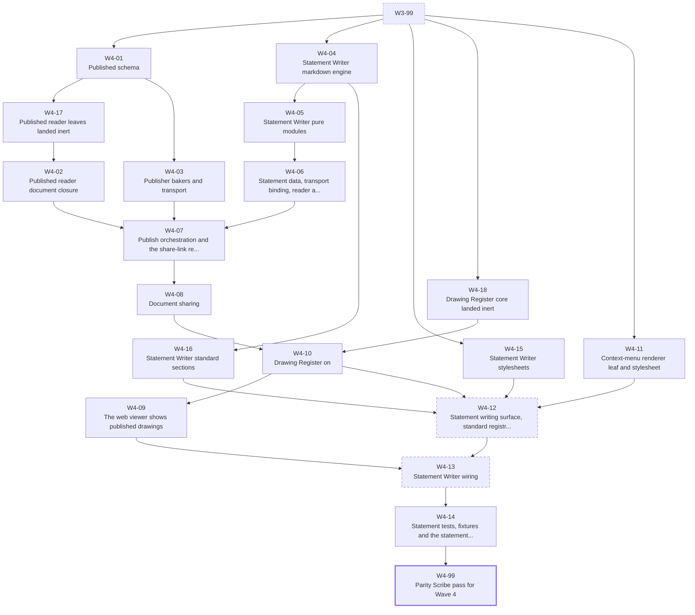
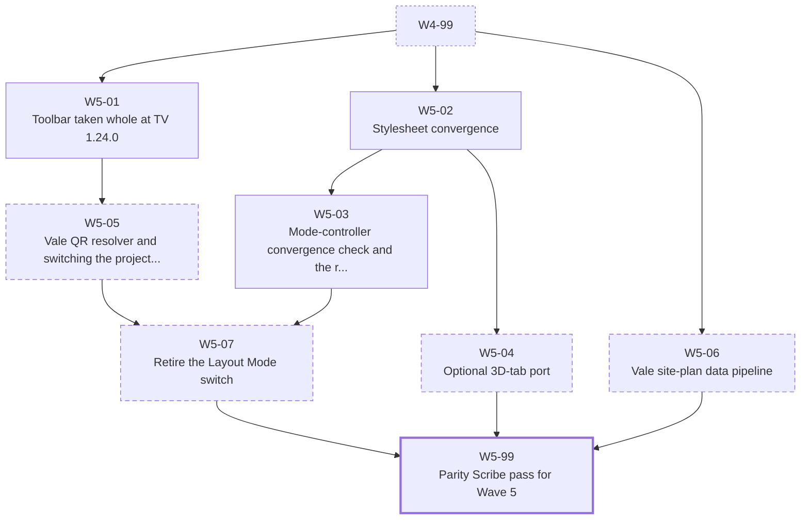
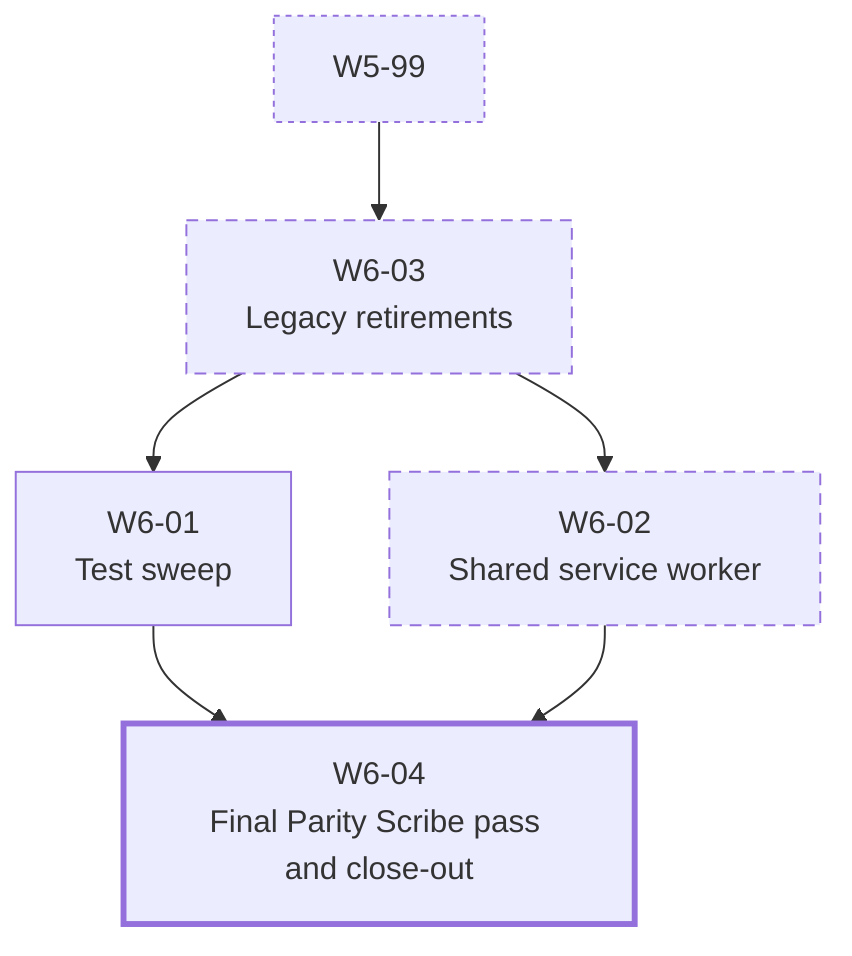
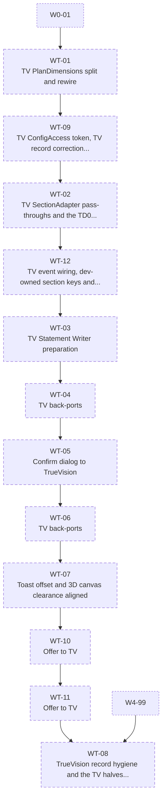

# K3 - Canonical Work Packages: ValeVision drawing-system parity with TrueVision

Generated 01-Oct-2026 by `parity/report/tools/k3_build.py` (catalogue modules `k3_cat_w0..w4`, `k3_cat_w56`, `k3_cat_wt`). TrueVision (lead) HEAD b2aa9151 (v2.172.0); ValeVision (target) HEAD 7b4e593a (v2.71.0). Read-only on both apps; every path below was checked against the tree snapshots or, outside them, on disk.

Machine-readable outputs: `parity/data/wp_canonical.json` (catalogue, DAG, critical path, test ownership), `parity/data/wp_raw_map.json` (raw-id map), `parity/data/hot_file_ownership.json` (hot files).

**Section F corrections applied (01-Oct-2026).** Section F of the parity report (R6) corrects this catalogue in its F.8 rows C1-C36 (C34-C36 added by the report's final harmonisation, H1, 01-Oct-2026); `k3_build.py` applies them through `k3_f8_corrections.py` (the ops are in `r6_corrections.py`), so this document and the JSON carry them: a changed line ends in `[F.8 Cn]`, an added target, hot file or source note carries `(F.8 Cn)`, each corrected package lists its rows in `f8_corrections`, swarm rules R3, R5, R8, R11 and gate G4 are amended, and W5-07 is the package C33 added. Every change, with its old and new text, is in `parity/data/wp_corrections_applied.json`; the files from before the corrections are kept as `*.pre_h2.json` (this document as `K3__WorkPackages.pre_h2.md`). Rows C5 and C8 change nothing in K3.

## 1. Summary

- **221 raw work packages** (`data/work_packages.json`) become **165 canonical packages**: 153 in the ValeVision waves W0-W6 and 12 in the TrueVision lane WT. 220 raw ids are mapped (each to exactly one primary package), 1 is dropped with a reason, and the 68 raw ids the verifiers refuted or superseded (some still named in raw dependencies or K1 blocks) are mapped through their live replacements.
- **The dependency graph is acyclic** (topological sort of all 165 packages succeeds); every wave starts after the previous wave's Parity Scribe pass and every scribe closes its wave.
- **Critical path (VV waves, by estimated lines): 65,429 lines over 53 packages**; by package count it is 56 packages long. The longest stretch is W4 (19,460 lines).
- **93 files are written by more than one package.** Every same-wave pair is ordered by the DAG (46 files carry a same-wave serial order); the VV devlog and ledger have one integrator, the Parity Scribe.
- **7 packages remain XL**, each with a recorded split_justification (atomic, small but over 15 files, or conditional and unestimated): W0-02, W0-03, W0-15, W3-03, W4-12, W5-06, WT-01.
- Validation: 0 errors, 0 warnings (section 13).

## 2. Conventions

Paths: `TVM/` = TrueVision `02__Src__AppModules`, `TV/` = TrueVision app root, `VVM/` = ValeVision `02__Src__AppModules` (target paths, after W0-02), `VV/` = ValeVision app root, `WCP/` = Whitecardopedia, `VCB/` = ValeCodebase git root, `NAAPPS/` = NaWeb/na-apps, `NAWEB/` = NaWeb (TrueVision git root). A target marked `(new)` is created by that package.

Size: S <= 300 est. lines, M <= 1,200, L <= 2,500, XL above 2,500 or more than 15 files; every XL carries split_justification.

**Standard gates** (every VV coding package; the JSON lists which apply per package):

- G1: node VV/80__Testing__PrototypeEnvironment/Na__Verify__ModuleGraph__.mjs exits 0 (baseline 01-Oct-2026: 517 modules, 0 failures; the count only grows).
- G2: node VV/80__Testing__PrototypeEnvironment/Na__Verify__Exports__.mjs exits 0 with a non-zero file count (it also checks modules nothing imports yet, so an inert landing must still link).
- G3: python parity/report/tools/k2_path_gate.py --root <VV app root> exits 0 (CSS @import, new URL(...), config path strings, retired folder names).
- G4 (from W0-04 on): node VV/80__Testing__PrototypeEnvironment/Na__Verify__ParityNaming__.mjs and Na__Verify__PortNotes__.mjs exit 0 (VALEVISION3D banners, FILE lines, no [TrueVision3D prefix, no TrueVision__ literal, no window.TrueVision__, no NaProjectPortal / 30__TrueVision__AppContent / /na-apps/30__TrueVision__CoreAppCode / noble-architecture.com/q/ or /s/, every PORT NOTE carries a Source version, no {{VVREL: token left after the scribe). Exempt: the whole PORT NOTE block of a file, history documents (devlog, ledger, __PLAN__, __NOTES__, Research__ and TASK__ files) and the named TrueVisionHub statement file W4-12 keeps at TV's path. A hit on W0-04's baseline allow-list prints WARN instead of failing: the SpecPdf__.js:147 read until W0-12 (that part is empty by W0-99), and PORT NOTEs written before the K2 H5 format without a Source version line until a package next writes the file. [F.8 C13]
- G5: every ported or new TV test named in tests_to_port exits 0 under node (mjs/cjs) or python (py) from the VV app root; browser harnesses (.html) are run on the WCP Flask server.
- G6: VVM/80__CloudflareIntegration/Na__CloudflareIntegration__ApiClient__.js is VV's own facade (W0-12): no VV file contains TV's transport (na-truevision-api, NaProjectPortal/, a TV R2 key builder) and no VV file was copied from TV 80__CloudflareIntegration. (This replaces the older slice acceptance line "No file under VVM imports 80__CloudflareIntegration", which predates K1 DR-27.)
- G7: the package returns a Port Record (S11 Appendix C) and never edits VV/ValeVision__PARITY__TrueVisionLedger__.md or VV/ValeVision__DEVLOG__.md; module DEVELOPMENT LOG lines carry {{VVREL:<wp_id>}} for the Parity Scribe to resolve.

**Swarm rules:**

- R1 (DR-05): one owner per file per wave; a hot file is edited only as its hot_file_ownership rule says (integrator or the stated serial order).
- R2 (DR-05): leaves first, hubs last. A TV file is taken whole only once every module and name it imports exists in VV; until then it is not landed (no throwaway stubs) unless a package names an explicit, recorded seam.
- R3 (DR-05/K2 H5): a whole-file port takes TV HEAD b2aa9151 text verbatim and re-applies only the listed VV seams (banner token, console prefix, PORT NOTE, app-token literals, VV transport through the facade, VV-only exports). After W0-02 no folder-number seam exists for 40/42-46 and folder paths port unchanged. The pin advances per file only at a wave boundary and only by the delegator: a TV file an approved WT package changed takes Adam's TV commit as its pin for every VV package dispatched afterwards; Adam's own TV releases after b2aa9151 wait until the delegator re-pins those files; a delta to a file already ported becomes a Release Watermark row and a follow-up hunk package; the Port Record names the commit read (F.1 P2). [F.8 C3]
- R4 (DR-34): a whole-file port takes TV's module version and DEVELOPMENT LOG; VV history moves to one PORT NOTE line. Hunk-replayed files keep VV's own sequence plus a Source version line.
- R5 (S11 B10): coding packages never edit the ledger or the VV devlog; the Parity Scribe pass of each wave allocates VV versions (step size per W0-01: Adam's devlog memory says patch bumps, DR-34 assumes v2.72.0 onwards; if Adam has not answered by W0-99, patch steps from v2.71.1, F.5.5), resolves {{VVREL:}} tokens, writes devlog entries and ledger rows. [F.8 C6]
- R6 (DR-07): no package edits or bumps the shared Whitecardopedia service worker except W0-08 and W6-02; every Port Record carries a SHARED SERVICE WORKER note (new modules, new exports, bump needed yes/no).
- R7 (DR-36): no package edits TrueVision except the WT lane, and only with Adam's per-package approval; VV never copies TV's known-broken variants over working VV ones (DR-37 item 4).
- R8 (DR-06/DR-28): no package writes new pictures, published files or statements under VaApps/Projects/{folderId}/ subfolders on R2 until Adam has applied the W0-07 sync fix and deployed worker 1.6.0 (their routes are new in W0-10, and the deployed /assets route accepts only thumbnail, linework and snapshot keys); worker routes are proven under wrangler dev and deployed by Adam only. [F.8 C29]
- R9 (DR-43/K2 V2): NA-only content never ships in VV; features whose content is NA-only land switched off until Adam supplies Vale content.
- R10 (DR-01/DR-40): TV releases Adam has not confirmed are ported but named in the Port Record; the four gesture changes (DR-40 items 7-10) are held until Adam says yes (guard constants in W3-03, removed by W3-04).
- R11 (waves): a wave starts only after the previous wave's Parity Scribe pass (its xx-99 package) has finished; Adam commits once per wave (S11 B10 item 7). Inside W0 Adam also commits twice: W0-01's PLAN edit alone before W0-02 is dispatched, then W0-02 alone (code only) before any other W0 package (F.5.7). [F.8 C10] Every commit stages only the integrator's path list, never git add -A at VCB/ (F.1 P19). [F.8 C4] A hard-gated package whose gate is still closed when the rest of its wave is DONE is marked SKIPPED-HELD by the integrator, which counts as DONE for its dependents and its scribe; released later, it runs as a follow-up after a hot-file re-check (F.4.2 step 6). [F.8 C9]

A package's `gated_by` lists every decision that changes its scope or content (provenance in the JSON). It runs on the DR default when unanswered, unless its **hard gate** says it waits.

## 3. Wave summary

| Wave | Theme | Packages | Est. lines | S / M / L / XL | Entry | Exit | Wave critical path (lines) |
|---|---|---|---|---|---|---|---|
| W0 | Foundations: decision record and swarm gates, the scripted renumber, hotkey names, the transport (Flask, worker, facade, loader helpers), the Layout Editor config foundation, vendor copies, sync safety and the shared service-worker package (prepared). | 20 | 15,619 | 6 / 8 / 3 / 3 | W0-01 | W0-99 | 5,599 |
| W1 | Core data and hubs: render-loop overlays, ProjectData and AutoSave over the facade, record/model leaves, SheetRecords and SheetModel, chrome and paint order, keyboards, the loader facade, the mode-controller core, veil, header fold and tab strip. | 39 | 34,200 | 8 / 21 / 10 / 0 | W0-99 | W1-99 | 12,950 |
| W2 | Subsystems: drawing planes, fog, folder 50, render styles, linework modifiers, site-plan leaves (dormant), drafting modules, object snap, measurements, grips, vector units (inert), spec lockstep, parametric engine; ends with the viewport convergence. | 44 | 52,190 | 9 / 13 / 22 / 0 | W1-99 | W2-99 | 13,570 |
| W3 | The SheetTools hub in two sub-waves around Sheet Images, then feature activation: drafting aids, rotation, vector tools, Sheet Images, Floor Areas, regions, panels and the PdfExporter re-sync. | 19 | 15,020 | 6 / 9 / 3 / 1 | W2-99 | W3-99 | 11,330 |
| W4 | Documents: published schema and reader, publisher, sharing, the published-only web viewer, the Drawing Register, and the Statement Writer last, switched off (DR-10). | 19 | 33,960 | 1 / 4 / 13 / 1 | W3-99 | W4-99 | 19,460 |
| W5 | Convergence and options: the toolbar taken whole, stylesheet and mode-controller convergence checks, and the decision-gated packages (Cache & Storage, QR resolver, site-plan pipeline). | 8 | 2,590 (+1 unestimated) | 4 / 3 / 0 / 1 | W4-99 | W5-99 | 1,570 |
| W6 | Close-out: legacy retirements, the test sweep, the shared service-worker refresh and the final Parity Scribe pass. | 4 | 1,070 | 2 / 2 / 0 / 0 | W5-99 | W6-04 | 950 |
| WT | TrueVision lane (DR-36): back-ports and record fixes in TrueVision, each only with Adam's per-package approval; outside the VV wave barrier. | 12 | 4,010 | 8 / 3 / 0 / 1 | W0-01 (lane start) | WT-08 | 4,010 |

## 4. Wave design: adjustments made on the evidence

The starting design was W0 foundations, W1 core, W2 subsystems, W3 hubs and activation, W4 documents, W5 polish, W6 close-out. These changes come from the code:

| Adjustment | Evidence |
|---|---|
| Viewport units converge at the end of W2 (W2-16), together with Model Source and the site-plan painter. | The painter imports names VV's current files lack (EdgeStyles FillHex, ModelLayers Token/IsOn, Frame States/SizeLayer/HideProgress, Window, Linework StyleToken/StyleBands/BandPaths), so ModelSource, the painter and the viewport units form one import cycle (S04a-V01). |
| The SheetTools hub lands in two sub-waves around the Sheet Images editing set (W3-01, W3-18/W3-02, W3-03). | SheetImages__Insert__ imports the hub's ToolState PickUpMove while the hub statically imports Crop and Menu (S05a-F55, S05a-V01; TV Insert import lines read at HEAD). |
| The 49 depth-fog pure leaves go to W1 (W1-09), ahead of the elevation data module. | TV Na__Elevation__ProjectJson__Data__ 1.1.0 imports 49 RecordData (TV :84-89). |
| The Drawing Register moved to W4, after publishing and sharing. | Register__Editor imports 65 Publish__Panel, 66 Share__Button and 31 DocumentKeys (TV import lines); landing it earlier would need seams in all three (S07a-F22). |
| The Statement Writer is last (W4-04..W4-16, W4-12, W4-13), behind LayoutEditor__Statement__Enabled = false. | DR-10 default; its surface imports the QR modules, the register and sharing. |
| PDF.js is vendored in W0-16 (VV vendor 07), not with the Register. | TV loads PDF.js from PlanVision's NA path (TV LE AppConfig :1200-1201, ConfigState__EditorSetup :403-404), which VV cannot use; W0-15 writes the VV vendor-07 path into the LE config, so the file must exist from W0 for the K2 path gate (G3). |
| Oversized packages are split along TV import lines into inert leaf landings and a switch-on package. | Reader (W4-17 -> W4-02), register (W4-18 -> W4-10), Statement Writer (W4-04 -> W4-05/W4-16; W4-15), object snap (W2-42 -> W2-19), folder 50 (W2-43 -> W2-06), drawing planes (W2-40 -> W2-01), vector tools (W2-28 -> W2-41), parametric elements (W2-38, W2-39), Sheet Images (W3-18 -> W3-02), Area Schedule (W3-17). Each inert landing links on its own (G2 checks unreachable modules). |
| The toolbar is taken whole only in W5 (W5-01). | TV Toolbar 1.24.0 statically imports ten feature modules from W2-W4 (WP-S06a-10v); W1-35 removes VV-only buttons first and no interim feature buttons are added. |
| W6 retires legacy folders before the test sweep and the service-worker refresh. | The precache list must not name retired files, and the sweep must run on the final tree. |
| TrueVision edits form their own serial lane (WT) outside the VV barrier. | DR-36 default (a) means none of them runs until Adam approves each; every WT package edits TrueVision__DEVLOG__.md, so the lane is serial. |

## 5. Catalogue by wave

Each wave has a dependency diagram (transitive reduction; the dashed node is the previous wave's scribe; dashed borders are hard-gated packages) and one table. Goals, targets, adaptations, acceptance and tests in full are in `wp_canonical.json`.

### Wave W0

Foundations: decision record and swarm gates, the scripted renumber, hotkey names, the transport (Flask, worker, facade, loader helpers), the Layout Editor config foundation, vendor copies, sync safety and the shared service-worker package (prepared).

| ID | Package and goal | Size (est. lines) | Depends on | Gated by | Hot files | Raw sources | Risk |
|---|---|---|---|---|---|---|---|
| W0-01 | **Decision record and swarm rules published** Record Adam's answers (or the K1 defaults) to DR-01..DR-44 as new VV D-numbers in the VV port plan, settle the cross-slice values every later package reads (document id rule, sheet-image folder, share-link token, PDF face), confirm the VV devlog version step, and publish the swarm rules and the shared-service-worker note format. | S (200) | - | DR-01, DR-02, DR-03, DR-04, DR-05, DR-06, DR-07, DR-22, DR-35 | ValeVision__PLAN__TrueVisionPort__LayoutEditor__.md | WP-S08-15, WP-S04b-16 | Low effort, high leverage: without it agents pick different answers for the same seam (S08-V05). |
| W0-02 | **Drawing-folder renumber to TV numbers (atomic, scripted, alone)** Run K2's scripted W1 change: legacy 40__System__2dElevationsView -> 91, VV 42..47 -> TV 40, 42..46, 2dProfileLines -> 05__RenderPipeline, ComposerPreset -> RenderPreset (DIV-1 body kept), SnapshotHistory -> TV file name, DistanceCulling -> 05__RenderPipeline; every specifier, CSS @import, config path string and false PORT NOTE line rewritten in one commit. | XL (1,049) | W0-01 | DR-02, DR-03, DR-04 | Na__AppConfig__Main.json, Na__AppFlow__LoadingSequence.js, Na__CoreUi__Styles__Index__.css, Na__Elevation__ModeController__.js, Na__FloorPlan__ModeController__.js, Na__LayoutEditor__Assets__.js, Na__LayoutEditor__AutoSave__.js, Na__LayoutEditor__History__.js, Na__LayoutEditor__Loader__.js, Na__LayoutEditor__MarkupBridge__.js, Na__LayoutEditor__ModeController__.js, Na__LayoutEditor__Panel__ViewportSettings__.js, Na__LayoutEditor__PdfExporter__.js, Na__LayoutEditor__SheetModel__.js, Na__LayoutEditor__SheetRecords__.js, Na__LayoutEditor__SnapshotRenderer__.js, Na__LayoutEditor__SpecPdf__.js, Na__ProjectedLinework__ConfigAccess__.js, Na__ProjectedLinework__Persistence__.js, Na__ProjectedLinework__Pipeline__.js, index.html | WP-S01-01R, WP-S02a-01, WP-S02a-12; split from WP-S09-10 | Highest-contention package: no other package may be in flight on VV while it runs. Deploy hazard (stale SW-cached LoadingSequence next to a new index.html) is handled by W0-08 and Adam's DR-07 token decision, not here. |
| W0-03 | **Hotkey file names (name only) and identity hygiene** Rename the two VV key files to TV's names without changing content (FR-12, FR-13) and remove the two known TrueVision identity leaks. | XL (60) | W0-02 | DR-33 | Na__AppUtils__ValeVision__HotkeyHandler__.js, Na__LayoutEditor__AppConfig__.json, Na__LayoutEditor__ConfigState__.js, Na__LayoutEditor__ConfigState__KeyMap__.js, Na__LayoutEditor__Controls__Pc__.js, Na__LayoutEditor__Controls__TouchScreen__.js, Na__LayoutEditor__SpecPdf__.js, Na__UiFeature__NavigationHelpPanel__Controls.js, index.html | WP-S01-03R | Low. TV drawing-tab key CONTENT must not land before ConfigState__KeyMap__ 1.11.0 (W0-15): T would resolve to Trim. |
| W0-05 | **Port-order map from TV's import graph (leaves first, hubs last)** For every TV module the swarm takes whole, compute the closure of imports missing in VV after W0-02 and emit the blocked-by list and a leaves-first order that the planner and the Parity Scribe use; flag every 80__CloudflareIntegration / LocalProjectMirror / NAAPPS import as a transport seam (resolved by the W0-12 facade). | S (300) | W0-02 | DR-05 | - | WP-S11-08 | None to either app (read-only). |
| W0-06 | **Ledger restructure, folder-number registry and records hygiene** Restructure the VV parity ledger (Module Register, Release Watermark, Decisions, back-ports, Archive), add the folder-number registry and the renumber map, mirror TV's realign plan name, fix every stale row the slices found, and tidy module log order - comment and documentation edits only. | M (900) | W0-02 | DR-02, DR-03, DR-07, DR-24, DR-26, DR-35, DR-36 | Na__AppUtils__R2AssetUpload__.js, Na__LayoutEditor__History__.js, Na__LayoutEditor__Toolbar__.js, ValeVision__DEVLOG__.md, ValeVision__PARITY__TrueVisionLedger__.md, ValeVision__PLAN__TrueVisionPort__LayoutEditor__.md | WP-S11-01, WP-S11-02, WP-S01-05, WP-S09-13, WP-S10-08R | Losing history; never delete narrative. TV plan edits only through the WT lane (DR-36). |
| W0-04 | **Swarm gates: naming lint, port-note verifier, UI parity gate, loader-stylesheet test, harness fixes** Give every later package machine checks for the rules it must keep: identity and NA-marker lint, PORT NOTE and log-order verifier with {{VVREL}} detection, UI parity of the fold/veil/tab/panel CSS, loader stylesheet order against TV's CSS index, and the ModuleGraph string false positive plus a loader facade-name check. | L (1,300) | W0-03, W0-06 | DR-03, DR-05, DR-24, DR-34, DR-43 | Na__Verify__Exports__.mjs, Na__Verify__ModuleGraph__.mjs | WP-S01-08R, WP-S11-03, WP-S09-02, WP-S10-05, WP-S03a-07 | Low (read-only checkers); false positives on legacy headers are handled by the legacy marker. |
| W0-07 | **Whitecardopedia sync pipeline safety (prepared, dry-run; Adam applies)** Stop the project sync deleting sub-folder pictures on R2 and make every sync preserve editor-owned keys from R2, with one editor-owned key list shared by the worker merge guard and the localhost overlay. | M (450) | W0-02 | DR-06, DR-30. **Hard gate:** Prepared and dry-run only; Adam applies the sync fix (DR-06) before any package writes under VaApps/Projects/{folderId}/ subfolders (R8). | AutomationUtil__AuditAndBackfillR2__ProjectJsonAndImages__Main__.py, AutomationUtil__R2Common__Lib__.py, AutomationUtil__SyncSingleProject__ToCloudAndWeb__Main__.py, Na__AppConfig__Main.json | WP-S12-01, WP-S08-04 | Runs on live projects from the SketchUp Cloud Sync plugin; a wrong merge overwrites R2. Shared with Whitecardopedia. |
| W0-08 | **Shared Whitecardopedia service-worker package (prepared, not bumped)** One package for every change the shared worker needs: registrar up to TV 1.1.0-1.3.0 with the unsaved-work hold (neutral window.Na__Pwa__HasUnsavedWork), the stale-while-revalidate refresh fix, precache of the lazily linked LE stylesheets and the DistanceCulling path, cache classes for sheet pictures and published documents, and the manifest-bump classification. | M (650) | W0-02 | DR-07, DR-27, DR-28, DR-29. **Hard gate:** Prepared and tested, not bumped; Adam bumps the shared token at deploy (DR-07). | Na__LayoutEditor__AutoSave__.js, Whitecardopedia__Pwa__ServiceWorker__Logic__.js, Whitecardopedia__Pwa__ServiceWorker__Registrar__.js | WP-S10-15, WP-S09-11R, WP-S07a-11, WP-S08-12, WP-S12-15, WP-S01-11 | Shared by every Vale web app; a token bump evicts every cache including models - Adam's call only. |
| W0-09 | **Flask persistence core and shared helper** Give WCP/server.py the guarded project save (drawings fingerprint, 409 on a stale base, backups outside the repo, atomic writes), JSON 404s, /api/health, files/<name> with Last-Modified, and harden the drawing-notes route; all helpers in one shared library. | M (900) | W0-02 | DR-27, DR-28, DR-29, DR-30 | server.py | WP-S12-03, WP-S06b-02 | server.py is shared with Whitecardopedia's Project Editor. server.py starts with app.run(..., debug=True), so the reloader picks up route changes when it was started with python server.py; the integrator owns restarts and checks that the new routes answer (F.4.1). [F.8 C16] |
| W0-10 | **VV worker 1.6.0: project GET, merge-keys and the guarded project-files family (built under wrangler dev; Adam deploys)** One worker release with server-side family rules for every new VV content type (siblings, thumbnails, assets, sheet images, published documents, statements), merge-keys with the editor-owned key list and an optional drawings-base 409, folderId validation on every /projects/ route, JSON 404 for unknown /api/*, and a health route listing capabilities the facade feature-detects. | L (1,500) | W0-07 | DR-06, DR-27, DR-28, DR-29, DR-30. **Hard gate:** Built and proven under wrangler dev; only Adam deploys the worker (DR-28). | CloudflareHelper__Cors__.js, index.js | WP-S12-04; split from WP-S07a-06, WP-S07b-03, WP-S08-05 | Needs Adam's wrangler deploy; folderId validation must not refuse any existing project; keep routes backward compatible. |
| W0-11 | **ProjectLoader identity helpers and the localhost repository fallback** Add TV's Na__AppUtils__GetProjectFolderFromUrl and Na__AppUtils__GetYearFromUrl with VV meaning (master index; never project.json folderId) and a localhost fallback in ResolveAssetUrl; additive only. | S (160) | W0-02 | DR-27 | Na__AppUtils__ProjectLoader.js | WP-S12-02, WP-S08-06 | Imported by about 30 VV modules: additive only. |
| W0-12 | **VV transport facade at TV's paths: Na__CfApi and Na__LocalMirror (VV bodies)** Create TV's client files at TV's paths with every exported name TV modules import (33 Na__CfApi__*, 8 Na__LocalMirror__*) and VV bodies over whitecardopedia-editor-api and the WCP Flask server, so ported TV files link unchanged; add the project display-name accessor that replaces window.TrueVision__Pwa__ProjectContext. | L (1,800) | W0-09, W0-10, W0-11, W0-03 | DR-27, DR-28, DR-29, DR-30 | Na__LayoutEditor__SpecPdf__.js | WP-S12-05, WP-S01-06R, WP-S09-06, WP-S07a-02, WP-S12-V18 | Holds the editor API key in memory (as today). Must not copy TV's transport; a save-path bug loses data - test on a copy of 2026/3047__Doous. |
| W0-13 | **Loading-sequence transport wiring, the editor-owned overlay and na-app-scene-ready** Initialise the facade at load, overlay editor-owned keys from R2 onto the Flask copy on localhost, register the loaded project data with the facade before the drawings dispatch, pass sceneConfig in the drawings-loaded detail and dispatch TV's na-app-scene-ready once per load. | S (200) | W0-12 | DR-27, DR-30 | Na__AppFlow__LoadingSequence.js | WP-S12-06; split from WP-S09-08 | LoadingSequence is touched by W0-02, W1-01 and W2-07 too: edit only the project-data region and the ShowScene tail. |
| W0-14 | **Asset upload contract, VV-gated asset modules and TV's thumbnail call shape** Adopt TV's non-throwing upload contract in VV R2AssetUpload (silent skip off localhost), take TV Assets 1.0.1 and Persistence 1.2.1 with VV's localhost gate, and let the thumbnail renderer accept TV's CaptureAndUpload call shape (fixing VV's Update All Thumbnails). | M (650) | W0-11, W0-06 | DR-27, DR-28 | Na__AppUtils__R2AssetUpload__.js, Na__LayoutEditor__Assets__.js, Na__PresentationMode__Thumbnail__Renderer.js, Na__ProjectedLinework__Persistence__.js | WP-S12-V09R, WP-S02a-16 | The renderer is shared by the scene editor, ThumbnailBake and the drawing editors; the three-argument form must stay byte-compatible. |
| W0-15 | **Layout Editor config foundation: AppConfig additive pass, ConfigState units and KeyMap 1.11.0 with TV key content** Take every TV-only key, block, note and label into VV's LE AppConfig (VV values for NA paths and brand, behaviour-changing values withheld), port ConfigState barrel 1.29.0, SheetSetup 1.9.0, ToolSetup 1.5.0, EditorSetup 1.6.0 and KeyMap 1.11.0 with TV's drawing-tab key content in ONE change, so every later package reads its config and no later package adds keys. | XL (2,700) | W0-03 | DR-10, DR-21, DR-29, DR-33, DR-43 | Na__Hotkeys__DrawingTabs__.json, Na__LayoutEditor__AppConfig__.json, Na__LayoutEditor__ConfigState__.js, Na__LayoutEditor__ConfigState__EditorSetup__.js, Na__LayoutEditor__ConfigState__KeyMap__.js, Na__LayoutEditor__ConfigState__SheetSetup__.js, Na__LayoutEditor__ConfigState__ToolSetup__.js | WP-S03a-V01, WP-S03a-02, WP-S07b-04 | A barrel name ahead of its unit stops the whole editor at link time: run G2 before anything else. |
| W0-16 | **Vendor and asset copies: jsPDF 4.1.0, html2canvas 1.4.1, PDF.js 3.11.174, Vale's Classic title-block scan** Copy (never move) jsPDF and VALE's own Classic scan out of legacy 35__System__PageLayoutSystem into TV's vendor and asset folders, vendor html2canvas and PDF.js (VV vendor 07, K2 TF-R07: TV loads PDF.js from PlanVision's NA path, TV AppConfig :1200-1201, which VV cannot use), and repoint the LE config, the SheetSetup fallback and the two test pages; the 35 copies stay for the legacy Create Drawing page until W6-03. | S (60) | W0-15 | DR-03, DR-04, DR-29, DR-43 | Na__LayoutEditor__AppConfig__.json, Na__LayoutEditor__ConfigState__SheetSetup__.js, Na__Test__SpecificationPdf__.html, Na__Test__TitleBlockCells__.html, Vale__Dependencies__ImportMap__Index__.json, Vale__Dependencies__VersionLock__README__.md | WP-S03a-V02, WP-S01-02, WP-S08-01, WP-S09-10 | Low, provided nothing is deleted from 35 (Image Export loads it by relative path). |
| W0-17 | **index.html start-up order aligned with TrueVision** Move Na__DevGate__Initialize, Na__DrawView__ProjectData__Initialize, a direct Na__SectSceneData__Initialize and Na__DrawCfg__SetAppConfig/Load above Na__AppFlow__StartLoadingSequence, mirroring TV Index.html:1535-1571; nothing else. | S (40) | W0-03 | - | index.html | WP-S09-01 | Low: listeners are idempotent; ordering only. |
| W0-18 | **Flask blueprints and app-root content: sheet images and user config (spellings)** Port TV's sheet-images and user-config APIs onto the shared helper as VV blueprints registered in WCP/server.py, create the app-root user-config folder and spellings file, and keep sheet-image rasters out of the ValeCodebase repository through its .gitignore (DR-29 default). [F.8 C19] | M (1,100) | W0-09 | DR-06, DR-13, DR-20, DR-27, DR-28, DR-29 | .gitignore, server.py | WP-S12-11, WP-S07a-06, WP-S12-14, WP-S01-07 | server.py registration serialised with W0-09 and W0-19; the integrator checks that the new routes answer and restarts Flask if needed (F.4.1). [F.8 C16] |
| W0-19 | **Flask blueprints: published documents and statements; .gitignore and .gitattributes for both** Port TV's published-documents and statements APIs as VV blueprints (guarded resolvers, atomic sniffed writes, archive never overwritten, prune scoped to one document, statement delete to quarantine), answer missing published and statement files with a JSON 404 through the blueprints (nothing reads through serve_static), and add the repository rules for published rasters, archives and LF-only statement files. [F.8 C30] | M (1,200) | W0-18 | DR-06, DR-10, DR-22, DR-27, DR-28, DR-29, DR-37 | .gitignore, server.py | WP-S12-12, WP-S08-05, WP-S12-13, WP-S07b-03 | Large files (PDF, print tiers): keep TV's size caps. Statements blueprint is scaffolding; the feature stays behind LayoutEditor__Statement__Enabled (DR-10). |
| W0-99 | **Parity Scribe pass for Wave 0** Run the S11 B10 procedure for W0: fresh devlog read, version allocation per W0-01, devlog entries from the Port Records (renumber, transport, config, service worker), ledger "Folder renumbering" and "Transport (DIV-4)" sections, Module Register rows, the SHARED SERVICE WORKER decision for the wave, harness counts. | M (400) | W0-01, W0-02, W0-03, W0-04, W0-05, W0-06 ... (19 in all; every package of the wave) | DR-01, DR-34, DR-35 | ValeVision__DEVLOG__.md, ValeVision__PARITY__TrueVisionLedger__.md | WP-S11-04, WP-S12-17 | Must never run concurrently with another writer of the two documents. |

### Wave W1

Core data and hubs: render-loop overlays, ProjectData and AutoSave over the facade, record/model leaves, SheetRecords and SheetModel, chrome and paint order, keyboards, the loader facade, the mode-controller core, veil, header fold and tab strip.

| ID | Package and goal | Size (est. lines) | Depends on | Gated by | Hot files | Raw sources | Risk |
|---|---|---|---|---|---|---|---|
| W1-01 | **Render-loop overlays registry, IsPaused, model-toggle exports and the design-phase library (uninitialised)** Port TV's InteractiveOverlays registry with Begin/EndFrame on VV's interactive 3D path only, add TV's Na__RenderLoop__IsPaused beside VV's pause events, add ModelToggle SetCategoryVisibleByKey / BorrowRegistry / RestoreRegistry, and land TV's PhaseLibrary verbatim and uninitialised. | M (900) | W0-99 | DR-01, DR-09, DR-32 | Na__AppFlow__LoadingSequence.js, Na__RenderLoop__Invalidation.js, Na__UiFeature__ModelToggle__Controls.js | WP-S01-10, WP-S02a-02, WP-S09-07; split from WP-S04a-05R | Render-loop edits affect every frame; VV renders more paths than TV (Video Studio, Export Render Layers). |
| W1-02 | **Door module to the TV 1.9.0 contract, plus FindDoorGroups** Merge TV door module 1.8.0/1.9.0 onto VV 1.7.1 (MOD constants, ComputePanelLocalPose, ApplyPanelTransform, GetLiveProgress, DescribeDoors, ScanGroupsInto, FindAdrAncestor, ResolveHitPanel, IsDoorOpen, left-button-only clicks) keeping VV's Video Studio exports, and add Na__DoorAnimation__FindDoorGroups. | M (420) | W0-99 | DR-01, DR-02, DR-05, DR-16 | 3dObjectIInteraction__Animation__ClickToOpenDoors__.js | WP-S02b-01 | Must land before folder 50 (W2-06): DoorPose's 7 imports fail to link without it (S02b-F26 critical). |
| W1-03 | **Drawing-quality prerequisites: ortho depth bias and the supersampler clamp** Bring VV MultiModel to TV 1.3.0's orthographic depth bias (RenderConfig__Linework__OrthoDepthBiasMm = 2 mm) and the supersampler present pass to min(rgb, a) (TV v2.103.0), the two fixes depth fog and the base images need. | S (60) | W0-99 | DR-01, DR-15 | Na__AppConfig__Main.json, Na__ModelLoader__MultiModel.js, Na__RenderEffect__Supersampler__.js | WP-S02b-11 | MultiModel and the Main config are high-traffic files: hunks only. |
| W1-04 | **Transitions 1.1.0: the walk exit only when asked** Port ReturnToOrbit and the options.returnToOrbit gate onto VV Transitions (VV orbit setter, MaxEngine culling, Initialize kept) and pass the option from VV's floor plan and elevation entries; the LE ModeController line lands in W1-32. | S (120) | W0-99 | DR-01, DR-32 | Na__DrawView__Transitions__.js, Na__Elevation__ModeController__.js, Na__FloorPlan__ModeController__.js | WP-S02a-11 | Low. |
| W1-05 | **Drawings data module: TV ProjectData 1.6.0 whole over the VV facade** Take TV Na__DrawView__ProjectData__ 1.6.0 whole (payload guard, save steps before/payload/after, IsLoaded, SAVED_ISO_KEY, GetBase/WhenBaseKnown/LearnBase/CheckBase, Save(showToast, report, registerKeys) through Na__CfApi__MergeAndSaveKeys and the guarded Flask POST) and re-apply VV's LayoutModeEnabled and section-block provider seams; North gains Save(showToast, report). | M (900) | W0-99 | DR-01, DR-27, DR-30, DR-41 | Na__CrossSectionView__SceneData.js, Na__DrawView__ProjectData__.js, Na__North__ProjectJson__Data__.js | WP-S12-07, WP-S02a-03; split from WP-S03b-05, WP-S07a-02 | Every drawing save path depends on it: test on a copy of 2026/3047__Doous. |
| W1-06 | **Draft core and the shared Dev-row shell** Port the drawing-draft system's pure and shell modules (DraftMaths, DrawingUsage, DevRowShell, DraftGuard), RowAccordion whole, RenameDrawing staged holders, the DrawView dev CSS "Drawing Panel Shell" region (its CSS-index @import moved last, as TV) and the Presentation modal 1.2.0 with its CSS. | L (1,950) | W1-05 | DR-01 | Na__CoreUi__Styles__Index__.css, Na__DrawView__Styles__DevMenu__.css, Na__PresentationMode__DevMenu__Modal__.js, Na__PresentationMode__Styles__SceneCarousel__.css | WP-S02a-04 | Low; the Modal is also wanted by W1-07 (AutoSave 1.5.0 altLabel) - this package is its single owner. |
| W1-08 | **Floor plan storey level and TV's data-module convention** Port StoreyLevel, the StoreyRow Dev row and ConfigState 1.1.0 verbatim and take ProjectJson__Data__ 1.1.0 whole (records via Na__DrawData__GetFloorPlansArray; first argument = sceneConfig), re-adding VV's extras; add the StoreyLevels config block, labels and the storey-note CSS. | M (1,100) | W1-05 | DR-01, DR-16 | Na__FloorPlan__AppConfig__.json, Na__FloorPlan__ProjectJson__Data__.js, Na__FloorPlan__Styles__DevMenu__.css | WP-S02a-05 | A missed caller passing a block would silently read the wrong object. |
| W1-09 | **Elevation depth-fog pure modules (49 leaves, inert)** Land TV's 49 AppConfig, ConfigState, Maths, RecordData and Shader verbatim so the elevation data module 1.1.0 can be taken whole; the render layer, Dev row and wiring come in W2-03. | M (1,150) | W0-99 | DR-01, DR-15 | - | -; split from WP-S02b-04R | Very low (inert). |
| W1-10 | **Elevation auto-name, identity statement and data module 1.1.0 (with the fog accessors)** Port AutoNameText and AutoName verbatim and take the elevation ProjectJson__Data__ 1.1.0 whole (TV first-argument convention, GetDepthFog/SetDepthFog/GetDepthFogPlane, Ensure in the normaliser and creator), apply VV's SeededFrom seam, union the AppConfig labels and add the identity/compass-mark CSS. | M (900) | W1-05, W1-09 | DR-01, DR-15, DR-32 | Na__Elevation__AppConfig__.json, Na__Elevation__ProjectJson__Data__.js, Na__Elevation__Styles__DevMenu__.css | WP-S02a-06; split from WP-S02b-04R | The elevation data file is later read by W2-03 (fog) and W2-05 (Dev menu); this package is its single owner. |
| W1-11 | **North: Show Compass (TV 1.1.0 whole)** Take CompassGizmo 1.1.0 and the North Dev editor 1.1.0 whole on the overlays registry, add ShownByDefault and the Show Compass labels, and drop VV's compass listeners on sheet open and in the snapshot queue. | S (250) | W1-01, W1-05 | DR-01, DR-32 | - | WP-S02a-10 | Relies on W1-01's overlay registry being wired on every VV render path. |
| W1-12 | **Project identity accessors: the document code and ProjectRecord's root facts** Add VV's document-code accessor Na__DrawData__GetDocumentCode() (projectCode of the loaded project.json, falling back to the master index entry for the ?project= token) as a VV-only export of ProjectData, and make ProjectRecord read clientDrawingName and siteAddress from the loaded project root. | S (300) | W1-05 | DR-01, DR-11 | Na__DrawView__ProjectData__.js, Na__LayoutEditor__ProjectRecord__.js | WP-S07a-09, WP-S12-10 | Touches the one drawings save module: must not change the transport token. |
| W1-13 | **Layout Editor pure leaves A: markup, records, numbering, scales, site-plan composites** Land the import-free (or config-only) leaves the record and markup hubs import: ShapeRings, DimensionRounding, PaintOrder, MeasureParse 1.1.0, SheetRecords__NoteRegions, SheetRecords__LeaderlessNotes, Register__Numbering, ScaleManager 1.2.1 and SitePlanComposites with its config - verbatim and inert. | L (2,000) | W0-99 | DR-01, DR-08, DR-11 | Na__LayoutEditor__ScaleManager__.js | WP-S03b-02R; split from WP-S05b-01, WP-S03b-10, WP-S07a-01, WP-S04a-10R | Very low: no consumer until later packages. |
| W1-14 | **Layout Editor pure leaves B: rotation, curves, drafting-aid state, vector quality** Land ViewportRotation 1.0.0, VectorTools__Curves 1.0.0, DraftMode__State, DrawingGrid__State, OrthoMode__State and VectorQuality verbatim and inert (all import nothing or config only). | L (1,620) | W0-99 | DR-01, DR-05 | - | WP-S04b-01, WP-S05b-02; split from WP-S04a-01R, WP-S04a-04 | Low. Curves must land before any ObjectSnap port (S05b-F08 load-order trap). |
| W1-15 | **Project QR code (53) switched off, with a VV ProjectLink** Port LE/53__Feature__ProjectQrCode (Encoder and Painter verbatim; Symbol fail-closed; ProjectLink adapted to VV identity; Config with ProjectQr__Enabled false and BaseUrl ''; README rewritten) so ShapeGeometry, the QR title-block cell and the parametric scrapbook link verbatim while no code ever prints. | L (1,900) | W0-99 | DR-01, DR-12, DR-43 | - | WP-S07a-04; split from WP-S07a-10 | Printed codes outlive the repository: ship disabled until W5-05 provides a Vale resolver (DR-12). |
| W1-16 | **Sheet Images render leaves (54), ahead of the shared-core ports** Port the render half of LE/54__Feature__SheetImages (Setup adapted, Geometry, Painter, Paint, Pdf, Encode verbatim, Source on the VV facade, Config adapted) so SheetRecords, SheetChrome, ShapeGeometry and PdfExporter can be taken whole. | L (2,000) | W0-99 | DR-01, DR-12, DR-13, DR-29 | - | WP-S07a-10 | Low (new files), but upstream of W1-19, W1-26 and W3-17. |
| W1-17 | **Hatch patterns leaf and the app-root hatch library** Add LE/36 HatchPatterns and Styles__Patterns.css and the app-root 52__LayoutEditor__HatchPatternLibrary (adapted root index, Construction pack first; Site Plan pack shared because site plans port dormant, DR-08/DR-19) with no wiring. | M (1,100) | W0-99 | DR-01, DR-08, DR-19 | - | WP-S05b-01; split from WP-S01-07 | Low. The library name and location are load-bearing (S05b-F03). |
| W1-18 | **GradientTool 1.1.0 and LineStyleTool 1.1.0** Take the two drawing-tool leaves whole (DrawPdf with holes and an even-odd clip; BuildRows/RefreshRows/RegisterControls taking { prefix, dashedLabel, dashedTitle }) before SheetChrome 1.14.0 and Panel__Dimensions 1.7.0 need them. | S (130) | W1-13 | DR-01, DR-05, DR-12 | - | WP-S05b-V1 | Low. |
| W1-19 | **Sheet record schema: SheetRecords 1.39.0 with the layer-stack restack** Bring SheetRecords to TV 1.39.0 plus the 29-Sep edge fields (commit 55014c6a): every TV record field, the one-time RestackLegacyLayers, GROUP_KINDS, NoteRegions/LeaderlessNotes normalisers, image/QR/area/site-plan/rotation/fog fields - VV seams only. | L (1,250) | W1-12, W1-13, W1-14, W1-16, W1-17 | DR-01, DR-08, DR-11, DR-14, DR-17, DR-42 | Na__LayoutEditor__DrawingCode__.js, Na__LayoutEditor__SheetRecords__.js | WP-S03b-03R | High blast radius: every sheet is re-normalised. Mitigated by the golden fixture and the restack whitelist test on real data (S03b-V04). |
| W1-20 | **SheetModel units to TV level, with AreaGroups** Take SheetModel State 1.2.0, Layers 1.4.0, Shapes 1.6.0, Viewports 1.4.0, TextAndDimensions 1.2.0, Leaders 1.2.0 and Groups 1.3.0 whole, add AreaGroups 1.0.0, and re-sync the DrawOrder and Common headers. | L (1,300) | W1-19 | DR-01, DR-14 | - | -; split from WP-S03b-03R | Sequential behind W1-19; together they are one schema change released in one wave. |
| W1-23 | **Render signature alignment and the Describe stub (no behaviour change)** Give VV's render entry points TV's positional signatures (Render2d weights/modelSourceId/stillWanted/depthFog, Render3d .../viewWindow/stillWanted, EnsureLinework .../modelSource/waited, optional modelSourceId on the fingerprint functions) and make Na__LeVp2d__Describe return a Resolve-shaped modelSource stub, never null. | S (220) | W1-14 | DR-01, DR-09 | Na__LayoutEditor__PdfExporter__.js, Na__LayoutEditor__SnapshotRenderer__.js, Na__LayoutEditor__Viewport2d__.js, Na__LayoutEditor__Viewport2d__Frame__.js, Na__LayoutEditor__Viewport2d__Linework__.js, Na__LayoutEditor__Viewport3d__.js | WP-S04a-01R | SnapshotRenderer and the viewport units are hot for W2-15 and W3-01: keep it small and land it first. |
| W1-24 | **PdfExporter interim parity: FAST picture packing, strict mode and the LoadLibrary split** Port TV 1.11.0's Na__LePdf__AddPicture (FAST unless options.pictureCompression), the options {strict, pictureCompression} through BuildDocument / DrawViewport / ExportSheet, the LoadLibrary/EnsureJsPdf split with its export and the awaited save, keeping VV's paint path until W1-28/W3-17. | S (200) | W1-23 | DR-01 | Na__LayoutEditor__PdfExporter__.js | WP-S08-02 | Low: larger PDFs (TV PS01 D01 744 KB -> 972 KB), same pixels. |
| W1-29 | **Key scope and the 3D hotkey guard** Port 03__AppUtils/Na__AppUtils__KeyScope__.js 1.1.0 verbatim and gate VV's 3D hotkey handler through it (MODEL scope first, IsTypingTarget, skip bindings with no registered callback before preventDefault), so 3D keys stop firing under drawing and document tabs. | M (330) | W0-99 | DR-01, DR-33 | Na__AppUtils__ValeVision__HotkeyHandler__.js | WP-S03a-V03 | Low: KeyScope has no imports; the guard only removes actions on non-3D tabs. |
| W1-30 | **Document keyboard (31__System__DocumentKeys)** Port LE/31__System__DocumentKeys (the document tabs' own keyboard and Na__Hotkeys__DocumentTabs__.json) inert until the Specification registers its actions; the ModeController Ready/Initialize lines land in W1-32. | M (460) | W1-29 | DR-01, DR-33 | - | WP-S03a-09 | Low (inert until wired). |
| W1-31 | **Loader facade 1.2: TV's editor entry points, view names and the registration pattern** Extend VV's lazy-loader facade (kept per DR-24) with TV's entry points - VIEW_REGISTER / VIEW_STATEMENT copies, OpenRegister / OpenStatements (refusing cleanly until those features land), IsSitePlanSheet (pre-load reads Sheet__DrawingType), Ready and a feature-presence answer - with CheckNames rows, and document the registration pattern in the loader header. | M (450) | W0-99 | DR-01, DR-24, DR-25, DR-38, DR-39 | Na__LayoutEditor__Loader__.js, Na__LayoutEditor__LoadingScreen__.js | WP-S03a-05, WP-S09-03 | Medium: the facade must answer identically before and after the load. |
| W1-32 | **ModeController core realignment (feature-independent TV hunks)** Port TV's feature-independent ModeController hunks: EnterUnder with the Quiet flag, VIEW_REGISTER/VIEW_STATEMENT, OpenRegister/OpenStatements refusing while absent, PreloadMetrics returning its promise, the Leave ordering, SectionForKind/FocusPanelFor/FocusPanelForSelection with the viewport FOLD_GROUP rule and FocusSection, the KeyScope reader and Follow, DocumentKeys Ready/Initialize, SuspendThreeD({ returnToOrbit: true }), and the column-tab hover hints. | M (500) | W1-04, W1-29, W1-30, W1-31 | DR-01, DR-24, DR-25 | Na__LayoutEditor__AppConfig__.json, Na__LayoutEditor__ModeController__.js | WP-S03a-V04, WP-S06a-04v; split from WP-S10-06 | The ModeController is the most contended file of the port: W1 order W1-32 -> W1-33 -> W1-34 -> W1-36. |
| W1-33 | **First-open veil and the header fold exactly as TV (Adam's "top nav bar animation")** Make VV's first drawing open look like TV's: the 3D furniture hides at the click, the header holds then glides with the strip welded to it over an opaque cover below the strip (TV wording "Your Drawings Are Loading"), handing over to TV's in-host LoadingVeil 1.1.0 with no blink; plus TV's two-mode veil CSS region. | M (700) | W1-32, W1-31 | DR-01, DR-24, DR-39 | Na__LayoutEditor__Loader__.js, Na__LayoutEditor__LoadingScreen__.js, Na__LayoutEditor__LoadingVeil__.js, Na__LayoutEditor__ModeController__.js, Na__LayoutEditor__Styles__Boot__.css, Na__LayoutEditor__Styles__Main__.css, Na__UiFeature__Styles__LoadingOverlays__.css | WP-S10-01, WP-S10-03R; split from WP-S03a-05, WP-S10-08R | Medium: two covers in sequence; every failure path must drop the early body class. |
| W1-34 | **Tab strip 2.0.0 with the Drawings menu, through the loader** Port TV TabStrip 2.0.0 whole with VV seams: facade-only imports, visibility from Na__LeLoad__IsAvailable, immediate render re-rendered on Na__LeLoad__STATE_EVENT, document tabs gated on feature presence, CloseMenu exported, TV's tab-strip CSS region and menu rules in Styles__Boot, TV tab labels, and VV's drag-to-reorder kept on the Drawings menu rows until the Register lands. | M (900) | W1-33 | DR-01, DR-24, DR-25, DR-38 | Na__LayoutEditor__AppConfig__.json, Na__LayoutEditor__DevMenu__Controls__.js, Na__LayoutEditor__Loader__.js, Na__LayoutEditor__ModeController__.js, Na__LayoutEditor__Styles__Boot__.css, Na__LayoutEditor__Styles__Specification__.css, Na__LayoutEditor__TabStrip__.js | WP-S03a-06, WP-S10-04R | Medium-high: a static import of an editor module in the strip would put the whole editor back on start-up. |
| W1-21 | **SheetModel facade 1.35.1, Sheets 1.4.0, History 1.7.0 and the late start (one change)** Take the SheetModel facade, the Sheets unit and History whole together (AnnounceRestore moves to the facade, RenumberSheets reads the register block, margin patch keys and note-region functions, "margin"/"areas"/"register-updated" step reasons) and delete VV's Na__LeLoad__AnnounceProjectLoad in the same change. | M (1,050) | W1-20, W1-13, W1-34 | DR-01, DR-05, DR-11, DR-14, DR-40, DR-42 | Na__LayoutEditor__History__.js, Na__LayoutEditor__Loader__.js, Na__LayoutEditor__SheetModel__.js, Na__LayoutEditor__SheetModel__Sheets__.js | WP-S03b-04, WP-S06b-05 | Load-order regressions (double or missing "loaded") and unwanted renumbering; DraftRestore late-start checks (W1-07) cover them. |
| W1-07 | **AutoSave 1.5.0 and the project-file draft guard** Port AutoSave 1.5.0 (IsLoaded-gated key, base in each draft, JudgeDraft with Apply / Discard / Decide Later, Suspend, Resume, DiscardSavedDraft, register-updated ignored) on VV's late-start SheetModel and the W1-05 ProjectData base functions. | M (420) | W1-05, W1-06, W1-21 | DR-01, DR-07, DR-27, DR-30 | Na__LayoutEditor__AutoSave__.js | WP-S12-08, WP-S03b-05 | A server not restarted leaves saves unjudged (TV notes the same); the worker stays unjudged until DR-30's flag. |
| W1-35 | **Toolbar subtractive phase (TV 1.17.0/1.19.0)** Remove Notes, Undo, Redo, Fit and 100% from VV's toolbar with their imports, listeners and margin sync, delete the MarginToggle labels and reword the MarginNotes description; keys and right-click entries stay; VV's Select/Move tooltips stay until auto-Move is confirmed. | S (150) | W1-34 | DR-01, DR-40 | Na__LayoutEditor__AppConfig__.json, Na__LayoutEditor__Toolbar__.js | WP-S06a-03v, WP-S10-02 | Low: removals only (DR-40 item 3 adopted, named in the Port Record). |
| W1-22 | **Sheet identity: Document ID values, title blocks (Cells 1.2.0, Modern 1.5.0, QR cell) and the 1:200 scale** Switch the title block row to TV's Document ID with VV register values, port TitleBlock Cells 1.2.0, Modern 1.5.0 (logo stand-in text in config) and the new QrCell (switched off), add 1:200, rename PDF files on the Document ID and re-sync the code-identical headers. | M (1,000) | W1-21, W1-15, W1-12, W1-35 | DR-01, DR-08, DR-11, DR-12, DR-17, DR-43 | Na__LayoutEditor__AppConfig__.json, Na__LayoutEditor__ConfigState__SheetSetup__.js, Na__LayoutEditor__PdfFilename__.js, Na__Test__TitleBlockCells__.html, Na__Test__TitleBlockCells__.test.mjs | WP-S07a-01, WP-S03b-08, WP-S03b-10 | Changes issued drawings' appearance (Document ID, wider cells): Adam approves; the first renumber rewrites stored numbers - check R2 for typed numbers first (DR-11). |
| W1-25 | **Embedded PDF fonts (PdfFonts) and Open Sans Medium** Port PdfFonts, point FontCdnBase and Fonts[].FileName at the Open Sans TTFs VV's @font-face already loads, switch LayoutEditor__Style__FontFamily to Open Sans first, add the Medium (500) face, and wire SpecPdf and the exporter (EnsureLoaded, Install, putOnlyUsedFonts). | M (500) | W1-24, W1-22 | DR-01, DR-05, DR-21 | Na__CoreUi__Styles__Fonts__.css, Na__LayoutEditor__AppConfig__.json, Na__LayoutEditor__PdfExporter__.js, Na__LayoutEditor__SpecPdf__.js | WP-S08-03, WP-S10-09 | Changes the printed face of every Vale drawing (Adam's sign-off, DR-21); title-block re-measure follows in W1-26. |
| W1-26 | **Chrome primitives and markup geometry: SheetChrome 1.14.0, ShapeGeometry 1.9.0, DimensionGeometry 1.6.0, LeaderGeometry 1.3.0** Take the four sheet-chrome and markup-geometry hubs whole now that every leaf they import exists (rings, hatch, PdfFonts, QR and picture painters, rotation, gradient holes), and re-measure the title block and captions in Open Sans in the same change. | M (1,000) | W1-25, W1-13, W1-14, W1-15, W1-16, W1-17, W1-18, W1-20 | DR-01, DR-12, DR-21 | Na__LayoutEditor__SheetChrome__.js, Na__Test__TitleBlockCells__.test.mjs | WP-S03b-06R; split from WP-S06b-04 | On-screen and PDF text measurement moves from Helvetica to Open Sans. |
| W1-27 | **Floor Areas core modules (inert, ahead of the hub and MarkupBridge)** Port Floor Areas Geometry, FloorAreas__, Tool, Menu, Paint and the config verbatim with no registration, toolbar, key or panel, so MarkupBridge 1.20.0, Measurements 1.10.0 and the SheetTools hub can import them. | L (2,400) | W1-26, W1-20, W1-14 | DR-01, DR-05, DR-14, DR-40 | - | WP-S06b-10a | FloorAreas__Paint imports SheetChrome 1.14.0, so it waits for W1-26. |
| W1-28 | **Paint order: the Layers list is the stack (SheetSurface 1.13.0, MarkupBridge 1.20.0, Groups 1.4.0, Paper CSS regions, PDF paint plan, vector quality)** In one change switch screen and PDF to TV's paint order: MarkupBridge 1.20.0, markup Groups 1.4.0 and SheetSurface 1.13.0 whole (zoom settle, translate placement, published view, vector-quality hold), the Paper CSS stack/zoom/fog/frame/per-slot-fade/vector-hold regions, and PdfExporter painting by Na__LePaint__Plan with BuildLayerPrimitives and BuildViewportFrame. | L (1,500) | W1-26, W1-27, W1-13, W1-14, W1-21, W1-25 | DR-01, DR-14, DR-40 | Na__LayoutEditor__MarkupBridge__.js, Na__LayoutEditor__PdfExporter__.js, Na__LayoutEditor__SheetSurface__.js, Na__LayoutEditor__Styles__Main__Paper__.css | WP-S03b-07R, WP-S04a-04 | Highest visual risk: if W1-19's restack has not run every note is buried under the drawings; screen and PDF must switch together. |
| W1-36 | **Navigation 1.3.0 and Controls 1.4.0/1.1.0 with the ModeController keyboard hunks** Take Navigation 1.3.0, Controls__Pc 1.4.0 and Controls__TouchScreen 1.1.0 whole (zoom gesture, authoring zoom, Page Up/Down, keyboard focus) and wire the ModeController's RestartSheetKeys, StepSheet with its STEP_SHEET_EVENT listener and TakeKeyboard on drawing open. | M (450) | W1-28, W1-29, W1-34 | DR-01, DR-33 | Na__LayoutEditor__Controls__Pc__.js, Na__LayoutEditor__Controls__TouchScreen__.js, Na__LayoutEditor__ModeController__.js, Na__LayoutEditor__Navigation__.js | WP-S03b-09R | Keyboard scoping touches every key: test the 3D tab, a drawing tab and the specification. |
| W1-37 | **Colour palette (54__Feature__ColourPalette)** Create VVM/54__Feature__ColourPalette with TV's six files (palette name per DR-20, VV console prefix, README wording), attach it to the plan-annotation toolbar swatch, and @import its stylesheet in the app CSS index at TV's position; PanelHost's attach line arrives with W1-38. | L (1,700) | W1-06 | DR-01, DR-05, DR-20 | Na__CoreUi__Styles__Index__.css, Na__PlanAnnotations__Toolbar__.js | WP-S06b-08 | Low; the browser's own mixer cannot be seen headless - Adam checks the stacking. |
| W1-38 | **PanelHost 1.6.0 and the panel stylesheet (TV Styles__Panels verbatim)** Take TV PanelHost__.js 1.6.0 whole (LinkedPairRow, ShowLink, tab hint, slider number box, palette attach) and TV Styles__Panels__.css whole (Linked Pair, rangebox, range-suffix, toggle-group wrap and --tight, inline-check, ref and red rules). | M (420) | W1-37 | DR-01, DR-17 | Na__LayoutEditor__PanelHost__.js, Na__LayoutEditor__Styles__Panels__.css | WP-S06a-02, WP-S10-06 | PanelHost is imported by every panel: no other W1 package edits LE/40 panels. |
| W1-99 | **Parity Scribe pass for Wave 1** S11 B10 procedure for W1, including the S03a and S03b ledger corrections (stale VV per-file logs: ScaleManager, SheetChrome, LeaderGeometry, History; "no PWA worker" rows; QR folder name; loader contradiction; plan D22 and line-242 comment). | M (500) | W1-01, W1-02, W1-03, W1-04, W1-05, W1-06 ... (38 in all; every package of the wave) | DR-34, DR-35, DR-43 | ValeVision__DEVLOG__.md, ValeVision__PARITY__TrueVisionLedger__.md, ValeVision__PLAN__TrueVisionPort__LayoutEditor__.md | WP-S03a-10, WP-S03b-12 | Single writer of the two documents. |

### Wave W2

Subsystems: drawing planes, fog, folder 50, render styles, linework modifiers, site-plan leaves (dormant), drafting modules, object snap, measurements, grips, vector units (inert), spec lockstep, parametric engine; ends with the viewport convergence.

```mermaid
flowchart TD
    W1_99["W1-99"]:::entry
    W2_02["W2-02<br/>Section adapter"]:::pkg
    W2_07["W2-07<br/>Progressive-render remainder of TV v2.58.2"]:::pkg
    W2_09["W2-09<br/>Render-style quick wins"]:::pkg
    W2_08["W2-08<br/>Main config"]:::pkg
    W2_10["W2-10<br/>Viewport titles"]:::pkg
    W2_14["W2-14<br/>Site-plan client leaves, dormant"]:::pkg
    W2_20["W2-20<br/>Context menu 1.1.0 flyouts and the hover to..."]:::pkg
    W2_21["W2-21<br/>SheetTools leaf modules, first set"]:::pkg
    W2_22["W2-22<br/>Note-regions tool leaf"]:::pkg
    W2_23["W2-23<br/>Measurements box 1.10.0"]:::pkg
    W2_27["W2-27<br/>Vector tools pure leaves"]:::pkg
    W2_30["W2-30<br/>Specification lockstep core and transport o..."]:::pkg
    W2_32["W2-32<br/>Notes margin layout"]:::pkg
    W2_33["W2-33<br/>Retire VV's per-document notes client"]:::pkg
    W2_40["W2-40<br/>Drawing Planes core leaves landed inert"]:::pkg
    W2_01["W2-01<br/>Drawing Planes"]:::pkg
    W2_03["W2-03<br/>Elevation Depth Fog core and 3D wiring"]:::pkg
    W2_04["W2-04<br/>Floor Plans Dev menu rebuild"]:::pkg
    W2_05["W2-05<br/>Elevations Dev menu rebuild"]:::pkg
    W2_12["W2-12<br/>Depth fog on sheets"]:::pkg
    W2_34["W2-34<br/>Spell check"]:::pkg
    W2_42["W2-42<br/>Object snap leaves landed inert"]:::pkg
    W2_19["W2-19<br/>Object snap switch-over"]:::pkg
    W2_18["W2-18<br/>Drafting-aid modules"]:::pkg
    W2_24["W2-24<br/>Grips 1.12.0 and its Paper CSS"]:::pkg
    W2_25["W2-25<br/>Move anchor and viewport snap move modules"]:::pkg
    W2_26["W2-26<br/>Drawing tools onto object snap, grid and or..."]:::pkg
    W2_28["W2-28<br/>Vector tools interactive units, part 1, lan..."]:::pkg
    W2_29["W2-29<br/>Patterns panel and the hatch ready chain"]:::pkg
    W2_31["W2-31<br/>Specification lockstep question card, bar s..."]:::pkg
    W2_36["W2-36<br/>Dependency-free panel fixes"]:::pkg
    W2_37["W2-37<br/>Parametric Scrapbook engine and core types..."]:::pkg
    W2_35["W2-35<br/>Specification Scrapbook"]:::pkg
    W2_38["W2-38<br/>New parametric element types landed inert"]:::pkg
    W2_41["W2-41<br/>Vector tools part 2 landed inert"]:::pkg
    W2_43["W2-43<br/>Projected linework new leaves landed inert"]:::pkg
    W2_06["W2-06<br/>Projected linework"]:::pkg
    W2_11["W2-11<br/>Plan doors leaf"]:::pkg
    W2_13["W2-13<br/>Linework modifiers"]:::pkg
    W2_15["W2-15<br/>SnapshotRenderer realignment to TV 1.13.0"]:::pkg
    W2_16["W2-16<br/>Viewport units whole-file convergence with..."]:::pkg
    W2_17["W2-17<br/>Layout Editor Dev menu"]:::pkg
    W2_39["W2-39<br/>Site-plan legend element and its link lande..."]:::pkg
    W2_99["W2-99<br/>Parity Scribe pass for Wave 2"]:::scribe
    W1_99 --> W2_02
    W1_99 --> W2_07
    W1_99 --> W2_09
    W2_09 --> W2_08
    W1_99 --> W2_10
    W1_99 --> W2_14
    W1_99 --> W2_20
    W2_20 --> W2_21
    W1_99 --> W2_22
    W2_22 --> W2_23
    W1_99 --> W2_27
    W1_99 --> W2_30
    W1_99 --> W2_32
    W2_30 --> W2_33
    W1_99 --> W2_40
    W2_40 --> W2_01
    W2_01 --> W2_03
    W2_02 --> W2_03
    W2_01 --> W2_04
    W2_03 --> W2_05
    W2_04 --> W2_05
    W2_03 --> W2_12
    W2_09 --> W2_12
    W2_03 --> W2_34
    W1_99 --> W2_42
    W2_23 --> W2_19
    W2_20 --> W2_19
    W2_42 --> W2_19
    W2_19 --> W2_18
    W2_19 --> W2_24
    W2_21 --> W2_24
    W2_24 --> W2_25
    W2_19 --> W2_26
    W2_27 --> W2_28
    W2_26 --> W2_28
    W2_14 --> W2_29
    W2_19 --> W2_29
    W2_30 --> W2_31
    W2_29 --> W2_31
    W2_29 --> W2_36
    W2_10 --> W2_37
    W2_24 --> W2_37
    W2_31 --> W2_35
    W2_34 --> W2_35
    W2_37 --> W2_35
    W2_37 --> W2_38
    W2_28 --> W2_41
    W1_99 --> W2_43
    W2_43 --> W2_06
    W2_06 --> W2_11
    W2_06 --> W2_13
    W2_11 --> W2_15
    W2_12 --> W2_15
    W2_13 --> W2_15
    W2_15 --> W2_16
    W2_35 --> W2_16
    W2_16 --> W2_17
    W2_18 --> W2_17
    W2_16 --> W2_39
    W2_05 --> W2_99
    W2_07 --> W2_99
    W2_08 --> W2_99
    W2_17 --> W2_99
    W2_25 --> W2_99
    W2_32 --> W2_99
    W2_33 --> W2_99
    W2_36 --> W2_99
    W2_38 --> W2_99
    W2_41 --> W2_99
    W2_39 --> W2_99
    classDef entry stroke-dasharray: 3 3
    classDef held stroke-dasharray: 6 4
    classDef scribe stroke-width: 3px
    classDef pkg stroke-width: 1px
```

| ID | Package and goal | Size (est. lines) | Depends on | Gated by | Hot files | Raw sources | Risk |
|---|---|---|---|---|---|---|---|
| W2-02 | **Section adapter (DIV-2) completion in VV: Serialize/Apply, outline width, SetModelRoot stub, RenderDepthInto** Give VV's SectionAdapter the four calls TV code reaches it for - Serialize/Apply over the Cross Sections tool, the outline width get/set, SetModelRoot as a no-op stub, and RenderDepthInto drawing the Cross Sections tool's cap meshes into a bound depth target - so SnapshotRenderer and 49's render layer never import a 41 folder. | S (260) | W1-99 | DR-01, DR-26, DR-41, DR-42 | Na__CrossSectionView__SystemLogic.js, Na__DrawView__SectionAdapter__.js | WP-S04a-15 | Touches VV's live section tool: keep every adapter function a thin pass-through. |
| W2-07 | **Progressive-render remainder of TV v2.58.2** Bring ProgressiveRefine 1.0.2 (planFrame reads its own clock; VV floor kept) and the render-loop guards into VV: ArmNextFrame in a finally, the thrown-frame guard, the 2.5 s refinement watchdog and the engine-hold stand-down. | S (250) | W1-99 | DR-01 | Na__AppFlow__LoadingSequence.js, Na__RenderEffect__ProgressiveRefine__.js | WP-S11-05 | VV's LoadingSequence differs heavily: hand-adapt the loop hunks; the only W2 LoadingSequence editor. |
| W2-09 | **Render-style quick wins: Enhance 1.1.0 strength and RenderComposites 1.3.0 percent weight** Take Enhance 1.1.0 and RenderComposites 1.3.0 whole with the config's percent Enhance row; the enhancePct path through Frame/Viewport3d arrives with W2-16 and through SnapshotRenderer with W2-15; Panel__Styles' % suffix with W2-36. | S (200) | W1-99 | DR-01 | Na__LayoutEditor__RenderComposites__Config__.json | WP-S04a-02 | Low. |
| W2-08 | **Main config: profile-line keys aligned with TV for drawing bakes** Align the RenderEffect__ProfileLines Drawing2d keys of Na__AppConfig__Main.json with TV once VV bakes take their width from the RenderComposites profileLinework weight; keep DrawingView__Config and ProjectedLinework__Config. | S (40) | W2-09 | DR-01 | Na__AppConfig__Main.json | WP-S09-09R | Low-medium: line weight on every sheet. |
| W2-10 | **Viewport titles: ViewportTitleText 1.1.0 and the identity config (storey level, typed names)** Take ViewportTitleText 1.1.0 verbatim and the ViewportIdentity config (Phase block, Words__GenericPlan); ViewportIdentity 1.1.0 itself is taken whole in W2-16. | S (160) | W1-99 | DR-01, DR-09 | - | WP-S04a-09 | Low. |
| W2-14 | **Site-plan client leaves, dormant: GlbParse, Store on the VV facade, Panel__SitePlanComposites** Create LE/21__System__SitePlanData (GlbParse verbatim; Store with VV identity, R2-then-GitHub fallback, build token, WCP static path on localhost and stem renaming on read) and the site-plan composites panel, with a VV config gate keeping the Drawing Type row hidden until a Vale pipeline exists (DR-08 (B)). | L (1,500) | W1-99 | DR-01, DR-05, DR-08, DR-29 | Na__LayoutEditor__AppConfig__.json | WP-S04a-10R | Store is the only adapted file; a wrong base would point VV at NA's portal - G6 and the naming lint catch it. |
| W2-20 | **Context menu 1.1.0 flyouts and the hover tooltip** Take the context-menu renderer 1.1.0 verbatim, add SheetTools__HoverTooltip 1.1.0, and port their Paper CSS rules (flyout, hint, hinted, mixed, open, submenu; .na-le-hovertip, [hidden], __lead). | M (480) | W1-99 | DR-01, DR-34 | Na__LayoutEditor__Styles__Main__Paper__.css | WP-S05a-03, WP-S10-11 | Low; exports unchanged. |
| W2-21 | **SheetTools leaf modules, first set: EditScope 1.4.0, ItemClipboard 1.7.0, SelectionSet, SelectionBox, Eyedropper, LayerMenu, NoteTooltip** Take the SheetTools leaves whose exports are supersets of VV's whole (EditScope with WithAdoption, ItemClipboard with cut/cross-sheet/exact in-place paste, SelectionSet, SelectionBox, Eyedropper 1.9.0 + v2.152.0) and add LayerMenu and NoteTooltip, unused until the hub wires them. | L (1,800) | W2-20 | DR-01, DR-34, DR-40 | - | WP-S05a-06 | Visible clipboard behaviour change (Cut/Copy/Duplicate rows; exact in-place paste). |
| W2-22 | **Note-regions tool leaf (NoteRegions__Tool 1.0.0, inert ahead of the hub)** Port the Region tool module verbatim so Measurements 1.10.0 and the hub can import it; no dispatch hunks. | S (270) | W1-99 | DR-01, DR-05 | - | WP-S06b-07a | Very low. |
| W2-23 | **Measurements box 1.10.0 (with the Say echo line the drafting aids import)** Take the Measurements box 1.10.0 whole: settle on zoom, Na__LeMeasure__Say, live retype, arrays, area and region tool readings; every new context call is typeof-guarded so it runs on VV's pre-hub orchestrator. | M (400) | W2-22 | DR-01, DR-05, DR-34 | - | WP-S05a-07Ra | Na__Test__MoveRetype__ needs the hub: checked in W3-03. |
| W2-27 | **Vector tools pure leaves (State, Setup, Config, Geometry, Offset, Boolean)** Land LE/37's pure leaves verbatim (Curves landed in W1-14) so the interactive units can follow. | L (2,370) | W1-99 | DR-01, DR-18 | - | -; split from WP-S05b-01 | Low. Clipper2 already vendored in VV. |
| W2-30 | **Specification lockstep core and transport over the VV facade, with SpecLinks 1.2.0** Port the Statement Writer lockstep leaf and SpecData State 1.2.0, Document 1.1.0, Draft 1.1.0, Editing 1.1.0, Lockstep 1.0.0, Transport 1.3.0 and the barrel 1.5.0 - transport through the W0-12 facade (Na__CfApi__ReadProjectFile/WriteProjectFile, Na__LocalMirror__WriteSiblingFile) - plus SpecLinks 1.2.0 (broken and note resolvers, locate), closing VV's two live specification data-safety faults. | L (2,200) | W1-99 | DR-01, DR-10, DR-27 | - | WP-S06b-01, WP-S06b-04 | Highest-value package of the specification: test on a copy of a project's notes file; without W0-09's Last-Modified the lockstep falls back to UpdatedIso (correct but coarser). |
| W2-32 | **Notes margin layout: regions placement, the leaderless panel file and MarginGrip 1.3.0** Port SpecMargin__Column and NoteRegions (Place/Push) as new files, SpecMargin 1.5.0, the Panel__MarginNotes__Leaderless file (registered by W3-11), MarginGrip 1.3.0 (its IsMoveAuto line arrives with the W3-03 hub) and the Specification Notes stylesheet whole. | L (2,400) | W1-99 | DR-01, DR-05 | Na__LayoutEditor__MarginGrip__.js | WP-S06b-06 | SpecMargin 1.5.0 re-plans more work per render. |
| W2-33 | **Retire VV's per-document notes client (R2DrawingNotes)** Delete Na__AppUtils__R2DrawingNotes__.js once W2-30 leaves no importer (K2 FR-18); optionally move the nine VV dev savers to Na__CfApi__MergeAndSaveKeys (TV pattern). | S (60) | W2-30 | DR-27 | Na__AppUtils__R2DrawingNotes__.js | WP-S12-16 | Low. |
| W2-40 | **Drawing Planes core leaves landed inert: Maths, ConfigState, AppConfig, Bounds, PlaneMesh** Land the Drawing Planes modules that import only each other, 04 MathUtils and three (Maths, ConfigState, the AppConfig with VV bounds values, Bounds, PlaneMesh) verbatim into TV's 47 slot; nothing imports them until W2-01. | L (1,780) | W1-99 | DR-01, DR-02, DR-32 | - | -; split from WP-S02a-07 | Category-token mismatch on older VV exports would size planes from the landscape: verified when W2-01 switches the system on. |
| W2-01 | **Drawing Planes (47__System__DrawingPlanes) with its start-up and stylesheet wiring** Port the rest of the Drawing Planes system into TV's slot - Overlay, Grip, the Dev-menu controls and the stylesheet, which import the W2-40 core and the W1 render-loop overlays - and wire PlaneOverlay/PlaneGrip/PlaneUi initialisation in index.html and the stylesheet in the CSS index at TV's positions. | L (2,300) | W2-40 | DR-01, DR-02, DR-23, DR-24, DR-32 | Na__CoreUi__Styles__Index__.css, index.html | WP-S02a-07, WP-S09-12R | Category-token mismatch on older VV exports would size planes from the landscape: verify on real projects. |
| W2-03 | **Elevation Depth Fog core and 3D wiring (render layer, Dev row, composer and export hooks)** Land 49's RenderLayer (cap depth through the VV SectionAdapter) and Dev row, call Na__ElevFog__RenderOverlay once after composer.render() in RenderPreset.RenderFrame (screen and card thumbnail), give GetExportOverrides a fog-only member that TiledRenderer calls per tile before the section overlay, set/clear the fog source in VV's elevation mode controller, and wire the init and stylesheet. | M (1,150) | W2-01, W2-02 | DR-01, DR-02, DR-05, DR-15, DR-32 | Na__CoreUi__Styles__Index__.css, Na__DrawView__RenderPreset__.js, Na__Elevation__ModeController__.js, Na__ImageExport__StaticExport__TiledRenderer.js, index.html | WP-S02b-04R, WP-S09-08 | DIV-1/DIV-2 adaptation; without W1-03's supersampler clamp baked fog layers are premultiplied-invalid. |
| W2-04 | **Floor Plans Dev menu rebuild (TV 2.0.0 editor and row builders) with VV's seams** Take TV's floor plan DevMenu Editor 2.0.0 and RowBuilders 2.0.0 whole (drafts, planes, storey row, NOT UPDATED chip, Update dialog, Revert) and re-apply VV's seams. | L (1,300) | W2-01 | DR-01, DR-26, DR-32 | Na__DrawView__ThumbnailBake__.js, Na__FloorPlan__AppConfig__.json, Na__FloorPlan__Styles__DevMenu__.css | WP-S02a-08 | Losing a VV seam silently (SectionAdapter, SyncSceneGroup, bake) is the main risk. |
| W2-05 | **Elevations Dev menu rebuild (TV 2.1.0 editor and row builders, fog block included) and the Cross Sections placeholder (48)** Take TV's elevation DevMenu Editor 2.1.0 and RowBuilders 2.1.0 whole (identity statement, Advanced bearing, auto names, planes, drafts and the fog block now that 49 exists), port the 48 Cross Sections placeholder panel with its Dev-menu item and init, and rename VV's own colliding Cross Section Tool ids. | L (1,700) | W2-03, W2-04 | DR-01, DR-02, DR-15, DR-26, DR-32 | Na__DrawView__ThumbnailBake__.js, Na__Elevation__AppConfig__.json, Na__Elevation__DevMenu__RowBuilders__.js, Na__Elevation__ProjectJson__Data__.js, Na__Elevation__Styles__DevMenu__.css, Na__UiFeature__CrossSectionView__DevControls.js, index.html | WP-S02a-09; split from WP-S02a-08 | Largest drawing-menu file set (TV editor 1,475 lines): keep every VV seam; id collision if the rename is skipped. |
| W2-12 | **Depth fog on sheets: Viewport2d__DepthFog leaf, the composites depthFog row and VV's TiledRenderer render-frame route** Port Viewport2d__DepthFog (no path seam after W0-02), add the RenderComposites config depthFog row and an opt-in renderFrame callback route in VV's TiledRenderer for SnapshotRenderer's fog (reverses TV TiledRenderer's PORT NOTE on purpose, DIV-1). | M (320) | W2-03, W2-09 | DR-01, DR-05, DR-15 | Na__ImageExport__StaticExport__TiledRenderer.js, Na__LayoutEditor__RenderComposites__Config__.json | WP-S04a-07R | The TiledRenderer route is new code on VV's DIV-1 renderer: keep it opt-in. |
| W2-34 | **Spell check (55__Feature__SpellCheck) with the Vale dictionary route** Create VVM/55__Feature__SpellCheck (Dictionary and Config adapted: dictionary file, /api/valevision/user-config/spellings, K_GROUPS, the SERVICE constant of TV's /api/health probe (Na__SpellCheck__SERVER_SERVICE = 'whitecardopedia-local-dev', DR-28 (A); W0-09 adds the route), labels; Field, WordBar and Styles verbatim) and @import its stylesheet in the CSS index at TV's position. [F.8 C28] | L (1,700) | W2-03 | DR-01, DR-20 | Na__CoreUi__Styles__Index__.css | WP-S06b-09 | Invisible until the Specification Scrapbook (W2-35) uses it. |
| W2-42 | **Object snap leaves landed inert: State, Geometry, Glyphs, Index, Sources, Marker, Config** Land the seven LE/28__System__ObjectSnap modules that do not import the snap search or controller - State, Geometry and Glyphs (import nothing), Index, Sources, Marker and the Config JSON - verbatim with VV headers; nothing imports them until W2-19. | L (1,920) | W1-99 | DR-01, DR-05 | - | -; split from WP-S04b-06R | Low (inert). |
| W2-19 | **Object snap switch-over: Search, Moves, GridMoves, controller, Menu and stylesheet, with a cycle-free Snapping shim and the test bundle** Port the remaining six core files of LE/28__System__ObjectSnap (Search, Moves, GridMoves, the controller, Menu, the stylesheet) over the W2-42 leaves with VV headers and link its stylesheet after Main__Paper; in the same commit delete VV's old snap-marker CSS, replace Snapping__.js with a shim importing only __Search__ and __State__ (TONE names as local constants, never the controller), and repoint Keyboard, Toolbar, SheetTools ContextMenu and ModeController to the controller/Search. | L (2,420) | W2-23, W2-20, W2-42 | DR-01, DR-05, DR-07, DR-33, DR-40 | Na__LayoutEditor__Loader__.js, Na__LayoutEditor__ModeController__.js, Na__LayoutEditor__SheetTools__ContextMenu__.js, Na__LayoutEditor__SheetTools__Keyboard__.js, Na__LayoutEditor__Snapping__.js, Na__LayoutEditor__Styles__Main__Paper__.css, Na__LayoutEditor__Toolbar__.js | WP-S04b-06R, WP-S04b-02R, WP-S01-04R, WP-S04b-14 | Snap behaviour changes visibly in one step; Keyboard/Toolbar/ContextMenu/ModeController are also edited later by W3-03/W5-01/W3-05 (different waves). |
| W2-18 | **Drafting-aid modules: Draft mode, Drawing Grid, Ortho mode and Drawing Axes (inert until W3-05)** Port LE/26 DraftMode (controller, config, CSS), LE/27 DrawingGrid (controller, panel, config, CSS), LE/32 OrthoMode (controller, config) and LE/33 DrawingAxes (controller, config, CSS) - the State leaves landed in W1-14 - and add the three stylesheets to Na__LeLoad__STYLESHEETS in TV's order around 28's. | L (2,300) | W2-19 | DR-01, DR-05, DR-40 | Na__LayoutEditor__Loader__.js | WP-S04b-03, WP-S04b-04, WP-S04b-05, WP-S04b-10 | Low; DrawingGrid, OrthoMode, DrawingAxes import Measurements Say (W2-23) and DrawingAxes imports ObjectSnap Marker (W2-19). |
| W2-24 | **Grips 1.12.0 and its Paper CSS (painted on the point)** Take Grips 1.12.0 whole with its CSS in one commit (free/bound/online states, picked box-shadow, 2 px rubber band and box, insert diamond without rotate(45deg)), and run the cross-slice "painted on the point" gate. | M (450) | W2-19, W2-21 | DR-01, DR-34 | Na__LayoutEditor__Styles__Main__Paper__.css | WP-S05a-07Rb, WP-S04b-13 | CSS and JS must ship in one commit. |
| W2-25 | **Move anchor and viewport snap move modules (inert; gestures switched on by W3-04)** Port MoveAnchor (and config) and ViewportSnapMove 1.6.0 so the hub can import them, with the carry CSS and TV's INTEGRATION paragraph in VV's AxisLock header; the press, drag and key wiring arrives with the W3-03 hub and the gestures are held until DR-40 items 9-10 are confirmed. | L (1,450) | W2-24, W2-23 | DR-01, DR-05, DR-40 | Na__LayoutEditor__Styles__Main__Paper__.css | WP-S04b-12, WP-S04b-11R | Low while unwired; the in-app gestures (DR-40 items 9-10) are W3-04's. |
| W2-26 | **Drawing tools onto object snap, grid and ortho (DimensionTool 1.12.0, RectangleTool 1.4.0, TextTool 1.4.0, LeaderTool 1.2.0)** Take the four drawing tools whole below VV headers - they import ObjectSnap Search instead of VV Snapping, use target constants, pass options.from, resolve Ortho and grid snap; ShapeTool lands with the vector tools in W3-07. | M (330) | W2-19, W2-23 | DR-01, DR-05, DR-37 | - | WP-S05b-07, WP-S04b-07 | Low. |
| W2-28 | **Vector tools interactive units, part 1, landed inert: Preview, Targets, Circle, Arc, Trim, Join** Land LE/37's Preview and Targets units and the Circle, Arc, Trim and Join tools verbatim (they import only the W2-27 pure leaves and each other) with no registration, hub edit or ShapeTool change; nothing imports them until W2-41's adapter and W3-07. | L (2,310) | W2-27, W2-19, W2-26 | DR-01, DR-05, DR-18, DR-37 | - | WP-S05b-V3 | Needs ObjectSnap Search, SheetModel AddGroupMember/AnnounceShapes/IsLayerSelectable/InsertShape afterId, ShapeGeometry Rings, Ortho State, ViewportRotation and PaintOrder - all landed by W1/W2-19. |
| W2-29 | **Patterns panel and the hatch ready chain** Port Panel__Patterns 1.1.0 verbatim (site plans dormant, DR-08 (B)), add Na__LeHatch__Ready to the Ready Promise.all and Na__LePanelPatterns__Register after the scrapbook registrations (Properties tab), and add "patterns" to AccordionSections. | M (520) | W2-14, W2-19 | DR-01, DR-05, DR-08, DR-19 | Na__LayoutEditor__AppConfig__.json, Na__LayoutEditor__ModeController__.js | WP-S05b-V2 | Never ship an adapted panel and re-port it verbatim later (DR-19). |
| W2-31 | **Specification lockstep question card, bar status 1.3.0 and their wiring** Port SpecLockstep 1.0.0, SpecEditor Bar 1.3.0 (disk-first status, hover, out-of-step alert) and the Lockstep Question CSS region; ModeController mounts the card when editable, StartWatch on Enter (non-viewer), StopWatch on Leave; the Save Sheets "specification held" toast arrives with Toolbar 1.24.0 (W5-01). | M (500) | W2-30, W2-29 | DR-01 | Na__LayoutEditor__ModeController__.js, Na__LayoutEditor__SpecEditor__Bar__.js, Na__LayoutEditor__Styles__Specification__.css | WP-S06b-03 | Apply ModeController hunks at VV's sites, never the TV file (W5-03 converges later). |
| W2-36 | **Dependency-free panel fixes (Text 1.4.0, Styles 1.7.0, Shapes 1.8.x hunks, Layers labels and Off-red, Leaders header)** Take Panel__Text 1.4.0 and Panel__Styles 1.7.0 whole (readout fix; % suffix and hint), port the Panel__Shapes 1.8.1/1.8.2 hunks, the Panel__Leaders header, the Panel__Layers 1.1.1 labels and 1.3.0 Off-red (no Ref switch yet), the ScrapbookCustom Shape__Area hunk, and correct the multi-select notes in config. | S (300) | W2-29 | DR-01 | Na__LayoutEditor__AppConfig__.json, Na__LayoutEditor__Panel__Layers__.js, Na__LayoutEditor__Panel__Shapes__.js | WP-S06a-01 | Low; Panel__Shapes and Panel__Layers are taken whole later (W3-12, W3-13). |
| W2-37 | **Parametric Scrapbook engine and core types to TV (engine 1.7.0, ScaleBar, DrawingTitle, Grips 1.6.0, LinkNoodle, ViewportLink 1.4.0, Styles, TileDrag)** Take the parametric engine 1.7.0 and its core element modules whole (slide, choices, Refit, adopt, base point, bar to the right, 5 mm underline rule, corner and base grips) with TileDrag 1.2.0 and the parametric stylesheet, and the config blocks for those types; the panel 1.8.0 and the new element types follow in W3-14/W2-38. | L (2,000) | W2-19, W2-10, W2-21, W2-24 | DR-01, DR-42 | Na__LayoutEditor__ScrapbookParametric__Config__.json, Na__LayoutEditor__ScrapbookParametric__ViewportLink__.js | WP-S06a-05v | The editor fails to link if any file statically imports something VV lacks: DrawingTitle lands before or with Grips (PLACE_BELOW/PLACE_RIGHT). |
| W2-35 | **Specification Scrapbook (LE/58) and the left Specification tab** Create LE/58__Feature__ScrapbookSpecification (library, panel and CSS verbatim; config wording adapted; RowEditor over the W2-30 local-copy write), register the left "document" tab, the Specification tab right after it and the section after ModelLayers. | L (2,300) | W2-30, W2-31, W2-34, W2-21, W2-37 | DR-01, DR-20 | Na__LayoutEditor__ModeController__.js | WP-S06a-06 | The panel statically imports the RowEditor, which imports SpellCheck: the whole folder lands together. |
| W2-38 | **New parametric element types landed inert: Cabinet Infill and the Project QR element** Land CabinetInfill 1.2.0 (universal) and the ProjectQr element (switched off, DR-12) verbatim and inert - both import nothing - so the parametric panel 1.8.0 (W3-14) links; the site-plan legend pair is W2-39. | L (1,800) | W2-37 | DR-01, DR-12, DR-43 | - | -; split from WP-S06a-05v | Low. |
| W2-41 | **Vector tools part 2 landed inert: Offset and Boolean tools, the adapter, the Vector Tools panel and stylesheet** Land the Offset and Boolean tools, the VectorTools adapter (which imports every tool), the Vector Tools panel and its stylesheet verbatim with no registration, hub edit or ShapeTool change; nothing imports them until W3-03/W3-07. | L (2,320) | W2-28 | DR-01, DR-18, DR-37 | - | -; split from WP-S05b-V3 | Needs ObjectSnap Search, SheetModel AddGroupMember/AnnounceShapes/IsLayerSelectable/InsertShape afterId, ShapeGeometry Rings, Ortho State, ViewportRotation and PaintOrder - all landed by W1/W2-19. |
| W2-43 | **Projected linework new leaves landed inert: FlushJoins and Storeys** Add folder 50's two new leaf modules that import nothing - FlushJoins and Storeys - verbatim below a VV header, with the FlushJoins suite; DoorPose, which imports the shared folder-50 units, lands with them in W2-06. | M (640) | W1-99 | DR-01, DR-16, DR-31 | - | -; split from WP-S02b-02R | Low (inert). |
| W2-06 | **Projected linework (folder 50) to TV HEAD: flush joins, seams occlude, storeys, door pose, modifiers config** Take 13 TV folder-50 files whole and add DoorPose (verbatim below a VV header) over the W2-43 leaves (FlushJoins, Storeys), take the folder's AppConfig whole with VV owner keys and a new BuildToken; Persistence stays with W0-14. | L (2,010) | W2-43 | DR-01, DR-02, DR-05, DR-09, DR-16, DR-31, DR-34 | Na__ProjectedLinework__ConfigAccess__.js | WP-S02b-02R | The new BuildToken stales every baked VV asset (re-bake needed); existing elevations visibly lose flush-join lines (intended, DR-31 (1)). |
| W2-11 | **Plan doors leaf (PlanDoors 1.3.0, inert until the viewport convergence)** Port PlanDoors__.js with VV config values (SwingCategoryKeys ValeVision__Linetype__DoorSwings, HideSwingsOnStoreys roof); its viewport hooks arrive with W2-16, its SnapshotRenderer door-pose hunk with W2-15, its click and menu with the W3-03 hub, its panel rows with W3-15. | M (460) | W2-06 | DR-01, DR-05, DR-16 | - | WP-S04a-06 | VV has no storeys: the storey behaviours must stay inert, not error (checked in W2-16). |
| W2-13 | **Linework modifiers: VV LineworkSettings extension and the model-layers config** Extend VV Na__LineworkSettings so SnapshotRenderer can apply TV's modifier rules, and take ModelLayers__Config__.json with the linework-modifiers group as ValeVision__LineworkModifier__*; the Line scale column and ModelLayers 1.4.0 arrive whole with W2-16. | M (350) | W2-06 | DR-01, DR-05, DR-31 | Na__RenderEffect__LineworkSettings__State.js | WP-S04a-08R | No Vale data exercises the modifier half today: the fixture is required. |
| W2-15 | **SnapshotRenderer realignment to TV 1.13.0 (DIV-1 hunk replay, one owner)** Replay every TV SnapshotRenderer hunk since 1.7.0 into VV's composer-based renderer in one package: design-phase lines, door pose, the fog route through the W2-12 TiledRenderer callback (underlays unfogged), modifier rules through the W2-13 LineworkSettings extension, enhancePct on both paths, and section save/restore through the W2-02 adapter. | M (750) | W2-02, W2-06, W2-09, W2-11, W2-12, W2-13 | DR-01, DR-09, DR-15, DR-16, DR-31 | Na__LayoutEditor__SnapshotRenderer__.js | -; split from WP-S04a-02, WP-S04a-05R, WP-S04a-06, WP-S04a-07R, WP-S04a-08R, WP-S04a-15 | One agent owns the whole file for W2 so six features' hunks never collide; losing a DIV-1 seam would change every sheet bake. |
| W2-16 | **Viewport units whole-file convergence with Model Source and the site-plan painter (one import cycle)** Take Viewport2d, Viewport2d__Frame, Viewport2d__Linework, Viewport2d__Window, Viewport3d, ViewportIdentity, EdgeStyles, ModelLayers and Panel__ModelLayers whole from TV HEAD, together with ModelSource and the Viewport2d__SitePlan painter (Linework -> ModelSource -> painter -> Linework), and wire Model Source and the site-plan composites in the ModeController; this is where plan doors, fog on sheets, modifiers, draft-mode render guards and dormant site plans go live. | L (2,400) | W2-15, W2-10, W2-14, W2-11, W2-12, W2-13, W2-35 | DR-01, DR-05, DR-08, DR-09, DR-15, DR-16, DR-31, DR-40 | Na__LayoutEditor__ModeController__.js, Na__LayoutEditor__Viewport2d__.js, Na__LayoutEditor__Viewport2d__Frame__.js, Na__LayoutEditor__Viewport2d__Linework__.js, Na__LayoutEditor__Viewport2d__Window__.js, Na__LayoutEditor__Viewport3d__.js | WP-S04a-14, WP-S04a-05R; split from WP-S04a-10R, WP-S04a-06, WP-S04a-07R, WP-S04a-08R, WP-S04a-02, WP-S04b-04 | Any missing import stops the whole editor (LE/01 loader import()): run G1 before committing; plan doors are a visible change Adam accepted under DR-16. |
| W2-17 | **Layout Editor Dev menu: the live-phase bake filter and the Layout Mode row** Keep VV's Dev menu 1.4.0 and add TV 1.2.0's live-phase bake filter through the loader (a literal modelSource import in ImportEditor) now that ModelSource exists, applying the Layout Mode decision (DR-25). | S (80) | W2-16, W2-18 | DR-01, DR-09, DR-25 | Na__LayoutEditor__DevMenu__Controls__.js, Na__LayoutEditor__Loader__.js | WP-S03a-08 | Low. |
| W2-39 | **Site-plan legend element and its link landed inert (dormant with site plans)** Land SiteLegend (imports nothing) and SiteLegendLink (imports SheetModel, SheetSurface, Viewport2d, the site-plan Store and SitePlanComposites, HatchPatterns, PanelHost and the parametric engine) verbatim and inert so the parametric panel 1.8.0 (W3-14) links; dormant with site plans (DR-08 (B)). | L (1,340) | W2-37, W2-16, W2-14 | DR-01, DR-08, DR-43 | - | -; split from WP-S06a-05v | Low (inert, dormant). |
| W2-99 | **Parity Scribe pass for Wave 2** S11 B10 procedure for W2, including the S02a and S02b ledger work (return-trip rows, phase 2/4 notes, the dimension split recorded as "VV split; TV copied, not wired", Lantern Designer rows moved, the version-number convention, the S02a back-port memo for TV) and S04a's VV header fixes. | M (600) | W2-01, W2-02, W2-03, W2-04, W2-05, W2-06 ... (43 in all; every package of the wave) | DR-34, DR-35 | ValeVision__DEVLOG__.md, ValeVision__PARITY__TrueVisionLedger__.md, ValeVision__PLAN__TrueVisionPort__LayoutEditor__.md | WP-S02a-13, WP-S02b-09, WP-S04a-12 | Single writer of the two documents. |

### Wave W3

The SheetTools hub in two sub-waves around Sheet Images, then feature activation: drafting aids, rotation, vector tools, Sheet Images, Floor Areas, regions, panels and the PdfExporter re-sync.

| ID | Package and goal | Size (est. lines) | Depends on | Gated by | Hot files | Raw sources | Risk |
|---|---|---|---|---|---|---|---|
| W3-01 | **SheetTools hub sub-wave A: SheetTools__State 1.8.0 and ToolState 1.7.0** Take the two hub units whose exports are supersets of VV's (State 1.8.0: MoveRetype, LastPress, TOOL_REGION ...; ToolState 1.7.0 + v2.152.0 + v2.90.0 hatch defaults: PickUpMove, IsMoveAuto, atScale no longer hard-coded) ahead of the rest of the hub, so the Sheet Images editing set can link before the atomic sub-wave B. | M (310) | W2-99 | DR-01, DR-05, DR-40 | Na__LayoutEditor__SheetTools__State__.js, Na__LayoutEditor__SheetTools__ToolState__.js | -; split from WP-S05a-08R | Low; it exists to break the hub <-> Sheet Images link cycle (S05a-V01). |
| W3-18 | **Sheet Images storage and publish units and the stylesheet (inert)** Port Store and Publish onto the VV facade and DR-29 folders and copy the Sheet Images stylesheet; they import only ProjectLoader, ProjectData, the facade, SheetRecords and the W1-16 render leaves (Encode, Geometry, Setup, Source), so they land inert before the editing set. | M (910) | W2-99 | DR-01, DR-06, DR-13, DR-29 | - | -; split from WP-S07a-07 | Low while inert; the picture writes go live with W3-09. |
| W3-02 | **Sheet Images editing set (inert): Crop, Menu, Insert, Handles, Panel and the core** Port the editing modules of LE/54__Feature__SheetImages verbatim (the core adapted for the document code) over the W3-18 storage units, so the hub's static imports (Crop, Menu) and the toolbar's (Insert) resolve; activation (ModeController, loader stylesheet line) is W3-09. | L (1,790) | W3-01, W3-18 | DR-01, DR-05, DR-06, DR-11, DR-13, DR-29 | - | WP-S07a-07 | Blocked until 28 ObjectSnap, ToolState PickUpMove, EditScope WithAdoption and Grips RegisterShapeProvider exist (S07a-F50) - all landed by W2/W3-01. |
| W3-03 | **SheetTools hub sub-wave B (atomic): HitResolution 1.11.0, PointerPress 1.10.0, PointerDrag 1.19.0, Keyboard 1.18.0, SheetTools 1.39.0, ContextMenu 1.7.0, CopyDrag 1.2.0** Take the rest of the SheetTools hub whole in one commit (the units cross-import each other's new exports), with AxisLock and ContentEditing header syncs and MarginGrip's IsMoveAuto line; Sheet Images, region, area, vector, drafting-aid, door and model rows link to modules already landed. Until Adam confirms DR-40 items 7-10 the four gestures land held behind recorded one-line guards. | XL (3,500) | W3-02 | DR-01, DR-05, DR-09, DR-13, DR-14, DR-16, DR-18, DR-34, DR-40 | Na__LayoutEditor__AxisLock__.js, Na__LayoutEditor__MarginGrip__.js, Na__LayoutEditor__SheetTools__.js, Na__LayoutEditor__SheetTools__ContextMenu__.js, Na__LayoutEditor__SheetTools__HitResolution__.js, Na__LayoutEditor__SheetTools__Keyboard__.js, Na__LayoutEditor__SheetTools__PointerDrag__.js, Na__LayoutEditor__SheetTools__PointerPress__.js | WP-S05a-08R, WP-S04b-08 | Largest single landing; any missing module or name fails the editor at link time. One agent, one commit, G1/G2/G6. |
| W3-04 | **Gesture changes switched on (DR-40 items 7-10): auto-Move, Ctrl-drag copy, viewport carry, move anchor** After Adam's explicit yes, remove the W3-03 guards so Select picks Move up, Ctrl-drag copies (and arrays), a press on viewport linework carries the viewport onto another drawing's point, and Ctrl+click arms a move anchor (after Ctrl-drag copy, so Ctrl means what it means in TV); update the Select/Move tooltips. | S (60) | W3-03 | DR-01, DR-40. **Hard gate:** Held until Adam confirms DR-40 items 7-10 (DR-01 default holds the four gesture changes). | Na__LayoutEditor__SheetTools__HitResolution__.js, Na__LayoutEditor__SheetTools__PointerDrag__.js, Na__LayoutEditor__SheetTools__PointerPress__.js | -; split from WP-S05a-08R, WP-S04b-11R, WP-S04b-12 | Changes mouse gestures Vale authors already use: only on Adam's explicit yes (DR-01, DR-40); never blocks another package. |
| W3-05 | **Drafting aids switched on: Drawing Grid panel and attach, Drawing Axes attach, Ortho and Draft live** Wire the drafting aids into the ModeController at TV's positions (grid panel registered after Sheet; Grid and Axes Attach/Detach with the tools) now that the hub's Keyboard 1.18.0 carries the F6/F7/F8/F9/K cases and the key rows exist; the toolbar buttons arrive with W5-01. | S (120) | W3-03 | DR-01, DR-05, DR-07, DR-33, DR-40 | Na__LayoutEditor__ModeController__.js | WP-S04b-09 | Low once the hub has landed; the Snapping__ deletion of WP-S04b-09 is W3-08. |
| W3-06 | **Rotatable viewports: ViewportHandles 1.5.0, Viewport3dZoom 1.1.0, ViewportClipboard 1.4.0** Take the three viewport units whole now that the hub (rotate hit first, RotateStart, RotateTo, Shift steps), the converged Window/Viewport2d (turned frames), SheetChrome, Groups and the rotate config exist, so the rotate grip appears only with its wiring. | M (340) | W3-03 | DR-01, DR-05, DR-40 | - | WP-S04a-03R | Low now; the S04a verifier's hot-file list collapses because every other rotation consumer was taken whole earlier. |
| W3-07 | **Vector tools and Booleans switched on: ShapeTool 1.10.0 and the ModeController wiring** Take ShapeTool 1.10.0 whole and register the Vector Tools panel straight after Vectors and Na__LeVec__Initialize after the history; the hub already carries the dispatch, keys and holes-aware edits; Circle/Arc toolbar buttons come with W5-01. | S (200) | W3-05 | DR-01, DR-05, DR-18, DR-37 | Na__LayoutEditor__AppConfig__.json, Na__LayoutEditor__ModeController__.js | WP-S05b-V4 | Coordination risk removed: the five cross-slice packages of the old plan are now W3-03 (hub) plus this package. |
| W3-08 | **Retire VV's Snapping__.js (K2 FR-15)** Delete the W2-19 shim once the hub, the drawing tools and ShapeTool no longer import it. | S (10) | W3-07 | DR-05 | Na__LayoutEditor__Snapping__.js | WP-S05a-10 | Low. |
| W3-09 | **Sheet Images switched on: ModeController wiring, the Images panel and the loader stylesheet line** Wire Sheet Images at TV's positions (Na__LeImg__Ready, Initialize, AttachInput/DetachInput, Images panel after Vector Tools), add its stylesheet to Na__LeLoad__STYLESHEETS before WebViewer and "images" to AccordionSections. | S (120) | W3-07 | DR-01, DR-06, DR-13, DR-29 | Na__LayoutEditor__AppConfig__.json, Na__LayoutEditor__Loader__.js, Na__LayoutEditor__ModeController__.js | -; split from WP-S07a-07 | Low once W3-02/W3-03 exist. |
| W3-10 | **Floor Areas switched on** Port Panel__FloorAreas 1.2.1, FloorAreas__Table 1.1.0, FloorAreas__LabelGrip 1.0.0 and Styles__FloorAreas (self-linked) verbatim and wire the ModeController (panel last in the right column, Na__LeArea__Ready, Na__LeAreaTable__Attach, "areas" routed to floor-areas, an area selection opening the section) with "floor-areas" in AccordionSections. | L (1,990) | W3-09 | DR-01, DR-05, DR-14, DR-40 | Na__LayoutEditor__AppConfig__.json, Na__LayoutEditor__ModeController__.js | WP-S06b-10b | The intended look (a room tint under the linework) needs the W1-28 paint order - already in. |
| W3-11 | **Overspill note regions UI: region grips, the regions panel and Margin Notes panel 1.2.0** Port NoteRegions__Grips 1.0.0, Panel__MarginNotes__Regions 1.0.0 and Panel__MarginNotes 1.2.0 (registers the Regions and Leaderless sub-panels) verbatim and attach the region grips beside the margin grip in the ModeController (TV :576-584). | M (1,150) | W3-10 | DR-01, DR-05, DR-40 | Na__LayoutEditor__ModeController__.js | WP-S06b-07b | Never adapt the grips onto VV's Snapping__ shim (W3-08 retires it). |
| W3-12 | **Dimensions and Vectors panels to TV (Panel__Dimensions 1.7.0, Panel__Shapes 1.9.0)** Take both panels whole now that ToolState stores Dimension__AtScale, the dimension records carry extension/RoundUp/LinePt/LineStyle, DimensionRounding and SheetDimensionPt exist, LineStyleTool takes the "dim" prefix and Shape__Hatch exists. | M (610) | W3-03 | DR-01, DR-19 | Na__LayoutEditor__Panel__Shapes__.js | WP-S06a-07 | Thin panels; the record and geometry changes are already in. |
| W3-13 | **Layers panel 1.3.0 with the Ref switch, and ViewportLink 1.5.1** Take Panel__Layers 1.3.0 whole (reference layers: drawn and printed but not picked, boxed or snapped to) and ViewportLink 1.5.1 (Nearest skips reference layers; rotation leaf). | S (210) | W3-03 | DR-01, DR-17 | Na__LayoutEditor__Panel__Layers__.js, Na__LayoutEditor__ScrapbookParametric__ViewportLink__.js | WP-S06a-09 | Only meaningful with hit testing (W3-03) and snapping (W2-19) honouring reference layers - both in. |
| W3-15 | **Viewport panel to TV 1.10.0 (Frame, Rotation, Doors, Hide swings, adoption)** Take Panel__ViewportSettings 1.10.0 whole (no folder-number seams after W0-02), re-apply VV's 1.4.1 Add Viewport list rebuild, and bring Frame, Rotation, WithAdoption, Doors and Hide swings rows live; Model Source and site-plan rows stay hidden as TV hides them. | M (600) | W3-06 | DR-01, DR-08, DR-09, DR-16 | Na__LayoutEditor__Panel__ViewportSettings__.js | WP-S06a-08v | Losing VV's 1.4.1 hunk would bring back a fixed bug. |
| W3-16 | **PdfExporter full re-sync to TV 1.12.0** Take PdfExporter 1.12.0 whole once every export it calls exists (paint plan, layer primitives, viewport frames, rings, hatches, picture PDF prep, rotation, fog, site-plan drawings, Model Source, floor areas, margin regions overflow) and re-apply only the VV seams. | M (400) | W3-09, W3-06 | DR-01, DR-05, DR-11, DR-21, DR-22 | Na__LayoutEditor__PdfExporter__.js | WP-S08-14 | Landing it early breaks module linking - it is last among the PDF consumers. |
| W3-17 | **Area Schedule parametric element (registered by the W3-14 panel)** Take the 57 AreaSchedule element 1.1.0 (new, pure: it imports nothing) verbatim with its test; the config AreaSchedule block, its three elements and the panel registration arrive with the parametric panel and config (W3-14); the Custom Scrapbook portability hunk already landed with W2-36. | M (700) | W3-10 | DR-01, DR-14, DR-42 | - | WP-S06a-13 | Meaningless without Floor Areas' data hook (W3-10, landed first). |
| W3-14 | **Parametric Scrapbook panel 1.8.0 and config to TV (all element types registered)** Take Panel__ScrapbookParametric 1.8.0 whole now that every type it imports exists (AreaSchedule, CabinetInfill, ProjectQr element off, SiteLegend/Link dormant, PdfFonts, ProjectLink, the facade), re-apply the project display-name accessor, and take the config whole with VV values (QR off, Standard Scrapbook empty, Custom not seeded). | L (1,300) | W3-10, W3-13, W3-17 | DR-01, DR-08, DR-12, DR-42, DR-43 | Na__LayoutEditor__Panel__ScrapbookParametric__.js, Na__LayoutEditor__ScrapbookParametric__Config__.json | -; split from WP-S06a-05v, WP-S06a-13 | 1,346-line panel with nine static imports: land last among the scrapbook packages. |
| W3-99 | **Parity Scribe pass for Wave 3** S11 B10 procedure for W3, including the S04b, S05a, S05b, S06a and S06b ledger work (return-trip sections per TV release, subfolder rows 1120-1136 incl. 28/36/37, rows 75-76 closed, row 1165 superseded, the stale harness claim at 44-49, VV per-file logs, Phase 5 rows 1069-1072, permanent divergences ModelLayers/SiteLegend/scrapbook transport, the retrospective 14-Sep specification entry, the "margin" undo row). | M (700) | W3-01, W3-02, W3-03, W3-04, W3-05, W3-06 ... (18 in all; every package of the wave) | DR-07, DR-34, DR-35, DR-40 | ValeVision__DEVLOG__.md, ValeVision__PARITY__TrueVisionLedger__.md | WP-S04b-15, WP-S05a-11, WP-S05b-11, WP-S06a-12, WP-S06b-13 | Single writer of the two documents. |

### Wave W4

Documents: published schema and reader, publisher, sharing, the published-only web viewer, the Drawing Register, and the Statement Writer last, switched off (DR-10).

| ID | Package and goal | Size (est. lines) | Depends on | Gated by | Hot files | Raw sources | Risk |
|---|---|---|---|---|---|---|---|
| W4-01 | **Published schema (53__Data__Layout__PublishedSchema) and the VV fixture** Create the shared publish/read contract at TV's path - keys verbatim, SchemaRef/MinReader/ByApp/reasons adapted - seed a VV example folder from TV's AA00 example (schema data only) linked both ways from the README, and port the schema test. | M (1,050) | W3-99 | DR-01, DR-22, DR-29 | - | WP-S08-07 | Low; TV's example is not yet final (S08-F46): treat the seed as provisional. |
| W4-17 | **Published reader leaves landed inert: Paint, Urls, Config, Styles, LoadingScreen, Unpublished** Create the reader's leaf modules at TV's path (52__System__Layout__PublishedDocuments): Paint, LoadingScreen and Unpublished verbatim, Urls and Config adapted, and the unlinked Styles__Main as TV has it; nothing imports them until W4-02. | L (1,940) | W4-01 | DR-01, DR-21, DR-22 | - | -; split from WP-S08-08 | Low (inert). |
| W4-02 | **Published reader document closure: Document, Sheet, Elements, Viewports, and the reader test** Land the rest of the reader at TV's path (Document, Sheet, Elements, Viewports verbatim; they import the W4-17 leaves and the 53 schema) and port the reader test and harness; the web viewer wires it in W4-09. | L (2,000) | W4-17 | DR-01, DR-21, DR-22 | - | WP-S08-08, WP-S10-13 | Dimension arrangement is implemented independently of Na__LeDim__. |
| W4-03 | **Publisher bakers and transport (65: Raster, Sheet, Viewports, Transport, Config)** Port the publisher's bakers and its transport at TV's paths: Raster verbatim, Viewports verbatim, Sheet adapted (SchemaRef and "Published by" meta), Transport over the VV facade and Flask blueprint, Config adapted; inert until W4-07. | L (1,650) | W4-01 | DR-01, DR-05, DR-06, DR-11, DR-22, DR-29 | - | WP-S08-09 | Publishing must run in Chrome or Edge (S08-F06). |
| W4-04 | **Statement Writer markdown engine (inert): Tokenise, Inline, Render, Serialise, Figure** Port the five 02 markdown modules to TV-identical paths under LE/52 (they import only each other) with the DR-37 CRLF decision applied to the tokeniser, and port the two markdown suites. | L (2,080) | W3-99 | DR-01, DR-10, DR-37, DR-42, DR-43 | - | WP-S07b-05A | Low (inert); the CRLF behaviour depends on DR-37. |
| W4-05 | **Statement Writer pure modules (inert): data index, images, editor move and typing, page publisher** Port 01 Data__Index (description adapted) and Images, 04 Editor__Move and Editor__Typing, and 07 Publish__Page (generator meta adapted) to TV-identical paths; Editor__Typing and Publish__Page import the W4-04 engine. | L (2,010) | W4-04 | DR-01, DR-10, DR-43 | - | -; split from WP-S07b-05A | Low (inert). |
| W4-15 | **Statement Writer stylesheets (inert, verbatim)** Copy the two 08 stylesheets verbatim (Styles__Statement, Styles__Statement__Document); the Page and the publisher link them by relative path (TV Page :827-828, Publish :130), so no index or loader line is added. | L (2,380) | W3-99 | DR-01, DR-10, DR-43 | - | -; split from WP-S07b-05A | Low (inert). |
| W4-16 | **Statement Writer standard sections (inert): Contents, Drawing Schedule, Finishes, Header, Footer and their config** Port the 09 standard sections at TV's paths - DrawingSchedule and Finishes verbatim (they import the W4-04 engine), Contents, Header and Footer with Vale defaults, and the Standard Config JSON with Vale words; the Registry and the Hub land with W4-12 (DR-43). | L (2,300) | W4-04 | DR-01, DR-10, DR-43 | - | -; split from WP-S07b-05A | Low (inert). |
| W4-06 | **Statement data, transport binding, reader and manager** Port 01 Data__ (Na__ValeVision__ storage prefixes, Vale starter, folder/name/{code} derivation per S07b-V02 using the document code) and Data__Transport verbatim over the facade (DR-27 (A), D-S07b-10 (a)), 05 Reader and 03 Manager. | L (2,220) | W4-05 | DR-01, DR-10, DR-11, DR-27, DR-29, DR-37, DR-42 | - | WP-S07b-05B | Built behind LayoutEditor__Statement__Enabled = false (DR-10 default) until Adam answers DR-10; no NA-framed tab reaches Vale users meanwhile. |
| W4-07 | **Publish orchestration and the share-link record (65 Publish__ and Panel; 66 Links and Manifest; Na__LeModel__GetDocumentId)** Port Publish__ and Publish__Panel (verbatim), 66 Share__Links (CurrentProject from the master index, VV project-token pattern, VV link base) and Share__Manifest (VV APP_VERSION and SCHEMA_REF), and add VV Na__LeModel__GetDocumentId - so a project can be published (from the register bar, W4-10) with its share-link record written just before the index. | L (1,950) | W4-02, W4-03, W4-06 | DR-01, DR-06, DR-11, DR-22, DR-23 | Na__LayoutEditor__SheetModel__.js | -; split from WP-S08-09, WP-S08-11 | High: first R2 write of published content (R8); keys are permanent once a link is sent (settle DR-23 first). |
| W4-08 | **Document sharing: Share buttons and Open (66), SpecEditor Bar 1.4.0 and the loader's boot-time share check** Port Share__Button (statement and register kinds kept per DR-23; Vale share-title fallback), Share__Open (started by the loader, never index.html), the share stylesheet (loader STYLESHEETS before WebViewer), Config and README adapted; take SpecEditor Bar 1.4.0 with its Share button; add a boot-time check of ?open= in the loader that imports nothing from the editor and calls the facade (OpenStatements / OpenSpecification / OpenRegister). | L (1,300) | W4-07 | DR-01, DR-05, DR-11, DR-21, DR-23, DR-24, DR-43 | Na__LayoutEditor__Loader__.js, Na__LayoutEditor__SpecEditor__Bar__.js | WP-S08-11 | Medium: keys are permanent once a link is sent. |
| W4-18 | **Drawing Register core landed inert: Data, DeleteDialog, Transactions, Notes, Preview, Pdf** Port the register's core modules at TV's path (51__Feature__DrawingRegister) over the facade - they import the facade, ConfirmDialog, ProjectData, ConfigState, SheetModel, SheetLayout, AutoSave, PdfExporter/PdfFilename/PdfFonts and Numbering (W1-13), all present by W4 - with the Register__Pdf seams; nothing imports them until W4-10. | L (2,120) | W3-99 | DR-01, DR-11, DR-21, DR-37 | - | -; split from WP-S07a-03 | Low while inert; the transactions write R2 once W4-10 wires them. |
| W4-10 | **Drawing Register on: Editor, Export, stylesheet, the Document Register tab, Panel__Sheet 1.4.0 and the wiring** Port Register__Editor and Register__Export (they import the W4-18 core, 31 DocumentKeys, 65 Publish__Panel and 66 Share__Button) and the self-linked register stylesheet; wire VIEW_REGISTER/OpenRegister/Hide/Initialize in the ModeController and the loader facade; add the Document Register tab; take Panel__Sheet 1.4.0 (typed Drawing No. row retired; Drawing Type row behind the DR-08 gate); remove the interim Drawings-menu reorder (DR-38). | L (1,700) | W4-08, W4-18 | DR-01, DR-05, DR-08, DR-11, DR-21, DR-37, DR-38 | Na__LayoutEditor__Loader__.js, Na__LayoutEditor__ModeController__.js, Na__LayoutEditor__Panel__Sheet__.js, Na__LayoutEditor__TabStrip__.js | WP-S07a-03 | Register transactions write R2 on confirmation: test with a fetch guard; check R2 for typed numbers before enabling renumber (DR-11). |
| W4-09 | **The web viewer shows published drawings (WebViewer 1.2.0, viewer guards, published loading screen wiring)** Take WebViewer 1.2.0 whole now that the register and the reader exist, add the ModeController viewer guards (never SetSheet in the viewer; WaitForFirstDrawing resolves at once there), the loader wait seam, and wire TV's published loading screen (Begin, Progress, WatchPaint, Finish, CancelAll). | M (500) | W4-10 | DR-01, DR-22, DR-25 | Na__LayoutEditor__Loader__.js, Na__LayoutEditor__ModeController__.js, Na__LayoutEditor__WebViewer__.js | WP-S08-10; split from WP-S10-13 | Medium; DR-25 is revisited at this port (retire Layout Mode once clients only see published files). |
| W4-11 | **Context-menu renderer leaf and stylesheet (27__System__ContextMenuSystem, renderer only)** Port Na__ContextMenuSystem__Ui__MenuRenderer__ and its stylesheet verbatim at TV's path for the Statement Writer; the 3D right-click menu (SystemLogic, RightClickGuard, HitResolver, Sections) is not ported (DR-44). | M (560) | W3-99 | DR-01, DR-10, DR-44 | Na__CoreUi__Styles__Index__.css | WP-S07b-11 | Low. |
| W4-12 | **Statement writing surface, standard registry, PDF, publish and the Statements page (one landing)** Port the statically interlocked rest of LE/52 in one change: 09 Registry, TrueVisionHub (per DR-43) and DrawingSchedule__Live; 04 Editor, Editor__Cards and Editor__Figure; 06 Pdf; 07 Publish and Publish__Images (verbatim over the facade); 03 Page (Na__ValeVision__ keys, neutral Standard Sections title). | XL (5,700) | W4-06, W4-08, W4-10, W4-11, W4-15, W4-16 | DR-01, DR-10, DR-27, DR-37, DR-42, DR-43. **Hard gate:** Lands switched off: LayoutEditor__Statement__Enabled = false until Adam answers DR-10. | - | WP-S07b-05C | The largest feature landing of W4; NA framing must not reach Vale users - the feature stays behind LayoutEditor__Statement__Enabled = false until Adam answers DR-10. |
| W4-13 | **Statement Writer wiring: ModeController, loader facade and the Design Statements tab (behind the Enabled switch)** Wire the statements view at TV's positions (VIEW_STATEMENT, Initialize and Mount before the viewer branch, Hide in Enter/Leave/OpenSpecification/OpenRegister, OpenStatements through EnterUnder, OPEN_EVENT listener), the loader (VIEW_STATEMENT, CheckNames row, OpenStatements via WithEditor) and the Design Statements tab through the facade, honouring LayoutEditor__Statement__Enabled. | S (200) | W4-12, W4-09 | DR-01, DR-10, DR-24, DR-38. **Hard gate:** Lands switched off: LayoutEditor__Statement__Enabled = false until Adam answers DR-10. | Na__LayoutEditor__Loader__.js, Na__LayoutEditor__ModeController__.js, Na__LayoutEditor__TabStrip__.js | WP-S07b-08 | The SW token note for the new modules goes in the Port Record (R6); no bump here. |
| W4-14 | **Statement tests, fixtures and the statement test server** Port the remaining statement test files and the reference Typora CSS, commit a VV fixture statement folder (headings, #### N.N sections, dividers, figures with titles and a crop, a comparison table, the house header and footer, plus a CRLF twin) and complete the adapted Na__Test__StatementServer__.py. | L (1,600) | W4-13 | DR-01, DR-10, DR-37 | - | WP-S07b-09 | Low. |
| W4-99 | **Parity Scribe pass for Wave 4** S11 B10 procedure for W4, including the S07a, S07b and S08 ledger work (rows 86, 121, 125, 126, 220, 321-339, 1176-1177; the Statement Writer return-trip section; VV/ValeVision__NOTES__StatementWriter__.md; the DIV-4 transport rows; row 1189; VV README notes on Chrome/Edge publishing and rename behaviour). | M (700) | W4-01, W4-17, W4-02, W4-03, W4-04, W4-05 ... (18 in all; every package of the wave) | DR-10, DR-25, DR-34, DR-35, DR-37 | ValeVision__DEVLOG__.md, ValeVision__PARITY__TrueVisionLedger__.md, ValeVision__README__.md | WP-S07a-08, WP-S07b-10, WP-S08-13 | Single writer of the two documents. |

### Wave W5

Convergence and options: the toolbar taken whole, stylesheet and mode-controller convergence checks, and the decision-gated packages (Cache & Storage, QR resolver, site-plan pipeline).

| ID | Package and goal | Size (est. lines) | Depends on | Gated by | Hot files | Raw sources | Risk |
|---|---|---|---|---|---|---|---|
| W5-01 | **Toolbar taken whole at TV 1.24.0** With every module the toolbar imports now in VV (drafting aids 26/27/28/32/33, vector tools 37 and VectorQuality, Sheet Images 54, Floor Areas 59, Document Sharing 66), take TV Toolbar 1.24.0 whole, re-applying only the VV header; the Select and Move tooltips follow DR-40 item 7. | M (420) | W4-99 | DR-01, DR-13, DR-14, DR-18, DR-23, DR-40 | Na__LayoutEditor__AppConfig__.json, Na__LayoutEditor__Toolbar__.js | WP-S06a-10v, WP-S10-12 | Ten static imports from other systems: by W5 they all exist, so the port is verbatim; without their stylesheet lines the split button renders unstyled (checked by Na__Test__LoaderStylesheets__). |
| W5-02 | **Stylesheet convergence: Styles__Main, Styles__Main__Paper, Boot and the CSS index** Bring Styles__Main and Styles__Main__Paper to TV except the regions VV keeps in its Boot sheet (tab strip, Dev section, loading screen, DR-24), confirm every Paper region arrived with its owner, take any region still missing, and check the CSS index and the loader STYLESHEETS list against TV's order; record the DevToolsMenu / DrawView DevMenu order decision. | S (300) | W4-99 | DR-01, DR-24, DR-39 | Na__CoreUi__Styles__Index__.css, Na__LayoutEditor__Loader__.js, Na__LayoutEditor__Styles__Boot__.css, Na__LayoutEditor__Styles__Main__.css, Na__LayoutEditor__Styles__Main__Paper__.css | WP-S03b-11, WP-S09-04 | Cascade order between Boot (page) and Main (loader) - compare side by side with TV. |
| W5-03 | **Mode-controller convergence check and the remaining hunks** After every feature package has applied its TV hunk (W1-W4), diff VV's ModeController against TV HEAD and land whatever is left (change-reason routing, the SectionForKind rule, Leave cleanup, Build/Attach/Ready/Initialize order), so the remaining difference is the recorded VV seams only (lazy loader, Layout Mode, VV transport). | S (200) | W5-02 | DR-01, DR-05, DR-24, DR-25 | Na__LayoutEditor__Loader__.js, Na__LayoutEditor__ModeController__.js | WP-S03a-12 | Low by now; it fails loudly if a feature package skipped its hunk. |
| W5-04 | **Optional 3D-tab port: Cache & Storage dev panel (DR-44); full screen and the Scene Inspector split only on request** Port TV's localhost-only Cache & Storage dev panel adapted to Whitecardopedia's registrar; leave VV's 60 full-screen row and the Scene Inspector rules where they are unless Adam asks for them (DR-44 default). | M (520) | W5-02 | DR-01, DR-07, DR-44. **Hard gate:** Optional (DR-44 default: VV unchanged; Cache & Storage optional). | Na__CoreUi__Styles__Index__.css, index.html | WP-S10-14 | Low; 3D tab only. Optional: skip entirely if Adam does not want it. |
| W5-05 | **Vale QR resolver and switching the project QR on (only when Adam picks the resolver, DR-12)** Create the Vale q/ resolver outside the app (port of NaWeb/q/index.html: text-node rendering; accepts ?key, ?p=, ?project= and #key; relative location.replace to WebApps/ValeVision3D/?project=<folderId>), give each master-index entry a permanent qrKey written once by the Python index writer and preserved by the rename handler, then switch ProjectQr__Enabled and the title-block QR cell on with the Vale base URL. | M (650) | W5-01 | DR-01, DR-06, DR-12, DR-43. **Hard gate:** Runs only after Adam chooses the Vale resolver (DR-12 default (A) keeps the QR code off). | AutomationUtil__R2Common__Lib__.py, CloudflareHandler__ProjectRename__.js, Na__LayoutEditor__AppConfig__.json, Na__MasterIndex__ProjectLocations__.json, Na__ProjectQr__Config__.json | WP-S07a-05 | Printed codes outlive the repository: the q/ location and key form are permanent once a Vale drawing is issued. Runs only after Adam chooses the resolver; until then the QR code stays off (DR-12 (A)). |
| W5-06 | **Vale site-plan data pipeline (only if DR-08 = A)** Land a Vale project's site-plan export under WCP/Projects/{year}/{folder}/SitePlan__DrawingData__{Existing,Proposed}/ with TV's folder and manifest names, register SitePlan__DataStores in project.json from the Whitecardopedia project builder, and sync the folders to VaApps/Projects/{folderId}/; no worker change (static reads). | XL (-) | W4-99 | DR-06, DR-08, DR-29. **Hard gate:** Runs only if Adam answers DR-08 with (A) (default (B): site plans dormant). | AutomationUtil__BuildCloudflareBucket__WhitecardopediaProjects__Main__.py, AutomationUtil__FetchLocalProjects__BuildWhitecardopediaProject__Main__.py, AutomationUtil__SyncSingleProject__ToCloudAndWeb__Main__.py | WP-S04a-11R | High and cross-repository; only worth doing under DR-08 (A). |
| W5-07 | **Retire the Layout Mode switch (only if DR-25 is answered retire at W4-09)** Only on Adam's 'retire' answer to DR-25 when W4-09 re-decides it: remove VV's per-project Layout Mode switch so the drawing tabs follow TrueVision's rule - shown when the Layout Editor is enabled in config and the project has at least one sheet (TV TabStrip :316) - here and on the live site, where W4-09's published-only viewer keeps unfinished sheets from clients. | S (250) | W5-03, W5-05 | DR-01, DR-22, DR-25. **Hard gate:** Runs only if Adam answers DR-25 'retire' when W4-09 re-decides it at the publishing port (DR-25 default (a): the per-project Layout Mode switch stays); otherwise the integrator marks it SKIPPED-HELD (F.4.2 step 6) and DR-25 (a) stands. | Na__DrawView__ProjectData__.js, Na__LayoutEditor__AppConfig__.json, Na__LayoutEditor__DevMenu__Controls__.js, Na__LayoutEditor__Loader__.js, Na__LayoutEditor__ModeController__.js, Na__LayoutEditor__TabStrip__.js | - | Low: removals and one visibility rule. A project whose switch was off gains its drawing tabs once it has a sheet (TV's rule, the intended change); W4-09's published-only viewer keeps unfinished sheets from clients. |
| W5-99 | **Parity Scribe pass for Wave 5** S11 B10 procedure for W5: devlog entries and ledger rows for the toolbar, the convergence checks and whichever optional packages ran; DR-12/DR-08/DR-44 outcomes recorded. | S (250) | W5-01, W5-02, W5-03, W5-04, W5-05, W5-06, W5-07 | DR-34, DR-35 | ValeVision__DEVLOG__.md, ValeVision__PARITY__TrueVisionLedger__.md | - | Single writer of the two documents. |

### Wave W6

Close-out: legacy retirements, the test sweep, the shared service-worker refresh and the final Parity Scribe pass.

| ID | Package and goal | Size (est. lines) | Depends on | Gated by | Hot files | Raw sources | Risk |
|---|---|---|---|---|---|---|---|
| W6-03 | **Legacy retirements: 35 PageLayoutSystem, 91 2dElevationsView, the old three.js folder; 62 EmailWorkers only on request** Retire the legacy drawing tools once nothing needs them (DR-03): remove 35__System__PageLayoutSystem with the legacy Create Drawing entry (ImageExport Controls :627, index.html :354), remove 91__System__2dElevationsView after re-homing or dropping the legacy ExportOverrides import (index.html :1376), retire 04__Lib__ThirdParty__Three/; move 62 -> 92 EmailWorkers only if Adam answers D-S01-08 (a) (untrack its node_modules first). | M (400) | W5-99 | DR-03. **Hard gate:** Adam confirms the user-visible removals first (DR-03); 62 -> 92 only if D-S01-08 is answered (a). Adam also chooses keep or archive for the Vale title-block material in 35 that no package keeps: 02__VizDpt__TitleBlock__Pdf__ (the VizDpt A3 variant, pdf and png) and 03__TitleBlock__LayoutPdfs__RecConcept__Feb-2026__ (12 A1-A3 layouts). [F.8 C31] | .gitignore, Na__CoreUi__Styles__Index__.css, Na__UiFeature__ImageExport__Controls.js, index.html | WP-S01-09 | Medium: it edits shared 3D-tab files (Image Export, index.html); the EmailWorkers deploy shortcut is a binary .lnk that cannot be edited as text. |
| W6-01 | **Test sweep: every TV test accounted for, the full VV suite green** Run every ported test and verifier from the VV app root (node for mjs/cjs, python for py, browser harnesses on WCP Flask), re-run the VV-owned suites, and close the TV test inventory: each of TV's 102 test files is ported (named package), VV-owned, or excluded with a reason. | S (150) | W6-03 | DR-01, DR-05, DR-18, DR-19 | - | WP-S02b-08, WP-S05a-09, WP-S05b-10 | Low; failures here point back at a feature package that skipped its test. |
| W6-02 | **Shared service worker: precache refresh and the consolidated token request (DR-07)** Collect the SHARED SERVICE WORKER notes from every Port Record, refresh the Whitecardopedia precache list for VV's new modules and lazily linked stylesheets (and drop the retired ones), and hand Adam one consolidated token bump with a log line naming the VV versions; Adam bumps at deploy. | S (120) | W6-03 | DR-07. **Hard gate:** Prepared, not bumped; Adam bumps the shared token at deploy (DR-07). | Whitecardopedia__Pwa__ServiceWorker__Logic__.js | - | The shared worker also serves Whitecardopedia: one change, reviewed by Adam. |
| W6-04 | **Final Parity Scribe pass and close-out** S11 B10 procedure for W6 plus the close-out: regenerate the drift table for every drawing-system file (identical, header-only, or declared seam), update the VV plan and README, record every DR answer used and every held item (DR-40 items 7-10 if still held, optional packages not run), and hand Adam the commit. | M (400) | W6-03, W6-01, W6-02 | DR-34, DR-35 | ValeVision__DEVLOG__.md, ValeVision__PARITY__TrueVisionLedger__.md, ValeVision__PLAN__TrueVisionPort__LayoutEditor__.md, ValeVision__README__.md | - | Single writer of the two documents. |

### TrueVision lane (WT)

TrueVision lane (DR-36): back-ports and record fixes in TrueVision, each only with Adam's per-package approval; outside the VV wave barrier.

| ID | Package and goal | Size (est. lines) | Depends on | Gated by | Hot files | Raw sources | Risk |
|---|---|---|---|---|---|---|---|
| WT-01 | **TV PlanDimensions split and rewire (VV's split adopted by TV)** Make TV 44 Data and Editor import from the split ConfigState and EditorPreview and drop their duplicated getters (back under 900 lines), load ConfigState so one loaded config serves the plan view and the LE MarkupBridge, and repoint every TV consumer as VV does. | XL (500) | W0-01 | DR-05, DR-32, DR-36, DR-41, DR-42. **Hard gate:** Runs only with Adam's per-package approval (DR-36 (b)); default (a): not run. | Na__Elevation__ModeController__.js, Na__FloorPlan__DevMenu__Editor__.js, Na__FloorPlan__ModeController__.js, Na__LayoutEditor__MarkupBridge__.js, TrueVision__DEVLOG__.md | WP-S02b-10R, WP-S11-09 | Edits the lead app and may race other TV sessions; re-read each file before writing. TV's service worker token may need a bump (TV's own worker). |
| WT-09 | **TV ConfigAccess token, TV record corrections, and the per-drawing Styles and Exclusions rows** Make TV 50 ConfigAccess's fallback buildToken equal the JSON token (turns TV's StoreyBand check green) and fix the GetAnnotationSetup comment; correct the TV devlog and PORT NOTE claims WP-S02b-10R lists (v2.159.0 FlushJoins note, stale CpuBackend back-port line, unlogged ClipWorker/WorkerPool/AuthoredEdges/ConfigAccess/Shader/Supersampler changes, folder-50 markers); wire 40 StyleRows Styles and Exclusions rows into TV's floor-plan and elevation row builders following VV's pattern - or record that TV drops them (D-S11-10). | S (220) | WT-01 | DR-36, DR-42. **Hard gate:** Runs only with Adam's per-package approval (DR-36 (b)); default (a): not run. | TrueVision__DEVLOG__.md | -; split from WP-S02b-10R, WP-S11-09 | Low; behaviour changes only where TV was silently wrong. |
| WT-02 | **TV SectionAdapter pass-throughs and the TD06 section-schema fix** Give TV's SectionAdapter the same four calls as VV (Serialize/Apply, outline width, SetModelRoot, RenderDepthInto) as thin pass-throughs over 41, point TV SnapshotRenderer and 49 RenderLayer at the adapter (DR-42 item 1), and fix TD06 in TV's 41 Serialize and SceneData (positionMm sign and per-scene entry keys to VV's schema, DR-41 (A)). | S (220) | WT-09 | DR-36, DR-41, DR-42. **Hard gate:** Runs only with Adam's per-package approval (DR-36 (b)); default (a): not run. | Na__LayoutEditor__SnapshotRenderer__.js, TrueVision__DEVLOG__.md, TrueVision__PLAN__ValeVisionRealign__DrawingSystems__.md | -; split from WP-S04a-15 | Touches TV's fog layer; keep every adapter function a thin pass-through. VV is unchanged (W2-02 landed VV's adapter half; VV never ports TV's 41 Serialize/SceneData, DR-41). |
| WT-12 | **TV event wiring, dev-owned section keys and record fixes** Make TV SceneTransition dispatch na-pm-scene-activated and ModelToggle dispatch na-model-visibility-changed; add CrossSection__SceneData to Na__DevSavedKeys, DEV_OWNED_PROJECT_DATA_KEYS and TRUEVISION_DEV_OWNED_KEYS (TV and the ProjectVision build); apply the ModuleGraph string false-positive fix; decide the orphan Na__PubDoc__Styles__Main__.css; refresh the stale DevGate/LoadingVeil PORT NOTEs and plan section 2.2 (DIV-4); delete the one-line placeholder Na__AppLoader__ProjectDataLoader__.js. | S (150) | WT-02 | DR-36, DR-37, DR-41, DR-42. **Hard gate:** Runs only with Adam's per-package approval (DR-36 (b)); default (a): not run. | Na__PresentationMode__Camera__SceneTransition.js, TrueVision__DEVLOG__.md, TrueVision__PLAN__ValeVisionRealign__DrawingSystems__.md | WP-S09-14 | Low, but it touches TV and ProjectVision scripts outside the VV swarm. |
| WT-03 | **TV Statement Writer preparation (all IO through Transport, branding into config, DEFINITIONS filter, CRLF-safe tokeniser)** In TV: route every statement read and write through the Transport unit (picture store, file location and write exported; Publish, Publish__Images and Editor__Cards stop importing CfApi/LocalMirror); move branding strings and storage prefixes into config (Data STARTER, localStorage prefixes, Page title, Publish__Page generator, Header/Footer/Contents defaults); add a config filter on Registry DEFINITIONS; make Md__Tokenise CRLF-tolerant while byte-exact; add .gitattributes eol=lf for statement md/html/json; move the live-RB05 tests to a frozen fixture plus a CRLF twin; fix the stale Standard test (:249) and the key-map filename in NOTES section 14. | M (600) | WT-12 | DR-10, DR-36, DR-37, DR-42. **Hard gate:** Runs only with Adam's per-package approval (DR-36 (b)); default (a): not run. | .gitattributes, Na__LayoutEditor__AppConfig__.json, TrueVision__DEVLOG__.md | WP-S07b-02 | Touches TV's live, still-unconfirmed feature; best landed before W4-04 so VV ports the then-identical files verbatim (DR-42 priority (6)); if it lands later, VV re-pins (noted in W4-12). |
| WT-04 | **TV back-ports: entourage silhouettes, Add Viewport refresh, scrapbook folders and panel hygiene** In TV: add TrueVision__SceneEntourageSilhouette to SnapshotRenderer CONTEXT_CATEGORIES; take VV v2.45.1's Add Viewport rebuild on every refresh (Panel__ViewportSettings :647) and the ModeController listeners on na-presentation-mode-scenes-loaded/-cleared; create the 02-05 scrapbook category folders with .gitkeep; sys.dont_write_bytecode in the two scrapbook Python tests; fix the AppConfig multi-select labels; log hygiene (ScrapbookCustom 1.0.1, ViewportLink's duplicate 1.3.0, Toolbar Floor Area/Vector entries, PanelHost slider-box entry, stale "Parity: verbatim" panel PORT NOTEs). | S (160) | WT-03 | DR-36, DR-42. **Hard gate:** Runs only with Adam's per-package approval (DR-36 (b)); default (a): not run. | Na__LayoutEditor__AppConfig__.json, Na__LayoutEditor__ModeController__.js, Na__LayoutEditor__SnapshotRenderer__.js, TrueVision__DEVLOG__.md | WP-S04a-13R, WP-S06a-11; split from WP-S11-06 | TV-side edits in files other TV sessions also edit; keep it one small TV release. |
| WT-05 | **Confirm dialog to TrueVision** Bring VV's styled confirm dialog into TV: the #naConfirmDialog markup (VV index.html 1322-1333) after #naToastNotification in TV Index.html (TV :798); the Confirm Dialog CSS region (VV DropdownAndToast 1375-1462, not VV's Navigation Mode Selector region 1464-1509) and the secondary-action rules (VV 383-402) into TV DropdownAndToast before TV :493; TV devlog entry; TV's own worker token bump. | S (150) | WT-04 | DR-36, DR-44. **Hard gate:** Runs only with Adam's per-package approval (DR-36 (b)); default (a): not run. | Index.html, Na__UiFeature__Styles__DropdownAndToast__.css, TrueVision__DEVLOG__.md, TrueVision__Pwa__ServiceWorker__Logic__.js | WP-S10-07R; split from WP-S11-06 | Low; TV-side. The VV ledger "Async confirm dialog" row is re-closed by the next VV scribe pass from this package's Port Record. |
| WT-06 | **TV back-ports: ThumbnailBake, pose-preserving mode changes, Ground Floor quick action** In TV: add VV's Na__DrawView__ThumbnailBake__ to 40__System__DrawingViewCore with the plan/elevation dev editors' bake queueing and Bake Missing Thumbnails; pose-preserving mode release and entry (Switcher ReleaseToOrbit/EnterModeAtPose, walk/fly SyncFromCamera, SceneTransition arrival rules); the Ground Floor Plan quick action in TV's floor-plan editor, or a record that StoreyLevel supersedes it. | M (650) | WT-05 | DR-36, DR-42. **Hard gate:** Runs only with Adam's per-package approval (DR-36 (b)); default (a): not run. | Na__Elevation__DevMenu__Editor__.js, Na__FloorPlan__DevMenu__Editor__.js, Na__PresentationMode__Camera__SceneTransition.js, TrueVision__DEVLOG__.md, TrueVision__Pwa__ServiceWorker__Logic__.js | WP-S11-06 | Edits the lead app; approval per item. |
| WT-07 | **Toast offset and 3D canvas clearance aligned (TV takes VV's values)** Set TV's toast offset to VV's 96 px and back-port VV's canvas and safe-frame clearance rules to TV (DR-44); VV unchanged. | S (60) | WT-06 | DR-36, DR-44. **Hard gate:** Runs only with Adam's per-package approval (DR-36 (b)); default (a): not run. | Na__UiFeature__Styles__DropdownAndToast__.css, TrueVision__DEVLOG__.md, TrueVision__Pwa__ServiceWorker__Logic__.js | WP-S10-10 | Low; 3D tab. |
| WT-10 | **Offer to TV: DrawingCode leaf and an app-neutral parametric panel (DR-42 items 4 and 5)** Offer TV the two refactors that make VV's SheetRecords and Parametric Scrapbook panel byte-identical: adopt VV's DrawingCode leaf (tab-code string rules) grown with pure DefaultNumber and ComposeDocumentId so both SheetRecords import one leaf; split a per-app Na__LayoutEditor__ScrapbookParametric__Types__.js out of the 1,346-line panel. | M (700) | WT-07 | DR-11, DR-36, DR-42. **Hard gate:** Runs only with Adam's per-package approval (DR-36 (b)); default (a): not run. Optional (DR-42 default: none happen). | TrueVision__DEVLOG__.md | - | Optional (DR-42 default: none happen). Derived by K3 from DR-42; no raw package carries it. |
| WT-11 | **Offer to TV: small app-neutrality changes (DR-42 items 2, 3, 8, 9, 10, 11)** Offer TV the remaining seam-removing changes: one storage-folder helper in ProjectLoader (2); spellings root key, model category prefix and API path read from config (3, the non-statement part); the site-plan config gate for the Drawing Type row (8); the title-block logo stand-in text in config (9); the neutral window.Na__Pwa__HasUnsavedWork flag published by AutoSave (10); the LayoutEditor__Statement__Enabled switch (11). | S (300) | WT-10 | DR-07, DR-08, DR-10, DR-36, DR-42, DR-43. **Hard gate:** Runs only with Adam's per-package approval (DR-36 (b)); default (a): not run. Optional (DR-42 default: none happen). | Na__LayoutEditor__AppConfig__.json, Na__LayoutEditor__ModeController__.js, TrueVision__DEVLOG__.md | - | Optional; each item needs its own approval (DR-36 (b) is per package). Derived by K3 from DR-42. |
| WT-08 | **TrueVision record hygiene and the TV halves of the VV scribe packages** In TV, comment-only unless stated: update plan section 12 rows C, N, U, Y, AI, AJ, AK, AM, AP and add the Release Watermark pointer row; section 4.1 folder map; correct the stale PORT NOTE back-port fields (LoadingVeil, ForceRender, SpecPdf, SpecEditor__Notes, PdfFilename, ViewportClipboard, Styles__Surfaces) and the four "ValeVision has no web viewer" notes; add one devlog records note. Plus the TV halves queued by the VV scribe passes: the three Selection-block Measure labels into Labels (S03a-10), PORT NOTE blocks for ModelSource/GlbParse/Store and module-log entries (S04a-12), the register PDF yellow-as-amber fix (Register__Pdf :644, DR-37 item 2), PORT NOTE blocks for Register__DeleteDialog and the 15 SheetImages files and the AutoSave log entry (S07a-08), TV plan/NOTES corrections (S03b-12, S06b-13, S07b-10, S08-13), the back-port memo items (S02a-13, S05b-11), and - only if Adam confirms it is a defect - hatch : d.hatchOn ? d.hatch : null in the four drawing tools (DR-37 item 3). | S (300) | WT-11, W4-99 | DR-35, DR-36, DR-37. **Hard gate:** Runs only with Adam's per-package approval (DR-36 (b)); default (a): not run. | Na__LayoutEditor__AppConfig__.json, TrueVision__DEVLOG__.md, TrueVision__PLAN__ValeVisionRealign__DrawingSystems__.md | WP-S11-07; split from WP-S02a-13, WP-S03a-10, WP-S03b-12, WP-S04a-12, WP-S05b-11, WP-S06b-13, WP-S07a-08, WP-S07b-10, WP-S08-13 | Comment-only in the lead app; may race other TV sessions editing the same headers. Waits for W4-99 so the TV notes queued by W1-99..W4-99 exist; notes queued later by W5-99/W6-04 go into a follow-up of this package. |

## 6. Hot-file ownership

Every file written by more than one package (vv_targets, hot_files and tv_targets together), with its editors in topological order. Across waves the wave barrier orders editors; inside a wave the stated serial order is enforced by DAG edges (checked for every pair).

| File | Editors (in order) | Rule | DAG-checked |
|---|---|---|---|
| `TV/02__Src__AppModules/21__System__PresentationMode/Na__PresentationMode__Camera__SceneTransition.js` | WT-12, WT-06 | WT serial: WT-12 -> WT-06 (DAG-enforced) | yes |
| `TV/02__Src__AppModules/42__System__FloorPlanViews/Na__FloorPlan__DevMenu__Editor__.js` | WT-01, WT-06 | WT serial: WT-01 -> WT-06 (DAG-enforced) | yes |
| `TV/02__Src__AppModules/51__System__LayoutEditor/03__Core__Config/Na__LayoutEditor__AppConfig__.json` | WT-03, WT-04, WT-11, WT-08 | WT serial: WT-03 -> WT-04 -> WT-11 -> WT-08 (DAG-enforced) | yes |
| `TV/02__Src__AppModules/51__System__LayoutEditor/05__Core__ModeController/Na__LayoutEditor__LoadingVeil__.js` | WT-12, WT-08 | WT serial: WT-12 -> WT-08 (DAG-enforced) | yes |
| `TV/02__Src__AppModules/51__System__LayoutEditor/05__Core__ModeController/Na__LayoutEditor__ModeController__.js` | WT-04, WT-11 | WT serial: WT-04 -> WT-11 (DAG-enforced) | yes |
| `TV/02__Src__AppModules/51__System__LayoutEditor/25__System__RenderStyles/Na__LayoutEditor__SnapshotRenderer__.js` | WT-02, WT-04 | WT serial: WT-02 -> WT-04 (DAG-enforced) | yes |
| `TV/02__Src__AppModules/62__Feature__AppInstallability/TrueVision__Pwa__ServiceWorker__Logic__.js` | WT-05, WT-06, WT-07 | WT serial: WT-05 -> WT-06 -> WT-07 (DAG-enforced) | yes |
| `TV/03__Style__AppStylesheets/Na__UiFeature__Styles__DropdownAndToast__.css` | WT-05, WT-07 | WT serial: WT-05 -> WT-07 (DAG-enforced) | yes |
| `TV/TrueVision__DEVLOG__.md` | WT-01, WT-09, WT-02, WT-12, WT-03, WT-04, WT-05, WT-06, WT-07, WT-10, WT-11, WT-08 | WT serial: WT-01 -> WT-09 -> WT-02 -> WT-12 -> WT-03 -> WT-04 -> WT-05 -> WT-06 -> WT-07 -> WT-10 -> WT-11 -> WT-08 (DAG-enforced) | yes |
| `TV/TrueVision__NOTES__StatementWriter__.md` | WT-03, WT-08 | WT serial: WT-03 -> WT-08 (DAG-enforced) | yes |
| `TV/TrueVision__PLAN__ValeVisionRealign__DrawingSystems__.md` | WT-02, WT-12, WT-08 | WT serial: WT-02 -> WT-12 -> WT-08 (DAG-enforced) | yes |
| `VCB/.gitignore` | W0-18, W0-19, W6-03 | W0 serial: W0-18 -> W0-19 (DAG-enforced); across waves: wave barrier | yes |
| `VV/02__Src__AppModules/01__AppCore/Na__AppFlow__LoadingSequence.js` | W0-02, W0-13, W1-01, W2-07 | W0 serial: W0-02 -> W0-13 (DAG-enforced); across waves: wave barrier | yes |
| `VV/02__Src__AppModules/02__AppData/Na__AppConfig__Main.json` | W0-02, W0-07, W1-03, W2-08 | W0 serial: W0-02 -> W0-07 (DAG-enforced); across waves: wave barrier | yes |
| `VV/02__Src__AppModules/03__AppUtils/Na__AppUtils__R2AssetUpload__.js` | W0-06, W0-14 | W0 serial: W0-06 -> W0-14 (DAG-enforced) | yes |
| `VV/02__Src__AppModules/03__AppUtils/Na__AppUtils__ValeVision__HotkeyHandler__.js` | W0-03, W1-29 | one editor per wave; the wave barrier orders them (W0-03 -> W1-29) | yes |
| `VV/02__Src__AppModules/30__System__ImageExport/Na__ImageExport__StaticExport__TiledRenderer.js` | W2-03, W2-12 | W2 serial: W2-03 -> W2-12 (DAG-enforced) | yes |
| `VV/02__Src__AppModules/40__System__DrawingViewCore/Na__DrawView__ProjectData__.js` | W1-05, W1-12, W5-07 | W1 serial: W1-05 -> W1-12 (DAG-enforced); across waves: wave barrier | yes |
| `VV/02__Src__AppModules/40__System__DrawingViewCore/Na__DrawView__RenderPreset__.js` | W0-02, W2-03 | one editor per wave; the wave barrier orders them (W0-02 -> W2-03) | yes |
| `VV/02__Src__AppModules/40__System__DrawingViewCore/Na__DrawView__ThumbnailBake__.js` | W2-04, W2-05 | W2 serial: W2-04 -> W2-05 (DAG-enforced) | yes |
| `VV/02__Src__AppModules/42__System__FloorPlanViews/Na__FloorPlan__AppConfig__.json` | W1-08, W2-04 | one editor per wave; the wave barrier orders them (W1-08 -> W2-04) | yes |
| `VV/02__Src__AppModules/42__System__FloorPlanViews/Na__FloorPlan__ModeController__.js` | W0-02, W1-04 | one editor per wave; the wave barrier orders them (W0-02 -> W1-04) | yes |
| `VV/02__Src__AppModules/42__System__FloorPlanViews/Na__FloorPlan__Styles__DevMenu__.css` | W1-08, W2-04 | one editor per wave; the wave barrier orders them (W1-08 -> W2-04) | yes |
| `VV/02__Src__AppModules/45__System__ElevationViews/Na__Elevation__AppConfig__.json` | W1-10, W2-05 | one editor per wave; the wave barrier orders them (W1-10 -> W2-05) | yes |
| `VV/02__Src__AppModules/45__System__ElevationViews/Na__Elevation__ModeController__.js` | W0-02, W1-04, W2-03 | one editor per wave; the wave barrier orders them (W0-02 -> W1-04 -> W2-03) | yes |
| `VV/02__Src__AppModules/45__System__ElevationViews/Na__Elevation__ProjectJson__Data__.js` | W1-10, W2-05 | one editor per wave; the wave barrier orders them (W1-10 -> W2-05) | yes |
| `VV/02__Src__AppModules/45__System__ElevationViews/Na__Elevation__Styles__DevMenu__.css` | W1-10, W2-05 | one editor per wave; the wave barrier orders them (W1-10 -> W2-05) | yes |
| `VV/02__Src__AppModules/50__System__ProjectedLinework/Na__ProjectedLinework__ConfigAccess__.js` | W0-02, W2-06 | one editor per wave; the wave barrier orders them (W0-02 -> W2-06) | yes |
| `VV/02__Src__AppModules/50__System__ProjectedLinework/Na__ProjectedLinework__Persistence__.js` | W0-02, W0-14 | W0 serial: W0-02 -> W0-14 (DAG-enforced) | yes |
| `VV/02__Src__AppModules/50__System__ProjectedLinework/Na__ProjectedLinework__Pipeline__.js` | W0-02, W2-06 | one editor per wave; the wave barrier orders them (W0-02 -> W2-06) | yes |
| `VV/02__Src__AppModules/51__System__LayoutEditor/01__Core__Loader/Na__LayoutEditor__Loader__.js` | W0-02, W1-31, W1-33, W1-34, W1-21, W2-19, W2-18, W2-17, W3-09, W4-08, W4-10, W4-09, W4-13, W5-02, W5-03, W5-07 | W1 serial: W1-31 -> W1-33 -> W1-34 -> W1-21; W2 serial: W2-19 -> W2-18 -> W2-17; W4 serial: W4-08 -> W4-10 -> W4-09 -> W4-13; W5 serial: W5-02 -> W5-03 -> W5-07 (DAG-enforced); across waves: wave barrier | yes |
| `VV/02__Src__AppModules/51__System__LayoutEditor/01__Core__Loader/Na__LayoutEditor__LoadingScreen__.js` | W1-31, W1-33 | W1 serial: W1-31 -> W1-33 (DAG-enforced) | yes |
| `VV/02__Src__AppModules/51__System__LayoutEditor/01__Core__Loader/Na__LayoutEditor__Styles__Boot__.css` | W1-33, W1-34, W5-02 | W1 serial: W1-33 -> W1-34 (DAG-enforced); across waves: wave barrier | yes |
| `VV/02__Src__AppModules/51__System__LayoutEditor/03__Core__Config/Na__Hotkeys__DrawingTabs__.json` | W0-03, W0-15 | W0 serial: W0-03 -> W0-15 (DAG-enforced) | yes |
| `VV/02__Src__AppModules/51__System__LayoutEditor/03__Core__Config/Na__LayoutEditor__AppConfig__.json` | W0-03, W0-15, W0-16, W1-32, W1-34, W1-35, W1-22, W1-25, W2-14, W2-29, W2-36, W3-07, W3-09, W3-10, W5-01, W5-05, W5-07 | W0 serial: W0-03 -> W0-15 -> W0-16; W1 serial: W1-32 -> W1-34 -> W1-35 -> W1-22 -> W1-25; W2 serial: W2-14 -> W2-29 -> W2-36; W3 serial: W3-07 -> W3-09 -> W3-10; W5 serial: W5-01 -> W5-05 -> W5-07 (DAG-enforced); across waves: wave barrier | yes |
| `VV/02__Src__AppModules/51__System__LayoutEditor/03__Core__Config/Na__LayoutEditor__ConfigState__.js` | W0-03, W0-15 | W0 serial: W0-03 -> W0-15 (DAG-enforced) | yes |
| `VV/02__Src__AppModules/51__System__LayoutEditor/03__Core__Config/Na__LayoutEditor__ConfigState__KeyMap__.js` | W0-03, W0-15 | W0 serial: W0-03 -> W0-15 (DAG-enforced) | yes |
| `VV/02__Src__AppModules/51__System__LayoutEditor/03__Core__Config/Na__LayoutEditor__ConfigState__SheetSetup__.js` | W0-15, W0-16, W1-22 | W0 serial: W0-15 -> W0-16 (DAG-enforced); across waves: wave barrier | yes |
| `VV/02__Src__AppModules/51__System__LayoutEditor/05__Core__ModeController/Na__LayoutEditor__ModeController__.js` | W0-02, W1-32, W1-33, W1-34, W1-36, W2-19, W2-29, W2-31, W2-35, W2-16, W3-05, W3-07, W3-09, W3-10, W3-11, W4-10, W4-09, W4-13, W5-03, W5-07 | W1 serial: W1-32 -> W1-33 -> W1-34 -> W1-36; W2 serial: W2-19 -> W2-29 -> W2-31 -> W2-35 -> W2-16; W3 serial: W3-05 -> W3-07 -> W3-09 -> W3-10 -> W3-11; W4 serial: W4-10 -> W4-09 -> W4-13; W5 serial: W5-03 -> W5-07 (DAG-enforced); across waves: wave barrier | yes |
| `VV/02__Src__AppModules/51__System__LayoutEditor/05__Core__ModeController/Na__LayoutEditor__TabStrip__.js` | W1-34, W4-10, W4-13, W5-07 | W4 serial: W4-10 -> W4-13 (DAG-enforced); across waves: wave barrier | yes |
| `VV/02__Src__AppModules/51__System__LayoutEditor/07__Core__SheetData/Na__LayoutEditor__Assets__.js` | W0-02, W0-14 | W0 serial: W0-02 -> W0-14 (DAG-enforced) | yes |
| `VV/02__Src__AppModules/51__System__LayoutEditor/07__Core__SheetData/Na__LayoutEditor__AutoSave__.js` | W0-02, W0-08, W1-07 | W0 serial: W0-02 -> W0-08 (DAG-enforced); across waves: wave barrier | yes |
| `VV/02__Src__AppModules/51__System__LayoutEditor/07__Core__SheetData/Na__LayoutEditor__History__.js` | W0-02, W0-06, W1-21 | W0 serial: W0-02 -> W0-06 (DAG-enforced); across waves: wave barrier | yes |
| `VV/02__Src__AppModules/51__System__LayoutEditor/07__Core__SheetData/Na__LayoutEditor__SheetModel__.js` | W0-02, W1-21, W4-07 | one editor per wave; the wave barrier orders them (W0-02 -> W1-21 -> W4-07) | yes |
| `VV/02__Src__AppModules/51__System__LayoutEditor/07__Core__SheetData/Na__LayoutEditor__SheetRecords__.js` | W0-02, W1-19 | one editor per wave; the wave barrier orders them (W0-02 -> W1-19) | yes |
| `VV/02__Src__AppModules/51__System__LayoutEditor/10__Core__SheetSurface/Na__LayoutEditor__Controls__Pc__.js` | W0-03, W1-36 | one editor per wave; the wave barrier orders them (W0-03 -> W1-36) | yes |
| `VV/02__Src__AppModules/51__System__LayoutEditor/10__Core__SheetSurface/Na__LayoutEditor__Controls__TouchScreen__.js` | W0-03, W1-36 | one editor per wave; the wave barrier orders them (W0-03 -> W1-36) | yes |
| `VV/02__Src__AppModules/51__System__LayoutEditor/10__Core__SheetSurface/Na__LayoutEditor__Styles__Main__.css` | W1-33, W5-02 | one editor per wave; the wave barrier orders them (W1-33 -> W5-02) | yes |
| `VV/02__Src__AppModules/51__System__LayoutEditor/10__Core__SheetSurface/Na__LayoutEditor__Styles__Main__Paper__.css` | W1-28, W2-20, W2-19, W2-24, W2-25, W5-02 | W2 serial: W2-20 -> W2-19 -> W2-24 -> W2-25 (DAG-enforced); across waves: wave barrier | yes |
| `VV/02__Src__AppModules/51__System__LayoutEditor/15__Core__Markup/Na__LayoutEditor__MarkupBridge__.js` | W0-02, W1-28 | one editor per wave; the wave barrier orders them (W0-02 -> W1-28) | yes |
| `VV/02__Src__AppModules/51__System__LayoutEditor/20__System__Viewports/Na__LayoutEditor__Viewport2d__.js` | W1-23, W2-16 | one editor per wave; the wave barrier orders them (W1-23 -> W2-16) | yes |
| `VV/02__Src__AppModules/51__System__LayoutEditor/20__System__Viewports/Na__LayoutEditor__Viewport2d__Frame__.js` | W1-23, W2-16 | one editor per wave; the wave barrier orders them (W1-23 -> W2-16) | yes |
| `VV/02__Src__AppModules/51__System__LayoutEditor/20__System__Viewports/Na__LayoutEditor__Viewport2d__Linework__.js` | W1-23, W2-16 | one editor per wave; the wave barrier orders them (W1-23 -> W2-16) | yes |
| `VV/02__Src__AppModules/51__System__LayoutEditor/20__System__Viewports/Na__LayoutEditor__Viewport2d__Window__.js` | W1-23, W2-16 | one editor per wave; the wave barrier orders them (W1-23 -> W2-16) | yes |
| `VV/02__Src__AppModules/51__System__LayoutEditor/20__System__Viewports/Na__LayoutEditor__Viewport3d__.js` | W1-23, W2-16 | one editor per wave; the wave barrier orders them (W1-23 -> W2-16) | yes |
| `VV/02__Src__AppModules/51__System__LayoutEditor/25__System__RenderStyles/Na__LayoutEditor__RenderComposites__Config__.json` | W2-09, W2-12 | W2 serial: W2-09 -> W2-12 (DAG-enforced) | yes |
| `VV/02__Src__AppModules/51__System__LayoutEditor/25__System__RenderStyles/Na__LayoutEditor__SnapshotRenderer__.js` | W0-02, W1-23, W2-15 | one editor per wave; the wave barrier orders them (W0-02 -> W1-23 -> W2-15) | yes |
| `VV/02__Src__AppModules/51__System__LayoutEditor/30__System__SheetTools/Na__LayoutEditor__AxisLock__.js` | W2-25, W3-03 | one editor per wave; the wave barrier orders them (W2-25 -> W3-03) | yes |
| `VV/02__Src__AppModules/51__System__LayoutEditor/30__System__SheetTools/Na__LayoutEditor__Measurements__.js` | W0-03, W2-23 | one editor per wave; the wave barrier orders them (W0-03 -> W2-23) | yes |
| `VV/02__Src__AppModules/51__System__LayoutEditor/30__System__SheetTools/Na__LayoutEditor__SheetTools__ContextMenu__.js` | W2-19, W3-03 | one editor per wave; the wave barrier orders them (W2-19 -> W3-03) | yes |
| `VV/02__Src__AppModules/51__System__LayoutEditor/30__System__SheetTools/Na__LayoutEditor__SheetTools__HitResolution__.js` | W3-03, W3-04 | W3 serial: W3-03 -> W3-04 (DAG-enforced) | yes |
| `VV/02__Src__AppModules/51__System__LayoutEditor/30__System__SheetTools/Na__LayoutEditor__SheetTools__Keyboard__.js` | W2-19, W3-03 | one editor per wave; the wave barrier orders them (W2-19 -> W3-03) | yes |
| `VV/02__Src__AppModules/51__System__LayoutEditor/30__System__SheetTools/Na__LayoutEditor__SheetTools__PointerDrag__.js` | W3-03, W3-04 | W3 serial: W3-03 -> W3-04 (DAG-enforced) | yes |
| `VV/02__Src__AppModules/51__System__LayoutEditor/30__System__SheetTools/Na__LayoutEditor__SheetTools__PointerPress__.js` | W3-03, W3-04 | W3 serial: W3-03 -> W3-04 (DAG-enforced) | yes |
| `VV/02__Src__AppModules/51__System__LayoutEditor/30__System__SheetTools/Na__LayoutEditor__Snapping__.js` | W2-19, W3-08 | one editor per wave; the wave barrier orders them (W2-19 -> W3-08) | yes |
| `VV/02__Src__AppModules/51__System__LayoutEditor/40__Ui__Panels/Na__LayoutEditor__Panel__Layers__.js` | W2-36, W3-13 | one editor per wave; the wave barrier orders them (W2-36 -> W3-13) | yes |
| `VV/02__Src__AppModules/51__System__LayoutEditor/40__Ui__Panels/Na__LayoutEditor__Panel__Shapes__.js` | W2-36, W3-12 | one editor per wave; the wave barrier orders them (W2-36 -> W3-12) | yes |
| `VV/02__Src__AppModules/51__System__LayoutEditor/40__Ui__Panels/Na__LayoutEditor__Panel__ViewportSettings__.js` | W0-02, W3-15 | one editor per wave; the wave barrier orders them (W0-02 -> W3-15) | yes |
| `VV/02__Src__AppModules/51__System__LayoutEditor/40__Ui__Panels/Na__LayoutEditor__Toolbar__.js` | W0-06, W1-35, W2-19, W5-01 | one editor per wave; the wave barrier orders them (W0-06 -> W1-35 -> W2-19 -> W5-01) | yes |
| `VV/02__Src__AppModules/51__System__LayoutEditor/50__Feature__Specification/Na__LayoutEditor__MarginGrip__.js` | W2-32, W3-03 | one editor per wave; the wave barrier orders them (W2-32 -> W3-03) | yes |
| `VV/02__Src__AppModules/51__System__LayoutEditor/50__Feature__Specification/Na__LayoutEditor__SpecEditor__Bar__.js` | W2-31, W4-08 | one editor per wave; the wave barrier orders them (W2-31 -> W4-08) | yes |
| `VV/02__Src__AppModules/51__System__LayoutEditor/50__Feature__Specification/Na__LayoutEditor__SpecPdf__.js` | W0-02, W0-03, W0-12, W1-25 | W0 serial: W0-02 -> W0-03 -> W0-12 (DAG-enforced); across waves: wave barrier | yes |
| `VV/02__Src__AppModules/51__System__LayoutEditor/50__Feature__Specification/Na__LayoutEditor__Styles__Specification__.css` | W1-34, W2-31 | one editor per wave; the wave barrier orders them (W1-34 -> W2-31) | yes |
| `VV/02__Src__AppModules/51__System__LayoutEditor/53__Feature__ProjectQrCode/Na__ProjectQr__Config__.json` | W1-15, W5-05 | one editor per wave; the wave barrier orders them (W1-15 -> W5-05) | yes |
| `VV/02__Src__AppModules/51__System__LayoutEditor/57__Feature__ScrapbookParametric/Na__LayoutEditor__ScrapbookParametric__Config__.json` | W2-37, W3-14 | one editor per wave; the wave barrier orders them (W2-37 -> W3-14) | yes |
| `VV/02__Src__AppModules/51__System__LayoutEditor/57__Feature__ScrapbookParametric/Na__LayoutEditor__ScrapbookParametric__ViewportLink__.js` | W2-37, W3-13 | one editor per wave; the wave barrier orders them (W2-37 -> W3-13) | yes |
| `VV/02__Src__AppModules/51__System__LayoutEditor/60__Feature__PdfExport/Na__LayoutEditor__PdfExporter__.js` | W0-02, W1-23, W1-24, W1-25, W1-28, W3-16 | W1 serial: W1-23 -> W1-24 -> W1-25 -> W1-28 (DAG-enforced); across waves: wave barrier | yes |
| `VV/02__Src__AppModules/51__System__LayoutEditor/70__DevTools__DevMenu/Na__LayoutEditor__DevMenu__Controls__.js` | W1-34, W2-17, W5-07 | one editor per wave; the wave barrier orders them (W1-34 -> W2-17 -> W5-07) | yes |
| `VV/03__Style__AppStylesheets/Na__CoreUi__Styles__Index__.css` | W0-02, W1-06, W1-37, W2-01, W2-03, W2-34, W4-11, W5-02, W5-04, W6-03 | W1 serial: W1-06 -> W1-37; W2 serial: W2-01 -> W2-03 -> W2-34; W5 serial: W5-02 -> W5-04 (DAG-enforced); across waves: wave barrier | yes |
| `VV/80__Testing__PrototypeEnvironment/Na__Test__ProjectQr__.test.mjs` | W1-15, W5-05 | one editor per wave; the wave barrier orders them (W1-15 -> W5-05) | yes |
| `VV/80__Testing__PrototypeEnvironment/Na__Test__StatementServer__.py` | W0-19, W4-14 | one editor per wave; the wave barrier orders them (W0-19 -> W4-14) | yes |
| `VV/80__Testing__PrototypeEnvironment/Na__Test__TitleBlockCells__.html` | W0-16, W1-22 | one editor per wave; the wave barrier orders them (W0-16 -> W1-22) | yes |
| `VV/80__Testing__PrototypeEnvironment/Na__Test__TitleBlockCells__.test.mjs` | W1-22, W1-26 | W1 serial: W1-22 -> W1-26 (DAG-enforced) | yes |
| `VV/80__Testing__PrototypeEnvironment/Na__Test__ViewportRotation__.test.mjs` | W1-14, W3-06 | one editor per wave; the wave barrier orders them (W1-14 -> W3-06) | yes |
| `VV/ValeVision__DEVLOG__.md` | W0-06, W0-99, W1-99, W2-99, W3-99, W4-99, W5-99, W6-04 | integrator: the wave's Parity Scribe (Wn-99, W6-04) is the only writer; W0-01/W0-06 write it before W0-99 (S11 B10, R5) | yes |
| `VV/ValeVision__PARITY__TrueVisionLedger__.md` | W0-06, W0-99, W1-99, W2-99, W3-99, W4-99, W5-99, W6-04 | integrator: the wave's Parity Scribe (Wn-99, W6-04) is the only writer; W0-01/W0-06 write it before W0-99 (S11 B10, R5) | yes |
| `VV/ValeVision__PLAN__TrueVisionPort__LayoutEditor__.md` | W0-01, W0-06, W1-99, W2-99, W6-04 | W0 serial: W0-01 -> W0-06 (DAG-enforced); across waves: wave barrier | yes |
| `VV/ValeVision__README__.md` | W4-99, W6-04 | one editor per wave; the wave barrier orders them (W4-99 -> W6-04) | yes |
| `VV/index.html` | W0-02, W0-03, W0-17, W2-01, W2-03, W2-05, W5-04, W6-03 | W0 serial: W0-02 -> W0-03 -> W0-17; W2 serial: W2-01 -> W2-03 -> W2-05 (DAG-enforced); across waves: wave barrier | yes |
| `WCP/02__Src__AppModules/62__Feature__AppInstallability/Whitecardopedia__Pwa__ServiceWorker__Logic__.js` | W0-08, W6-02 | single owner per DR-07: W0-08 prepares, W6-02 refreshes; no other package edits it (R6) | yes |
| `WCP/Tools__DevUtils/AutomationUtil__R2Common__Lib__.py` | W0-07, W5-05 | one editor per wave; the wave barrier orders them (W0-07 -> W5-05) | yes |
| `WCP/Tools__DevUtils/AutomationUtil__SyncSingleProject__ToCloudAndWeb__Main__.py` | W0-07, W5-06 | one editor per wave; the wave barrier orders them (W0-07 -> W5-06) | yes |
| `WCP/server.py` | W0-09, W0-18, W0-19 | W0 serial: W0-09 -> W0-18 -> W0-19 (DAG-enforced) | yes |

## 7. Critical path

Weighted by estimated lines over the VV waves (W0-W6), the wave barrier makes the whole-programme path the chain of each wave's longest path:

| Wave | Path | Est. lines |
|---|---|---|
| W0 | W0-01 -> W0-02 -> W0-07 -> W0-10 -> W0-12 -> W0-13 -> W0-99 | 5,599 |
| W1 | W1-13 -> W1-19 -> W1-20 -> W1-21 -> W1-22 -> W1-25 -> W1-26 -> W1-27 -> W1-28 -> W1-36 -> W1-99 | 12,950 |
| W2 | W2-40 -> W2-01 -> W2-03 -> W2-34 -> W2-35 -> W2-16 -> W2-39 -> W2-99 | 13,570 |
| W3 | W3-18 -> W3-02 -> W3-03 -> W3-05 -> W3-07 -> W3-09 -> W3-10 -> W3-17 -> W3-14 -> W3-99 | 11,330 |
| W4 | W4-04 -> W4-05 -> W4-06 -> W4-07 -> W4-08 -> W4-10 -> W4-12 -> W4-13 -> W4-14 -> W4-99 | 19,460 |
| W5 | W5-01 -> W5-05 -> W5-07 -> W5-99 | 1,570 |
| W6 | W6-03 -> W6-01 -> W6-04 | 950 |
| **All** | 53 packages | **65,429** |

By package count the longest chain is 56 packages: W0-01 -> W0-02 -> W0-07 -> W0-10 -> W0-12 -> W0-13 -> W0-99 -> W1-29 -> W1-30 -> W1-32 -> W1-33 -> W1-34 -> W1-21 -> W1-22 -> W1-25 -> W1-26 -> W1-27 -> W1-28 -> W1-36 -> W1-99 -> W2-22 -> W2-23 -> W2-19 -> W2-29 -> W2-31 -> W2-35 -> W2-16 -> W2-17 -> W2-99 -> W3-01 -> W3-02 -> W3-03 -> W3-05 -> W3-07 -> W3-09 -> W3-10 -> W3-17 -> W3-14 -> W3-99 -> W4-01 -> W4-17 -> W4-02 -> W4-07 -> W4-08 -> W4-10 -> W4-12 -> W4-13 -> W4-14 -> W4-99 -> W5-02 -> W5-03 -> W5-07 -> W5-99 -> W6-03 -> W6-01 -> W6-04.

TrueVision lane (serial, outside the barrier): WT-01 -> WT-09 -> WT-02 -> WT-12 -> WT-03 -> WT-04 -> WT-05 -> WT-06 -> WT-07 -> WT-10 -> WT-11 -> WT-08 (4,010 lines).

## 8. Test ownership

TrueVision has 102 files in 80__Testing__PrototypeEnvironment. Each is ported by the package that creates its VV file, kept as VV's own, or excluded with a reason. "Sections earlier" are packages that run named sections from a scratch copy before the file lands.

| TV test file | Status | Ported by | Sections earlier | Re-run by |
|---|---|---|---|---|
| `Na__TestEnv__ObjectSnapBundle__.cjs` | ported | W2-19 | - | - |
| `Na__TestEnv__Styles__PrototypeSandbox__.css` | vv-owned environment: VV keeps its own version (VV identity, VV Flask server); diff reviewed in W6-01, not ported. | - | - | - |
| `Na__Test__AreaSchedule__.test.mjs` | ported | W3-17 | - | - |
| `Na__Test__AuthoringZoomMax__.test.mjs` | ported | W1-36 | W0-15 | - |
| `Na__Test__BubbleNoteTooltip__.test.mjs` | ported | W3-03 | - | - |
| `Na__Test__ColourPalette__.test.mjs` | ported | W1-38 | - | - |
| `Na__Test__CopyDrag__.test.cjs` | ported | W3-03 | - | W3-04 |
| `Na__Test__CrossSheetClipboard__.test.cjs` | ported | W3-03 | - | - |
| `Na__Test__DimensionRoundUp__.test.mjs` | ported | W1-13 | - | W3-12 |
| `Na__Test__DocumentKeys__.test.mjs` | ported | W1-32 | W1-29 | W4-10 |
| `Na__Test__DraftGuard__.test.cjs` | ported | W1-07 | - | - |
| `Na__Test__DraftRestore__.test.mjs` | ported | W1-07 | - | - |
| `Na__Test__DrawingAxes__.test.mjs` | ported | W3-05 | W2-18 | W5-01 |
| `Na__Test__DrawingDrafts__.test.mjs` | ported | W1-06 | - | W2-04 |
| `Na__Test__DrawingGrid__.test.mjs` | ported | W3-05 | W2-18 | W5-01 |
| `Na__Test__DrawingPlanes__.test.mjs` | ported | W2-01 | - | - |
| `Na__Test__DrawingProfileLines__.html` | excluded: Imports TV 40 Na__DrawView__ProfileLines__.js (harness :64), which VV never ports (DIV-1; K2 TargetMaps "never port TV's ProfileLines"). | - | - | - |
| `Na__Test__DrawingTabKeys__.test.mjs` | ported | W1-36 | W0-15 | - |
| `Na__Test__ElevationDepthFog__.test.mjs` | ported | W1-09 | - | W2-03, W2-16 |
| `Na__Test__ElevationGeometry__.html` | ported | W1-10 | - | - |
| `Na__Test__EnhanceWhitecardStrength__.test.mjs` | ported | W2-09 | - | - |
| `Na__Test__FloorAreas__.test.mjs` | ported | W1-27 | - | W3-10 |
| `Na__Test__FloorPlanStoreyLevel__.test.mjs` | ported | W1-08 | - | - |
| `Na__Test__FlushJoins__.test.mjs` | ported | W2-43 | - | W2-06 |
| `Na__Test__GroupMoveSnapping__.test.cjs` | ported | W3-03 | - | - |
| `Na__Test__HatchLineControls__.test.mjs` | ported | W3-12 | W1-19 | - |
| `Na__Test__HideSwings__.test.mjs` | ported | W2-16 | W1-19 | W3-15 |
| `Na__Test__IosTextureProbe__.html` | excluded: An on-device WebGL probe for one TV iPad fault (file header); it loads no app module. | - | - | - |
| `Na__Test__LayerMenu__.test.mjs` | ported | W2-21 | W1-20 | W3-13 |
| `Na__Test__LayerStack__.test.mjs` | ported | W1-28 | W1-19 | W3-13 |
| `Na__Test__LeaderlessNotes__.test.mjs` | ported | W2-32 | W1-13, W1-21 | - |
| `Na__Test__MoveAnchor__.test.mjs` | ported | W3-04 | - | - |
| `Na__Test__MoveRetype__.test.mjs` | ported | W3-03 | - | - |
| `Na__Test__NorthCompass__.test.mjs` | ported (replaces VV copy) | W0-02 | - | W1-11 |
| `Na__Test__NoteRegions__.test.mjs` | ported | W2-32 | W1-13, W1-21 | - |
| `Na__Test__ObjectSnap__.test.mjs` | ported | W2-19 | - | W3-11, W5-01 |
| `Na__Test__OrthoMode__.test.mjs` | ported | W3-05 | W2-18 | W5-01 |
| `Na__Test__PaintedOnThePoint__.test.mjs` | ported | W2-24 | - | - |
| `Na__Test__PerSceneLighting__.test.mjs` | vv-owned suite: VV already has its own version; re-run in W6-01. | - | - | W6-01 |
| `Na__Test__ProjectDataSaveGuard__.test.py` | ported | W0-09 | - | - |
| `Na__Test__ProjectQr__.test.mjs` | ported | W1-15 | - | W5-05 |
| `Na__Test__ProjectQr__Decode__.py` | ported | W1-15 | - | W5-05 |
| `Na__Test__ProjectRecordAddress__.html` | ported | W1-12 | - | - |
| `Na__Test__PublishedReader__.test.mjs` | ported | W4-02 | - | W4-09 |
| `Na__Test__PublishedReader__Harness__.html` | ported | W4-02 | - | - |
| `Na__Test__PublishedSchema__.test.mjs` | ported | W4-01 | - | - |
| `Na__Test__Reference__TyporaTheme__.css` | ported | W4-14 | - | - |
| `Na__Test__ScrapbookApi__.test.py` | vv-owned suite: VV already has its own version; re-run in W6-01. | - | - | W6-01 |
| `Na__Test__ScrapbookCabinetInfill__.test.mjs` | ported | W2-38 | - | - |
| `Na__Test__ScrapbookDrawingTitle__.test.mjs` | ported (replaces VV copy) | W2-37 | - | - |
| `Na__Test__ScrapbookProjectQr__.test.mjs` | ported | W2-38 | - | - |
| `Na__Test__ScrapbookScaleBar__.test.mjs` | ported (replaces VV copy) | W2-37 | - | - |
| `Na__Test__ScrapbookServer__.py` | vv-owned suite: VV already has its own version; re-run in W6-01. | - | - | W6-01 |
| `Na__Test__ScrapbookSiteLegend__.test.mjs` | ported | W2-39 | - | - |
| `Na__Test__SetMoveLeaderTips__.test.cjs` | ported | W3-03 | - | - |
| `Na__Test__ShareLinks__.test.mjs` | ported | W4-08 | - | W5-01 |
| `Na__Test__SheetImagesApi__.test.py` | ported | W0-18 | - | - |
| `Na__Test__SheetImages__.test.mjs` | ported | W3-09 | W1-16 | - |
| `Na__Test__SheetPagingWalkExit__.test.mjs` | ported | W1-36 | - | - |
| `Na__Test__SheetsNormaliseOnce__.test.mjs` | ported | W1-21 | - | - |
| `Na__Test__SitePlanComposites__.test.mjs` | ported | W2-14 | - | - |
| `Na__Test__SitePlanComposites__Output__.html` | ported | W2-14 | - | - |
| `Na__Test__SitePlanFaces__.test.mjs` | ported | W2-16 | - | - |
| `Na__Test__SitePlanStore__.test.mjs` | ported | W2-14 | - | - |
| `Na__Test__SpecInlineEdit__.test.mjs` | ported | W2-35 | - | - |
| `Na__Test__SpecLockstep__.test.mjs` | ported | W2-30 | - | - |
| `Na__Test__SpecificationPdf__.html` | vv-has, re-run | - | - | W0-16, W1-25 |
| `Na__Test__SpellCheckDictionary__.test.mjs` | ported | W2-34 | - | - |
| `Na__Test__SpellCheckField__.html` | ported | W2-34 | - | - |
| `Na__Test__StatementDomRoundTrip__.html` | ported | W4-14 | - | - |
| `Na__Test__StatementFigureTitle__.test.mjs` | ported | W4-04 | - | - |
| `Na__Test__StatementFigure__.html` | ported | W4-14 | - | - |
| `Na__Test__StatementFinishes__.html` | ported | W4-14 | - | - |
| `Na__Test__StatementFinishes__.test.mjs` | ported | W4-12 | - | - |
| `Na__Test__StatementLockstep__.test.mjs` | ported | W2-30 | - | - |
| `Na__Test__StatementPublish__.test.mjs` | ported | W4-12 | - | - |
| `Na__Test__StatementRoundTrip__.test.mjs` | ported | W4-04 | - | - |
| `Na__Test__StatementSchedule__.test.mjs` | ported | W4-12 | - | - |
| `Na__Test__StatementServer__.py` | ported | W0-19 | - | W4-06, W4-14 |
| `Na__Test__StatementStandard__.html` | ported | W4-14 | - | - |
| `Na__Test__StatementStandard__.test.mjs` | ported | W4-12 | - | - |
| `Na__Test__StatementTyping__.html` | ported | W4-14 | - | - |
| `Na__Test__StatementTypography__.html` | ported | W4-14 | - | - |
| `Na__Test__StoreyBand__.test.mjs` | ported | W2-06 | - | W2-16 |
| `Na__Test__TitleBlockCells__.html` | ported (replaces VV copy) | W1-22 | - | - |
| `Na__Test__TitleBlockCells__.test.mjs` | ported (replaces VV copy) | W1-22 | - | W1-26 |
| `Na__Test__TitleBlockScaleCell__.html` | ported | W1-26 | - | - |
| `Na__Test__UserSpellingsApi__.test.py` | ported | W0-18 | - | - |
| `Na__Test__VectorBooleans__.test.mjs` | ported | W3-07 | - | - |
| `Na__Test__VectorQuality__.test.mjs` | ported | W1-28 | - | W5-01 |
| `Na__Test__VectorTools__.test.mjs` | ported | W3-07 | W2-27 | - |
| `Na__Test__ViewportRotation__.test.mjs` | ported | W1-14 | - | W3-06 |
| `Na__Test__ViewportTitleText__.test.mjs` | ported (replaces VV copy) | W2-10 | - | - |
| `Na__Verify__Exports__.mjs` | vv-owned harness: VV has both harnesses; W0-04 fixes them (G1/G2 for every package). | - | - | W0-02 |
| `Na__Verify__ModuleGraph__.mjs` | vv-owned harness: VV has both harnesses; W0-04 fixes them (G1/G2 for every package). | - | - | W0-02 |
| `Na__Verify__RubySyntax__.py` | excluded: Syntax-checks SketchUp plugin Ruby (file header); outside the drawing system. | - | - | - |
| `TestEnv__FlaskLocalServer.bat` | vv-owned environment: VV keeps its own version (VV identity, VV Flask server); diff reviewed in W6-01, not ported. | - | - | - |
| `TestEnv__FlaskLocalServer.py` | vv-owned environment: VV keeps its own version (VV identity, VV Flask server); diff reviewed in W6-01, not ported. | - | - | - |
| `TestEnv__PrototypeTestingSandbox__DomAndLayout.html` | vv-owned environment: VV keeps its own version (VV identity, VV Flask server); diff reviewed in W6-01, not ported. | - | - | - |
| `TestEnv__PrototypeTestingSandbox__Main__.js` | vv-owned environment: VV keeps its own version (VV identity, VV Flask server); diff reviewed in W6-01, not ported. | - | - | - |
| `TestEnv__README__.md` | vv-owned environment: VV keeps its own version (VV identity, VV Flask server); diff reviewed in W6-01, not ported. | - | - | - |
| `TestEnv__SubAppData__Config.json` | vv-owned environment: VV keeps its own version (VV identity, VV Flask server); diff reviewed in W6-01, not ported. | - | - | - |

VV-only tests and verifiers created by this plan: `Na__Test__AppConfigParity__.test.mjs` (W0-15), `Na__Test__DrawingNotesRoute__.test.py` (W0-09), `Na__Test__LineworkModifiers__.test.mjs` (W2-13), `Na__Test__LoaderFacade__.test.mjs` (W1-31), `Na__Test__LoaderStylesheets__.test.mjs` (W0-04, W5-02), `Na__Test__PublishedApi__.test.py` (W0-19), `Na__Test__RegisterNumbering__.test.mjs` (W4-18), `Na__Test__TransportFacade__.test.mjs` (W0-12), `Na__Verify__ParityNaming__.mjs` (W0-04), `Na__Verify__PortNotes__.mjs` (W0-04), `Na__Verify__UiParity__.mjs` (W0-04).

## 9. Raw-id map

Every live raw id maps to exactly one canonical package (its primary owner); "also in" lists canonical packages that carry part of it.

| Raw id | Raw title | Canonical | Also in |
|---|---|---|---|
| WP-S01-01R | Drawing-system folder renumber to TV numbers (atomic, first) - corrected | W0-02 | - |
| WP-S01-02 | Move the Layout Editor's jsPDF and Classic title-block scan out of 35__System__PageLayoutSystem | W0-16 | - |
| WP-S01-03R | Hotkey file renames and identity hygiene - corrected | W0-03 | - |
| WP-S01-04R | Retire VV Snapping__ in favour of TV 28__System__ObjectSnap - corrected | W2-19 | - |
| WP-S01-05 | Documentation, registry and ledger alignment | W0-06 | - |
| WP-S01-06R | Transport and identity facade scaffold (names and paths) - corrected | W0-12 | - |
| WP-S01-07 | App-root content folders (user config and hatch library) | W0-18 | W1-17 |
| WP-S01-08R | Parity naming lint for the swarm - corrected | W0-04 | - |
| WP-S01-09 | (Deferred) EmailWorkers renumber off TV/WCP 62 | W6-03 | - |
| WP-S01-10 | Shared-module export parity for the drawing system (IsPaused, ModelToggle, DoorAnim) | W1-01 | - |
| WP-S01-11 | PWA seams the Layout Editor needs from WCP (unsaved-work hold, project display name) | W0-08 | - |
| WP-S02a-01 | Renumber VV drawing folders to TV numbers | W0-02 | - |
| WP-S02a-02 | Interactive overlays registry and render-loop pause query | W1-01 | - |
| WP-S02a-03 | Drawings data seam: payload guard, save steps, IsLoaded, report | W1-05 | - |
| WP-S02a-04 | Draft core: DraftMaths, DrawingUsage, DevRowShell, DraftGuard, RowAccordion, staged rename, modal | W1-06 | - |
| WP-S02a-05 | Floor plan storey level and TV data-module convention | W1-08 | - |
| WP-S02a-06 | Elevation auto-name, identity statement and data-module convention | W1-10 | - |
| WP-S02a-07 | Drawing Planes system | W2-01 | W2-40 |
| WP-S02a-08 | Floor Plans and Elevations Dev menu rebuild (TV 2.x) | W2-04 | W2-05 |
| WP-S02a-09 | Cross Sections placeholder panel | W2-05 | - |
| WP-S02a-10 | North Show Compass (TV 1.1.0 whole) | W1-11 | - |
| WP-S02a-11 | Transitions 1.1.0 (walk exit only when asked) | W1-04 | - |
| WP-S02a-12 | Rename ComposerPreset to RenderPreset (DIV-1 kept inside) | W0-02 | - |
| WP-S02a-13 | Ledger, PORT NOTEs and TV back-port memo | W2-99 | WT-08 |
| WP-S02a-16 | Thumbnail capture accepts TV's call shape (also fixes VV's Update All Thumbnails) | W0-14 | - |
| WP-S02b-01 | Door module to the TrueVision 1.9.0 contract (VV 25) | W1-02 | - |
| WP-S02b-02R | Projected linework folder 50 to TV HEAD (corrected: Persistence untouched, gated on folder numbers) | W2-06 | W2-43 |
| WP-S02b-04R | Elevation Depth Fog core and 3D wiring (corrected export hook, acceptance and ownership) | W2-03 | W1-09, W1-10 |
| WP-S02b-08 | Port the slice tests | W6-01 | - |
| WP-S02b-09 | Ledger, PORT NOTEs, headers and devlog | W2-99 | - |
| WP-S02b-10R | TV-side back-ports, complete (TV only, on Adam's approval, one session with WP-S09-14) | WT-01 | WT-09 |
| WP-S02b-11 | Cross-slice prerequisites for drawing quality (05 and 15) | W1-03 | - |
| WP-S03a-02 | Drawing-tab key map: rename and KeyMap 1.11.0, atomically | W0-15 | - |
| WP-S03a-05 | Loader 1.2: facade additions and the first-open wait contract | W1-31 | W1-33 |
| WP-S03a-06 | Tab strip 2.0.0 through the loader | W1-34 | - |
| WP-S03a-07 | Loader stylesheet registration (recurring) and parity test | W0-04 | - |
| WP-S03a-08 | Dev menu alignment | W2-17 | - |
| WP-S03a-09 | Document keyboard (31__System__DocumentKeys) | W1-30 | - |
| WP-S03a-10 | Port notes, ledger rows and TV back-ports | W1-99 | WT-08 |
| WP-S03a-12 | Per-feature mode controller hunks (template applied by each feature slice) | W5-03 | - |
| WP-S03a-V01 | Config foundation, sequenced (replaces WP-S03a-01) | W0-15 | - |
| WP-S03a-V02 | Library and asset placement by copy (replaces WP-S03a-11) | W0-16 | - |
| WP-S03a-V03 | Key scope and the 3D hotkey guard (replaces WP-S03a-03) | W1-29 | - |
| WP-S03a-V04 | Mode controller core realignment (replaces WP-S03a-04) | W1-32 | - |
| WP-S03b-01 | Immediate VV correctness fixes (optional bridge) | **dropped** | - |
| WP-S03b-02R | Pure leaves: NoteRegions and LeaderlessNotes records, PaintOrder and MeasureParse now; ShapeRings and DimensionRounding after sign-off | W1-13 | - |
| WP-S03b-03R | Sheet record schema and model units to TV level, incl. the layer-stack restack (corrected acceptance) | W1-19 | W1-20 |
| WP-S03b-04 | SheetModel facade, Sheets unit, History and the late start (one change) | W1-21 | - |
| WP-S03b-05 | Draft guard and the project-file guards (TV v2.145/v2.146), with the transport slice | W1-07 | W1-05 |
| WP-S03b-06R | Chrome primitives and markup geometry, with a VV ProjectLink and the Open Sans re-measure | W1-26 | - |
| WP-S03b-07R | Paint order: the Layers list is the stack (switch on PaintOrder's consumers), corrected prerequisites | W1-28 | - |
| WP-S03b-08 | Title blocks: Cells Widen, Modern 1.5.0, QR end cell, Classic asset relocation | W1-22 | - |
| WP-S03b-09R | Navigation and controls (zoom gesture, authoring zoom, Page Up/Down, keyboard focus) with KeyScope gating VV's 3D hotkeys | W1-36 | - |
| WP-S03b-10 | Scale list and header re-sync (ScaleManager 1.2.1, code-identical files, divergence notes) | W1-22 | W1-13 |
| WP-S03b-11 | Stylesheets: Main without the tab strip, Paper regions with their owners, tab menu into Boot | W5-02 | - |
| WP-S03b-12 | Ledger and documentation | W1-99 | WT-08 |
| WP-S04a-01R | Enabling leaves and render signature alignment (Describe stub) | W1-23 | W1-14 |
| WP-S04a-02 | Render style quick wins: Enhance strength and the percent weight | W2-09 | W2-15, W2-16 |
| WP-S04a-03R | Rotatable viewports (corrected scope and hot files) | W3-06 | - |
| WP-S04a-04 | Vector quality control | W1-28 | W1-14 |
| WP-S04a-05R | Model Source, dormant (adapted ModelSource, hunk replays) | W2-16 | W1-01, W2-15 |
| WP-S04a-06 | Plan doors and Hide swings | W2-11 | W2-15, W2-16 |
| WP-S04a-07R | Depth fog on sheets (with the section depth route) | W2-12 | W2-15, W2-16 |
| WP-S04a-08R | Linework modifiers and per-viewport Line scale (hunk replay; fixture-tested) | W2-13 | W2-15, W2-16 |
| WP-S04a-09 | Viewport titles: storey level and typed names | W2-10 | - |
| WP-S04a-10R | Site plans, client side, dormant (corrected transport, tab strip and ModelSource swap) | W2-14 | W1-13, W2-16 |
| WP-S04a-11R | Vale site plan data pipeline (outside the app root; no exporter naming change) | W5-06 | - |
| WP-S04a-12 | Ledger and header hygiene | W2-99 | WT-08 |
| WP-S04a-13R | Back-ports to TV (entourage silhouettes, Add Viewport refresh in full) | WT-04 | - |
| WP-S04a-14 | Whole-file convergence of the shared viewport and style units | W2-16 | - |
| WP-S04a-15 | Section calls through the DIV-2 adapter, both apps | W2-02 | W2-15, WT-02 |
| WP-S04b-01 | Port the pure leaves the object snap imports | W1-14 | - |
| WP-S04b-02R | Add the exports the drafting aids import (seams), corrected | W2-19 | - |
| WP-S04b-03 | Port the Ortho mode folder | W2-18 | - |
| WP-S04b-04 | Port Draft mode with its render guards | W2-18 | W2-16 |
| WP-S04b-05 | Port the Drawing Grid folder | W2-18 | - |
| WP-S04b-06R | Port the Object Snap core with a cycle-free switch-over | W2-19 | W2-42 |
| WP-S04b-07 | Move the drawing tools onto the new snap, Ortho and the grid | W2-26 | - |
| WP-S04b-08 | Wire the sheet-tools pointer paths to the new snap | W3-03 | - |
| WP-S04b-09 | Wire keys, toolbar and mode controller; delete Snapping__.js | W3-05 | - |
| WP-S04b-10 | Port the Drawing Axes folder | W2-18 | - |
| WP-S04b-11R | Port the viewport snap move (carry by a linework point), corrected | W2-25 | W3-04 |
| WP-S04b-12 | Port the Move Anchor (Ctrl+click) | W2-25 | W3-04 |
| WP-S04b-13 | Paint grips and frames on their points (cross-slice gate) | W2-24 | - |
| WP-S04b-14 | Port the drafting-aid test harness and suites | W2-19 | - |
| WP-S04b-15 | Update the ledger, devlog and port notes | W3-99 | - |
| WP-S04b-16 | Shared service worker note and token decision for every wave of this slice | W0-01 | - |
| WP-S05a-03 | Context menu flyouts and the hover tooltip | W2-20 | - |
| WP-S05a-06 | Leaf modules, first set | W2-21 | - |
| WP-S05a-07Ra | Measurements box 1.10.0 (first half of the old WP-S05a-07) | W2-23 | - |
| WP-S05a-07Rb | Grips 1.12.0 and its CSS (second half of the old WP-S05a-07) | W2-24 | - |
| WP-S05a-08R | The hub, atomically, landing with the Sheet Images hooks (replaces WP-S05a-08) | W3-03 | W3-01, W3-04 |
| WP-S05a-09 | Port the 12 test harnesses | W6-01 | - |
| WP-S05a-10 | Retire VV's Snapping module | W3-08 | - |
| WP-S05a-11 | Ledger, devlog and PORT NOTEs | W3-99 | - |
| WP-S05b-01 | Leaves and hatch library content (no wiring) | W1-17 | W1-13, W2-27 |
| WP-S05b-02 | Prerequisite leaves owned by other slices (coordination) | W1-14 | - |
| WP-S05b-07 | Drawing tools onto Object Snap, grid and ortho (verbatim bodies) | W2-26 | - |
| WP-S05b-10 | Tests | W6-01 | - |
| WP-S05b-11 | Ledgers, devlogs and TV doc back-port notes | W3-99 | WT-08 |
| WP-S05b-V1 | GradientTool 1.1.0 and LineStyleTool 1.1.0 (S05b-owned drawing-tool leaves) | W1-18 | - |
| WP-S05b-V2 | Patterns panel and the hatch ready chain | W2-29 | - |
| WP-S05b-V3 | The 37 interactive units, adapter and Vector Tools panel landed inert | W2-28 | W2-41 |
| WP-S05b-V4 | Vector tools and Booleans switched on (one cross-slice release) | W3-07 | - |
| WP-S06a-01 | Dependency-free panel fixes | W2-36 | - |
| WP-S06a-02 | PanelHost 1.6.0 and the panel stylesheet | W1-38 | - |
| WP-S06a-03v | Toolbar, subtractive phase (corrected) | W1-35 | - |
| WP-S06a-04v | Panel focus wiring and tab hover text (corrected) | W1-32 | - |
| WP-S06a-05v | Parametric Scrapbook to the TV v2.134 state, plus Cabinet Infill (corrected) | W2-37 | W2-38, W2-39, W3-14 |
| WP-S06a-06 | Specification Scrapbook (LE/58) | W2-35 | - |
| WP-S06a-07 | Dimensions and Vectors panels to TV | W3-12 | - |
| WP-S06a-08v | Viewport panel to TV 1.10.0 (corrected) | W3-15 | - |
| WP-S06a-09 | Layers Ref switch and ViewportLink 1.5.0 | W3-13 | - |
| WP-S06a-10v | Toolbar, final verbatim port to TV 1.24.0 (corrected) | W5-01 | - |
| WP-S06a-11 | Back-ports to TrueVision | WT-04 | - |
| WP-S06a-12 | Ledger, devlog and service worker | W3-99 | - |
| WP-S06a-13 | Area Schedule element (with Floor Areas) | W3-17 | W3-14 |
| WP-S06b-01 | Specification lockstep core and transport | W2-30 | - |
| WP-S06b-02 | Flask drawing-notes route hardening | W0-09 | - |
| WP-S06b-03 | Lockstep question card, bar status and wiring | W2-31 | - |
| WP-S06b-04 | Specification links: broken-link and note resolvers | W2-30 | W1-26 |
| WP-S06b-05 | Notes margin data layer: regions and leaderless records, model, undo, config | W1-21 | - |
| WP-S06b-06 | Margin layout, regions placement, leaderless panel file, margin grip | W2-32 | - |
| WP-S06b-07a | Region tool module ahead of the SheetTools hub | W2-22 | - |
| WP-S06b-07b | Overspill note regions UI: grips, regions panel, margin panel 1.2.0 | W3-11 | - |
| WP-S06b-08 | Colour Palette feature and wiring | W1-37 | - |
| WP-S06b-09 | Spell Check, user dictionary and the Flask user-config route | W2-34 | - |
| WP-S06b-10a | Floor Areas core modules ahead of the hub and MarkupBridge ports | W1-27 | - |
| WP-S06b-10b | Floor Areas activation: panel, schedules, label grip, wiring | W3-10 | - |
| WP-S06b-13 | Ledgers and port notes for this slice | W3-99 | WT-08 |
| WP-S07a-01 | Document ID schema and register configuration in VV core | W1-22 | W1-13 |
| WP-S07a-02 | VV transport for the register and the drawings save contract | W0-12 | W1-05 |
| WP-S07a-03 | Port the Drawing Register and wire it into VV | W4-10 | W4-18 |
| WP-S07a-04 | Port the Project QR Code with its title block and shape hooks (switched off) | W1-15 | - |
| WP-S07a-05 | VV QR resolver outside the app (decision-gated) | W5-05 | - |
| WP-S07a-06 | VV transport for sheet images: Flask blueprint, worker routes, client facade | W0-18 | W0-10 |
| WP-S07a-07 | Port Sheet Images and its editor hooks | W3-02 | W3-09, W3-18 |
| WP-S07a-08 | Ledgers, TV back-ports and final verification | W4-99 | WT-08 |
| WP-S07a-09 | VV document project code accessor | W1-12 | - |
| WP-S07a-10 | QR and picture render leaves, ahead of the shared-core ports | W1-16 | W1-15 |
| WP-S07a-11 | Shared Vale service worker: a sheet-pictures cache bucket | W0-08 | - |
| WP-S07b-02 | TV-side back-port prep (optional, recommended; TV repo) | WT-03 | - |
| WP-S07b-03 | VV statement transport: worker handler, Flask blueprint, AppUtils client | W0-19 | W0-10 |
| WP-S07b-04 | Environment and config prerequisites | W0-15 | - |
| WP-S07b-05A | Pure statement modules, landed inert | W4-04 | W4-05, W4-15, W4-16 |
| WP-S07b-05B | Statement data, transport binding, reader and manager | W4-06 | - |
| WP-S07b-05C | Standard registry, hub, writing surface, PDF, publish and the Statements page (one landing) | W4-12 | - |
| WP-S07b-08 | Wiring into VV's Layout Editor (ModeController, loader, tab strip, SW) | W4-13 | - |
| WP-S07b-09 | Tests, fixtures and the statement test server | W4-14 | - |
| WP-S07b-10 | Ledger, devlog and notes | W4-99 | WT-08 |
| WP-S07b-11 | Context-menu renderer leaf and stylesheet | W4-11 | - |
| WP-S08-01 | Move jsPDF into the version-locked vendor folder | W0-16 | - |
| WP-S08-02 | PdfExporter interim parity: FAST picture packing and publish options | W1-24 | - |
| WP-S08-03 | Embedded PDF fonts (after D-S08-03) | W1-25 | - |
| WP-S08-04 | Stop the Whitecardopedia sync deleting sub-folder pictures on R2 | W0-07 | - |
| WP-S08-05 | VV server side: published-document worker routes and the Flask mirror | W0-19 | W0-10 |
| WP-S08-06 | VV client transport utility and ProjectLoader facades | W0-11 | - |
| WP-S08-07 | Published schema (53) and the VV fixture | W4-01 | - |
| WP-S08-08 | Published reader (52) | W4-02 | W4-17 |
| WP-S08-09 | Publisher (65) and its interim entry point | W4-03 | W4-07 |
| WP-S08-10 | The web viewer shows published drawings | W4-09 | - |
| WP-S08-11 | Document sharing (66) and the Share buttons | W4-08 | W4-07 |
| WP-S08-12 | Published cache class in the shared Vale service worker | W0-08 | - |
| WP-S08-13 | Ledger and documentation (both sides) | W4-99 | WT-08 |
| WP-S08-14 | PdfExporter full re-sync to TV 1.12.0 | W3-16 | - |
| WP-S08-15 | Cross-slice decision gate for publishing and sharing | W0-01 | - |
| WP-S09-01 | index.html start-up order aligned with TrueVision | W0-17 | - |
| WP-S09-02 | Harness hygiene: string false positive and facade-name check | W0-04 | - |
| WP-S09-03 | Loader facade and stylesheet list extended for TV's editor entry points | W1-31 | - |
| WP-S09-04 | Stylesheet registration rules (Boot, CSS index, loader list) | W5-02 | - |
| WP-S09-06 | Transport shims with TV's names over VV's worker and Flask | W0-12 | - |
| WP-S09-07 | Shared-module prerequisites outside the drawing folders | W1-01 | - |
| WP-S09-08 | Loading-sequence seams for TV features | W2-03 | W0-13 |
| WP-S09-09R | Main config alignment for drawing blocks (replaces WP-S09-09) | W2-08 | - |
| WP-S09-10 | Vendor, asset and file-name moves | W0-16 | W0-02 |
| WP-S09-11R | Shared service worker: refresh fix, precache and token policy (replaces WP-S09-11) | W0-08 | - |
| WP-S09-12R | index.html wiring for each TV-only system as it lands (replaces WP-S09-12) | W2-01 | - |
| WP-S09-13 | Ledger and devlog corrections | W0-06 | - |
| WP-S09-14 | TrueVision back-ports found by this slice (separate TV session) | WT-12 | - |
| WP-S10-01 | Veil CSS to TV's two-mode region | W1-33 | - |
| WP-S10-02 | Toolbar slimmed to TV (Notes, Undo, Redo, Fit, 100% removed) | W1-35 | - |
| WP-S10-03R | First-open veil and fold, exactly as TV (verifier replacement for WP-S10-03) | W1-33 | - |
| WP-S10-04R | Compact tab strip (TV TabStrip 2.0.0) with the Drawings menu (verifier replacement for WP-S10-04) | W1-34 | - |
| WP-S10-05 | UI parity gate script | W0-04 | - |
| WP-S10-06 | Panels look: TV Styles__Panels verbatim and PanelHost tab hints | W1-38 | W1-32 |
| WP-S10-07R | Confirm dialog to TrueVision, TV-side (verifier replacement for WP-S10-07) | WT-05 | - |
| WP-S10-08R | Ledger, headers and service-worker records (verifier replacement for WP-S10-08) | W0-06 | W1-33 |
| WP-S10-09 | Fonts: Open Sans Medium and a Vale-owned font source | W1-25 | - |
| WP-S10-10 | Toast offset and 3D canvas clearance (per decisions) | WT-07 | - |
| WP-S10-11 | Context-menu flyouts, Layer row, hover and note tooltips | W2-20 | - |
| WP-S10-12 | Toolbar full parity with TV 1.24.0 | W5-01 | - |
| WP-S10-13 | Published drawings loading screen | W4-02 | W4-09 |
| WP-S10-14 | Optional 3D-tab ports (full screen 76, Cache & Storage, Scene Inspector split) | W5-04 | - |
| WP-S10-15 | Shared Whitecardopedia registrar brought up to TV's registrar 1.1.0-1.3.0 (verifier, new) | W0-08 | - |
| WP-S11-01 | Parity ledger reconciliation and restructure | W0-06 | - |
| WP-S11-02 | ValeVision devlog and module-header hygiene | W0-06 | - |
| WP-S11-03 | Port-note and watermark verifier (Na__Verify__PortNotes__) | W0-04 | - |
| WP-S11-04 | Parity Scribe pass (recurring, once per wave) | W0-99 | - |
| WP-S11-05 | Progressive-render remainder of TV v2.58.2 | W2-07 | - |
| WP-S11-06 | ValeVision -> TrueVision back-ports (TV side, only with Adam's approval) | WT-06 | WT-04, WT-05 |
| WP-S11-07 | TrueVision record hygiene (TV side, only with Adam's approval) | WT-08 | - |
| WP-S11-08 | Port-order map from the TV import graph (leaves first, hubs last) | W0-05 | - |
| WP-S11-09 | Finish TV's half-landed VV back-ports: PlanDimensions split and per-drawing Styles/Exclusions rows (TV side, Adam's approval only) | WT-01 | WT-09 |
| WP-S12-01 | Sync pipeline safety: top-level purge and editor-key preservation | W0-07 | - |
| WP-S12-02 | ProjectLoader identity helpers and localhost repository fallback | W0-11 | - |
| WP-S12-03 | Flask persistence core and shared helper | W0-09 | - |
| WP-S12-04 | Worker 1.6.0: project GET, merge-keys, guarded project-files family | W0-10 | - |
| WP-S12-05 | VV transport facade: Na__CfApi and Na__LocalMirror | W0-12 | - |
| WP-S12-06 | Loading-sequence wiring and the editor-owned overlay | W0-13 | - |
| WP-S12-07 | ProjectData 1.6.0 transport port (coordinate with S02a WP-S02a-15) | W1-05 | - |
| WP-S12-08 | AutoSave 1.5.0 and DevMenu Modal 1.2.0 (coordinate with S03b WP-S03b-05) | W1-07 | - |
| WP-S12-10 | ProjectRecord reads the project root | W1-12 | - |
| WP-S12-11 | Sheet-images Flask blueprint (with S07a) | W0-18 | - |
| WP-S12-12 | Published-documents Flask blueprint (with S08) | W0-19 | - |
| WP-S12-13 | Statements Flask blueprint (with S07b, if statements are ported) | W0-19 | - |
| WP-S12-14 | User-config (spellings) Flask blueprint (with S06a/S06b) | W0-18 | - |
| WP-S12-15 | Cache hygiene: manifest bump policy and service-worker classification | W0-08 | - |
| WP-S12-16 | Retire or realign VV-only transport clients | W2-33 | - |
| WP-S12-17 | Ledger, PORT NOTEs and docs for the transport | W0-99 | - |
| WP-S12-V09R | Asset modules ported with VV's gate, and the upload failure contract | W0-14 | - |
| WP-S12-V18 | Project display name for printed documents and the title block | W0-12 | - |

**Dropped:**

- WP-S03b-01: Optional bridge (TV-format records read through a VV adapter) made unnecessary: the same-wave whole-file ports take History 1.7.0 (W1-21), Layers 1.4.0 and Shapes 1.6.0 (W1-20) and MarkupBridge 1.20.0 (W1-28), so no interim bridge is ever live (DR-05 rule: no throwaway stubs).

**Retired raw ids** (refuted or superseded by the verifiers, `data/raw/verify__*.json`; "Named by" shows the raw packages or K1 decisions that still name them):

| Retired id | Replaced by | Canonical | Named by | Verifier reason |
|---|---|---|---|---|
| WP-S01-01 | WP-S01-01R | W0-02 | DR-02, DR-03, DR-04, WP-S01-05, WP-S01-07 | Superseded by WP-S01-01R: same scope, but the touch count (106 files) and the acceptance pairing count (98) were wrong (67 files + 3 history docs; 69 shared pairs), three listed hot files contain no old folder name (0... |
| WP-S01-03 | WP-S01-03R | W0-03 | - | Superseded by WP-S01-03R: its acceptance ('grep for KeyMappings__ finds 0 references') cannot pass because TV keeps the internal LayoutEditor__KeyMappings__* keys inside Na__Hotkeys__DrawingTabs__.json, it missed comm... |
| WP-S01-04 | WP-S01-04R | W2-19 | - | Superseded by WP-S01-04R: its hot files miss three of VV's 11 Snapping__ importers (30/SheetTools__, 30/SheetTools__ContextMenu__, 30/SheetTools__Keyboard__) and it does not deal with the Na__LeOsnap__TONE_* imports,... |
| WP-S01-06 | WP-S01-06R | W0-12 | DR-27, WP-S01-07 | Superseded by WP-S01-06R: it assumed VV's Flask server lacks write routes; WCP/server.py already has POST /api/projects/<folder_id>, /drawing-notes, /assets and others, which the VV LocalProjectMirror should wrap. |
| WP-S01-08 | WP-S01-08R | W0-04 | DR-03 | Superseded by WP-S01-08R: rule (3) would fail on VV's legitimate cdn.noble-architecture.com/VaApps and www.noble-architecture.com/assets URLs; the corrected lint targets NA-only markers and TrueVision window globals. |
| WP-S02a-14 | WP-S02b-04R | W2-03 | DR-32 | Duplicate. WP-S02b-04 already scopes every item: the 49 port, the 41 depth-only cap export, the 42 SectionAdapter pass-through, the ComposerPreset RenderFrame fog call, the elevation data GetDepthFog/SetDepthFog/GetDe... |
| WP-S02a-15 | WP-S03b-05 | W1-07 | - | Duplicate. WP-S03b-05 already scopes ProjectData 1.6.0 (GetBase, WhenBaseKnown, CheckBase, SAVED_ISO_KEY), the base header through R2SaveProjectJson, and the WCP/server.py fingerprint route with 409 and backups, with... |
| WP-S02b-02 | WP-S02b-02R | W2-06 | DR-09, DR-16, DR-31, DR-34, WP-S02b-08, WP-S02b-09 | Superseded by WP-S02b-02R. Its Persistence scope (DevGate gate) is wrong for VV: the gate is a VV data-path seam, and TV's Persistence would not link in VV. It also lacks the folder-number gate, the StoreyBand token a... |
| WP-S02b-03 | WP-S06b-08 | W1-37 | WP-S02b-09 | Duplicate of WP-S06b-08 (Colour Palette), which already carries the 44 Toolbar hunk and lists the file as a hot file. |
| WP-S02b-04 | WP-S02b-04R | W2-03 | DR-02, DR-15, WP-S02b-08, WP-S02b-09 | Superseded by WP-S02b-04R. The export hook spec would draw the section overlay twice per tile, and the acceptance wrongly expects projected vectors to fade on screen and in image exports. It also omits the LE underlay... |
| WP-S02b-05 | WP-S04a-07R | W2-12 | DR-15 | Duplicate of WP-S04a-07 (Depth fog on sheets), which owns the same LE files and the VV TiledRenderer callback route. |
| WP-S02b-06 | WP-S04a-06 | W2-11 | DR-16, WP-S02b-08 | Duplicate of WP-S04a-06 (Plan doors and Hide swings). Keep S02b's notes as acceptance input. |
| WP-S02b-07 | WP-S04a-08R | W2-13 | DR-31 | Subset of WP-S04a-08 (Linework modifiers and model-layer hygiene), which also covers the raster side. |
| WP-S02b-10 | WP-S02b-10R | WT-01 | DR-42 | Superseded by WP-S02b-10R. Its hot-file list named 6 of the roughly 17 TV files the rewire touches, and it omits the StoreyBand token fix and the merge with WP-S09-14. |
| WP-S03a-01 | WP-S03a-V01 | W0-15 | WP-S03a-02 | Its scope says 'the six ConfigState files' with the barrel taken whole, while KeyMap 1.11.0 lands later in WP-S03a-02. TV's barrel statically imports ReloadKeyMap, GetCopyDragModifier, GetMoveAnchorModifier and IsCopy... |
| WP-S03a-03 | WP-S03a-V03 | W1-29 | DR-33, WP-S03a-09 | Its 3D-dictionary rename updates only the handler's fetch path (:116). The navigation help panel (10__NavigationAndCameras/Na__UiFeature__NavigationHelpPanel__Controls.js:84) fetches the same file and would lose every... |
| WP-S03a-04 | WP-S03a-V04 | W1-32 | WP-S03a-05, WP-S03a-09, WP-S03a-12 | Its Walk acceptance ('opening a drawing while walking leaves Walk; the toolbar reads Orbit') already passes on VV today, because VV's SuspendThreeD always exits Walk; it proves nothing. The returnToOrbit option matter... |
| WP-S03a-11 | WP-S03a-V02 | W0-16 | DR-29 | 'Move' breaks VV's live legacy page layout. 30__System__ImageExport (:627) opens 35__System__PageLayoutSystem/Na__PageLayoutSystem__Layout__.html, which loads jspdf.umd.js (script tag :40) and PageLayoutSystem__TitleB... |
| WP-S03b-02 | WP-S03b-02R | W1-13 | WP-S06b-07a | Superseded by WP-S03b-02R (same scope): ShapeRings and DimensionRounding carry TV PORT NOTEs saying the VV port waits for Adam's sign-off (D-S03b-11), which the original did not gate. |
| WP-S03b-03 | WP-S03b-03R | W1-19 | DR-08, DR-11, DR-14, DR-42, WP-S03b-04, WP-S06b-10a | Superseded by WP-S03b-03R (same scope): acceptance 2 was wrong - TV's normaliser also adds Asset__Samples: null to snapshot assets and Viewport__Styles.depthFog once configured, and the comparison must be against VV's... |
| WP-S03b-06 | WP-S03b-06R | W1-26 | WP-S03b-08 | Superseded by WP-S03b-06R (same scope): missing the VV ProjectLink prerequisite (53 Symbol -> ProjectLink imports ProjectLoader functions VV lacks, a link-time failure), the D-S03b-11 gate for ShapeRings/LeaderGeometr... |
| WP-S03b-07 | WP-S03b-07R | W1-28 | DR-14, WP-S03b-11, WP-S06b-07b, WP-S06b-10b | Superseded by WP-S03b-07R (same scope): '30/EditScope IsInside' is not a prerequisite (VV EditScope already exports it with TV's body) and EditScope is not a hot file; SpecMargin push already exists; the TV-only confi... |
| WP-S03b-09 | WP-S03b-09R | W1-36 | - | Superseded by WP-S03b-09R (same scope): missing VV's 3D hotkey handler (03__AppUtils/Na__AppUtils__ValeVision__HotkeyHandler__.js, Index.html L1792, 02__AppData/Na__ValeVision__HotkeysDictionary__.json), which KeyScop... |
| WP-S04a-01 | WP-S04a-01R | W1-23 | DR-09, WP-S04a-02, WP-S04a-06, WP-S06b-10a | Superseded by WP-S04a-01R: the interim Describe must return a Resolve-shaped modelSource stub, not null slots (TV dereferences described.modelSource.renderId unguarded). |
| WP-S04a-03 | WP-S04a-03R | W3-06 | DR-05, WP-S04a-06 | Superseded by WP-S04a-03R: Window cannot be taken whole (it imports ModelSource and PlanDoors), Handles must land with the rotate config and SheetTools wiring, and seven VV rotation consumers (Groups, MarkupBridge, Ey... |
| WP-S04a-05 | WP-S04a-05R | W2-16 | DR-05, DR-09, WP-S04a-09 | Superseded by WP-S04a-05R: a verbatim ModelSource pulls the whole site plan client and hatch slice forward; the phase lines must be hunk replays; no LoadingSequence change is needed; VV's SetModelRoot is a stub. |
| WP-S04a-07 | WP-S04a-07R | W2-12 | DR-05, DR-15 | Superseded by WP-S04a-07R: also needs a VV route for Na__SectionCut__RenderDepthInto (TV's 49 RenderLayer imports it) and hunk replays rather than whole-file takes. |
| WP-S04a-08 | WP-S04a-08R | W2-13 | DR-05, DR-31 | Superseded by WP-S04a-08R: Linework/ModelLayers/Frame changes must be hunk replays, and its main acceptance test cannot run on Vale data (Doous linework GLBs carry no LineworkModifier tags) - a fixture is needed. |
| WP-S04a-10 | WP-S04a-10R | W2-14 | DR-05, DR-08 | Superseded by WP-S04a-10R: the tab grouping acceptance is stale (TabStrip 2.0.0), no LoadingSequence edit is needed, the Store adapter needs WithBuildToken exported and stem renaming, and ModelSource/Linework/painter... |
| WP-S04a-11 | WP-S04a-11R | W5-06 | DR-08 | Superseded by WP-S04a-11R: no exporter naming target is needed (Vale GLBs already carry TrueVision__ stems), and the VV registration point is the WCP build script. |
| WP-S04a-13 | WP-S04a-13R | WT-04 | - | Superseded by WP-S04a-13R: the Add Viewport back-port has a second half (ModeController scene-broadcast listeners), and the SectionAdapter item moves to WP-S04a-15 with a wider scope. |
| WP-S04b-02 | WP-S04b-02R | W2-19 | DR-05, WP-S04b-03, WP-S04b-04, WP-S04b-05, WP-S04b-10 | Its hot-file list for the full v2.111 package omits files the devlog's own Files list includes: SheetTools__.js 1.32.0, SheetTools__PointerDrag__.js 1.8.0, Toolbar__.js 1.14.0 and 50__Feature__Specification/Na__Layout... |
| WP-S04b-06 | WP-S04b-06R | W2-19 | DR-05, DR-40, WP-S04b-07, WP-S04b-08, WP-S04b-09, WP-S04b-10, WP-S04b-12, WP-S04b-13, WP-S04b-14, WP-S04b-15, WP-S06a-05v | Its Snapping__ shim re-exports the controller, which creates the tools -> Snapping -> controller -> Measurements -> tools cycle. It also leaves the three Toggle importers (Keyboard, Toolbar, ContextMenu) on the shim,... |
| WP-S04b-11 | WP-S04b-11R | W2-25 | DR-01, WP-S04b-12 | It misses Na__LeTools__CarryTarget, TV-only code in HitResolution that PointerPress and the hover call (HitResolution is not among its hot files). It treats the carry config keys as optional, although ViewportSnapMove... |
| WP-S05a-01 | WP-S03a-V03 | W1-29 | WP-S05a-09, WP-S07b-05C | Duplicate of S03a's WP-S03a-V03 (KeyScope port, handler gate, contenteditable test, mode controller reader and Follow), which is a superset: it also skips dictionary rows with no callback before preventDefault, handle... |
| WP-S05a-02 | WP-S03a-09 | W1-30 | DR-33, WP-S05a-09 | Duplicate of S03a's WP-S03a-09 (same folder, key map and ModeController Ready/Initialize hunk; S03a owns the mode controller). If the planner prefers S05a as owner, drop WP-S03a-09 instead - never both. |
| WP-S05a-04 | WP-S03a-V01 | W0-15 | WP-S05a-06 | Subset of S03a's WP-S03a-V01, which takes ToolSetup 1.5.0 and every additive AppConfig key, block and label; keep the acceptance line (each reader returns TV's default with the key absent) as a check on it. |
| WP-S05a-05 | WP-S03a-02 | W0-15 | DR-33, WP-S05a-09 | Duplicate of S03a's WP-S03a-02 (rename + KeyMap 1.11.0 in one change); its acceptance count is wrong - Na__Test__DrawingTabKeys__ at TV HEAD resolves 588 presses, not 426 - and the key file's prose needs adapting (F33... |
| WP-S05a-07 | WP-S05a-07Ra, WP-S05a-07Rb | W2-23, W2-24 | DR-34, WP-S05a-09, WP-S06b-07b, WP-S06b-10b | Grips and Measurements wait on different dependency chains (Grips: ObjectSnap__Search__ closure incl. VectorTools__Curves__ and DrawingGrid__State__; Measurements: FloorAreas trio and the note-region record unit), and... |
| WP-S05a-08 | WP-S05a-08R | W3-03 | DR-01, DR-05, DR-34, WP-S05a-09, WP-S05a-10, WP-S05a-11, WP-S06b-07b, WP-S06b-10b | Cannot be sequenced as written: it requires SheetImages Crop/Menu first, but SheetImages__Insert__ imports the hub's own ToolState PickUpMove (S05a-V01); its prerequisite list stops at the first level of a 70-file clo... |
| WP-S05b-03 | WP-S03b-03R, WP-S03b-04, WP-S05a-08R, WP-S03a-V01, WP-S06a-07 | W0-15, W1-19, W1-21, W3-03, W3-12 | - | Every file is ported whole elsewhere: SheetRecords, SheetModel__Shapes/Groups/TextAndDimensions and the facade (S03b WP-03/04), ToolState (S05a WP-08), ConfigState__ToolSetup and AppConfig dimension/shape keys (S05a W... |
| WP-S05b-04 | WP-S03b-06R, WP-S03b-07R, WP-S05b-V1 | W1-18, W1-26, W1-28 | DR-12 | SheetChrome, ShapeGeometry and DimensionGeometry are S03b WP-06 whole-file ports and MarkupBridge is S03b WP-07 (its AtScale line also S03b WP-01's bridge). The S05b-owned GradientTool 1.1.0 and LineStyleTool 1.1.0 mo... |
| WP-S05b-05 | WP-S06a-07, WP-S06a-02, WP-S05a-06, WP-S05b-07 | W1-38, W2-21, W2-26, W3-12 | WP-S05b-07 | Panel__Dimensions is S06a WP-07 (whole), PanelHost and Styles__Panels S06a WP-02 (whole), Eyedropper traits S05a WP-06 (Eyedropper 1.9.0 + v2.152 whole); DimensionTool create fields come with WP-S05b-07's whole body (... |
| WP-S05b-06 | WP-S06a-07, WP-S06a-01, WP-S05a-06, WP-S05b-V2 | W2-21, W2-29, W2-36, W3-12 | DR-19, WP-S05b-10 | Panel__Shapes 1.9.0 is S06a WP-07 (1.8.1 fix in S06a WP-01), the Eyedropper hatch trait S05a WP-06, labels S06a WP-07. The S05b-owned remainder (Panel__Patterns and the ModeController Hatch Ready / Patterns registrati... |
| WP-S05b-08 | WP-S05b-V3, WP-S05b-V4 | W2-28, W3-07 | DR-18, DR-37, WP-S05b-10, WP-S05b-11, WP-S06b-10b | Mixes S05b-owned 37 units with anchored hunks into VV's OLD hubs (SheetTools__State, ToolState, PointerPress, PointerDrag, Keyboard, SheetTools__ContextMenu, SheetTools, Measurements, KeyMap) that S05a WP-05/07/08 rep... |
| WP-S05b-09 | WP-S05a-06, WP-S05a-08R, WP-S05b-V4 | W2-21, W3-03, W3-07 | WP-S05b-10 | All five files are S05a whole-file ports (SelectionBox 1.7.0 in S05a WP-06; PointerPress 1.10.0, Keyboard 1.18.0, SheetTools__ContextMenu 1.7.0, HitResolution 1.11.0 in S05a WP-08), each already carrying the v2.150 ho... |
| WP-S06a-03 | WP-S06a-03v | W1-35 | - | Superseded by WP-S06a-03v. Its scope adopts TV's Select and Move tooltips, which describe v2.78.0 auto-Move that VV lacks, and VV AppConfig :661-662 overrides the code fallbacks anyway. It also misses the AppConfig cl... |
| WP-S06a-04 | WP-S06a-04v | W1-32 | WP-S06a-06 | Superseded by WP-S06a-04v. Its acceptance check 'both columns show tabs' cannot pass: PanelHost hides a strip with fewer than two tabs (PanelHost__.js:273), and VV's left column gets its second tab only with LE/58. Th... |
| WP-S06a-05 | WP-S06a-05v | W2-37 | DR-42, WP-S06a-06, WP-S06a-09, WP-S06a-12, WP-S06a-13 | Superseded by WP-S06a-05v. It misses four things: - the '../../40__System__DrawingViewCore' -> 42 path seam in the adapted panel (TV :199); - the Grips -> DrawingTitle 1.2.0 PLACE_BELOW/PLACE_RIGHT dependency; - the c... |
| WP-S06a-08 | WP-S06a-08v | W3-15 | DR-16 | Superseded by WP-S06a-08v. 'Take TV whole' copies imports of '../../40__System__DrawingViewCore' (:206) and '../../42__System__FloorPlanViews' (:207). Under those numbers the files do not exist in VV, so the editor fa... |
| WP-S06a-10 | WP-S06a-10v | W5-01 | - | Superseded by WP-S06a-10v. It is missing three dependencies: - WP-S04b-09, which edits the same file and owns the F3/F6/F7/F8/F9/K key rows and the loader STYLESHEETS lines its acceptance checks need; - the 54 and 66... |
| WP-S06b-07 | WP-S06b-07a, WP-S06b-07b | W2-22, W3-11 | - | Wrong scope and order: its SheetTools/Measurements/RectangleTool/ObjectSnap hunks are delivered verbatim by WP-S05a-08 (hub incl. TOOL_REGION dispatch), WP-S05a-07 (Measurements 1.10.0), WP-S05b-07 (RectangleTool 1.4.... |
| WP-S06b-10 | WP-S06b-10a, WP-S06b-10b | W1-27, W3-10 | DR-01, DR-40 | Circular: 'Floor Areas last, after the SheetData, SheetTools, DrawingTools and Markup slices' cannot hold because those slices' whole-file ports import 59 modules (WP-S05a-07/08: FloorAreas__Tool__/__Menu__; WP-S03b-0... |
| WP-S06b-11 | WP-S06a-03v | W1-35 | DR-40 | Duplicate of WP-S06a-03 (Toolbar subtractive phase), which removes the Notes toggle with Undo/Redo/Fit/100% and has the same acceptance; fold its two extras (delete Labels__MarginToggle/MarginToggleTitle at VV AppConf... |
| WP-S06b-12 | WP-S08-03, WP-S08-11 | W1-25, W4-08 | DR-05, DR-21 | Both halves are owned by S08: SpecPdf with PdfFonts and the returnPromise save in WP-S08-03, and the SpecEditor__Bar__ Share button in WP-S08-11; the SpecificationPdf test page's jsPDF path is WP-S08-01's. |
| WP-S07b-01 | WP-S06b-01 | W2-30 | - | Duplicate. WP-S06b-01 already ports the same file (S06b row STMT-01) and Na__Test__StatementLockstep__ with it, so two packages would create the same file. Keep one owner (WP-S06b-01, the first consumer); the S07b pac... |
| WP-S07b-05 | WP-S07b-05A, WP-S07b-05B, WP-S07b-05C | W4-04, W4-06, W4-12 | DR-10, DR-37, DR-42, WP-S07b-08, WP-S07b-09, WP-S07b-10 | It cannot land or pass its acceptance alone. Page__ statically imports 07 Publish__ and the 09 Registry and DrawingSchedule__Live__. Editor__ and Editor__Cards__ import the 09 Registry, which imports TrueVisionHub__,... |
| WP-S07b-06 | WP-S07b-05C, WP-S07b-05A | W4-04, W4-12 | DR-10, DR-42, WP-S07b-10 | Publish__ imports the 09 Registry and the ProjectQr Symbol, and the Page (WP-05) imports Publish__, so this package can neither follow nor precede WP-05 on its own. Folded into WP-S07b-05C; Publish__Page__ moves to WP... |
| WP-S07b-07 | WP-S07b-05A, WP-S07b-05C | W4-04, W4-12 | DR-10, DR-42, DR-43, WP-S07b-10 | The Registry is imported by the Editor, Cards and Page (WP-05), so it cannot come after them. The pure section modules move to WP-S07b-05A; the Registry, Hub and Live source move to WP-S07b-05C. |
| WP-S09-05 | WP-S03a-V03, WP-S03a-02 | W0-15, W1-29 | - | Duplicate with an unsafe step. KeyScope plus the HotkeyHandler gate (and skipping rows without a callback) is WP-S03a-V03. The key-file rename with TV content is WP-S03a-02, atomically with KeyMap 1.11.0 (the rename a... |
| WP-S09-09 | WP-S09-09R | W2-08 | - | Depends on D-S09-05, which is withdrawn because S09-F09 is refuted. Replaced by WP-S09-09R with the same scope. |
| WP-S09-11 | WP-S09-11R | W0-08 | DR-07 | Missing precondition: until WP-S01-11 adds the registrar's unsaved-work hold, any token bump reloads open VV editors that hold unsaved work, on localhost too. Replaced by WP-S09-11R. |
| WP-S09-12 | WP-S09-12R | W2-01 | DR-02, DR-23, DR-24 | Its step 'controls passed to plan/elevation mode controllers and Transitions per D-S09-05' is wrong: VV keeps its own controllers, which need Na__DrawView__Transitions__Initialize({camera, controls}). Replaced by WP-S... |
| WP-S10-03 | WP-S10-03R | W1-33 | DR-39 | Superseded by WP-S10-03R. As scoped, the early body class would show the 3D menus, nav toolbar, help panel and carousel over the boot veil because their hiding rule is in the lazily linked VV Styles__Main (S10-V01); t... |
| WP-S10-04 | WP-S10-04R | W1-34 | DR-25, DR-38 | Superseded by WP-S10-04R. Its risk line assumes sheet reorder stays reachable from the Sheet panel and Dev section, but neither has a reorder control in VV (S10-V02), so the port would remove VV's only reorder path; i... |
| WP-S10-07 | WP-S10-07R | WT-05 | DR-44 | Superseded by WP-S10-07R. The cited CSS range (VV DropdownAndToast 1376-1509) includes VV's VV-only Navigation Mode Selector region (1464-1509), and the scope misses .na-dropdown-menu__action--secondary (VV 383-402),... |
| WP-S10-08 | WP-S10-08R | W0-06 | - | Superseded by WP-S10-08R. It bumps the shared token on its own, which the ledger (159-173) records as Adam's decision because a bump evicts every Vale app's caches, models included; and it corrects one stale 'no servi... |
| WP-S12-09 | WP-S12-V09R | W0-14 | DR-27 | Its scope ports Assets 1.0.1 and Persistence 1.2.1 'verbatim', which swaps VV's IsRunningOnLocalhost() upload/bake gate for TV's DevGate (TD01). That goes against VV's DevGate PORT NOTE and D24: an unlocked live sessi... |

Packages with no primary raw id (split parts or K3-derived): W1-09, W1-20, W2-15, W2-27, W2-38, W2-39, W2-40, W2-41, W2-42, W2-43, W3-01, W3-04, W3-09, W3-14, W3-18, W4-05, W4-07, W4-15, W4-16, W4-17, W4-18, W5-07, W6-02, WT-02, WT-09, WT-10, WT-11.

## 10. K2 phase crosswalk

K2 used its own phase labels; they are not K3 waves.

| K2 label | K3 package(s) |
|---|---|
| K2 "W1" (scripted renumber, FR-01..FR-11) | W0-02 |
| K2 "W1b" (hotkey file names FR-12, FR-13) | W0-03 |
| K2 "W2 (first)" (facade FR-16, FR-17; TF-T49) | W0-12 |
| K2 "W2" vendor and asset copies (FR-19, FR-20, TF-R04..R06) | W0-16 |
| K2 TF-R07 PDF.js "add_later with LE/51" | W0-16 (moved, see section 4) |
| K2 "W2" feature folders (47, 48, 49, 54, 55; LE 21, 26-37, 51-59, 65, 66) | W1-W4 owner packages (per folder: see vv_targets) |
| K2 FR-14 Snapping shim / FR-15 retire | W2-19 / W3-08 |
| K2 FR-18 retire R2DrawingNotes | W2-33 |
| K2 "W3" retirements (FR-21 35, FR-23 old three.js, FR-25 91) and FR-22 (62 -> 92, deferred) | W6-03 |
| K2 FR-24 Scene Inspector split (optional, not recommended by DR-44) | W5-04 (only on request) |

## 11. K3 rulings

| Topic | Ruling |
|---|---|
| G6 facade rule | DR-27 (A) gives VV its own same-name facade at TV's paths (W0-12). This replaces the older raw acceptance line "No file under VVM imports 80__CloudflareIntegration". |
| Display name | Na__CfApi__GetProjectDisplayName (VerbNoun form of WP-S12-V18's Na__CfApi__ProjectDisplayName) replaces every TV read of window.TrueVision__Pwa__ProjectContext: SpecPdf :141, SpecDocument :161, Register__Pdf :213, Panel__ScrapbookParametric :290, Statement TrueVisionHub :206. |
| Document code | The document-code accessor reads the facade's loaded data (W1-12); statements and pictures are filed under it, never under the ?project= token (S07a-V01, S07b-V02). |
| Spec lockstep | Goes straight onto the facade; R2DrawingNotes is retired in W2-33 (K2 FR-18). |
| Persistence | Folder 50 Persistence is owned by W0-14 (asset upload contract), not by the folder-50 port (W2-06). |
| Gesture holds | DR-40 items 7-10 are held by one-line guard constants at the hub entry points (W3-03), removed by W3-04 after Adam's yes; no config key. |
| Parametric types | W2-38/W2-39 land Cabinet Infill, the Project QR element and the site-plan legend pair inert so Panel__ScrapbookParametric 1.8.0 can be taken whole (DR-12 (A), DR-08 (B)); no raw package carried them. |
| Whole-file takes | ShapeGeometry 1.9.0 is taken whole in W1-26; the toolbar gets no interim feature buttons (W1-35 subtractive, W5-01 whole). |
| Paper CSS | Styles__Main__Paper lands region by region with its owner packages; W5-02 checks convergence. |
| Tests | A TV test is ported by the package that creates its VV file; earlier packages may run named sections from a scratch copy; later ones re-run it. W6-01 closes the TV inventory (102 files). |
| TV halves | Mixed packages are split by app: WP-S04a-15 -> W2-02 (VV) + WT-02 (TV); WP-S11-06 items 1/6 -> WT-04, item 3 -> WT-05, items 2/4/5 -> WT-06; the TV notes of the scribe packages -> WT-08; W0-06 only drafts the TV notes of WP-S01-05 (DR-36 lists it), WT-08 applies them. |
| DR-42 offers | Items with no raw package are carried by K3-derived optional packages WT-10 (items 4, 5) and WT-11 (items 2, 3, 8, 9, 10, 11). |
| Shared worker | WP-S10-12 and WP-S10-14 list the Whitecardopedia worker as a hot file; under R6/DR-07 W5-01 and W5-04 never edit it, and any need goes to W6-02 through the Port Record. |
| Statement gate | Raw WP-S07b-05B says "blocked until DR-10"; the DR-10 default is to build behind LayoutEditor__Statement__Enabled = false, so W4-06 runs switched off. |
| Publish entry | No interim "Publish drawings..." Dev entry (D-S08-04): the Register lands in the same wave and hosts TV's Publish button. |
| Sizes | Size is mechanical from est_lines and file count (S <= 300, M <= 1,200, L <= 2,500, XL above or more than 15 files); every XL carries a split_justification. |

## 12. Disagreements resolved from the code

| Disagreement | Resolution |
|---|---|
| K2 places vendor 07 (PDF.js) "with LE/51"; the W0-15 config writes its path in W0. | Read TV LE AppConfig :1200-1201 and ConfigState__EditorSetup :403-404 (TV loads it from /na-apps/20__PlanVision__CoreAppCode/...); listed NAAPPS/20__PlanVision__CoreAppCode/01__AppDependencies__VersionLocked/PdfJs__3.11.174/build/ (pdf.min.js 377,137 B; pdf.worker.min.js 1,133,681 B). Vendoring moved to W0-16. |
| W0-02's move list named 91__System__2dElevationsView/...2dProfileLines as the source of the 2dProfileLines move. | K2 file_rename_map FR-08 moves it straight from 40__System__2dElevationsView to 05__RenderPipeline; corrected. |
| The register stylesheet and the Statement Writer stylesheets: CSS index or loader list? | Neither: TV links them from the modules (Register__Editor :596 new URL(...); Statement Page :827-828; Statement Publish :130). No index or loader edit in W4-10/W4-15. |
| Raw WP-S07b-02 places the TV statement .gitattributes at "NaWeb/.gitattributes (TV repo root)". | Listed NaWeb: it holds .git and .gitattributes, so NaWeb is TV's git root (NAWEB/ in K3 paths). |
| W1-16 said the full Sheet Images suite lands in W3-12; W1-14 said the rotation suite completes in W3-07. | The packages that create the files are W3-09 (Sheet Images on) and W3-06 (rotatable viewports); both texts corrected and W1-14 now creates the rotation test file it first runs. |
| The Cache & Storage panel reads TV's registrar global. | TV panel :238 reads window.TrueVision__Pwa__ServiceWorker__Registrar; Whitecardopedia exposes window.Whitecardopedia__Pwa__ServiceWorker__Registrar (Registrar :378). W5-04 adapts it. |
| Raw test packages (WP-S02b-08, WP-S05a-09, WP-S05b-10) port suites that feature packages also port. | Each suite is created by one package (test-ownership table); the raw test packages become the W6-01 sweep. |
| The ProjectVision path in W0-07 and WT-12. | Listed na-apps: 05__ProjectVision__CoreAppCode sits under NaWeb/na-apps (CloudflareR2__ModelSync__Main__.py, ProjectVision__BuildScript__.py), so the path is NAAPPS/05__ProjectVision__CoreAppCode/... |

## 13. Validation

`python parity/report/tools/k3_build.py` checks, and fails on any breach of:

- unique ids matching their wave; every dependency exists; no VV package depends on a later wave or on the WT lane;
- a topological sort of all packages (no cycle); every package of wave n depends, directly or not, on wave n-1's scribe, and each scribe depends on its whole wave;
- every live raw id is the primary source of exactly one package or dropped; every split_from id is live; every retired id referenced by raw dependencies, K1 blocks or the verifiers has a live replacement;
- every TV source exists in the TV tree snapshot (or on disk outside it); every VV target exists in the VV tree after the renumber stage that applies to the package, or is created by an ancestor; no file is created twice;
- every file edited by two packages of the same wave is ordered by the DAG; only scribes and the records packages (W0-01, W0-06) write the VV devlog and ledger; only W0-08 and W6-02 touch the shared service worker; no VV-wave package edits TrueVision and no WT package edits Vale files;
- every package above 2,500 estimated lines or 15 files carries a split_justification; every TV test file is ported, VV-owned or excluded.

Result: 0 errors, 0 warnings.

Independent re-check, `python parity/report/tools/k3_verify_outputs.py` (reads only the written JSON files and `data/work_packages.json`; it recomputes ownership, the topological sort, the critical path, the hot-file table and the barrier): **PASS**.

- schema: 165 packages carry every required field with the right type
- raw ids: 221 live = 220 owned once + 1 dropped
- topological sort: 165 of 165 packages
- critical path: 53 packages, 65429 est. lines (recomputed maximum 65429)
- hot files: 93 with several editors, 0 unordered same-lane pairs
- wave barrier: every scribe closes its wave; every package reaches the previous scribe

## 14. Open issues

- DR-40 items 7-10 (auto-Move, Ctrl-drag copy, viewport carry, move anchor) are unanswered: W3-03 lands four K3-proposed guard constants and W3-04 is held until Adam says yes.
- Devlog version step: Adam's standing rule is patch bumps; DR-34 assumes minor releases from v2.72.0 (the devlog stepped v2.21.1-v2.21.21 by patches, then by minor numbers from v2.22.0). W0-01 records the answer and the scribes follow it; if Adam has not answered by W0-99, the scribe uses patch steps from v2.71.1 (R6 F.5.5). [F.8 C6]
- K3-proposed names need Adam's or the naming rulebook's confirmation: Na__CfApi__GetProjectDisplayName, the gesture guard constants, and the VV-only tests and verifiers (Na__Test__TransportFacade__, Na__Test__LineworkModifiers__, Na__Test__RegisterNumbering__, Na__Test__AppConfigParity__, Na__Test__LoaderFacade__, Na__Test__LoaderStylesheets__, Na__Test__DrawingNotesRoute__, Na__Test__PublishedApi__, Na__Verify__ParityNaming__, Na__Verify__PortNotes__, Na__Verify__UiParity__).
- Packages with no raw source were added by K3 (split parts and K3-derived packages, listed in section 9); W2-38/W2-39 (parametric element types) and WT-10/WT-11 (DR-42 offers) have no raw package at all.
- Import closures for the inert landings were read from single-line `from '...'` statements at TV HEAD; a multi-line import could hide a dependency. G2 at landing is the proof.
- The WT lane runs only if Adam answers DR-36 with (b), package by package; until then VV carries the seams the lane would remove.
- K2 and K3 use different wave labels (crosswalk in section 10); K2's "W1" is K3's W0-02.
- Resolved in code (R6 F.8 C5): VV registers Whitecardopedia's service worker through the WCP Url constructor and registrar (VV/index.html :34, :44); the registered stub VCB/WebApps/Na__Pwa__ServiceWorker__.js imports the WCP logic file, and VCB/WebApps/live_sw.js is an unreferenced saved copy of it. The deployed GitHub Pages copy is assumed to match the repository. [F.8 C5]
- W5-06 (site-plan data pipeline) is not estimated: it spans the SketchUp Plugins repository and the Whitecardopedia pipeline, read here only by file name; it runs only under DR-08 (A).
- Estimates come from TV line counts and the drift table; verbatim copies count their full length, hunk replays their diff lines.
- The statement fixture folder name (W4-14) follows TV's frozen fixture if WT-03 lands it; otherwise W4-14 names it.
- TrueVision has no DrawingCode leaf: WT-10 assumes TV adopts VV's file name and folder (51__System__LayoutEditor/07__Core__SheetData) if Adam accepts DR-42 item 4.
- Seven packages stay XL: atomic (W0-02 scripted renumber, W0-15 config barrel + key map, W3-03 hub sub-wave B, W4-12 statement surface, WT-01 TV PlanDimensions split), small but over 15 files (W0-03: 60 lines in 16 files once F.8 C12 added the SectionClipping__State header) or unestimated and conditional (W5-06); each records its reason in split_justification. [F.8 C12]
