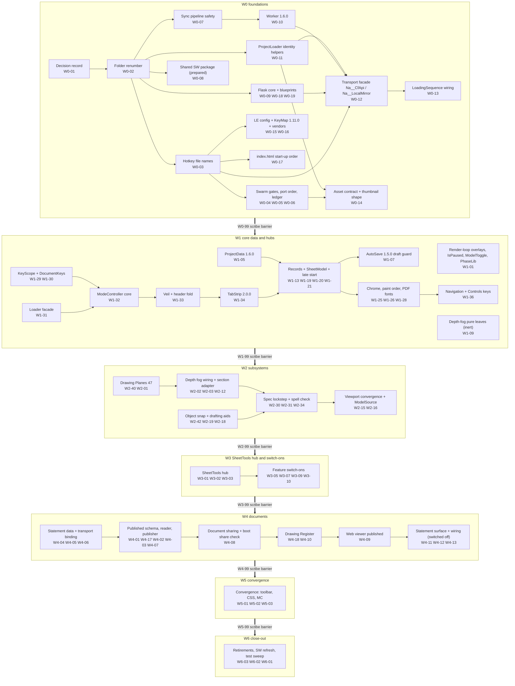

## Section C - Wiring Requirements to Established Modules

This section answers Adam's third ask: what every TrueVision (TV) drawing-system module needs from the ValeVision (VV) modules it lands among, and how VV keeps its own worker, Flask server, R2 prefix and lazy editor while the code becomes TV's. Folder and file naming are Section A and Section B; the header fold, tab strip and veil look are Section D; the release watermark and module inventory are Section E; wave scheduling is Section F. This section cites those where it touches them and does not repeat them.

**How to read it.**

- Paths are K2 **target** paths, valid after the scripted renumber W0-02 (VV `42..47` become TV `40, 42..46`; legacy `40__System__2dElevationsView` becomes `91`; K2 FR-01..FR-11). `VVM/` and `TVM/` = each app's `02__Src__AppModules/`; `LE/` = `51__System__LayoutEditor/`; `WCP/` = `D:\10_CoreLib__ValeCodebase\WebApps\Whitecardopedia`; `NAAPPS/` = TV's local server folder. A line number on a VV file is today's (HEAD `7b4e593a`, current folder name), a line number on a TV file is HEAD `b2aa9151`.
- "Owner" is the canonical K3 package that lands the wiring (`parity/data/wp_canonical.json`); "DR" is the K1 decision that governs it (`parity/data/decision_register.json`). Where a K1 decision is unanswered the K1 default applies (K3 rule: a package runs on the DR default unless its hard gate says it waits).
- Gates G1-G7 are K3's standard gates (G1 `Na__Verify__ModuleGraph__.mjs`, G2 `Na__Verify__Exports__.mjs` with a non-zero count, G3 `k2_path_gate.py`, G4 naming and PORT NOTE verifiers, G5 the package's ported tests, G6 "VV's own facade, no TV transport", G7 Port Record and no ledger/devlog edits).
- Every fact below was either taken from a verified slice finding (id given), a canonical artefact, or re-read in the code for this section (path:line given). The generators are kept beside the report: `parity/report/tools/r3_entry_points.py`, `r3_config_files.py`, `r3_events.py`, `r3_shared_surface.py`, `r3_storage_keys.py`, `r3_system_dag.py`, `r3_wp_lookup.py` (all read-only on both apps).

**Scale of the wiring surface (verified 01-Oct-2026).**

| Surface | TV | VV | Source |
|---|---|---|---|
| Drawing-system imports in the entry HTML (folders 03 DevGate, 27, 40-55, 80, legacy 40) | 33 in `TV/Index.html:885-919` (eager, editor included) | 25 in `VV/index.html:1375-1442` (editor only through `Na__LeLoad__Initialize`, :1442) | `r3_entry_points.py`; S09-F10 |
| CSS index `@import` lines | 43, of which 14 Layout Editor (`TV/03__Style__AppStylesheets/Na__CoreUi__Styles__Index__.css:161-174`) | 27, of which 1 Layout Editor (Boot, :92) | re-read both files; S09 B2 |
| Lazily linked LE stylesheets | none (all eager) | 8 in `Na__LeLoad__STYLESHEETS` (`VVM/LE/01__Core__Loader/Na__LayoutEditor__Loader__.js:125-134`) | re-read |
| Mode controller static imports / Ready chain | 76 / 11 promises (`TVM/LE/05__Core__ModeController/Na__LayoutEditor__ModeController__.js:1193`) | 51 / 6 (`VVM/.../ModeController__.js:828`) | S09-F12, re-read |
| Window events | 75 (32 TV-only) | 64 (21 VV-only); 43 shared | `r3_events.py counts` over S09's catalogue |
| Names TV drawing modules import from shared folders that VV does not export | 72 names in 13 modules | - | `r3_shared_surface.py`; S09 App. B |
| Main config top-level blocks | 25 (4 TV-only) | 30 (9 VV-only) | re-read both `02__AppData/Na__AppConfig__Main.json` |
| LE AppConfig top-level blocks | 36 (5 TV-only) | 31 | re-read; S03a b.2 (356 key-level differences) |
| Drawing-scope system config JSONs | 40 | 16 of them at TV's path; 24 missing | `r3_config_files.py` |
| Transport client exports used by TV drawing code | `Na__CfApi__*` 33 (27 imported app-wide, 21 by 40-55), `Na__LocalMirror__*` 8 | none at TV's path | S12-F04, S12-F05, S09-F27/F28 |
| Persistence and transport tests | 31 | 3 (scrapbook only) | S12 (a) |

---

### C.1 The integration checklist - landing any TV drawing-system module in VV

Run the rows in order for every TV file a package takes. "HOT" marks a file many packages edit: it is edited only in the serial order `parity/data/hot_file_ownership.json` gives (DR-05 rule R1). A row that does not apply to the module is skipped, never improvised.

| # | Step | Rule (what to do) | Where (K2 target) | Proof / gate | Governs |
|---|---|---|---|---|---|
| 0 | Pre-flight | Take the TV file at HEAD `b2aa9151` whole (K3 R3) only when every module and name it imports already exists in VV (K3 R2); otherwise land its leaves first, inert, or stop. Read the TV file's DEVELOPMENT LOG entries newer than VV's last port and its PORT NOTE; a "ValeVision : not yet ported - it waits for Adam's sign-off" line is ported but named in the Port Record (124 TV files carry it, S04b-F57). Hold the four gesture changes behind their guard constants (DR-40 items 7-10, K3 R10). Look up every file you will edit in `hot_file_ownership.json`. | the TV file; `parity/data/hot_file_ownership.json` | import walk clean (S11-V02 method: 44 of 62 whole-file rows were blocked) | DR-01, DR-05, DR-40 |
| 1 | Path | Put the file at TV's relative path (K2 N1, N4, F1). After W0-02 no folder-number seam exists for 40/42-46; TV-only folders take TV's number (27, 47, 48, 49, 52, 53, 54, 55, 80, and LE 21/26/27/28/31/32/33/36/37/51/52/53/54/58/59/65/66). Never port TV `41__System__SectionCutEngine/*` or `40__System__DrawingViewCore/Na__DrawView__ProfileLines__.js`: a TV import of either is replaced by the `Na__DrawView__SectionAdapter__*` name (C.4 S4) or dropped (DIV-1). | target folder per K2 `target_folder_map.json` | G3 (`k2_path_gate.py` covers CSS `@import`, `new URL(...)`, config path strings and retired names that G1/G2 cannot see) | DR-02, DR-26, DR-41 |
| 2 | Imports | Every named import must resolve, including in a module nothing imports yet (G2 checks every module, S04b-F59). Names VV lacks in shared folders land first with their owners (catalogue a5). Transport names come only from VV's own facade (`VVM/80__CloudflareIntegration/Na__CloudflareIntegration__ApiClient__.js`, `VVM/03__AppUtils/Na__AppUtils__LocalProjectMirror__.js`, W0-12) and the ProjectLoader helpers (W0-11); never copy TV's `80__CloudflareIntegration` file, its worker or a TV key builder. No throwaway stubs; the only permitted export stubs are fog and site-plan exports for an early 65 port (DR-05). | importing file | G1, G2, G6 | DR-05, DR-27 |
| 3 | Load path | **Layout Editor module:** never `index.html`. It enters through the mode controller's module graph (HOT `VVM/LE/05__Core__ModeController/Na__LayoutEditor__ModeController__.js`): add the import, the Build/registration line, its `Ready()` to the `Promise.all` in TV's order (each Ready must resolve, never reject, S03a-F41), its `Initialize` and Attach/Detach at TV's positions (catalogue a4). **Reached by TV's TabStrip, DevMenu or Index.html:** expose it through the loader facade (HOT `VVM/LE/01__Core__Loader/Na__LayoutEditor__Loader__.js`) with a literal `import()` only, a pre-load answer from the raw drawings block, a `Na__LeLoad__CheckNames` row for every copied constant and a flip of the static feature-presence map (catalogue a3). **Drawing-core or 3D-tab module that TV initialises in Index.html:** add the import and the call to HOT `VV/index.html` at TV's position (catalogue a1); a listener a loading-sequence dispatch must reach goes above `Na__AppFlow__StartLoadingSequence`. | ModeController / Loader / index.html | G1 (the loader's literal specifiers keep the lazy graph walked, S09 B13); facade name check (W0-04) | DR-24, DR-25 |
| 3b | Late start | The editor loads after the drawings dispatch, so an LE module initialises from current state (`Na__DrawData__IsLoaded()`, `Na__DrawData__GetSheetsArray()`, the SheetModel), never from the first raw `na-layouteditor-drawingsdata-loaded` (S09-F14; TV's only such listener is `TVM/LE/54__Feature__SheetImages/Na__LayoutEditor__SheetImages__.js:147`). Until W1-21 the loader re-announces `'loaded'` (`Loader:307-311`); W1-21 deletes `Na__LeLoad__AnnounceProjectLoad` and TV's SheetModel late start takes over (`TVM/LE/07__Core__SheetData/Na__LayoutEditor__SheetModel__.js:773`). | module Initialize | `Na__Test__DraftRestore__`, `Na__Test__SheetsNormaliseOnce__` | DR-24 |
| 4 | Stylesheet | Give every ported sheet exactly one VV home (catalogue b): a TV CSS-index LE sheet joins `Na__LeLoad__STYLESHEETS` in TV's relative order, WebViewer last, added only when the file exists (a missing file only warns, `Loader:272-275`); a self-linking module needs nothing; pre-editor rules (tab strip, Dev section, loading screen, 3D-furniture hiding) live in `VVM/LE/01__Core__Loader/Na__LayoutEditor__Styles__Boot__.css`; app-wide sheets (27, 47, 49, 54, 55) go into HOT `VV/03__Style__AppStylesheets/Na__CoreUi__Styles__Index__.css` at TV's position. | Loader list / Boot / CSS index | `Na__Test__LoaderStylesheets__` (W0-04); `Na__Verify__UiParity__` | DR-24, DR-39 |
| 5 | Config | The module's system JSON travels with it (catalogue c3). LE AppConfig keys, blocks and labels are all landed by W0-15 in one additive pass; a feature package only flips a value W0-15 withheld for it (catalogue c1) and never adds keys. A ConfigState barrel never lands ahead of the unit whose names it imports (S03a-V01, link failure). Keys are TV's; brand lives in values (K2 V1); NA paths get VV values (K2 V2). `Na__AppConfig__Main.json` gains a block only if TV's main config has it for this module; VV-only blocks stay. | HOT `VVM/LE/03__Core__Config/Na__LayoutEditor__AppConfig__.json`, ConfigState units, `VVM/02__AppData/Na__AppConfig__Main.json` | `Na__Test__AppConfigParity__` (W0-15) | DR-43, K2 V1/V2 |
| 6 | Project data | New persisted data nests inside `LayoutEditor__DrawingsData` (TV's own rule, `TVM/46__System__NorthDirection/Na__North__ProjectJson__Data__.js:20-30`, S09 B8). A new top-level key needs a decision and must join `ProjectData__EditorOwnedKeys` (W0-07) or a sync from another machine drops it. A record field is written only after the SheetRecords owner (W1-19) normalises it, because VV's normalisers drop or coerce unknown fields (S03b-F02). Saves go through `Na__DrawData__Save(showToast, report, registerKeys)` and `Na__DrawData__RegisterSaveStep` / `RegisterPayloadGuard` (W1-05), never a direct R2 write. | ProjectData, SheetRecords, `Na__AppConfig__Main.json` | golden-fixture round trip (S03b-V04) | DR-06, DR-30, DR-41 |
| 7 | Events | Keep TV's event names and `Na__<Ns>__<X>_EVENT` constants verbatim (K2 E1; catalogue e1). Keep VV's working dispatchers where TV's are broken (K2 E3, DR-37 item 4): `na-pm-scene-activated`, `na-model-visibility-changed`. When a file is taken whole, re-add its VV-only listeners and exports (catalogue e3, S09-F39, S09-F12). | dispatching / listening modules | grep acceptance per package (S02b-V01 list) | DR-37 |
| 8 | Keys | Key rows already exist after W0-15 (TV's drawing-tab file with KeyMap 1.11.0); a feature package adds only the dispatch. Document-tab actions register with DocumentKeys (W1-30). Every keyboard listener consults `Na__KeyScope__Is`, `Na__KeyScope__IsTypingTarget` and `Na__KeyScope__ControlKeepsKey` (catalogue f2). A new binding goes into the JSON, the KeyMap fallback and the catalogue together (S04b-F34). | key JSON, KeyMap, the module's handler | `Na__Test__DrawingTabKeys__` (588 presses, S05a-F33), `Na__Test__DocumentKeys__` | DR-33 |
| 9 | Transport | All I/O goes through the facade names, `Na__AppUtils__R2AssetUpload` or a Flask blueprint constant (catalogue g). Constant seams only: `/api/truevision/<f>` -> `/api/valevision/<f>`; service `'na-projectvision-local-dev'` -> `'whitecardopedia-local-dev'` on `/api/health`; header `X-TrueVision-*` -> `X-ValeVision-*`; sibling file `TrueVision__X__.json` -> `ValeVision__X__.json` through config. R2 keys only under `VaApps/Projects/{folderId}/` with TV's relative folder names. A new content kind needs its worker family (W0-10), its Flask blueprint (W0-18/W0-19) and, for assets, the `R2AssetUpload` guard. No new picture, published or statement object goes to R2 until Adam has run the W0-07 sync fix (K3 R8); only Adam deploys the worker. | facade / blueprint / module constants | G6; `Na__Test__TransportFacade__`; ported server tests | DR-06, DR-27, DR-28, DR-29 |
| 10 | Identity | Banner `VALEVISION3D - ...`, console `[ValeVision3D <System>]`, no `TrueVision__` literal, no `window.TrueVision__*` read, no NA marker (`NaProjectPortal`, `30__TrueVision__AppContent`, `/na-apps/30__TrueVision__CoreAppCode`, `/q/`, `/s/`); NA-only features ship switched off until Vale content exists (C.4 S2). | the ported file and its config | G4 (`Na__Verify__ParityNaming__`, W0-04) | DR-43, K2 H1/C1/K3/K4/V2 |
| 11 | Service worker | Never edit or bump the shared Whitecardopedia worker (only W0-08 and W6-02 do, K3 R6). Every Port Record carries a SHARED SERVICE WORKER note: new modules, new or renamed cross-module exports, a lazily linked stylesheet, token needed yes/no; never "n/a" (WP-S04b-16). | Port Record | W6-02 consolidates the token request | DR-07 |
| 12 | Tests | Port each TV test once, in the package that lands last among the modules it loads (DR-05; owner map `wp_canonical.json` `test_ownership`); Node tests run from the VV app root, Python server tests against WCP Flask with `sys.dont_write_bytecode`, `.html` harnesses on the WCP Flask server (G5). `node --check` every changed `.js`. | `VV/80__Testing__PrototypeEnvironment/` | G1, G2, G5 | DR-05 |
| 13 | Records | PORT NOTE with K2 H5 fields including `Source version`; on a whole-file take the module takes TV's version and DEVELOPMENT LOG (DR-34); the new log entry carries `{{VVREL:<wp_id>}}`; return a Port Record (S11 Appendix C). Never edit `VV/ValeVision__DEVLOG__.md` or `VV/ValeVision__PARITY__TrueVisionLedger__.md`: the wave's Parity Scribe (Wn-99) owns both. | module header | G4 (`Na__Verify__PortNotes__`), G7 | DR-34, DR-35 |
| 14 | Hand-over | Leave Adam an in-app checklist (he tests in the app himself): the feature path, a project with no drawings, Save Sheets on localhost (R2 then disk), the PDF, the read-only web view, and Layout Mode off. | Port Record | Adam's sign-off | DR-01 |

---

### C.2 Catalogues

#### (a) Entry points and loader registration - eager in TV, lazy in VV

**(a1) Start-up wiring in the entry HTML.** TV imports the whole drawing stack, the editor included, from `TV/Index.html` and initialises it at start-up; VV imports the drawing core the same way but the Layout Editor only through its loader. Line numbers: TV import `:885-919`, TV call lines from `TV/Index.html:1541-1783`; VV import `:1375-1442`, VV call lines `:1966-2283` (re-read for this section; `r3_entry_points.py`).

| TV module (target path in both apps) | TV import / call | VV today (current path) | VV wiring rule | Owner | DR |
|---|---|---|---|---|---|
| `80__CloudflareIntegration/Na__CloudflareIntegration__ApiClient__.js` `Na__CfApi__Initialize(workerBaseUrl)` | :885 / :950 | absent | Not in `index.html`. VV's facade exposes async `Na__CfApi__Initialize()` (no URL; key from Flask `GET /api/editor-config`) called by the loading sequence after `Na__AppUtils__InitMasterIndex()` | W0-12, W0-13 | DR-27 |
| `27__System__ContextMenuSystem/Na__ContextMenuSystem__SystemLogic__.js` | :886 / :1609 | absent | Not ported (TV's 3D right-click menu). Only `Na__ContextMenuSystem__Ui__MenuRenderer__.js` lands, no initialise call | W4-11 | DR-44, DR-10 |
| `41__System__SectionCutEngine/Na__SectionCut__Engine__.js`, `__SceneData__.js` | :887, :896 / :1670, :1557 | VV keeps `41__System__CrossSectionView` controls :1377/:2156 and dev controls :1378/:2157 | Never ported (DIV-2). VV calls `Na__SectSceneData__Initialize()` (from `41__System__CrossSectionView/Na__CrossSectionView__SceneData.js`, idempotent) directly above the loading sequence | W0-17 | DR-26, DR-41 |
| `40__System__DrawingViewCore/Na__DrawView__ProfileLines__.js` | :888 / (callback, no call) | absent | Never ported (DIV-1, S02a-F15): VV's ortho profile pass is `05__RenderPipeline/Na__RenderEffect__2dProfileLines__.js` (FR-08) | - | DR-04 |
| `03__AppUtils/Na__AppUtils__DevGate__.js` | :891 / :1541 | :1429 / :2261 (after the dev surfaces) | Move above `Na__AppFlow__StartLoadingSequence`, as TV: "must precede every dev surface" | W0-17 | - |
| `40__System__DrawingViewCore/Na__DrawView__ProjectData__.js` | :892 / :1556 | :1410 / :2209 (after the loading sequence at :1966) | Move above the loading sequence (the latent dispatch-before-listener race TV fixed in commit `2712872f`, S09-F07) | W0-17 | - |
| `40__System__DrawingViewCore/Na__DrawView__ConfigState__.js` | :893 / :1569-1570 | :1409 / :2207-2208 | Move above the loading sequence; `Na__DrawCfg__Load()` not awaited (TV comment :1559-1568) | W0-17 | - |
| `40__System__DrawingViewCore/Na__DrawView__RenderPreset__.js` | :894 / :1695 | `42__System__DrawingViewCore/Na__DrawView__ComposerPreset__.js` :1412 / :2211 | W0-02 renames file and the eight exports (FR-09); VV keeps its composer body and its init context `{ renderer, scene, camera, pipelineRef }` (TV passes `{ renderer, scene }`; C.4 S6) | W0-02 | DR-04 |
| `40__System__DrawingViewCore/Na__DrawView__MaterialPreset__.js` | :895 / :1706 | :1413 / :2217 | Aligned | - | - |
| `50__System__ProjectedLinework/*` ConfigAccess, SvgOverlay, Pipeline, DevMenu | :897-900 / :1711-1714 | :1430-1433 / :2263-2266 | Aligned (S02b-F56); add no Storeys, DoorPose or FlushJoins init: the pipeline reaches them | - | - |
| `LE/05__Core__ModeController/Na__LayoutEditor__ModeController__.js` `Na__LeMode__Initialize(ctx)` | :901 / :1719 | through the loader: `Na__LeLoad__Initialize(ctx)` :1442 / :2274 -> `Run()` -> `editor.mode.Na__LeMode__Initialize(Context)` (`Loader:329`) | Keep the loader (permanent VV seam); same render context as TV | W1-31 | DR-24 |
| `LE/05__Core__ModeController/Na__LayoutEditor__TabStrip__.js` `Na__LeTabs__Initialize()` | :902 / :1730 | loader `Na__LeLoad__ImportTabs` (`Loader:434-438`) when Layout Mode is on and a sheet exists | TabStrip 2.0.0 imports only the loader facade (catalogue a3) | W1-34 | DR-25, DR-38 |
| `LE/70__DevTools__DevMenu/Na__LayoutEditor__DevMenu__Controls__.js` | :903 / :1731 | loader `Na__LeLoad__WireDevSection` (`Loader:464-481`) | Keep VV DevMenu 1.4.0 (newer architecture); TV 1.2.0's live-phase filter added through the loader | W2-17 | DR-24 |
| `LE/66__Feature__DocumentSharing/Na__LayoutEditor__Share__Open__.js` | :904 / :1738 (outside the `.then`) | absent | Never from `index.html`: a boot-time `?open=` check in the loader that imports nothing from the editor calls `Na__LeLoad__OpenStatements / OpenSpecification / OpenRegister`; `Share__Open` then runs inside the loaded editor | W4-08 | DR-23, DR-24 |
| `42__System__FloorPlanViews/Na__FloorPlan__ModeController__.js` + `__DevMenu__Editor__.js` | :905-906 / :1676, :1683 | :1414-1415 / :2219, :2225 | VV keeps its own controller (1.2.2): context `{ camera, canvas, modelRoot }` without TV's `controls`, plus VV-only `Na__DrawView__Transitions__Initialize({ camera, controls })` (:1411 / :2210) that it relies on (S09-F09 refuted the flight difference) | W1-04 (returnToOrbit), W2-04 | DR-32 |
| `45__System__ElevationViews/Na__Elevation__ModeController__.js` + `__DevMenu__Editor__.js` | :907-908 / :1755, :1762 | :1419-1420 / :2235, :2241 | As floor plans | W1-04, W2-05 | DR-32 |
| `48__System__CrossSectionViews/Na__CrossSection__DevMenu__Editor__.js` | :909 / :1767 (inside the elevation `.then`) | absent | Port with the elevation Dev-menu rebuild, after VV renames its own colliding `naCrossSectionDev*` gate ids to `naCrossSectionToolDev*` (VV `index.html:855-866`, `41/Na__UiFeature__CrossSectionView__DevControls.js:79-83`) | W2-05 | DR-26 |
| `45__System__ElevationViews/` PlaneGizmo, FacePick, GizmoGrip | :910-912 / :1751-1753 | :1416-1418 / :2232-2234 | Aligned; TV keeps them initialised but unused since v2.82.0; retire-or-keep is decided once for both apps with 47 (S11-V09) | W2-01 | DR-32 |
| `47__System__DrawingPlanes/` Overlay, Grip, DevMenu Controls | :913-915 / :1747-1749 | absent | Add the three imports and inits after the LE block, as TV | W2-01 (core W2-40) | DR-02 |
| `46__System__NorthDirection/` DevMenu, CompassGizmo, PickTool | :916-918 / :1772-1774 | :1421-1423 / :2250-2252 | Aligned; North 1.1.0 whole once the overlays registry exists | W1-11 | DR-32 |
| `49__System__ElevationDepthFog/Na__ElevationDepthFog__RenderLayer__.js` `Na__ElevFog__Initialise` | :919 / :1783 | absent | Add the import and the call last, as TV | W2-03 (leaves W1-09) | DR-15 |
| VV-only: `91__System__2dElevationsView/` controls + ExportOverrides | - | :1375-1376 / :2149, :1874 | Keep until retired | W6-03 | DR-03 |
| VV-only: `40__System__DrawingViewCore/Na__DrawView__Transitions__.js` | - | :1411 / :2210 | Keep (VV plan and elevation controllers fly through it) | - | DR-32 |

**(a2) What changes in VV's `01__AppCore/Na__AppFlow__LoadingSequence.js` (HOT; never taken whole - TV 1.3.1 and VV 1.7.0 are independent lines, 1,915 diff lines, S09 B4).** Editors in order W0-02 -> W0-13 -> W1-01 -> W2-07.

| Hook | TV (`TVM/01__AppCore/Na__AppFlow__LoadingSequence.js`) | VV rule | Owner |
|---|---|---|---|
| Facade start and merge base | `Na__CfApi__SetLoadedProjectData(full)` :925; `Na__CfApi__Initialize` from Index.html :950 | `await Na__CfApi__Initialize()` after the master index (localhost only, never fatal); `Na__CfApi__SetLoadedProjectData(projectData)` before the drawings dispatch | W0-13 |
| Editor-owned overlay on localhost | `Na__DevSavedKeys` (8 keys) :352-361, overlay :736-746 | overlay the `ProjectData__EditorOwnedKeys` list from `Na__CfApi__ReadProjectData()` onto the Flask copy, localhost only, logged, non-fatal | W0-13 (list W0-07) |
| Drawings dispatch | `na-layouteditor-drawingsdata-loaded` `{ block, sceneConfig, projectCode }` :959-968, unconditional, after scenes | keep VV's order (before scenes, :726-730) and keys; add `sceneConfig` to the detail (harmless for VV) | W0-13 |
| Section-block dispatch | `na-crosssection-scenedata-loaded` `{ block }` :976-980, unconditional | keep VV's `{ sceneData }`, only when present (:719-724; DIV-2) | - (keep) |
| Scene-ready signal | `na-app-scene-ready` :443 at the end of `ShowScene` | dispatch once at the end of VV `Na__UiFeature__ShowScene` (:474) | W0-13 |
| Held render loop | `if (Na__RenderLoop__IsPaused())` :1144 | `Na__RenderLoop__IsPaused` added beside VV's pause/resume events; VV's branch keeps its events | W1-01 |
| Drawing frame | ProfileLines -> `Na__ElevFog__RenderOverlay` -> SectionCut overlay -> `Na__DrawMarkup__SyncFrame` :1175-1178 | VV calls `Na__DrawView__RenderPreset__RenderFrame()` -> `Na__DrawMarkup__SyncFrame` -> `Na__PlOverlay__SyncFrame` (:1316-1330, renamed by W0-02); the fog is drawn inside RenderFrame, never here (two or three draws per frame otherwise, S02b-F41) | W2-03 |
| Interactive overlays | `Na__InteractiveOverlays__BeginFrame` :1189 / `EndFrame` :1447 | BeginFrame on VV's interactive 3D branch only, after the drawing branch and the Video Studio preview branch; EndFrame in the tick's `finally` | W1-01 |
| Model reload hooks | `Na__ContextMenu__ResetForModelChange()` :628, `Na__PhaseLib__Initialize` :714 | neither: 27 SystemLogic is not ported; PhaseLibrary lands uninitialised (`IsLive(undefined)` is true) | W1-01 | 

**(a3) The loader facade (`VVM/LE/01__Core__Loader/Na__LayoutEditor__Loader__.js`, VV 1.1.0, 758 lines, 36 exports today).** The only LE module `index.html` imports; it answers the tab strip and Dev section from the raw drawings block before the editor exists and forwards to `editor.mode / model / spec / config / viewport3d / pdf` after (`ImportEditor`, :244-253). TV has no counterpart (TV DEVLOG reserves LE/01 for a loader back-port, K2 N4). Editors in serial order: W0-02, W1-31 -> W1-33 -> W1-34 -> W1-21; W2-19 -> W2-18 -> W2-17; W3-09; W4-08 -> W4-10 -> W4-09 -> W4-13; W5-02 -> W5-03.

| Facade addition / change | Signature and behaviour | Mirrors (TV) | Owner |
|---|---|---|---|
| View-name copies | `Na__LeLoad__VIEW_REGISTER = 'register'`, `Na__LeLoad__VIEW_STATEMENT = 'statement'`, each with a `Na__LeLoad__CheckNames` row against `editor.mode.Na__LeMode__VIEW_*` | `TVM/LE/05.../ModeController__.js:429-431` | W1-31 |
| Document-tab entry points | `Na__LeLoad__OpenRegister(options)`, `Na__LeLoad__OpenStatements(options)`: through `Na__LeLoad__WithEditor`; refuse without loading anything while the feature-presence map says absent | `Na__LeMode__OpenRegister` :928, `OpenStatements` :957 | W1-31 (live W4-10, W4-13) |
| Feature-presence answer | a static map in the loader (register, statements) that the owning package flips; no runtime probe (S03a-F24 verifier) | TV shows the tabs unconditionally | W1-31; flipped by W4-10, W4-13 |
| Site-plan test before load | `Na__LeLoad__IsSitePlanSheet(sheet)`: pre-load `record.Sheet__DrawingType === 'siteplan'` (so `SheetViews`, `Loader:187-196`, must carry `Sheet__DrawingType`); after load answer `false` while the editor lacks `Na__LeModel__IsSitePlanSheet` | `TVM/LE/07.../SheetRecords__.js:433, :1311` | W1-31 |
| Ready | `Na__LeLoad__Ready()` | `Na__LeMode__Ready` :974 | W1-31 |
| Editor import list | add a literal `modelSource` entry to `Na__LeLoad__ImportEditor` for the Dev bake's live-phase filter | TV DevMenu 1.2.0 `Na__LeSource__Resolve` | W2-17 |
| Stylesheet list | `Na__LeLoad__STYLESHEETS` grows to TV's CSS-index LE sequence (catalogue b) | `TV CSS index:161-174` | W2-18, W2-19, W3-09, W4-08 |
| Late start | delete `Na__LeLoad__AnnounceProjectLoad` and its call (`Loader:307-311, :339`); TV SheetModel 1.35.1 announces `'loaded'` once (`TVM/.../SheetModel__.js:773`) | v2.145.0 late start | W1-21 |
| First-open wait | `Na__LeMode__WaitForFirstDrawing` (VV-only, `ModeController:595-600`) resolves at once when the view is not `VIEW_SHEET` (W1-33) and in viewer mode (W4-09); otherwise waits TV's first-open jobs; the loader adds `body.na-layout-editor--active` before the import on a non-quiet press and removes it on failure | TV `Na__LeVeil__FirstOpen` :733 and the Quiet entry :444 | W1-33, W4-09 |
| Shared links | boot-time `?open=` check, no editor import, calls the facade; a project opened without `?open=` loads nothing | TV `Index.html:1733-1738` | W4-08 |
| Header | the registration pattern written into the loader header | - | W1-31 |
| Layout Mode | `Na__LeLoad__IsAvailable()` = `LayoutEditor__DrawingsData__LayoutModeEnabled === true` and a raw sheet exists (`Loader:503-507`); TabStrip 2.0.0 shows itself on `IsAvailable` instead of TV's `IsEnabled() && sheets.length > 0` (`TVM/.../TabStrip__.js:316`) | - | W1-34 | 

**(a4) Mode-controller registrations, feature by feature.** VV's `ModeController__.js` 1.18.0 is completed hunk by hunk, never taken whole until W5-03's convergence check, because TV 1.32.0 imports 76 modules (27 missing in VV today, S11 App. D). Every line number below was re-read in `TVM/LE/05__Core__ModeController/Na__LayoutEditor__ModeController__.js`. Ready-chain order in TV (:1193): Cfg, Edge, Composite, Grad, Dash, **Hatch, SpComp, Area, DocKeys, Img**, DrawCfg (VV has the six unbolded).

| Feature (TV folder) | TV hunk lines | Ready | Panel / tab registration | Owner |
|---|---|---|---|---|
| Key scope (03 KeyScope) | import :389; reader `Na__LeMode__KeyScope` :653-656; `Na__KeyScope__Follow` :1182 | - | - | W1-32 (KeyScope file W1-29) |
| Document keyboard (LE/31) | import :390; `Na__LeDocKeys__Initialize` :1211 | `Na__LeDocKeys__Ready` | - | W1-32 (module W1-30) |
| Feature-independent core | `Na__LeMode__EnterUnder` :883-888 and `Quiet` :444; `VIEW_REGISTER/VIEW_STATEMENT` :429-431; `PreloadMetrics` returning its promise :632-640; Leave order; `SectionForKind(kind, items)` with the viewport `FOLD_GROUP` rule; `SuspendThreeD({ returnToOrbit : true })` :707; column-tab hover hints | - | left/right tab hints | W1-32 |
| Sheet keyboard restart and paging | `Na__LeMode__RestartSheetKeys` :611-617 (called :694, :709); `StepSheet` :810-819 + `Na__LePc__STEP_SHEET_EVENT` listener :1219; `Na__LePc__TakeKeyboard` | - | - | W1-36 |
| First-open veil (VV variant) | `Na__LeVeil__FirstOpen` :289, :733 -> VV calls the loader screen + `WaitForFirstDrawing` jobs | - | - | W1-33 |
| Specification through EnterUnder | `OpenSpecification` via `EnterUnder` | - | - | W1-34 |
| Object snap (LE/28) | import :349; `Na__LeOsnap__Clear` from `__Search__` :774 (VV imports it from `30__System__SheetTools/Na__LayoutEditor__Snapping__.js` :228 until the shim) | - | - | W2-19 |
| Hatch patterns (LE/36) | imports :291, :297 | `Na__LeHatch__Ready` | `Na__LePanelPatterns__Register` :552 (after the scrapbook registrations) | W2-29 |
| Spec lockstep (LE/50) | imports :354-355; `Na__LeSpecLock__Mount` :557 (editable only); `Na__LeSpec__StartWatch` :710 (non-viewer); `StopWatch` :768 | - | - | W2-31 |
| Specification scrapbook (LE/58) | import :333; left `document` tab :521 before `Na__LePanelScrapSpec__RegisterTab`; `Register` :536 | - | left column: Document Preferences, Specification | W2-35 |
| Model Source and site-plan composites (LE/20, LE/25, 26) | imports :343, :378-379; `Na__LeSource__Initialize` :1206; `Na__PhaseLib__CHANGED_EVENT` listener :1247-1251; `Na__LeModel__IsSitePlanViewport` :1076 | `Na__LeSpComp__Ready` | `Na__LePanelSpComp__Register` :533 | W2-16 |
| Drawing grid and axes (LE/27, LE/33) | imports :327-329; `Na__LeGrid__Attach` :574 / `Detach` :585; `Na__LeAxes__Attach` :575 / `Detach` :586 | - | `Na__LePanelGrid__Register` :529 (after Sheet) | W3-05 (modules W2-18) |
| Vector tools (LE/37) | import :339; `Na__LeVec__Initialize` :1198 (after History) | - | `Na__LePanelVec__Register` :546 (straight after Vectors) | W3-07 |
| Sheet images (LE/54) | imports :295, :341; `AttachInput` :578 / `DetachInput` :582; `Na__LeImg__Initialize` :1209; `'images'` refresh :1151 | `Na__LeImg__Ready` | `Na__LePanelImages__Register` :547 | W3-09 |
| Floor areas (LE/59) | imports :292-294; `Na__LeAreaTable__Attach` :1208; `'areas'` reason :1003; panel `'floor-areas'` :1028; `SectionForKind` :1059; `Na__LeArea__Is` :1088 | `Na__LeArea__Ready` | `Na__LePanelArea__Register` :553 (last in the right column) | W3-10 (core W1-27) |
| Overspill note regions (LE/50) | import :366; `Na__LeRegionGrip__Attach` :577 / `Detach` :583 | - | - | W3-11 |
| Viewer never renders a sheet | `if (!Na__LeVw__IsViewerMode()) Na__LeSurface__SetSheet(sheet)` :752; OnSheetsChanged viewer branch :1124-1137 | - | - | W4-09 |
| Drawing register (LE/51) | imports :358-360; `Na__LeRegEd__Mount` :502; Hide on Enter/Leave/OpenSpec :690, :765, :900; `OpenRegister` :928-939; `Na__LeReg__Initialize` / `Na__LeRegEdit__Initialize` :1201-1202; `'register-updated'` -> chrome refresh :1142 | - | Document Register tab via the loader | W4-10 (core W4-18) |
| Statement writer (LE/52) | imports :361-363; `Na__LeStmt__Initialize` and Page Mount :503-504 (before the viewer branch); Hide :691, :766, :901, :933; `OpenStatements` :957-969; `Na__LeStmt__OPEN_EVENT` listener :1230 | - | Design Statements tab via the loader, behind `LayoutEditor__Statement__Enabled` | W4-13 |
| VV-only seams kept through every hunk | `Na__LeMode__WaitForFirstDrawing`, `IsAvailable`, `IsLayoutModeOn`, `SetLayoutMode` (VV :327-354, :595-600, exports :888-902); scene-broadcast listeners `na-presentation-mode-scenes-loaded/cleared` (VV :866-867); loader INTEGRATION header | - | - | W1-32, W5-03 |

**(a5) Established shared modules: the names TV drawing modules import that VV must export first.** 72 names in 13 modules (S09 Appendix B, regenerated by `r3_shared_surface.py`); with W0-02 the paths are identical in both apps. A TV file that imports one of these cannot land before the owner (G2 fails link).

| Shared module (K2 path, both apps) | VV file today | Names VV must export | TV drawing importers | Owner |
|---|---|---|---|---|
| `03__AppUtils/Na__AppUtils__KeyScope__.js` | no | 7: `Na__KeyScope__ControlKeepsKey`, `DOCUMENT`, `Follow`, `Is`, `IsTypingTarget`, `MODEL`, `SHEET` | 4 | W1-29 (file); W1-32, W1-36, W3-03 (importers) |
| `03__AppUtils/Na__AppUtils__LocalProjectMirror__.js` | no | 8: `Na__LocalMirror__MergeKeys`, `DrawingsFingerprint`, `WriteSiblingFile`, `StatementTree`, `WriteStatementFile`, `MakeStatementFolder`, `MoveStatement`, `DeleteStatement` | 6 | W0-12 (VV body over WCP Flask) |
| `03__AppUtils/Na__AppUtils__ProjectLoader.js` | yes | 2: `Na__AppUtils__GetProjectFolderFromUrl`, `Na__AppUtils__GetYearFromUrl` | 12 | W0-11 |
| `03__AppUtils/Na__AppUtils__SnapshotHistory.js` | as `..SnapshotHistory__.js` | 1: `Na__SnapHist__Create` | 2 | W0-02 (FR-10) |
| `05__RenderPipeline/Na__RenderEffect__DistanceCulling__.js` | under `02__Engine__MaxEngine/` | 2: `Na__DistanceCulling__IsEnabled`, `SetEnabled` | 3 | W0-02 (FR-11) |
| `05__RenderPipeline/Na__RenderLoop__InteractiveOverlays__.js` | no | 4: `Na__InteractiveOverlays__Register`, `Unregister`, `SetWanted`, `IsWanted` | 2 | W1-01 |
| `05__RenderPipeline/Na__RenderLoop__Invalidation.js` | yes | 1: `Na__RenderLoop__IsPaused` | 1 | W1-01 |
| `25__System__3dObject__InteractionSystem/3dObjectIInteraction__Animation__ClickToOpenDoors__.js` | yes (1.7.1) | 6: `Na__DoorAnim__ApplyPanelTransform`, `ComputePanelLocalPose`, `DescribeDoors`, `GetLiveProgress`, `MOD_TYPE_FIXED`, `MOD_TYPE_ROT_ONLY` | 1 | W1-02 (merge TV 1.8.0/1.9.0, keep VV's `SnapAllClosed`, `Get/SetSpeedScale`, `GetBaseDurationMs`, S02b-F26) |
| `25__System__3dObject__InteractionSystem/Na__DoorAnimation__FindDoorGroups.js` | no | 1: `Na__DoorAnimation__FindDoorGroups` | 1 | W1-02 |
| `26__System__ToggleModelElements/Na__ModelGroup__PhaseLibrary__.js` | no | 14: `Na__PhaseLib__*` (CHANGED_EVENT, Ensure, GetCategoryKeys, GetDefaultId, GetGroups, GetLabel, GetMessage, GetReadyEntry, GetStatus, HasGroup, IsLive, Pin, SetCacheLimit, Unpin) | 4 | W1-01 (verbatim, never initialised) |
| `26__System__ToggleModelElements/Na__UiFeature__ModelToggle__Controls.js` | yes | 3: `Na__ModelToggle__BorrowRegistry`, `RestoreRegistry`, `SetCategoryVisibleByKey` | 1 | W1-01 |
| `27__System__ContextMenuSystem/Na__ContextMenuSystem__Ui__MenuRenderer__.js` | no | 2: `Na__ContextMenu__Ui__Open`, `Close` | 2 | W4-11 |
| `80__CloudflareIntegration/Na__CloudflareIntegration__ApiClient__.js` | no | 21 of the 33 `Na__CfApi__*` (all 33 are exported, catalogue g and C.4 S1) | 16 | W0-12 |

#### (b) Stylesheet registration

**Rule (K2 S5; S03a b.7; S10-F16).** TV loads every editor sheet from its CSS index at start-up. VV has three homes and each ported sheet goes to exactly one: (1) `Na__LeLoad__STYLESHEETS` for a sheet TV `@import`s in its LE region, in TV's relative order, Surfaces first and WebViewer last; (2) nothing, for a sheet its module links itself with `new URL('./x.css', import.meta.url)`; (3) VV's CSS index, for app-wide sheets TV imports outside the LE region; plus (4) VV's `Styles__Boot__.css` for rules that must apply before the editor loads. Never pre-register a file that does not exist yet.

| TV sheet (target path) | TV registration | VV home after alignment | Owner |
|---|---|---|---|
| `LE/10__Core__SheetSurface/Na__LayoutEditor__Styles__Surfaces__.css` | CSS index :161 | `STYLESHEETS[0]` (today `Loader:126`) | - |
| `LE/10.../Na__LayoutEditor__Styles__Main__.css` | :162 | `STYLESHEETS[1]` (:127); its tab-strip, Dev-section and loading-screen regions live in Boot, one copy only (S09-F16); its 3D-furniture hiding block (VV `:30-50`) moves verbatim to Boot (DR-39) | W1-33 (removes the hiding block), W5-02 (`hot_file_ownership.json`; W1-34 only reads TV's tab-strip and menu regions and writes them to Boot) |
| `LE/10.../Na__LayoutEditor__Styles__Main__Paper__.css` | :163 | `STYLESHEETS[2]` (:128) | W1-28 (regions); W2 serial W2-20 -> W2-19 -> W2-24 -> W2-25 (menu and tooltip rules, old snap-marker rules deleted, grips, carry rules); W5-02 (`hot_file_ownership.json`) |
| `LE/26__System__DraftMode/Na__LayoutEditor__Styles__DraftMode__.css` | :164 | after Main__Paper | W2-18 |
| `LE/27__System__DrawingGrid/Na__LayoutEditor__Styles__DrawingGrid__.css` | :165 | after DraftMode | W2-18 |
| `LE/28__System__ObjectSnap/Na__LayoutEditor__Styles__ObjectSnap__.css` | :166 | after DrawingGrid; VV's old `.na-le-osnap*` marker rules deleted in the same commit | W2-19 |
| `LE/33__System__DrawingAxes/Na__LayoutEditor__Styles__DrawingAxes__.css` | :167 | after ObjectSnap, before Panels | W2-18 |
| `LE/40__Ui__Panels/Na__LayoutEditor__Styles__Panels__.css` | :168 | existing (:129) | W1-38 (verbatim) |
| `LE/50__Feature__Specification/` Specification, Specification__Notes, Specification__Read | :169-171 | existing (:130-132) | - |
| `LE/54__Feature__SheetImages/Na__LayoutEditor__Styles__SheetImages__.css` | :172 | after Specification__Read | W3-09 |
| `LE/66__Feature__DocumentSharing/Na__LayoutEditor__Styles__Share__.css` | :173 | after SheetImages | W4-08 |
| `LE/80__Feature__WebViewer/Na__LayoutEditor__Styles__WebViewer__.css` | :174 (LAST) | existing (:133), stays LAST | - |
| `54__Feature__ColourPalette/Na__ColourPalette__Styles__.css` | CSS index :182 | VV CSS index (app-wide: the 3D-tab plan-annotation toolbar uses it) | W1-37 |
| `55__Feature__SpellCheck/Na__SpellCheck__Styles__.css` | :190 | VV CSS index | W2-34 |
| `47__System__DrawingPlanes/Na__DrawingPlanes__Styles__DevMenu__.css` | :123 | VV CSS index after the elevation and north Dev sheets | W2-01 |
| `49__System__ElevationDepthFog/Na__ElevationDepthFog__Styles__DevMenu__.css` | :130 | VV CSS index at TV's position | W2-03 |
| `27__System__ContextMenuSystem/Na__ContextMenuSystem__Styles__.css` | :103 | VV CSS index at TV's position | W4-11 |
| `40__System__DrawingViewCore/Na__DrawView__Styles__DevMenu__.css` | :149 (after PlanDimensions) | VV :85 imports it first in the drawing group; moved to TV's position | W1-06 |
| `42`, `45`, `46` Dev sheets; `43` PlanAnnotations; `44` PlanDimensions; `50` ProjectedLinework | :108, :115, :116, :135, :140, :155 | VV :86-91 (paths rewritten by W0-02) | W0-02 |
| `LE/36` Patterns, `LE/37` VectorTools, `LE/51` DrawingRegister, `LE/56` ScrapbookCustom, `LE/57` ScrapbookParametric, `LE/58` ScrapbookSpecification, `LE/59` FloorAreas | self-linked (`Panel__Patterns__.js:365`, `Panel__VectorTools__.js:376`, `Register__Editor__.js:596`, `Panel__ScrapbookCustom__.js:365`, `Panel__ScrapbookParametric__.js:429`, `Panel__ScrapbookSpecification__.js:718`, `Panel__FloorAreas__.js:733`) | nothing to register (VV already self-links 56 and 57) | W2-29, W2-41, W4-10, W2-35, W3-10 |
| `LE/52__Feature__StatementWriter/08__Style__Stylesheets/` Statement, Statement__Document | linked by `Statement__Page__.js:827-828` on first mount | nothing to register | W4-15 (files), W4-12 (page) |
| `52__System__Layout__PublishedDocuments/Na__PubDoc__Styles__Main__.css` | referenced by nothing in TV (S09 B2) | land unlinked, as TV; TV's decision on the orphan is WT-12 | W4-17 |
| VV-only `LE/01__Core__Loader/Na__LayoutEditor__Styles__Boot__.css` | - | keeps VV CSS index :92; gains TV's tab-strip region and 10 Drawings-menu rules, loses 6 rename/add rules (W1-34); gains the 3D-furniture hiding block moved verbatim from VV `Styles__Main__.css:30-50` and the boot veil (W1-33) | W1-33 -> W1-34, then W5-02 (`hot_file_ownership.json`) |
| `Na__UiFeature__Styles__DevToolsMenu__.css` | TV :53 (after AppHeader) | VV :112 (last); order checked against TV | W5-02 |

Resulting `Na__LeLoad__STYLESHEETS` (14 entries, TV order): Surfaces, Main, Main__Paper, DraftMode, DrawingGrid, ObjectSnap, DrawingAxes, Panels, Specification, Specification__Notes, Specification__Read, SheetImages, Share, WebViewer. `Na__Test__LoaderStylesheets__` (W0-04) asserts this sequence restricted to files that exist, and is re-run in W5-02. Caching: none of the 8 lazily linked sheets nor the 2 self-linked scrapbook sheets is precached by the shared worker today (WCP logic precache list has no `51__System__LayoutEditor` path); W0-08 adds them, W6-02 adds the rest (catalogue h).

#### (c) Config blocks and keys

**(c1) Layout Editor AppConfig - `VVM/LE/03__Core__Config/Na__LayoutEditor__AppConfig__.json` (HOT).** 356 key-level differences, most of them TV-only labels and settings of TV-only features (S03a-F01). One package, W0-15, takes every TV key, block, note and label in a single additive pass with VV values for NA paths and brand, and withholds the values that change behaviour until their feature lands; later packages only flip their own withheld value. Serial editors: W0-03 -> W0-15 -> W0-16; W1-32 -> W1-34 -> W1-35 -> W1-22 -> W1-25; W2-14 -> W2-29 -> W2-36; W3-07 -> W3-09 -> W3-10; W5-01; W5-05.

| Item | TV (line) | VV value / rule | Owner |
|---|---|---|---|
| Block `LayoutEditor__VectorQuality__Config` | :220 | verbatim | W0-15 |
| Block `LayoutEditor__ModelSource__Config` (MaxCachedPhases 3) | :337 | verbatim; inert until W2-16 (DR-09) | W0-15 |
| Block `LayoutEditor__PlanDoors__Config` | :341 | `SwingCategoryKeys` = `["ValeVision__Linetype__DoorSwings"]` (TV `TrueVision__Linetype__DoorSwings`; VV linetype keys are `ValeVision__Linetype__*`, S03a-F02) | W0-15 |
| Block `LayoutEditor__DrawingRegister__Config` (52 keys) | :1193 | `DocumentCodeFormat` `{project}_{drawing}` until Adam supplies Vale phases; `Phases` Vale words (TV T01-T04 are NA job stages); `LetterheadLogoAspect` 4.5 (Vale logo 2000x444; TV 4.096); `PdfJsScriptPath` / `PdfJsWorkerPath` -> `04__Lib__ThirdParty__VersionLocked/07__Vendor__PdfJs__v3.11.174/build/` (TV points at PlanVision's NA path, :1200-1201); reader fallbacks in `ConfigState__EditorSetup__` carry the same VV values (S07a-F13) | W0-15, W0-16, W1-22 |
| Block `LayoutEditor__Statement__Config` (37 keys) | :1271 | `FolderName` `10__StatementDocs`; `IndexFileName` `ValeVision__StatementDocs__.json`; `StylesheetUrl` on VV's public origin; `Html2CanvasScriptPath` VV vendor 06; plus VV-only `LayoutEditor__Statement__Enabled` = `false` | W0-15 |
| TV-only keys inside shared blocks | TitleBlock `QrCell*` (16 settings), `RowWidthFactorByPaper`, Revision `ValuePrefix`; Scales `SitePlanScaleDenominators`, `SitePlanDefaultScaleDenominator`; Viewport `DefaultStyles/DepthFog`, `Rotate*`; Dimensions `DefaultExtensionMm`, `DefaultAtScale`, `DefaultRoundUp`, `RoundUpStepMm`, `RoundUpMarker`; Navigation `AuthoringZoomMax`, `ZoomSettleMs`, `HoldPaperWhileZooming`; Snapping `SheetChrome`, `ViewportCarry`, `ViewportTracking`, `AcquireDwellMs`, `AcquireMax`, `TrackMarkerSizePx`; Selection `PickDragPx`, `DoubleClickMs`, `DoubleClickSlopPx`; EditScope `AutoMoveOnSelect`, `AutoMoveKinds`; Shapes/Leader `DefaultAtScale`, `NoteTooltip`, `NoteTooltipMs`; Pdf `FontFamily`, `FontBasePath`, `FontCdnBase`, `Fonts`; Specification `LockstepEnabled`, `LockstepPollMs`, `AutoSaveLocalMs`; MarginNotes six `Region*`; Measurements `ArrayMaxCount` (S03a b.2) | verbatim (inert until each feature lands); `Specification__LegacyFileName` = `""`; `QrCellEnabled` = `false` (DR-12); Pdf font paths per DR-21 default (the AD04 TTFs VV's `@font-face` already loads from `www.noble-architecture.com/assets/`, allow-listed by K2 V2) | W0-15 |
| `AvailableScaleDenominators` adds 200 | value drift | adopt 1:200 (DR-17) | W1-22 |
| Labels | 188 TV-only | added | W0-15 |
| Label rewordings (13) | `SpecificationTab`, `TabsPreviousTitle`, `TabsNextTitle`, `NoSheets`, `ToolMoveTitle`, `ToolSelectTitle`, ... | withheld; each flipped by its feature | W1-32, W1-34, W1-35, W5-01 |
| Behaviour values withheld | TitleBlock `Rows` `DocumentId`; `Panels__AccordionSections` (`patterns`, `vector-tools`, `images`, `floor-areas`); `Style__FontFamily` Open Sans first | flipped by the owner | W1-22; W2-29, W3-07, W3-09, W3-10; W1-25 |
| 16 brand values | Logo* values, `DrawnByDefault`, `ClassicScanAssets`, `Pdf__Author`, `Pdf__Creator`, `Pdf__JsPdfScriptPath`, `Specification__FileName`, ... | stay VV (`DrawnByDefault` "Vale Garden Houses", `Specification__FileName` `ValeVision__DrawingNotes__.json`, ...); `JsPdfScriptPath` -> `04__Lib__ThirdParty__VersionLocked/05__Vendor__JsPdf__v4.1.0/jspdf.umd.js`, `ClassicScanAssets` -> `01__AppAssets__ValeVision/06__AppAssets__TitleBlocks/TitleBlock__ClassicScan__A3__.png` (copies; the 35 originals stay until W6-03) | W0-16 |
| VV-only keys kept | `LayoutModeLabel`, `LayoutModeHint`, `LayoutModeOffNote` (DR-25); `ClassicFieldAnchors/A3/DrawingNumber` until the DocumentId switch; new `LayoutEditor__TitleBlock__LogoFallbackText` (Vale text, offered to TV, DR-42 item 9); a config gate hiding the Drawing Type row (DR-08, offered to TV, DR-42 item 8) | keep / add | W1-22, W2-14 |
| VV-only keys removed | `MarginToggle`, `MarginToggleTitle` (TV removed the toolbar Notes button) and the MarginNotes description reworded | delete | W1-35 |
| TV defect not copied | `LayoutEditor__Labels__MeasureOffsetAgain`, `MeasureNoOffsetSide`, `MeasureDimOffsetTitle` sit in TV's Selection block (:367-369), dead because `Na__LeCfg__GetLabel` reads only Labels (ConfigState :372-375) | VV keeps them in Labels (:881); TV fix is WT-08 | W0-15 |

**(c2) ConfigState units - all in W0-15, one change.** TV's barrel statically imports four KeyMap names and five TV-only getters; landing it ahead of its units is a link failure that stops the editor loading (S03a-V01).

| Unit (`VVM/LE/03__Core__Config/`) | VV -> TV | What arrives | VV fallbacks re-applied |
|---|---|---|---|
| `Na__LayoutEditor__ConfigState__.js` (barrel) | 1.17.0 -> 1.29.0 | 9 re-exports: `ReloadKeyMap`, `GetCopyDragModifier`, `IsCopyDragKey`, `GetMoveAnchorModifier`, `GetVectorQualitySetup`, `GetPlanDoorsSetup`, `GetModelSourceSetup`, `GetDrawingRegisterSetup`, `GetStatementSetup` | header INTEGRATION "called by the loader"; console prefix |
| `__Readers__` | 1.0.0 = 1.0.0 | port note only | - |
| `__KeyMap__` | 1.0.0 -> 1.11.0 | `MatchKeyBinding(key, held, context)` with `When`; the key file URL `./Na__Hotkeys__DrawingTabs__.json` (VV :63 today points at `Na__LayoutEditor__KeyMappings__.json`); fallback rows fixed (catalogue f) | console prefix |
| `__SheetSetup__` | 1.3.0 -> 1.9.0 | QR cell fields, row width factor, depth fog style, plan doors, model source, vector quality, PDF font cuts, 1:200; VV's duplicate `GetScaleSetup` keys (:235-246) disappear | logo 34 / 33 / 5.5 / 4.5 / 1.8 / 2.5 and the Vale logo path; `DrawnByDefault`; rows fallback `DrawingNumber` until W1-22; jsPDF path; swing key |
| `__ToolSetup__` | 1.0.0 -> 1.5.0 | auto-move, pick-drag, sheet chrome snaps, array max, round-up, note tooltip, viewport carry | none |
| `__EditorSetup__` | 1.0.0 -> 1.6.0 | `GetDrawingRegisterSetup`, `GetStatementSetup`, zoom settle, authoring zoom max, regions, statement and spec lockstep | `fileName` `ValeVision__DrawingNotes__.json`; `legacyFileName` `""`; `indexFileName` `ValeVision__StatementDocs__.json`; PDF.js paths (VV vendor 07); `logoAspect` 4.5; html2canvas path |

**(c3) System config JSONs travel with their modules.** 40 config files in TV's drawing scope; 16 exist at TV's path in VV after W0-02, 24 do not (`r3_config_files.py`).

| Config (target path) | In VV | VV rule | Owner |
|---|---|---|---|
| `47__System__DrawingPlanes/Na__DrawingPlanes__AppConfig__.json` | no | verbatim, bounds tokens included (S02a-F43) | W2-40 |
| `49__System__ElevationDepthFog/Na__ElevationDepthFog__AppConfig__.json` | no | verbatim | W1-09 |
| `52__System__Layout__PublishedDocuments/Na__PubDoc__Config__.json` | no | `Sheet__FontFamily` = VV authoring face | W4-17 |
| `53__Data__Layout__PublishedSchema/Na__PublishedSchema__.json` | no | TV folder names verbatim (DR-29) | W4-01 |
| `54__Feature__ColourPalette/Na__ColourPalette__Config__.json` | no | Vale palette name, identical groups (DR-20) | W1-37 |
| `55__Feature__SpellCheck/Na__SpellCheck__Config__.json` | no | `DictionaryFile` `50__ValeVision__UserConfig/ValeVision__UserSpellings__.json`, `ApiPath` `/api/valevision/user-config/spellings` | W2-34 |
| `LE/25__System__RenderStyles/Na__LayoutEditor__SitePlanComposites__Config__.json` | no | verbatim, dormant (DR-08) | W1-13 |
| `LE/26__System__DraftMode/..DraftMode__Config__.json`, `LE/27../..DrawingGrid__Config__.json`, `LE/32../..OrthoMode__Config__.json`, `LE/33../..DrawingAxes__Config__.json` | no | Meta reworded for VV; Drawing Grid defaults are TV's (DR-40 item 5) | W2-18 |
| `LE/28__System__ObjectSnap/..ObjectSnap__Config__.json` / `..MoveAnchor__Config__.json` | no | verbatim | W2-42 / W2-25 |
| `LE/31__System__DocumentKeys/Na__Hotkeys__DocumentTabs__.json` | no | verbatim | W1-30 |
| `LE/37__System__VectorTools/..VectorTools__Config__.json` | no | verbatim (`Behaviour.DrawInsideOpenGroup`) | W2-27 |
| `LE/52__Feature__StatementWriter/09__Standard__Sections/..Statement__Standard__Config__.json` | no | Vale words; the Hub section excluded through DEFINITIONS (DR-43) | W4-16 |
| `LE/53__Feature__ProjectQrCode/Na__ProjectQr__Config__.json` | no | `Enabled` false and `BaseUrl` `""` (fails closed, S07a-F30); switched on only with a Vale resolver | W1-15, W5-05 |
| `LE/54__Feature__SheetImages/..SheetImages__Config__.json` | no | `Sources__PagesBaseUrl` `https://adam-noble-01.github.io/ValeCodebase/WebApps/Whitecardopedia`; notes name VV folders; numbers verbatim (S07a-F44) | W1-16 |
| `LE/58__Feature__ScrapbookSpecification/..ScrapbookSpecification__Config__.json` | no | `ValeVision__DrawingNotes__.json`, VV dictionary folder | W2-35 |
| `LE/59__Feature__FloorAreas/..FloorAreas__Config__.json` | no | verbatim | W1-27 |
| `LE/65__Feature__DocumentPublishing/..Publish__Config__.json` / `LE/66__Feature__DocumentSharing/..Share__Config__.json` | no | adapted (VV link base, Vale share-title fallback, never NA URLs) | W4-03 / W4-08 |
| `27__System__ContextMenuSystem/..AppConfig__.json`, `41__System__SectionCutEngine/..Engine__AppConfig__.json` | no | not ported (DR-44; DIV-2) | - |
| `42`, `45`, `46` system AppConfigs | yes | TV drift ported with their data/editor packages | W1-08, W2-04; W1-10, W2-05; W1-11 |
| `50__System__ProjectedLinework/..AppConfig__.json` | yes | TV rules; a VV-specific BuildToken with the ConfigAccess fallback equal to it (TV's own fallback is stale, S02b-F33); re-bake is Adam's (DR-31) | W2-06 |
| `LE/20../..ViewportIdentity__Config__.json`; `LE/25../` EdgeStyles, ModelLayers, RenderComposites | yes | drift is real despite "header-only" in drift_all (S04a-F04); ModelLayers keeps VV's `ValeVision__*` category keys (K2 K3) | W2-10; W2-16, W2-13, W2-09/W2-12 |
| `LE/55../..Scrapbook__Config__.json`, `LE/56../..ScrapbookCustom__Config__.json` | yes | keep VV's (VV's library is empty; `Library__ApiPath` `/api/valevision/scrapbook` - overwriting breaks saves, S06a-F55) | - |
| `LE/57../..ScrapbookParametric__Config__.json` | yes | adapted: TV's file minus ProjectQr, AreaSchedule, SiteLegend until adopted; VV wording kept (S06a-F39) | W2-37, W3-14 |

**(c4) App-wide config - `VVM/02__AppData/Na__AppConfig__Main.json` (HOT; editors W0-02 -> W0-07 -> W1-03 -> W2-08).** Never copied whole (S09-V05).

| Block / key | TV | VV | Rule | Owner |
|---|---|---|---|---|
| `ProjectData__EditorOwnedKeys` | - (TV keeps three hand-synchronised lists, S09 B8) | absent | new VV-only block: the one list read by the localhost overlay, the worker's merge-keys guard and the sync pipeline (catalogue d6) | W0-07 |
| `models.RenderConfig__Linework.RenderConfig__Linework__OrthoDepthBiasMm` | 2 | absent | add with the MultiModel orthographic depth bias | W1-03 |
| `RenderEffect__ProfileLines` Drawing2d keys | `Drawing2d__Description`, `Drawing2dEnabled`, `Drawing2dEdgeColor` 3355443, `Drawing2dEdgeThresholdNormal` 0.2, width removed (v2.27.0) | `Drawing2dDescription`, `Drawing2dEdgeColor` null, `Drawing2dEdgeThresholdNormal` null, `Drawing2dEdgeWidth` 1.0 | align once bakes take their width from the RenderComposites `profileLinework` weight; confirm the live width under DIV-1 first | W2-08 |
| `LayoutEditor__Config` (`__ReadOnlyOnWeb: true`) | present | present | aligned (read by ConfigState and `Loader:202-206`) | - |
| `DrawingView__Config`, `ProjectedLinework__Config` | absent (TV falls back to system JSON) | VV-only | keep (Vale look); the two `DrawingView__Config__Transition*` keys are dead in both apps - delete only by decision | - |
| `ProjectData__AssetUrls` (`R2BaseUrl` `https://cdn.noble-architecture.com/VaApps/Projects`, `GhBaseUrl`) | absent | VV-only | keep: the facade's CDN base and the published reader's R2 base read it (never hard-code the CDN, S08-V02) | - |
| `CloudflareConfig` (`CloudflareConfig__WorkerBaseUrl`) | TV-only | absent | never (DIV-4: VV's worker URL and key come from Flask `/api/editor-config`, `WCP/server.py:334-358`) | - |
| Other VV-only (`RenderEngine__Config`, `ImageExport__Config`, `ExportRenderLayers__Config`, `Navmode__*`, `LoadResilience__Config`) and TV-only (`Scene__Default__FogConfig`, `ImageExport__Panel`, `StoreyVisibility`) | | | outside the drawing system; no 40-55 module reads them (S09 B5) | - |

#### (d) Project data: keys, record fields, compatibility, migrations, drafts and save guards

**(d1) Top-level keys of `project.json` (VV) / `TrueVision__ProjectData__.json` (TV).** Census of 155 VV and 8 TV files (S12 b.7). Keys are TV's (K2 K1); `CrossSection__SceneData` is VV's schema (K2 K2).

| Key | TV / VV presence | Written by | Editor-owned list | Rule | Owner |
|---|---|---|---|---|---|
| `LayoutEditor__DrawingsData` | 3/8 / 4/155 | ProjectData save (single owner, whole block) | yes | TV ProjectData 1.6.0 over the facade; gains `LayoutEditor__DrawingsData__SavedIso` on the first VV save; VV keeps `__LayoutModeEnabled` | W1-05 |
| `PresentationMode__SavedCameraScenes` | 3/8 / 9/155 | scene editor; VV sync rewrites IMG-slot thumbnails | yes | the sync applies its repoint to R2's copy of the block (S12 b.9) | W0-07 |
| `CrossSection__SceneData` | 0/8 / 5/155 | VV 41 SceneData through `Na__DrawData__RegisterSectionBlockProvider` | yes | VV entry schema only; TV 41 SceneData/Serialize never ported | W1-05; DR-41 |
| `CrossSection__Config` | - / VV | 41 dev controls | yes | keep | - |
| `LayoutEditor__DrawingRegister` | TV feature (0 local files) / new | Register Data via `Na__CfApi__MergeAndSaveKeys` and `Na__LocalMirror__MergeKeys` | yes (TV's own lists miss it, S12-F48) | top-level by TV design; never nested | W4-18, W4-10 |
| `Camera__DefaultPosition`, `OrbitHelperCube__Position`, `Navmode__EnabledModes`, `Navmode__OrbitMaxDistanceMm` | both | dev menus | yes | `SaveCameraSettings` also deletes the legacy `valeVision_Camera__DefaultPosition` (35/155 files): merge-keys `remove` must allow that one legacy key | W0-10 |
| `FogPlane__Config`, `RenderEngine__Config`, `VideoStudio__Config`, `GridLine__Grid__Offset__Config` | VV-only | VV dev menus | yes | keep | - |
| `RenderEffect__AssetCullDistanceMm`, `Navmode__FovOverrides` | TV-only | TV dev menus | - | outside the drawing port | - |
| `SitePlan__DataStores` / `SitePlan__DataStore` | 3/8 / - | TV build pipeline | pipeline key | dormant (DR-08 B); VV writes it only from a Vale pipeline | W5-06 |
| `projectCode`, `projectName`, `folderId`, `images`, `allImages`, `displayImages`, `thumbnailImage`, `valeVision_ModelUrls`, `ValeVison3D__SketchUpCameraData` (sic), `basePath` | VV pipeline keys | pipelines only | no | the worker's merge-keys refuses them; `folderId` is wrong in 54 and missing in 10 of 155 files - never use it for a path (S12-V02) | W0-10 |

**(d2) Drawings block, record fields and the schema owner.** The only conflict is in record normalisation: VV SheetRecords 1.15.0 drops or coerces TV-era fields on the next load (S03b-F02), so **SheetRecords 1.39.0 (W1-19) lands before any package that writes these fields**, and W1-21 (SheetModel facade 1.35.1, Sheets 1.4.0, History 1.7.0) before any that patches them.

| Field family | VV today | Arrives with (record owner / writer) |
|---|---|---|
| Layer types `area`, `image` (VV coerces to `mixed`); `Layer__Selectable` (reference layers); `Sheet__LayerStack` 2 and the one-time restack | absent | W1-19 / W1-28 (paint order), W3-13 (Ref switch, DR-17) |
| Group members viewport, leader, dimension (VV `GROUP_KINDS` = shape, annotation, group) | absent | W1-19 / W1-28 (Groups 1.4.0), W3-03 |
| `Shape__Hatch`; `Shape__Curve`, `Shape__Holes`; `Shape__Qr`; `Shape__Image` + `SourceW/H`; `Shape__Area`, `Sheet__AreaGroups` | absent | W1-19 / W2-29, W3-12 (hatch); W3-07 (vectors, Booleans); W1-26, W2-38 (QR primitive and element); W3-02 (pictures); W1-27, W3-10 (rooms) |
| `Viewport__Styles.depthFog`; `Viewport__RotationDeg`; `Viewport__ShowFrame`; `Viewport__ClosedDoors`, `Viewport__HideSwings`; `Viewport__ModelSourceId`; `Viewport__SitePlan`, `Sheet__DrawingType` | depthFog dropped (Styles rebuilt from 8 keys); others kept but ignored (S04a-F43) | W1-19 / W2-12; W3-06; W3-15; W2-11, W3-15; W2-16; W2-14 (dormant, DR-08) |
| Dimension `AtScale`, `StartExtensionMm`, `EndExtensionMm`, `ExtensionsLinked`, `RoundUp`, `LinePt`, `LineStyle` | absent (AtScale read, never written) | W1-19 / W1-26 (DimensionGeometry), W2-26 (DimensionTool), W3-12 (panel) |
| `Sheet__MarginNotes` `RegionsOn`, `Regions`, `LeaderlessOn`, `LeaderlessGroups` | VV rebuilds the margin record from six keys and erases them (S06b-F23) | W1-13 (leaves), W1-19 / W2-32, W3-11 |
| `Sheet__Fields__DocumentId`, `__Phase`, register numbering | absent | W1-19, W1-22 / W4-18, W4-10 |
| Elevation `Elevation__DepthFog`, `Elevation__NameIsAuto`; floor-plan storey fields; `..__North` | absent (nested in the drawings block) | W1-09/W1-10, W1-08, W1-11 |
| VV-only record keys `Elevation__SeededFrom`, `Elevation__LineworkAsset`, `Elevation__ExcludeCategoryTokens` | VV writes them | stop writing `SeededFrom`, preserve and read existing values (DR-32); `LineworkAsset` is shared |

**(d3) Migrations and one-time effects on existing Vale data.**

| Effect | When | What Adam sees / what must hold | Owner |
|---|---|---|---|
| Layer restack (`Sheet__LayerStack` 2): every existing VV sheet has a markup layer under a viewport layer (all 4 local sheets) | first load after W1-19, before paint order (W1-28) | one restack, idempotent; the Layers panel order changes once; no visual change before or after (S03b-F03) | W1-19, W1-28 |
| Golden-fixture whitelist: TV's normaliser adds `Layer__Order`, `Sheet__LayerStack` 2, `Viewport__ModelSourceId` null, `Asset__Samples` null, `Viewport__Styles.depthFog` (when configured) | W1-19 | anything else in the VV-before / VV-after diff is a regression (S03b-V04) | W1-19 |
| `LayoutEditor__DrawingsData__SavedIso` absent on every VV block | first save after W1-05 | `LearnBase` treats it as null and the first save stamps it | W1-05 |
| Browser drafts written before drafts recorded their `base` | first editor open after W1-07 | the Apply / Discard / Decide Later question once per old draft | W1-07 |
| Linework BuildToken change | W2-06 | every baked linework asset reads stale once; Adam runs Dev > Bake All to R2 on localhost (DR-31) | W2-06 |
| Site-plan manifest stems `TrueVision__SitePlan__*` | on read | renamed to `ValeVision__SitePlan__*` by the Store, as the model loader renames GLB namespaces (`MultiModel:145, :175`) | W2-14 |
| TV's legacy drawings migration (drawings nested in the presentation block, pre-v2.21.0) | - | inert on VV data (`HasLegacyDrawings` false); kept verbatim | W1-05 |
| Title block row `DrawingNumber` -> `DocumentId` | W1-22 | VV's `Na__Test__TitleBlockCells__.test.mjs:115` asserts the old divergence and is updated in the same package (S07a-F55) | W1-22 |

**(d4) Browser storage keys** (apps never share an origin, so shared names are safe; K2 B1/B2). Scanned for this section (`r3_storage_keys.py`) and merged with S12 b.7 and S01-F46.

| Key | TV | VV today | VV after alignment | Owner |
|---|---|---|---|---|
| `Na__LayoutEditor__Draft__<code>` | `{ savedAt, sheets, base }` | `{ savedAt, sheets }` | TV format | W1-07 |
| `Na__LayoutEditor__SpecDraft__<code>`, `Na__LayoutEditor__SpecDiscarded__<code>` | both | first only | both | W2-30 |
| `Na__DrawingRegister__Draft__<code>` | yes | - | same name | W4-18 |
| `Na__TrueVision__StatementDraft__`, `...StatementDiscarded__`, `...StatementView__`, `...StatementLast__`, `...StatementMono__` | yes | - | `Na__ValeVision__Statement*` (app token, K2 B2; TV offered app-neutral names, DR-42 item 3) | W4-06, W4-12 |
| `TrueVision3D__AuthoringUnlocked` | DevGate | `ValeVision3D__AuthoringUnlocked` | keep VV | - |
| IndexedDB `TrueVision3D__ProjectedLinework` | yes | `ValeVision3D__ProjectedLinework` | keep VV | W0-14 |
| `na-layouteditor-osnap` | `'1'/'0'` | same key, same format (VV Snapping) | no migration | W2-42 |
| `na-layouteditor-osnap-modes`, `-osnap-targets`, `-osnap-names`, `na-layouteditor-drawing-grid`, `na-layouteditor-ortho`, `na-layouteditor-drawing-axes` | yes | - | TV names (per-browser, never synced, S04b-F48) | W2-42; W1-14 (grid and ortho state leaves); W2-18 (axes) |
| `Na__LayoutEditor__RasterLevel`, `Na__LayoutEditor__VectorLevel`, `Na__LayoutEditor__VectorTools__Settings`, `na-colourpalette-active`, `Na__DrawingPlanes__Shown`, `Na__DrawingPlanes__Snap`, `Na__North__CompassShown` | yes | RasterLevel only | TV names | - (RasterLevel exists); W1-14 (VectorQuality); W2-27; W1-37; W2-01; W1-11 |
| `na-layouteditor-panel:*` (incl. `fold-region-`, `scrapspec-full`), `na-layouteditor-spec:headings-only`, `na-layouteditor-spec:view`, `na-layouteditor-scrapbook-custom:category` | yes | partly | TV names | with each panel |

**(d5) Save guards (TV v2.145.0 / v2.146.0; DR-30 default).**

| Layer | TV mechanism | VV mechanism after alignment | Owner |
|---|---|---|---|
| Late start | `Na__DrawData__IsLoaded`; SheetModel announces once; AutoSave's key waits | same (W1-05, W1-21); the loader's re-announcement deleted | W1-05, W1-21 |
| Draft judged | AutoSave 1.5.0 `JudgeDraft` / `AskAboutDraft` / `PutDraftBack`; base stored in the draft; nothing written while asking; `Suspend` / `Resume` / `DiscardSavedDraft` | AutoSave 1.5.0 whole; Presentation Dev modal 1.2.0 third button (`altLabel`, `altIsDestructive`) | W1-07, W1-06 |
| Save judged before R2 | `CheckBase` against `GET /api/projects/<code>/drawings-fingerprint`; refuse before R2; base on the local write; 409 | ProjectData's internal `CheckBase` (TV `ProjectData__.js:531-539`) against Flask `GET /api/projects/<folder_id>/drawings-fingerprint`; local write carries `X-ValeVision-Drawings-Base`; 409 `{ conflict:true, drawings }`; today's Flask answers that URL with a JSON 404 "Project not found", which the facade reads as `unsupported` (S12 b.4 verifier) | W1-05, W0-09, W0-12 |
| R2 judged | not done in TV | optional `drawingsBase` on worker merge-keys (409 when stale), behind a flag, off until Adam switches it on; offered back to TV | W0-10 |
| Copies kept | backups outside the repo, 30 per file | backup root outside `D:/10_CoreLib__ValeCodebase` (config, Adam confirms), 30 per file; atomic temp + `os.replace` writes | W0-09 |
| Payload guard and save steps | `RegisterPayloadGuard` (written copy only), `RegisterSaveStep` before/payload/after with `ctx.block`, `ctx.state`, `ctx.note`, `ctx.local` (S07a-F48) | same, TV file whole | W1-05 |
| Unsaved-work hold on a worker update | registrar waits while `window.TrueVision__Pwa__HasUnsavedWork` | neutral `window.Na__Pwa__HasUnsavedWork = Na__LeAuto__HasUnsavedWork` read by the shared registrar | W0-08, W1-07 |

**(d6) Survival of editor keys across syncs and machines.** TV protects its editor-owned keys with three hand-synchronised lists (`Na__DevSavedKeys`, `TVM/01__AppCore/Na__AppFlow__LoadingSequence.js:352-361`; `DEV_OWNED_PROJECT_DATA_KEYS`, `NAAPPS/05__ProjectVision__CoreAppCode/CloudflareR2__ModelSync__Main__.py:121-130`; `TRUEVISION_DEV_OWNED_KEYS`, `ProjectVision__BuildScript__.py:83-92`). VV has none, and its SketchUp sync uploads the local `project.json` whole (`WCP/Tools__DevUtils/AutomationUtil__SyncSingleProject__ToCloudAndWeb__Main__.py:715`, called :927, :936, :987) after an image purge that lists the prefix with no delimiter (:659-680, called :926, :959). VV therefore gets **one** list, `ProjectData__EditorOwnedKeys` in `Na__AppConfig__Main.json`: `PresentationMode__SavedCameraScenes`, `LayoutEditor__DrawingsData`, `LayoutEditor__DrawingRegister`, `CrossSection__SceneData`, `CrossSection__Config`, `Navmode__EnabledModes`, `Navmode__OrbitMaxDistanceMm`, `Camera__DefaultPosition`, `OrbitHelperCube__Position`, `FogPlane__Config`, `RenderEngine__Config`, `VideoStudio__Config`, `GridLine__Grid__Offset__Config` (S12 b.7).

| Consumer of the list | Behaviour | Owner |
|---|---|---|
| Sync pipeline | purge top-level keys only (`Delimiter='/'`) with pagination in the image and GLB purges; read R2's `project.json`, keep the listed keys from R2, apply the thumbnail repoint to R2's scene block, write the merged document locally and to R2; dry run on `2026/3047__Doous`; Adam applies it | W0-07 (DR-06) |
| Worker merge-keys | every key in `set` / `remove` must match the editor-owned families; pipeline keys refused | W0-10 |
| Localhost overlay | the listed keys are overlaid from R2 onto the Flask copy at load | W0-13 |
| Rule for every later package | a new top-level key joins the list in the same change, or it does not ship | all |

#### (e) The window-event catalogue diff

Counts (S09's static scan, re-run by `r3_events.py`): TV 75 events, VV 64, 43 shared, 32 TV-only, 21 VV-only. The scan misses listeners registered from arrays or unresolved constants (S09-V04: VV `71/Na__ExportRenderLayers__PreviewController__.js:65-72`; both apps' scene editors via `Na__PresentationMode__DevMenu__GROUPS_CHANGED_EVENT`). Names and constants are TV's verbatim (K2 E1).

**(e1) TV-only events, and the package that lands their dispatcher (and listeners).**

| Event | TV dispatcher | TV listeners | Lands with |
|---|---|---|---|
| `na-app-scene-ready` | `01__AppCore/Na__AppFlow__LoadingSequence.js:443` | `LE/66/Na__LayoutEditor__Share__Open__.js`, `TV/Index.html`; TV-only `62` PWA, `70` AssetCullDistance | dispatcher W0-13 (end of VV `ShowScene`); listener W4-08 |
| `na-drawview-draft-changed` | `40/Na__DrawView__DraftGuard__.js` | `42/..FloorPlan__DevMenu__Editor__.js`, `45/..Elevation__DevMenu__Editor__.js` | W1-06; listeners W2-04, W2-05 |
| `na-drawview-styles-changed` | `40/Na__DrawView__RenderPreset__.js` (TV body) | none | none: VV's RenderPreset body is VV's (DIV-1) and nothing listens |
| `na-floorplan-storey-changed` | `42/..FloorPlan__DevMenu__Editor__.js`, `42/..FloorPlan__ProjectJson__Data__.js` | `LE/20/..ViewportIdentity__.js` | W1-08, W2-04; listener W2-16 |
| `na-drawing-planes-changed` | `47/..DrawingPlanes__Overlay__.js` | `47` DevMenu Controls, Grip | W2-01 |
| `na-model-phase-library-changed` | `26/..ModelGroup__PhaseLibrary__.js` | LE ModeController, `LE/20/..ViewportIdentity__.js`, `LE/25/..SnapshotRenderer__.js` | W1-01 (never fires: library uninitialised, DR-09); listeners W2-16, W2-15 |
| `na-colourpalette-changed` | `54/..ColourPalette__Manager__.js` | none | W1-37 |
| `na-spellcheck-caret`, `na-spellcheck-changed` | `55/..SpellCheck__Field__.js`, `55/..SpellCheck__Dictionary__.js` | `55/..SpellCheck__WordBar__.js` | W2-34 |
| `na-layouteditor-zoom-settled` | `LE/10/..SheetSurface__.js` (1.10.0) | LE/26 DraftMode, LE/27 DrawingGrid, LE/28 ObjectSnap Marker, LE/30 Grips and Measurements, LE/80 WebViewer | W1-28 (SheetSurface 1.13.0); listeners W2-18, W2-42, W2-24, W2-23, W4-09 |
| `na-layouteditor-step-sheet` | `LE/10/..Controls__Pc__.js` | LE ModeController :1219 | W1-36 |
| `na-layouteditor-draft-changed` | `LE/26/..DraftMode__.js` | none | W2-18 |
| `na-layouteditor-grid-changed` | `LE/27/..DrawingGrid__.js` | `LE/27/..Panel__DrawingGrid__.js` | W2-18 |
| `na-layouteditor-ortho-changed`, `na-layouteditor-drawing-axes-changed` | `LE/32/..OrthoMode__.js`, `LE/33/..DrawingAxes__.js` | `LE/40/..Toolbar__.js` | W2-18; toolbar W5-01 |
| `na-layouteditor-vector-quality-changed` | `LE/20/..VectorQuality__.js` | `LE/40/..Toolbar__.js` | W1-14; toolbar W5-01 |
| `na-layouteditor-vectortools-hint`, `-vectortools-settings` | `LE/37/..VectorTools__State__.js` | none | W2-27 |
| `na-layouteditor-area-placed`, `-area-rename` | `LE/59/..FloorAreas__Tool__.js`, `__Menu__.js` | `LE/59/..Panel__FloorAreas__.js` | W1-27; listener W3-10 |
| `na-layouteditor-note-region-placed` | `LE/50/..NoteRegions__Tool__.js` | `LE/50/..Panel__MarginNotes__Regions__.js` | W2-22; listener W3-11 |
| `na-layouteditor-spec-locate` | `LE/50/..SpecLinks__.js` | `LE/58/..Panel__ScrapbookSpecification__.js` | W2-30; listener W2-35 |
| `na-layouteditor-sheetimages-source` | `LE/54/..SheetImages__Source__.js` | `LE/54/..SheetImages__.js` | W1-16; listener W3-02 |
| `na-siteplan-store-changed` | `LE/21/..SitePlan__Store__.js` | LE/36 Patterns panel, LE/40 ModelLayers and ViewportSettings panels, LE/57 SiteLegendLink | W2-14 (dormant); listeners W2-29, W2-16, W3-15, W2-39 |
| `na-layouteditor-register-changed` | `LE/51/..Register__Data__.js`, `__Transactions__.js` | `LE/51/..Register__Editor__.js` | W4-18; listener W4-10 |
| `na-projectqr-ready` | `LE/53/..ProjectQr__Symbol__.js` | `LE/52/..Statement__Page__.js` | W1-15; listener W4-12 |
| `na-le-statement-changed` | `LE/52/01__Core__Data/..Statement__Data__.js` | Statement Page, `LE/66/..Share__Manifest__.js` | W4-06; listeners W4-12, W4-07 |
| `na-le-stmt-std:ready` | `LE/52/09__Standard__Sections/..Standard__Registry__.js` | Statement Page | W4-12 |
| `na-le-statement-open` | none found by the scan (constant `Na__LeStmt__OPEN_EVENT`) | LE ModeController :1230 | W4-13 |
| `na-context-menu-visibility-changed` | `27/..ContextMenuSystem__Section__ModelVisibility__.js` | `26` StoreyIsolate / StoreyView controls (TV-only) | not ported (27 SystemLogic stays out, DR-44) |
| `na-presentation-mode-scene-activated` | `21/..UI__SceneCarousel.js` | `21/..DevMenu__SceneEditor.js` | not ported: VV keeps `na-pm-scene-selected` for the same carousel -> editor role |
| `na-fullscreen-state-changed` | `76/..FullscreenMode__SystemLogic.js` | none | not ported (VV keeps `60__Feature__FullScreenMode`, DR-44) |

**(e2) VV-only events (21) - all stay (K2 E2).** `na-layouteditor-loader-changed` (loader -> TabStrip, DevMenu; the loader's own state, DR-24); `na-pause-render-loop`, `na-resume-render-loop` (VV keeps its event-based hold; TV's `Na__RenderLoop__IsPaused` is added beside it, W1-01); `na-render-engine-loaded/switch` and `na-profile-lines-changed` (dual engine, DIV-1); `na-crosssection-config-loaded`, `na-crosssection-sketchup-sections-loaded` (41 tool, DIV-2); `na-elevation-camera-changed` (dispatched by legacy 91 and by RenderPreset, heard by LoadingSequence and 41) and `na-elevation-state-changed` (legacy 91, retires with W6-03); `na-pm-scene-selected`, `na-pm-toggle-camera-path`; `na-asset-fallback-toast`, `na-camera-fov-changed`; Fog Plane (2) and Video Studio (5) events.

**(e3) Shared events whose wiring differs - the rule per event.**

| Event | Difference | Rule | Owner |
|---|---|---|---|
| `na-pm-scene-activated` | VV dispatches it (`21/..Camera__SceneTransition.js:451`) and VV 41 SceneData restores section bindings on it; TV dispatches nothing yet TV 41 SceneData listens | keep VV's dispatcher; never copy TV's SceneTransition/41 variant (K2 E3); TV fix is WT-12 | - (WT-12) |
| `na-model-visibility-changed` | VV dispatches it (`26/..ModelToggle__Controls.js:178`); TV has listeners only | keep VV's dispatch through W1-01's ModelToggle edit; grep acceptance in every package touching 26 (S02b-V01) | W1-01 |
| `na-crosssection-scenedata-loaded` | TV `{ block }` unconditional; VV `{ sceneData }` only when present | keep VV's dispatch and listener (DIV-2) | - |
| `na-layouteditor-drawingsdata-loaded` | TV listeners ProjectData and SheetImages; VV listeners ProjectData and SheetModel | VV SheetModel stops listening when TV's facade 1.35.1 lands (it listens to CHANGED only and starts late from `IsLoaded`) | W1-21 |
| `na-layouteditor-sheets-changed` | VV's loader also dispatches it (the re-announced `'loaded'`) | the extra dispatch disappears with `Na__LeLoad__AnnounceProjectLoad` | W1-21 |
| `na-layouteditor-drawingsdata-changed` | TV-only listeners DraftGuard, DrawingPlanes Overlay, 48 Dev editor; VV-only listener the loader | listeners arrive with their modules; the loader keeps its own | W1-06, W2-01, W2-05 |
| `na-layouteditor-mode-changed`, `na-layouteditor-snapshot-queue` | VV North DevMenu listens to both (hides the compass on sheet open and during snapshot renders); TV hides it through the overlays registry | drop VV's two listeners when North 1.1.0 lands on the overlays registry (DR-32 supersedes "re-apply" in S09-F39) | W1-11 (registry W1-01) |
| `na-presentation-mode-scenes-loaded`, `-scenes-cleared` | VV LE ModeController listens (Add Viewport list follows new scenes, VV v2.45.1); TV does not | keep in every ModeController hunk; back-port offered (S11-F28) | W1-32, W5-03 |
| `na-layouteditor-zoom-changed` | TV listeners DrawingGrid, SheetImages Crop; VV listener Measurements (TV moved to `zoom-settled`) | Measurements 1.10.0 moves to `zoom-settled` | W2-23 |
| `na-layouteditor-snap-changed` | dispatched by TV's ObjectSnap controller vs VV's `Snapping__.js` | dispatcher moves with the object-snap switch-over; the shim keeps the name | W2-19 |
| `na-layouteditor-spec-changed`, `-spec-open`, `-tool-changed` | TV-only listeners/dispatchers in SpecLockstep, ScrapbookSpecification, Regions and FloorAreas panels | arrive with those modules | W2-31, W2-35, W3-11, W3-10 |
| `na-north-direction-changed` | TV 45 Elevation Dev editor also listens | arrives with the elevation editor rebuild | W2-05 |
| `na-crosssection-state-changed`, `na-render-engine-changed` | VV dispatches; TV only listens (VV-origin events, harmless in TV) | keep | - |

**(e4) Dispatch payload contracts VV keeps (adapt the module, never the dispatch; S09 checklist step 6).** `na-layouteditor-drawingsdata-loaded` detail `{ block, projectCode }` gains `sceneConfig` (W0-13) and keeps VV's order; `na-crosssection-scenedata-loaded` keeps `{ sceneData }`; `na-app-scene-ready` carries no detail and fires once per load after the canvas is visible.

#### (f) Hotkeys and key scopes

**(f1) Key files - one per kind of tab (TV v2.115.0; K2 F4).**

| File (target) | TV | VV today | Rule | Owner |
|---|---|---|---|---|
| `02__AppData/Na__Hotkeys__3dModelTab__.json` | TV's 3D keys | `02__AppData/Na__ValeVision__HotkeysDictionary__.json` | rename only (FR-13); keep root key `Na__ValeVision__HotkeysDictionary`, the `ValeVision__*` actions and VV's handler; repoint the two fetches (`03/Na__AppUtils__ValeVision__HotkeyHandler__.js:116`, `10/Na__UiFeature__NavigationHelpPanel__Controls.js:84`) and the comments (`index.html:1261, :1776`) | W0-03 |
| `LE/03__Core__Config/Na__Hotkeys__DrawingTabs__.json` | 57 distinct keyboard-binding actions (22 TV-only, listed in f3); `MeasurementsBox__ArrayCharacters`, `SelectionBindings__CopyDragModifier`, `__MoveAnchorModifier` | `Na__LayoutEditor__KeyMappings__.json`, 35 keyboard-binding actions, same 11 top-level blocks (internal `LayoutEditor__KeyMappings__*` names are TV's too); S03a counts 63 vs 41 across every action list | rename with VV content (FR-12, W0-03); TV's content only together with `ConfigState__KeyMap__` 1.11.0 (W0-15) | W0-03, W0-15 |
| `LE/31__System__DocumentKeys/Na__Hotkeys__DocumentTabs__.json` | document tabs' keyboard | absent | verbatim | W1-30 |

**(f2) Key scope (`03__AppUtils/Na__AppUtils__KeyScope__.js` 1.1.0, a leaf; W1-29).**

| Scope | Live when | Listener and guard | Owner |
|---|---|---|---|
| `model` (`Na__KeyScope__MODEL`) | the editor is not active; also before the lazy editor loads (KeyScope's default) | VV's 3D handler: first line `if (!Na__KeyScope__Is(Na__KeyScope__MODEL)) return;`, typing test `Na__KeyScope__IsTypingTarget(document.activeElement)` (counts contenteditable), and skip a binding with no registered callback before `preventDefault` | W1-29 |
| `sheet` | a drawing tab | sheet keyboard and `Controls__Pc` (Page Up/Down, `TakeKeyboard`); `Na__KeyScope__ControlKeepsKey(element, key)` before standing down for a focused control | W1-36, W3-03 |
| `document` | Specification, Document Register, Design Statements | DocumentKeys capture-phase listener (`Initialize` at TV MC :1211) | W1-30, W1-32 |
| reader | `Na__LeMode__KeyScope()` (TV MC :653-656) handed over once with `Na__KeyScope__Follow` (TV :1182) | - | W1-32 |
| Ctrl+S | `Na__LeMode__OnSaveKey` on `document` keydown, capture (both apps) | sheet, specification and register alike | - |

**(f3) Key rows TV adds, and when each works.** Rows arrive with W0-15 (they are inert: VV's old keyboard switch returns on an unknown action without `preventDefault`, S03a b.4); the dispatch arrives with the hub (W3-03, Keyboard 1.18.0) or the named unit; the feature is switched on by the last package.

| Keys (TV file) | Action | `When` | Dispatch | Switched on |
|---|---|---|---|---|
| PageUp / PageDown | `Nav__PreviousSheet` / `Nav__NextSheet` | - | `Controls__Pc` 1.4.0 + MC `StepSheet` | W1-36 |
| F8 (Ctrl+L disabled) | `Ortho__Toggle` | - | Keyboard 1.18.0 + `RedrawHeld` | W3-05 |
| K | `View__DraftToggle` | - | Keyboard 1.18.0 | W3-05 |
| F6 / F7 | `View__GridToggle` / `Snap__GridToggle` | - | Keyboard 1.18.0 | W3-05 |
| F9 | `View__AxesToggle` | - | Keyboard 1.18.0 | W3-05 |
| Ctrl+X | `Edit__Cut` | - | Keyboard 1.18.0, ItemClipboard 1.7.0 (W2-21) | W3-03 |
| A | `Tool__FloorArea` | - | Keyboard 1.18.0 | W3-10 |
| C, Shift+A, T, Shift+T, J, U, F, Shift+F, Shift+C | `Tool__Circle`, `Tool__Arc`, `Tool__Trim`, `Tool__Extend`, `Tool__Join`, `Tool__Split`, `Tool__Offset`, `Tool__Fillet`, `Tool__Chamfer` | `Tool__Trim`: `InContainer` | Keyboard 1.18.0 + the 37 units | W3-07 |
| Shift+U, Shift+S, Shift+T, Shift+O | `Edit__BooleanUnion`, `BooleanSubtract`, `BooleanTrim`, `BooleanOuterShell` | `BooleanSelection` / `OuterShellSelection` | Keyboard 1.18.0 + Boolean tool | W3-07 |
| Ctrl-drag, Ctrl+click | `SelectionBindings__CopyDragModifier`, `__MoveAnchorModifier` | - | PointerPress/PointerDrag (W3-03, guarded) | W3-04 (only after Adam's yes, DR-40) |
| array characters | `MeasurementsBox__ArrayCharacters` | - | Measurements 1.10.0 | W2-23 |

**(f4) Hazards and how they are closed.**

| Hazard | Evidence | Closed by |
|---|---|---|
| TV lists `Tool__Trim` (T, `When InContainer`) above `Tool__Text`; VV KeyMap 1.0.0 has no `When` matcher, so TV content alone makes Text unreachable | S03a b.4, S09-F06 | key file content and KeyMap 1.11.0 in one change (W0-15); VV callers pass no context, so every `When` row is skipped and T stays Text |
| VV KeyMap fallback lacks `Tool__Move`, `Tool__SelectSpace`, `Edit__Save` and binds Space to `Edit__Deselect` enabled (`VVM/LE/03.../ConfigState__KeyMap__.js:91`) while the shipped JSON disables it: with the key file unreachable, M is dead and Ctrl+S opens the browser's Save dialog | S03a-F07, re-read | KeyMap 1.11.0 (W0-15); acceptance with the key file blocked (404) |
| VV's 3D keys fire under drawing tabs (T picks Text and enters Walk; R resets the hidden camera; V toggles the carousel) and inside contenteditable labels (`43__System__PlanAnnotations/Na__PlanAnnotations__Editor__.js:236` after W0-02) | S03a-F29, S05a-F35, S03b-V01, S09-F40 | W1-29 gate + W1-32 `Follow` |
| VV dispatches its ten `ValeVision__DrawingMarkup__Contextual` documentation rows: D, O, Delete and Escape are swallowed with a "No callback" warning on every tab | S03a-V04 | W1-29 (skip bindings without a callback) |
| Page Up/Down go dead on drawing tabs once the 3D keys are gated, until `Controls__Pc` answers them | S03a-V03 note, S05a-F38 | W1-36 lands in the same wave as W1-32 |
| S09-F06's verifier note says TV's content "would kill F = Zoom Fit" | re-read: VV's shipped file already has `Nav__ZoomFit` (f/F) with `Enabled: false` and VV's fallback has no ZoomFit row | no regression; F becomes `Tool__Offset`, ignored by VV's old switch until W3-07 |
| Statement typing eaten by 3D keys | S07b-F34 | KeyScope, DocumentKeys and the handler gate are W1, the Statement Writer is W4 |

#### (g) Transport - VV keeps its own worker and storage everywhere

**The two transports today (DIV-4; S12 b.2, re-read for this section).**

| | TV | VV |
|---|---|---|
| Worker | `na-truevision-api` (`TV/80__CloudflareIntegration/CloudflareWorker/wrangler.toml:24`), generic unauthenticated routes `GET /health`, `POST /r2/read\|write\|list\|delete\|copy`, `PUT /r2/upload` (`src/CloudflareWorker__Main__.js:19-25`, router `:46-95`) | `whitecardopedia-editor-api` (`WCP/CloudflareWorker/wrangler.jsonc:16`), one handler per feature: ProjectEditor, ProjectVisibility, ProjectRename, ProjectDelete, ProjectAsset, DrawingNotes (`src/index.js:155-219`) |
| Auth and CORS | none; `deploy.bat` runs a plain `wrangler deploy`, so the top-level `ENVIRONMENT = "development"` applies (`wrangler.toml:38-41`; the `[env.production]` block :44-50 is not selected) and any origin is echoed (`Main__.js:168-171`) | `X-Editor-Api-Key` on every route but health (`index.js:112-116`, check :147-153), GET included; CORS methods `GET, POST, OPTIONS`, headers `Content-Type, X-Editor-Api-Key` (`CloudflareHelper__Cors__.js:72-73`) |
| Prefix | `NaProjectPortal/` (`wrangler.toml:41`) | `VaApps/Projects/{folderId}/`, hard-coded in each handler (e.g. `ProjectEditor__.js:93`) |
| Bucket | `noble-architecture-cdn`, account `fb32e89aeb7dce82f8391f6496ec8b34` (`wrangler.toml:30, :35`) | the same bucket and account (`wrangler.jsonc:17, :25`): isolation is by prefix and handler only, so a VV module must never build a TV key (K2 R1) |
| Unknown route | JSON 404 (`Main__.js:73-79`) | JSON 404 (`index.js:221-225`); but any POST under `/api/editor/projects/` falls into the generic save route (`:211-219`, no folderId validation) and is refused only because its body lacks `projectCode` (`ProjectEditor__.js:221-225`; S12 b.5 verifier) |
| Local server | `NAAPPS/ProjectVision__LocalServer__Main__.py`: `/api/health` service `'na-projectvision-local-dev'` (:637-645); project, fingerprint, backups, sibling files (:648-799); `sync-cdn` (:802, operator-only, no drawing module calls it, S12 Coverage); five `/api/truevision/*` blueprints and `/api/manager` (:233-238) | `WCP/server.py` (Flask, port 8000): `/api/check-localhost` (:322), `/api/editor-config` (:334-358), project routes (:408-819), one blueprint `/api/valevision/scrapbook` (:96) |

The client side follows TV's own precedent: `Na__AppUtils__R2AssetUpload__.js` already has one name and signature over two transports ("identical signature, different transport", `TVM/03__AppUtils/Na__AppUtils__R2AssetUpload__.js:23-37`). DR-27 generalises it into a VV facade at TV's paths (C.4 S1).

**(g1) Per-feature route map.** Every TV client call keeps its name; only the body behind it is VV's. "NEW" worker routes are W0-10 (worker 1.6.0, proven under `wrangler dev`, deployed by Adam); "NEW" Flask routes are W0-09, W0-18 and W0-19 (no deploy). R2 keys are relative to `VaApps/Projects/{folderId}/` (folderId `YYYY/<code>__<Name>`; three folders contain a space, so every URL is encoded per segment, S12 b.4).

| Feature / operation | TV call -> TV route | VV worker route (method, path, payload) | Guard | R2 key | Flask mirror (localhost) | Owner (route / consumer) |
|---|---|---|---|---|---|---|
| Facade start | `Na__CfApi__Initialize(workerBaseUrl)` with `CloudflareConfig__WorkerBaseUrl` (`TV/Index.html:950`; ApiClient :131-138) | `GET /api/editor/health`: today `{ ok, worker }` (`index.js:139-145`); 1.6.0 adds `version` and `routes:['save','assets','drawing-notes','project','merge-keys','files']` | none | - | `GET /api/editor-config` -> `{ workerApiBaseUrl, apiKey }` read from `Token__CloudflareAPI.env` (`server.py:334-358`); only the local server has it, so a GitHub Pages session never holds the key | W0-10 / W0-12, W0-13 |
| Project identity | `Na__CfApi__GetProjectContext()` -> `{ projectFolder, yearCode, projectCode }` from `?project-folder=` and `?year=` (default `'26'`, TV ProjectLoader :101-103) | - | - | - | `Na__AppUtils__GetProjectFolderFromUrl()` -> `'3047__Doous'`, `GetYearFromUrl()` -> `'2026'`, from the `?project=` token through the master index, null until `InitMasterIndex` settles; never `project.json` `folderId` (wrong in 54, missing in 10 of 155, S12-V02) | W0-11 |
| Read project data | `ReadProjectData()` -> `/r2/read` -> `{ ok, data, missing }` (ApiClient :294-305) | NEW `GET /api/editor/projects/{folderId}/project` (`no-store`; 404 `{ missing:true }`); when the route is not listed, CDN `${R2Base}/${folderId}/project.json?t=<now>` with `cache:'no-store'` (S12 b.4) | key; folderId pattern | `project.json` | `GET /api/projects/<folder_id>` (disk, `server.py:408-433`) | W0-10 / W0-13, W1-05 |
| Save keys (drawings, register, dev keys) | `MergeAndSaveKeys(partial)`, queued: shallow merge over the in-memory loaded document, whole-document `/r2/write`, then `SetLoadedProjectData(merged)` (ApiClient :348-363) | NEW `POST .../projects/{folderId}/merge-keys` `{ set:{k:v}, remove:[k], drawingsBase?:'iso:<stamp>'\|'none', bumpBuild?:false }` -> `{ success, drawings:{ savedIso } }`; fallback when not listed: existing `POST .../projects/{folderId}` with `{ ...base, ...partial }` (base = fresh Flask GET on localhost, else a deep clone of the loaded data; that route needs `projectCode`, upserts the index and bumps the manifest, `ProjectEditor__.js:221-239`) | key; folderId; every key in an editor-owned family (catalogue d6); 409 `{ missing:true }` without a `project.json`; 409 `{ conflict:true }` on a stale `drawingsBase` (behind the DR-30 flag, off) | `project.json` (`no-cache, max-age=0`); manifest only with `bumpBuild:true` | `Na__LocalMirror__MergeKeys(partial, { drawingsBase })`: fresh `GET` (no-store), merge, `POST /api/projects/<folder_id>` with `X-ValeVision-Drawings-Base`; 409 -> `{ conflict:true, drawings }`; backup first, atomic write | W0-10, W0-09 / W1-05, W4-18 |
| Delete keys | `DeleteProjectKeys(names)` (ApiClient :369-378) | merge-keys `{ remove:[...] }`; `remove` must accept the legacy `valeVision_Camera__DefaultPosition` that VV's camera saver deletes (35 of 155 files, S12 :454-455) | as above | `project.json` | as above | W0-10 |
| Drawings fingerprint | `Na__LocalMirror__DrawingsFingerprint()` -> `GET /api/projects/<code>/drawings-fingerprint` (TV server :707-725) | - | - | - | NEW `GET /api/projects/<folder_id>/drawings-fingerprint` -> `{ status, drawings:{ savedIso, digest:'sha1:...' } }`, no-store. Today the URL reaches `get_project` and answers JSON 404 "Project not found" (`server.py:408-418`); the facade reads that as `unsupported`, so saves stay unjudged as TV intends (S12 b.4 verifier) | W0-09 / W1-05 |
| Scene thumbnails | `WriteThumbnailWebp(sceneId, blob)` -> `/r2/write` base64 -> `{ ok, relUrl }` (ApiClient :410-429) | existing `POST .../projects/{folderId}/assets` (JSON base64, 25 MB decoded cap, `ProjectAsset__.js:51-52`; bumps the manifest, :148) until `files/write` is listed | key; family F-THUMB | `PresentationMode/Thumbnails/<scene>.webp` | existing multipart `POST /api/projects/<folder_id>/assets` (`server.py:752-778`) | - / W0-14 |
| Snapshots, baked linework | `Na__AppUtils__R2AssetUpload(payload, projectCode, relativePath, showToast)` -> `Na__CfApi__WriteProjectAsset(rel, payload, type)` (ApiClient :450-460); never throws, `r2Success:false` on failure | today VV's R2AssetUpload posts to `/assets`, then mirrors to Flask, and throws on a phase-1 failure (`VVM/03__AppUtils/Na__AppUtils__R2AssetUpload__.js:135-200`); W0-14 adopts TV's non-throwing contract and a silent skip off localhost | F-ASSET; the same three-root guard on both sides (`ProjectAsset__.js:51` = TV ApiClient :450) | `LayoutEditor/Snapshots/<hash>.webp\|png`, `LayoutEditor/Linework/<name>.json` | existing `/assets` | W0-14 |
| Specification notes, read | `ReadProjectFile(name)` -> `/r2/read`; local `ProjectFileLocation(name).repoUrl` (ApiClient :616-640) | existing `GET .../drawing-notes` (key required, `index.js:186-198`); NEW `POST .../files/read { path }` | key; F-SIB | `ValeVision__DrawingNotes__.json` | `repoUrl` = `new URL('../Whitecardopedia/Projects/' + folderId + '/' + name, AppRootUrl)`: the `/Whitecardopedia/<path>` route answers real 404s (`server.py:899-909`); NEW `GET /api/projects/<folder_id>/files/<name>` with `Last-Modified`, no-store | W0-09, W0-10 / W2-30 |
| Specification notes, write | `WriteProjectFile(name, doc)` (R2 only, ApiClient :735-744) + `Na__LocalMirror__WriteSiblingFile(name, doc)` | NEW `POST .../files/write { path, data }` (no bump); before the deploy, the existing `/drawing-notes` POST (bumps, `DrawingNotes__.js:135`) | F-SIB | as above | NEW `POST /api/projects/<folder_id>/files/<name>` (backup, atomic); `/drawing-notes` kept as an alias | W0-09, W0-10 / W2-30; `R2DrawingNotes` retired by W2-33 |
| Statement index | `ProjectFile*` with the index name from config + `WriteSiblingFile` | `files/read`, `files/write` | F-SIB | `ValeVision__StatementDocs__.json` | `files/<name>` | W0-09, W0-10 / W4-06 |
| Statement files | `StatementFileLocation(path)`, `ReadStatementFile(path)`, `WriteStatementFile(path, payload, type)` (ApiClient :651-733) | NEW `files/read`, `files/write` (text), `files/upload` (Blob), `files/list` | F-STMT (TV's segment, suffix and depth rules; 25 MB); md/html/json stored `no-cache, max-age=0`; no manifest bump per file | `10__StatementDocs/<folder>/<file>` | `Na__LocalMirror__StatementTree / WriteStatementFile / MakeStatementFolder / MoveStatement / DeleteStatement` -> NEW blueprint `/api/valevision/statements/{tree,file,image,folder,move,delete}` (delete to quarantine) | W0-10, W0-19 / W4-06, W4-12 |
| Sheet images | `SheetImageLocation(folder, file)`, `ListSheetImages()`, `UploadSheetImage(folder, file, blob)`, `CopySheetImage(from, to, file)`, `DeleteSheetImage(folder, file)` (ApiClient :790-971) | NEW `files/list { prefix:'05__Layout__DrawingDocs__Images/' }` (cursor), `files/upload?path=&cacheControl=public, max-age=31536000, immutable` (raw body), `files/copy { from, to }` (same family), `files/delete { path }` | F-IMG; delete only managed names `__[0-9a-f]{10}.(webp\|jpg\|png)`; never `00__Archive` | `05__Layout__DrawingDocs__Images/<DocumentId>/<name>__<10 hex>.<ext>` | NEW blueprint `/api/valevision/sheet-images/{list,upload,reconcile}` (`00__Archive` local only, never deleted); module constants `ROUTE`, `SERVICE` (`SheetImages__Store__.js:62`) | W0-10, W0-18 / W1-16, W3-18, W3-02, W3-09 |
| Published documents | `PublishedLocation(rel)`, `PublishedPrefix(docId)`, `ListPublished(docId)`, `UploadPublished(rel, blob)`, `DeletePublished(rel)`; hashed names `public, max-age=31536000, immutable`, others `public, max-age=60, must-revalidate` (ApiClient :1001-1007) | NEW `files/upload` raw (about 95 MB), `files/list`, `files/delete { paths }` | F-PUB: one document folder per delete (server side); never `00__Archive__Revisions`; never the build manifest | `06__Layout__PublishedDocuments/<docId>/...` | NEW blueprint `/api/valevision/published/{file,list,archive,prune}` (`YEAR ^\d{4}$`; archive local only); module constant `Na__LePubNet__API` (TV `'/api/truevision/published'`, `Publish__Transport__.js:55`) | W0-10, W0-19 / W4-03, W4-07 |
| Published reader URLs | `Na__PubDoc__Urls__`: R2 first live, repository first on localhost, no retry on a 404 (S08 :595) | - | - | read-only | W4-17 seam. Localhost: the Flask copy first through a 404-honest path; W4-17's text gave `http://127.0.0.1:8000/Projects/{folderId}/06__...`, which reaches the catch-all that answers `index.html` with 200 (`server.py:956-977`); since R6 F.8 C30 W4-17 reads `/Whitecardopedia/Projects/...` (the facade's `repoUrl` form; real 404, :899-909) and W0-19 answers missing published and statement files with a JSON 404 through its blueprints (C.5). Live: the R2 URL built from `ProjectData__AssetUrls__R2BaseUrl`, never through `ResolveAssetUrl`, whose `hasImages_R2:false` gate sends 11 of 152 projects to GitHub Pages only (`ProjectLoader.js:464-475`, S08-V02) | W4-17 |
| Share-link record | `Share__Manifest` through the publish transport | as published | as F-PUB | `06__Layout__PublishedDocuments/PublishedDocuments__ShareLinks__.json` | as published | W4-07, W4-08 |
| User spelling dictionary | `GET\|POST /api/truevision/user-config/spellings`; file `50__TrueVision__UserConfig/TrueVision__UserSpellings__.json` | none (no R2) | - | - | NEW blueprint `WCP/Server__ValeVisionUserConfig__Api__.py`, `/api/valevision/user-config/spellings`; file `VV/50__ValeVision__UserConfig/ValeVision__UserSpellings__.json` | W0-18 / W2-34 |
| Custom scrapbook | `/api/truevision/scrapbook...` with an `/api/health` probe (`ScrapbookCustom__Transport__.js:71, :131`) | none | - | - | existing `/api/valevision/scrapbook` (`server.py:96`); VV's module already probes `/api/check-localhost` (VV `ScrapbookCustom__Transport__.js:84`), a kept DIV-4 adaptation (S06a :255) | - |
| Site-plan data (dormant) | static reads + `GetLoadedProjectData().SitePlan__DataStores` | none (static) | - | `SitePlan__DrawingData__{Existing,Proposed}/...` | WCP static path | W2-14; pipeline W5-06 only if DR-08 = A |
| Admin and PlanVision files | `AdminFileLocation(name)` (ApiClient :566), `PlansFileLocation(name)` (:600-608, `/na-project-portal/` URLs) | none | - | - | always `null`, exported for name parity; ProjectRecord reads root facts through `GetLoadedProjectData()` | W0-12, W1-12 |
| Content CDN URL | `BuildContentCdnUrl(projectFolder, yearCode, rel)` -> `${CdnBase}/NaProjectPortal/${yy}-Projects/${folder}/30__TrueVision__AppContent/${rel}` (ApiClient :208-212) | - | - | `${R2Base}/${year}/${folder}/${rel}` | - | W0-12 |
| Local-server recognition | `/api/health` with `service === 'na-projectvision-local-dev'` (`SpellCheck__Dictionary__.js:97, :355`; `SheetImages__Store__.js:62, :90`; `LocalProjectMirror__.js:107, :160`; `ScrapbookCustom__Transport__.js:71, :131`) | - | - | - | NEW `GET /api/health` -> `{ status:'ok', service:'whitecardopedia-local-dev', app:'ValeVision3D', port:8000 }`; `/api/check-localhost` kept; each ported module changes one SERVICE constant (DR-28 (A)) | W0-09 |
| Unknown API | TV answers JSON 404s | 1.6.0 validates the folderId on every `/projects/` route, so an unknown suffix can no longer reach the save handler | - | - | NEW JSON 404 for unknown `/api/*` GETs (today the catch-all answers `index.html` with 200, `server.py:956-977`); missing sub-routes under `/api/projects/<path:folder_id>` keep answering through `get_project` / `save_project`, which clients read as "route missing" (S12 b.6 L2) | W0-10, W0-09, W0-19 |
| Sync pipeline (outside the app) | TV preserves `DEV_OWNED_PROJECT_DATA_KEYS` from R2 (`NAAPPS/05__ProjectVision__CoreAppCode/CloudflareR2__ModelSync__Main__.py`, S12 :575) | - | - | top-level purge only, paginated; editor-owned keys preserved from R2 | - | W0-07 (prepared; Adam runs it; catalogue d6) |

**(g2) Worker `whitecardopedia-editor-api` 1.6.0 (W0-10; S12 b.5).** New files `src/handlers/CloudflareHandler__ProjectFiles__.js`, `src/handlers/CloudflareHandler__ProjectMerge__.js`, `src/CloudflareHelper__PathGuards__.js`; `src/index.js` edited (routing, folderId validation, health route list, dev log 1.6.0). GET and POST only, with bases in JSON bodies, so CORS needs no change; every new route is matched before the generic save route (`index.js:211-219`).

| Route | Payload | Response | Manifest bump |
|---|---|---|---|
| `GET /api/editor/health` | - | `{ ok, worker, version:'1.6.0', routes }`; the facade calls only routes the list names (TV instead sniffs "Unknown R2 operation" and 404/405, ApiClient :882-886) | no |
| `GET .../projects/{folderId}/project` | - | document, `no-store`; 404 `{ missing:true }` | no |
| `POST .../projects/{folderId}/merge-keys` | `{ set, remove, drawingsBase?, bumpBuild? }` | `{ success, drawings:{ savedIso } }`; 409 conflict or missing | only with `bumpBuild:true` |
| `POST .../files/read` | `{ path }` | `{ ok, data\|text, encoding?, contentType, lastModified }`; 404 `{ missing:true }` | no |
| `POST .../files/write` | `{ path, data, encoding?:'base64', contentType?, cacheControl? }`; never `project.json` | `{ ok, key, size }` | no |
| `POST .../files/upload?path=&cacheControl=` | raw body, streamed (as TV `/r2/upload`) | `{ ok, key, size, etag }` | no |
| `POST .../files/list` | `{ prefix, cursor?, limit? }`; prefix must be a family root | `{ ok, objects:[{ path, size, etag, uploaded }], truncated, cursor }` | no |
| `POST .../files/copy` | `{ from, to, cacheControl? }`, same family | `{ ok, key }`; 404 `{ missing:true }` | no |
| `POST .../files/delete` | `{ path }` or `{ paths:[...] }` (at most 1,000) | `{ ok, deleted }` | no |
| existing save, visibility, rename, delete | unchanged | unchanged | yes (DR-28 keeps the bump for syncs, rename, visibility and delete; the save route stays as the pre-1.6.0 fallback) |
| existing `/assets`, `/drawing-notes` | unchanged | unchanged | yes today (`ProjectAsset__.js:148`, `DrawingNotes__.js:135`); used only until `files` is listed |

Path families (server-side allow-list; relative to `VaApps/Projects/{folderId}/`; no leading `/`, no `\`, no `.` or `..` segment; S12 b.5):

| Id | Pattern | Ops |
|---|---|---|
| F-SIB | `^(ValeVision__DrawingNotes__\|ValeVision__StatementDocs__)\.json$` | read, write |
| F-THUMB | `^PresentationMode/Thumbnails/[A-Za-z0-9_.-]+\.(webp\|png)$` | read, write, upload |
| F-ASSET | `^LayoutEditor/(Linework\|Snapshots)/[A-Za-z0-9_.-]+\.(webp\|png\|json)$` | read, write, upload |
| F-IMG | `^05__Layout__DrawingDocs__Images/` + folder `^[A-Za-z0-9][A-Za-z0-9_\-.]{0,119}$` (not `00__Archive`) + file `^[A-Za-z0-9][A-Za-z0-9_\-.]{0,159}\.(webp\|jpe?g\|png)$` | all |
| F-PUB | `^06__Layout__PublishedDocuments/` + 1-6 segments `^[A-Za-z0-9][A-Za-z0-9_\-.]{0,159}$`, extension `json\|svg\|webp\|png\|pdf\|md`, first segment never `00__Archive__Revisions` | all |
| F-STMT | `^10__StatementDocs/` + 1-5 segments `^[A-Za-z0-9_\-. &()\[\]]{1,140}$`, extension `md\|html\|json\|txt\|jpe?g\|png\|webp\|gif\|tiff?\|bmp\|svg` | read, write, upload, list |

FolderId validation on every `/projects/` route uses the rename handler's pattern `^\d{4}/[^<>:"/\\|?*\x00-\x1F]+$` (`ProjectRename__.js:84`; today applied only to the new folderId in the body, :225). All 152 master-index folderIds and 155 local folders pass it; S08's stricter pattern would refuse the three `2025/FN-62104__Fenner Scheme-0n` folders (S12 b.5 verifier census, S08-V06). Proof and deploy: `Dev__Worker.bat` (`wrangler dev` on 8787) with `EDITOR_WORKER_URL=http://127.0.0.1:8787/api/editor` in `Token__CloudflareAPI.env`; Adam then runs `Deploy__Worker.bat`. No new secrets.

**(g3) Flask mirror on `WCP/server.py` (HOT, serial W0-09 -> W0-18 -> W0-19).**

| Route / module | Behaviour | TV source | Owner |
|---|---|---|---|
| `WCP/Server__ValeVisionShared__Lib__.py` (new) | `write_text_atomic` / `write_bytes_atomic` (retries 0.05-0.8 s), `backup_before_overwrite` (root outside the repository: `%LOCALAPPDATA%\ValeGardenHouses\ValeVision\ProjectDataBackups` or `VALEVISION_PROJECT_BACKUP_ROOT`, keep 30), `resolve_project_dir` with realpath containment under `Whitecardopedia/Projects` (fixes `get_project_path`, which joins any `folder_id` containing `/` unchecked, `server.py:128-136`), `drawings_fingerprint`, `json_404` | `ProjectVision__LocalServer__Main__.py:110-131, :377-459` (backup root `TRUEVISION_PROJECT_BACKUP_ROOT`, :114-116) | W0-09 |
| `GET /api/health` | as (g1) | :637-645 | W0-09 |
| `GET\|POST /api/<path:rest>` fallback | JSON 404 `{ error:'no such API route' }` for routes outside `/api/projects/` | - | W0-09 |
| `POST /api/projects/<path:folder_id>` | with `X-ValeVision-Drawings-Base`: compare with the fingerprint on disk, 409 `{ error, conflict:true, drawings }` on a mismatch, else back up, write atomically and answer `{ success, drawings, backup }`; without the header: as today; `validate_project_json` kept (`server.py:163`) | :673-704 (`X-TrueVision-Drawings-Base`, :131) | W0-09 |
| `GET .../drawings-fingerprint`, `GET .../backups` | as TV | :707-751 | W0-09 |
| `GET\|POST /api/projects/<path:folder_id>/files/<name>` | allow-list `ValeVision__DrawingNotes__.json`, `ValeVision__StatementDocs__.json`; GET sends the stored bytes with `Last-Modified` and no-store; POST backs up and writes 4-space JSON, LF, final newline; `/drawing-notes` stays as an alias | :754-799 | W0-09 |
| Blueprints `Server__ValeVisionSheetImages__Api__.py`, `Server__ValeVisionUserConfig__Api__.py` | `/api/valevision/sheet-images/*`, `/api/valevision/user-config/spellings`; query `project-folder` + 4-digit `year`, or `folder-id=YYYY/Folder` | `ProjectVision__TrueVisionSheetImages__Api__.py` (478 lines), `__TrueVisionUserConfig__Api__.py` (418) | W0-18 |
| Blueprints `Server__ValeVisionPublished__Api__.py`, `Server__ValeVisionStatements__Api__.py` | `/api/valevision/published/*`, `/api/valevision/statements/*`; nothing read through `serve_static`; missing files answer JSON 404; `.gitignore` for `00__Archive__Revisions/` and (unless Adam decides otherwise) published rasters and PDFs; `.gitattributes` LF for statement md/html/json (DR-37 item 1) | `__TrueVisionPublished__Api__.py` (448), `__TrueVisionStatements__Api__.py` (451) | W0-19 |

Route reloading: `server.py` runs `app.run(..., debug=True)` (:1007-1011) and is started with `python server.py` (`start_server.bat:33`), so Werkzeug's reloader restarts the server when `server.py` or an imported blueprint changes (S12 b.6). K3's W0-09 risk line said "Flask does not reload routes (restart needed)", which holds only for a server started without the reloader; R6 F.8 C16 rewrote it and gave restarts to the integrator (F.4.1; C.5).

**(g4) Transport rules every package keeps.**

| Rule | Detail | Source |
|---|---|---|
| Authentication | every new worker route behind `X-Editor-Api-Key`; the key reaches a browser only from the local Flask, so VV authors only on localhost | S12-F38, S12-F39, DR-31 |
| No TV transport | never copy TV's worker (no auth, origins echoed) or its ApiClient file; never `NaProjectPortal/`, `na-truevision-api` or a TV key builder | G6; K2 R1, R4, R6 |
| Failure contract | every facade function resolves `{ ok:false, error }` and never throws, as TV's | S12 b.4, W0-12 |
| Old worker | until Adam deploys 1.6.0, call only routes the health answer lists; never send a top-level `projectCode` in a new-route body (the generic save route would then accept it) | `index.js:211-219`, `ProjectEditor__.js:221-225` |
| Caching | sibling documents and thumbnails `no-cache, max-age=0`; hashed names `public, max-age=31536000, immutable`; mutable published files `public, max-age=60, must-revalidate` | S12 b.5; TV ApiClient :1006-1007 |
| Build manifest | no new route bumps `VaApps/Index/Na__BuildVersion__Manifest__.json`; each bump makes every Vale client re-fetch every GLB through `?v=` | DR-28, S12-F13 |
| Landing order | sync fix prepared (W0-07) -> Flask core (W0-09) -> worker under `wrangler dev` (W0-10; Adam deploys) -> facade (W0-12; feature-detects, so it may land before the deploy) -> ProjectData and AutoSave (W1-05, W1-07) -> feature transports | DR-28, K3 W0 |
| R8 | nothing new is written under `VaApps/Projects/{folderId}/` subfolders until Adam has run the W0-07 fix: the sync's recursive purge (`AutomationUtil__SyncSingleProject__ToCloudAndWeb__Main__.py:645-680`) would delete it | DR-06, S12-F01, S08-F02, S07b-V01 |
| Unverified | Cloudflare request-body and CPU limits for raw uploads; whether the production `ALLOWED_ORIGIN` secret names the GitHub Pages origin | S12 "Still unverified" |

#### (h) Service worker and cache - VV runs under the shared Whitecardopedia worker

| Concern | Today (verified) | Requirement | Owner |
|---|---|---|---|
| Registration | `VV/index.html:44` loads WCP's registrar; the stub `WebApps/Na__Pwa__ServiceWorker__.js` imports WCP's logic; `/ValeVision3D/` is a managed folder (`Whitecardopedia__Pwa__ServiceWorker__Logic__.js:250`); `WebApps/live_sw.js` is an older copy (token `2026-09-10-6`), not the live logic (S09 B11) | edit only the WCP logic and registrar files | W0-08 |
| Token | `PWA_SW_VERSION_TOKEN = '2026-09-18-1'` (:229) names the shell, thumbs, data and models caches (:230-234); not bumped through VV v2.61-v2.71 although exports changed (S09 B11) | give models and thumbnails a token of their own, then bump the shell token once per VV deploy wave with a log line naming the VV versions; no feature package edits or bumps it; Adam bumps | W0-08, W6-02 (DR-07) |
| Reload over unsaved work | the registrar reloads every controlled page on `controllerchange`, deferring only for `window.Na__LoadWatchdog__IsLoadingActive`, on localhost too (Registrar :110-150) | hold while `window.Na__Pwa__HasUnsavedWork` is true (published by AutoSave); no reload on a first install; `updateViaCache:'none'` (TV registrar 1.1.0-1.3.0, S10-V05) | W0-08; the AutoSave line re-applied by W1-07 |
| Stale-while-revalidate | refresh with a plain `fetch(request)` (:452-456); deployed shell JS/CSS are stale-while-revalidate (:691-697), localhost is network-first (:692-694) | `fetch(request, { cache:'no-cache' })` (TV SW 1.9.54) | W0-08 |
| Precache | list from :260 has no `51__System__LayoutEditor` path; DistanceCulling listed under `02__Engine__MaxEngine/` (:318) | the 8 loader-linked LE sheets and the 2 self-linked scrapbook sheets; DistanceCulling repointed to `05__RenderPipeline/` (FR-11); W6-02 adds every later lazily linked sheet and drops retired files (TV precaches its lazy sheets for the same reason, TV SW logic :745-771) | W0-08, W6-02 |
| Cache classes | CDN `.png`/`.svg` go to the uncapped shell cache (:240-250, :687-697; S12 b.9 item 5) | `wpwa-images-<token>` (sheet pictures, cache-first, LRU 160) and `wpwa-published-<token>` (hashed files cache-first capped, JSON network-first, PDF passthrough), both in the owned prefixes and the activate keep-list | W0-08 |
| First deploy of swarm output | a warm client can run a cached `LoadingSequence.js` importing old folder paths beside a fresh `index.html` (K2 section 9 step 4) | waits for W0-08 and Adam's token decision | DR-07 |
| Per package | - | Port Record line "SHARED SERVICE WORKER: new modules / new or renamed exports / lazily linked sheets / token needed yes-no"; never "n/a" | every package |

W0-08's acceptance: a fresh origin registers without reloading; with unsaved sheets open the reload waits; a changed LE stylesheet arrives on the first load after a deploy; a picture fetched twice from the CDN is served from the images bucket; gallery, model and data rules unchanged.

#### (i) DevGate and authoring

| Concern | TV | VV | Rule | Owner |
|---|---|---|---|---|
| Authoring gate | `Na__DevGate__IsAuthoringEnabled()`: a stored answer (`?authoring=on\|off`, `Unlock()`, `Lock()`) wins anywhere; with none, localhost authors and other hosts do not (`TVM/03__AppUtils/Na__AppUtils__DevGate__.js:173-191`); key `TrueVision3D__AuthoringUnlocked` (:81); initialised before every dev surface (`TV/Index.html:1536-1541`) | same logic, key `ValeVision3D__AuthoringUnlocked` (`VVM/03__AppUtils/Na__AppUtils__DevGate__.js:83`); initialised after the North Dev menu (`VV/index.html:2252, :2261`), harmless only because the gate resolves on first ask | move the call above the loading sequence; keep VV's key (K2 B2) | W0-17 |
| Editability | `Na__LeMode__IsEditable() = DevGate \|\| !ReadOnlyOnWeb` (TV ModeController :456-457) | identical (VV ModeController :312-313; pre-load `Na__LeLoad__IsEditable`, Loader :519-522) | aligned | - |
| Data-path writes (uploads, bake before save, spec sync) | DevGate: an unlocked device authors from the live site (TV plan TD01) | `Na__AppUtils__IsRunningOnLocalhost()` = hostname `localhost` or `127.0.0.1`, or port 8000 (`ProjectLoader.js:303-307`); the worker key exists only there | keep VV's hostname gate in Assets `CanUpload` and in Persistence bake-before-save (VV D24); `R2AssetUpload` returns a silent skip off localhost; facade `IsConfigured()` false off localhost | W0-14, W0-12 (DR-31 item 2) |
| Layout Mode switch | strip shows when the editor is enabled and a sheet exists (TV TabStrip :316) | `LayoutEditor__DrawingsData__LayoutModeEnabled` (absent = off) gates the strip on every host (ModeController :327-330; Loader :503-507) | keep; correct the stale comment "The live site never reads it" (`VVM/42__System__DrawingViewCore/Na__DrawView__ProjectData__.js:319-321`, target folder 40); re-decided at W4-09 | W1-31, W1-34, W4-09 (DR-25) |
| Dev Tools items | `naFloorPlanDevItem`, `naElevationDevItem`, `naNorthDevItem`, `naProjectedLineworkDevItem`, `naLayoutEditorDevItem` (`TV/Index.html:581-638`) | same ids (`VV/index.html:888-952`) | aligned | - |
| `naCrossSectionDev*` | TV 48 placeholder panel (`TV/Index.html:600-608`) | VV 41 Cross Section Tool gate (`VV/index.html:855-866`; 41 DevControls :79-83) | VV renames its own ids to `naCrossSectionToolDev*` so TV's 48 file ports byte for byte | W2-05 (DR-26) |
| LE Dev section | TV DevMenu imported at start-up | first click imports the Dev menu through the loader; the Layout Mode row heads it | keep VV's architecture | W2-17 |
| Publish entry | Register bar "Publish drawings..." (`Register__Editor__.js:539`) | - | no interim Dev entry: the Register lands in the same wave | W4-07, W4-10 |
| Off-localhost acceptance | - | VV treats any host on port 8000 as local | test read-only behaviour from a host other than `localhost`/`127.0.0.1` on a port other than 8000 and 8090 | W4-09, W4-14 (S07b-V10) |

#### (j) Tests and verification harnesses

**(j1) Gates and their known traps.**

| Gate | Baseline 01-Oct-2026 | Trap | Fix |
|---|---|---|---|
| G1 `node VV/80__Testing__PrototypeEnvironment/Na__Verify__ModuleGraph__.mjs` | VV 517 modules, 0 failures; it walks the lazy editor through the loader's literal `import()`s (S05a baselines) | TV exits 1 on a string false positive in `21/Na__PresentationMode__DevMenu__SceneEditor.js` (~:1791): porting that file would turn VV red (S09 B13) | W0-04 makes the harness ignore string contents |
| G2 `node .../Na__Verify__Exports__.mjs` | VV 415 files PASS (413 on the renumbered copy; the 2 extra are untracked `.wrangler/tmp` files in `62__Feature__EmailWorkers/CloudflareWorker`, K2 TargetMaps :466) | checks every module, imported or not; blind to the facade's property calls (`editor.mode.Na__LeMode__*`, S09 :263); a harness argument is relative to `02__Src__AppModules`, and a wrong one checks 0 files (S05a baselines) | require a non-zero count (K3 G2); W0-04 adds a facade-name check; `Na__LeLoad__CheckNames` at runtime |
| G3 `python parity/report/tools/k2_path_gate.py --root <VV>` | FAIL (288 fail, 1 warn) by design until W0-02: all 288 are the script's retired-name check (e.g. `VV/index.html:2203-2211`), none of its four path checks fails; PASS (0 fail, 1 warn) with `--names ZZZ_NONE` (both re-run 01-Oct-2026; the warn is the script's own path-string check, not K3's G4, at `80__Testing__PrototypeEnvironment/TestEnv__PrototypeTestingSandbox__DomAndLayout.html:46`) | covers CSS `@import`, `new URL(...)`, config path strings and retired folder names; before W0-02 the default run fails on the old names, so the pre-flight baseline is the `--names ZZZ_NONE` run (R0 P4, R1 A.3.2, R6 F.0 and F.5.1) | W0-02's acceptance requires the default run to exit 0 (R1 A.3.2 step 2); from then on every package runs it with the default retired-name list |
| G4 `Na__Verify__ParityNaming__.mjs`, `Na__Verify__PortNotes__.mjs` | from W0-04 | must pass VV's own `cdn.noble-architecture.com/VaApps` and font URLs | - |
| G5 ported tests | 6 VV node tests pass (K2 TargetMaps :36) | Python tests use the Flask test client on a temporary Projects root with `sys.dont_write_bytecode`; `.html` harnesses run on WCP Flask | per package |
| G6 facade rule | - | replaces the older acceptance line "No file under VVM imports 80__CloudflareIntegration" (K3 :29, :1338) | - |

**(j2) Wiring, transport and server tests.** The porter is the package that lands last among the modules a test loads (`wp_canonical.json` `test_ownership`); "proves" quotes the package acceptance.

| Test | Proves | Porter (also run by) |
|---|---|---|
| `Na__Test__LoaderStylesheets__.test.mjs` (VV-only) | `Na__LeLoad__STYLESHEETS` holds TV's CSS-index LE sequence for files present in VV (Surfaces first, WebViewer last) | W0-04 (W5-02) |
| `Na__Verify__UiParity__.mjs` (VV-only; TV root as argument) | AppHeader fold, Boot tab-strip region, LoadingOverlays veil region, Styles__Panels and stylesheet order equal TV's; SW token warning; fails on a one-character mutation | W0-04 |
| `Na__Test__AppConfigParity__.test.mjs` (VV-only) | the LE AppConfig key-tree diff shows only the allow-listed seams | W0-15 |
| `Na__Test__TransportFacade__.test.mjs` (VV-only, stubbed fetch) | keys `VaApps/Projects/2026/3047__Doous/...`, CDN URLs and app-root repository URLs for a Flask origin and the GitHub Pages sub-path; `MergeAndSaveKeys` queued, merge-keys when listed, whole-document fallback otherwise; `IsConfigured` false off localhost | W0-12 |
| Worker node tests (new, beside the worker; Map-backed `env.R2_BUCKET`) | each family accepts its own paths and refuses `project.json`, archives, `..`, cross-family copies, multi-document deletes and unmanaged picture names; merge-keys refuses pipeline keys and answers its 409s; no files route touches the manifest; 401 without the key; every index folderId passes | W0-10 |
| Sync-pipeline stub test (new, in-memory S3) | subfolder pictures and published keys survive a full sync; R2's drawings survive a stale local file; listing passes 1,000 keys | W0-07 |
| `Na__Test__ProjectDataSaveGuard__.test.py` (TV, 32 checks) | fingerprint invariance, matching base, stale base refused with no backup, no header never judged, `none`, backups byte-identical outside the repo, capped at 30 | W0-09 |
| `Na__Test__DrawingNotesRoute__.test.py` (VV-only) | `Last-Modified`, no-store, 404 `{ missing:true }`, atomic 4-space LF writes | W0-09 |
| `Na__Test__SheetImagesApi__.test.py` (24 checks), `Na__Test__UserSpellingsApi__.test.py` | blueprint rules on a temporary Projects root | W0-18 |
| `Na__Test__PublishedApi__.test.py` (VV-only), `Na__Test__StatementServer__.py` (adapted) | archive refusal, one-document prune, real 404 for a missing manifest, 400 on `..`/archive/bad extension/seventh segment; statement fencing, size caps, never-overwrite, delete needs confirm; the statement server answers `/api/check-localhost` and `/api/editor-config` with a fake key and blocks worker writes | W0-19 (StatementServer: W4-06, W4-14) |
| `Na__Test__LoaderFacade__.test.mjs` (VV-only) | every loader copy of an event or view name equals the editor's constant; the facade answers identically before and after the first editor load | W1-31 |
| `Na__Test__DraftRestore__.test.mjs` (27 checks), `Na__Test__DraftGuard__.test.cjs` (11) | late start and the draft guard | W1-07 |
| `Na__Test__SheetsNormaliseOnce__.test.mjs` | no renormalising between announcements | W1-21 |
| `Na__Test__DocumentKeys__.test.mjs` | key scope, the 3D-key gate, document keys | W1-32 (sections W1-29; W4-10) |
| `Na__Test__DrawingTabKeys__.test.mjs` (588 presses), `Na__Test__SheetPagingWalkExit__.test.mjs` | the key file against the fallback, `ReloadKeyMap`, paging | W1-36 (sections W0-15) |
| `Na__Test__ShareLinks__.test.mjs` (68 checks) | link builder, parser, record write order; ported without the `s/` + `q/` resolver region (S08 :612) | W4-08 (W5-01) |
| `Na__Test__PublishedSchema__.test.mjs` (59), `Na__Test__PublishedReader__.test.mjs` (63) + harness | schema walk on the VV fixture; an unpublished drawing fetches nothing; no renderer reachable | W4-01, W4-02 (W4-09) |

**(j3) Roll-up of TV's 102 test-folder files** (`test_ownership.by_test`): 80 ported; 6 ported in place of VV's older copies (NorthCompass W0-02, ScrapbookDrawingTitle and ScrapbookScaleBar W2-37, TitleBlockCells `.html` and `.test.mjs` W1-22, ViewportTitleText W2-10); 3 excluded (`Na__Test__DrawingProfileLines__.html` imports TV's ProfileLines, DIV-1; `Na__Test__IosTextureProbe__.html`; `Na__Verify__RubySyntax__.py`); 3 VV-owned suites re-run in W6-01 (PerSceneLighting, ScrapbookApi, ScrapbookServer); the 2 harnesses stay VV's and are fixed in W0-04; 7 environment files stay VV's; `Na__Test__SpecificationPdf__.html` is re-run by W0-16 and W1-25. The final sweep is W6-01.

---

### C.3 The system dependency DAG

Each box is a system: a group of K3 packages (ids inside the box). An arrow A -> B means at least one package of B depends on a package of A in `parity/data/wp_canonical.json` `depends_on`, directly or through packages not drawn; the lifted graph (41 systems, 103 edges) is transitively reduced to 36 edges and is acyclic. The thick arrows are K3 rule R11: wave n+1 starts only after wave n's Parity Scribe package (`Wn-99`) has finished. Generated by `parity/report/tools/r3_system_dag.py` from the same data K3 validates (K3 section 13: topological sort of 164 packages, 0 errors, when this section was written; 165 since R6 F.8 C33 added W5-07, which sits inside W5 and is not drawn); K3's own graph is per package, this one per system. Scribes, the TV lane (WT, DR-36) and W5/W6 internals are not drawn.

**What the chains mean for wiring.**

| Chain | Why it is ordered | Kind |
|---|---|---|
| DEC -> REN -> everything | the renumber (W0-02) runs alone because it rewrites every specifier, CSS `@import` and config path string; all later paths are K2 target paths | true dependency |
| REN -> SYNC -> WORKER -> FACADE <- FLASK, PLID; FACADE -> LSEQ | the facade's bodies call the new Flask routes and feature-detect the new worker routes; the loading sequence initialises the facade and registers the loaded data with it. No feature transport (catalogue g) can land before W0-12, and R8 holds new R2 content until Adam runs W0-07 | true dependency |
| KEYN -> CFG, IDX, GATE, FACADE | W0-03 renames the hotkey files (FR-12, FR-13) and touches files the next packages also edit: the LE config and KeyMap (W0-15), `VV/index.html` (W0-17), `SpecPdf__.js` (W0-12); the gates (W0-04) lint the final names | rename dependency, then hot-file serialisation |
| KEYS, LOADER -> MC -> VEIL -> TABS -> MODEL | KeyScope (W1-29) and the loader facade (W1-31) come before the ModeController realignment; after it the Loader, ModeController and TabStrip hot files are edited in serial order and W1-21's late start (deleting `Na__LeLoad__AnnounceProjectLoad`) lands last on the Loader | partly hot-file serialisation (Loader, ModeController, TabStrip) |
| PDATA -> MODEL -> AUTO, PAINT -> NAV | ProjectData 1.6.0 (W1-05) before the records and the late start; AutoSave 1.5.0 (W1-07) needs `Na__DrawData__IsLoaded` and the late start; Navigation (W1-36) edits files W1-28 also edits | true dependency, then hot-file serialisation |
| PLANES -> FOG | the section adapter's four calls (W2-02) and the fog wiring (W2-03) need the drawing planes | true dependency |
| FOG -> SPEC | W2-34 edits the CSS index after W2-03 | hot-file serialisation (CSS index) |
| SNAP -> SPEC | W2-31 depends on W2-29 (the Patterns panel and hatch ready chain), which depends on the snap switch-over W2-19 | true dependency, through W2-29 |
| SPEC -> VP | W2-16 depends on W2-35 (the Specification Scrapbook), which needs W2-30, W2-31 and W2-34 | true dependency, through W2-35 |
| HUB -> ON | features switch on through the SheetTools hub | true dependency |
| STMTD -> PUB -> SHARE -> REG -> VIEWER -> STMT | W4-07 edits the SheetModel after W4-06; then the Loader, ModeController and TabStrip pass from sharing to the Register, the viewer and the statement wiring in turn | mostly hot-file serialisation |

---

### C.4 The VV adapter seams

A seam is the one place where VV keeps its own body behind TV's path and names. Every seam follows one pattern: TV's file path, file name and exported names; VV's body; a PORT NOTE "Parity: diverged (identical names and signatures, different <what>)" (K2 H3, X3); a line in the Port Record; and a test that pins the shared contract. Section R0's permanent-divergence table (PD-xx) says why each seam exists; this table gives the wiring contract a porter codes against.

| Id | Seam | Where (K2 target) | TV contract -> VV body | Exactly what differs | Owner | DR | R0 |
|---|---|---|---|---|---|---|---|
| S1 | Transport facade | `VVM/80__CloudflareIntegration/Na__CloudflareIntegration__ApiClient__.js` (FR-16), `VVM/03__AppUtils/Na__AppUtils__LocalProjectMirror__.js` (FR-17), two ProjectLoader helpers | all 33 `Na__CfApi__*` and 8 `Na__LocalMirror__*` names with TV's signatures and return shapes; detail below | the worker, the auth key, the R2 prefix, the project identity, the local server and its header; no TV code | W0-11, W0-12 (W0-13 wires it) | DR-27, DR-28, DR-29, DR-30 | PD-03 |
| S2 | Brand and NA content | the ported file's config keys and identity tokens | module code verbatim; TV's key, VV's value (K2 V1); token swaps for identity (K2 H1, C1, B2, K3, K4); NA-only features land off | banner `VALEVISION3D - `; console `[ValeVision3D <System>]`; storage keys `ValeVision3D__AuthoringUnlocked`, `Na__ValeVision__StatementDraft__<id>`, IndexedDB `ValeVision3D__ProjectedLinework`; model categories `ValeVision__<Category>`; sibling files `ValeVision__*__.json` through config; no `window.TrueVision__*` read (S11 below); never `NaProjectPortal`, `30__TrueVision__AppContent`, `/na-apps/...` (PDF.js comes from VV vendor 07), `/q/`, `/s/`; QR off, Hub section excluded, Standard Scrapbook empty, Custom Scrapbook not seeded | every package; W0-15 (config values), W0-16 (vendors) | DR-43, DR-12, DR-21 | PD-12, PD-13, PD-15 |
| S3 | Title block | `LE/10__Core__SheetSurface` title-block renderers and the LE AppConfig | `TitleBlock__Modern__` reads the logo stand-in text from config, so the module is byte-identical; Classic uses Vale's scan | VV-only key `LayoutEditor__TitleBlock__LogoFallbackText` (offered to TV, DR-42 (9)); Classic image = Vale's scan (md5 59777a65, FR-20, copied by W0-16); the Document ID row switched on with VV register values; `LayoutEditor__TitleBlock__QrCellEnabled` false; PDF file names on the document code (S10) | W1-22, W0-16 | DR-43, DR-11, DR-12 | PD-14 |
| S4 | Section adapter and the sign convention | `VVM/40__System__DrawingViewCore/Na__DrawView__SectionAdapter__.js` (today 42) over `VVM/41__System__CrossSectionView/` | TV's 13 exports, all present in both (`Na__DrawView__SectionAdapter__GetActivePlaneId, GetPlaneDefinition, IsCutting, ReapplyClipping, Release, RemovePlane, RenderOverlay, SetActivePlane, SetPlaneDistanceMm, SetPlaneHeightMm, SuspendLiveTool, UpsertHorizontalPlane, UpsertVerticalPlane`); TV 1.0.0 (270 lines) wraps `41__System__SectionCutEngine/Na__SectionCut__Engine__.js`, VV 1.2.0 (497 lines) wraps `Na__CrossSectionView__SystemLogic.js`; W2-02 adds the four calls TV code otherwise makes to TV 41 | VV bodies over the Cross Sections tool; NAMESPACE `Na__DrawSection` (TV `Na__DrawView__SectionAdapter`); sign: for the same physical cut VV stores `positionMm = -h` and TV stores `+h`, so one app reads the other's record as a mirrored plane. VV builds a plan cut at `-cutHeight` along normal (0,-1,0) (`Na__DrawView__SectionAdapter__.js:298-300`, through the point `normal * distance`, :243), so `plane.constant = +h` (`VVM/41__System__CrossSectionView/Na__CrossSectionView__SystemLogic.js:567`); it saves `-s.plane.constant` (:1502) and restores through `normal * positionMm` (:1540-1541). TV's engine holds the same `+h` for the same normal (`TVM/41__System__SectionCutEngine/Na__SectionCut__Engine__.js:132-134, :360-367`), saves `+plane.constant` (`Na__SectionCut__Serialize__.js:185-194`) and restores it as a cut height through `UpsertHorizontalPlane(id, posMm)` (:254). Upright cuts differ the same way (VV adapter :318; TV Apply :261). TV's source comment at Serialize :185-193 ("the two engines store plane.constant with opposite signs") is therefore the error, as K1 DR-41 resolved: VV's convention is the TD06 reference, VV changes nothing, and the TV fix is WT-02 (DR-41 (A)). The per-scene entries differ too (VV `CrossSection__SceneBinding__*`, TV camelCase; S12-V01), so TV 41 `SceneData` and `Serialize` are never ported; the section block reaches ProjectData through `Na__DrawData__RegisterSectionBlockProvider` | W2-02 (VV), WT-02 (TV pass-throughs and the DR-41 sign and entry-key fix) | DR-26, DR-41, DR-42 | PD-02 |
| S5 | Lazy loader facade | `VVM/LE/01__Core__Loader/Na__LayoutEditor__Loader__.js` (VV-only folder; TV reserves LE/01) | TV callers import editor modules statically; VV answers through `Na__LeLoad__<Verb>(...)` = `Na__LeLoad__WithEditor(editor => editor.mode.Na__LeMode__<Verb>(...), quiet)` (`Loader:388`; e.g. `OpenSpecification`, :606-608) | literal `import()` only (`ImportEditor` :244-251, `ImportTabs` :434-435, Dev :472) so G1 still walks the editor; pre-load answers from the raw block (`RawRecords` :171, `IsAvailable` :503-507); every copied constant has a `CheckNames(editor)` row (:284); stylesheets through `Na__LeLoad__STYLESHEETS` (:125); W1-21 deletes `AnnounceProjectLoad` (:307). The additions per entry point are catalogue (a3) | W1-31, W1-33, W1-34, W4-08, W4-09 | DR-24 | PD-05 |
| S6 | Composer render route | `VVM/40__System__DrawingViewCore/Na__DrawView__RenderPreset__.js` (FR-09; today `42/Na__DrawView__ComposerPreset__.js`) | TV's eight exports `Initialize(context), Enter(options), Exit(), ApplyStyles(styles), RenderFrame(camera), IsActive(), GetCamera(), GetExportOverrides()` | VV body drives the EffectComposer; NAMESPACE `Na__DrawPreset`; `Enter` takes the same `{ camera, styles }` object in both (VV's SnapshotRenderer adds `edgeWidthPx`, VV :502); VV's `RenderFrame()` gains TV's optional `camera` argument in W0-02, because TV's SnapshotRenderer passes one (TV :938; K2 TargetMaps :248-249); VV's `Initialize` context is `{ renderer, scene, camera, pipelineRef }`. Fog: `Na__ElevFog__RenderOverlay` once after `composer.render()` and before `drawOverlay` inside `RenderFrame`, never in the loading sequence; `GetExportOverrides` gains a fog-only member that VV's TiledRenderer calls per tile before the section overlay; TiledRenderer gains an opt-in `renderFrame` callback route for SnapshotRenderer's fog (reverses TV TiledRenderer's PORT NOTE on purpose) | W0-02, W2-03, W2-12 | DR-04, DR-15, DR-32 | PD-01 |
| S7 | Layout Mode switch | `VVM/40/Na__DrawView__ProjectData__.js` (key), LE ModeController, Loader, TabStrip | TV: the strip shows when the editor is enabled and a sheet exists (TV TabStrip :316) | VV-only key `LayoutEditor__DrawingsData__LayoutModeEnabled` (absent = off) with `Na__DrawData__GetLayoutModeEnabled()` / `SetLayoutModeEnabled(enabled)` (ProjectData :323-334); `Na__LeMode__IsAvailable()` = config enabled and switch on and at least one sheet (ModeController :327-330), `IsLayoutModeOn()`, `SetLayoutMode(enabled)` (leaves an open sheet first, :347-354); loader twins `Na__LeLoad__IsAvailable`, `IsLayoutModeOn`, `SetLayoutMode` (:503-513, :614-620); TV's TabStrip 2.0.0 is ported with `IsAvailable` in place of TV's test; the stale comment at ProjectData :319-321 is corrected; 7 VV-only exports and 5 label keys stay | W1-05, W1-31, W1-34, W2-17; re-decided W4-09; W5-07 retires it on a 'retire' answer (R6 F.8 C33) | DR-25 | R0.3.6 (Layout Mode) |
| S8 | 3D key handler gate | `VVM/03__AppUtils/Na__AppUtils__ValeVision__HotkeyHandler__.js` (twin of TV `10/Na__Hotkeys__Manager.js`) | TV's KeyScope contract (`Na__KeyScope__Is`, `IsTypingTarget`, `ControlKeepsKey`) | VV keeps its handler, root key `Na__ValeVision__HotkeysDictionary` and `ValeVision__*` actions; it gains only the KeyScope guard; file names are TV's (FR-12, FR-13) | W0-03, W1-29 | DR-33 | PD-11 |
| S9 | Data-path gate | Assets `CanUpload`, folder-50 Persistence bake-before-save, `R2AssetUpload` | TV gates on `Na__DevGate__IsAuthoringEnabled()` (TD01) | VV gates on `Na__AppUtils__IsRunningOnLocalhost()` (`ProjectLoader.js:303-307`; Persistence `:596-597`); `R2AssetUpload` returns a silent skip off localhost and never throws (TV contract) | W0-14 | DR-31 | PD-07 |
| S10 | Document code | `Na__DrawData__GetDocumentCode()` (VV-only export of ProjectData) | TV's `?project=` is a bare code (`?project=XX00`, TV ProjectLoader :81-86); VV's `?project=` token can be `2026/3047__Doous`, which would print `2026/3047__Doous_D01`, a folder path inside a document name (S07a-V01, DR-11) | projectCode of the loaded document (through `Na__CfApi__GetLoadedProjectData()`), falling back to the master-index entry; `Na__DrawData__GetProjectCode()` stays the transport token; one marked seam each in SheetRecords' DrawingNumber default, SpecPdf number, `Na__LePdf__Filename`, Register__Pdf and Sheet Images until TV adopts the accessor | W1-12 | DR-11 | PD-20 |
| S11 | Project display name | `Na__CfApi__GetProjectDisplayName()` (VV-only facade export) | TV reads `window.TrueVision__Pwa__ProjectContext` (SpecPdf :141, SpecDocument :161, Register__Pdf :213, Panel__ScrapbookParametric :290, Statement TrueVisionHub :206; K3 section 11) | reads root `projectName` / `displayName` / `projectNameAlias` of the loaded data; one marked line per reader | W0-12 | DR-27 (K2 K4) | PD-03, PD-12 |
| S12 | Unsaved-work flag | AutoSave publishes; WCP registrar reads | TV `window.TrueVision__Pwa__HasUnsavedWork` (TV AutoSave :566; TV registrar :59, :133-134, :167) | neutral `window.Na__Pwa__HasUnsavedWork` from `Na__LeAuto__HasUnsavedWork`; the AutoSave line is re-applied after W1-07's whole-file take | W0-08, W1-07 | DR-07 | PD-04 |
| S13 | Thumbnail call shape | `Na__PresentationMode__Thumbnail__CaptureAndUpload` | TV `(sceneId, targetWidthPx)` (TV renderer :261) | VV `(sceneId, projectCode, showToast)` (VV renderer :229) also accepts TV's shape (a number second argument is the width), so Update All Thumbnails works; the three-argument form stays byte-compatible | W0-14 | DR-27 | PD-21 |
| S14 | Snapping shim | `LE/30__System__SheetTools/Na__LayoutEditor__Snapping__.js` (FR-14, deleted by FR-15) | TV kept `Snapping__.js` 1.5.0 as a short-lived re-export until its last importer was repointed to ObjectSnap (TV `28__System__ObjectSnap/Na__LayoutEditor__ObjectSnap__.js:60-63`) | VV's shim imports only `__Search__` and `__State__`, declares `TONE_VERTEX`, `TONE_DIMENSION`, `TONE_VIEWPORT` locally (never the controller, to stay cycle-free); deleted by W3-08 | W2-19, W3-08 | DR-05 | R0.3.6 (`Snapping__.js`) |
| S15 | ProjectRecord facts | `LE/07__Core__SheetData/Na__LayoutEditor__ProjectRecord__.js` | TV reads NA Project Admin documents and a PlanVision fallback over the CfApi admin/plans locations | VV body: `clientDrawingName` and `siteAddress` from the project root through `GetLoadedProjectData()`; `AdminFileLocation` / `PlansFileLocation` answer null | W1-12 | DR-27 | PD-19 |
| S16 | Statement identity | Statement data, transport and drafts | TV's `{code}` comes from its bare `?project=` code (TV ProjectLoader :81-86) | `{code}` = the document code (S10), never the `?project=` folderId with its `/` (S07b-V02); drafts `Na__ValeVision__StatementDraft__<id>`; index name from config | W4-06 | DR-11, DR-29 | PD-12, PD-20 |
| S17 | Share links | `LE/66__Feature__DocumentSharing` | TV's code pattern and NA base | `CODE_PATTERN` replaced by a project-token pattern admitting `/`, `_`, `-`, `.` and the three space-containing folders; NA base and "Noble Architecture" fallback replaced; document keys and `?open=` verbatim; never a bare code while codes collide | W4-07, W4-08 | DR-23 | PD-22 |
| S18 | Published reader URLs | `52__System__Layout__PublishedDocuments/Na__PubDoc__Urls__.js` | R2 first live, repository first on localhost, no retry on a 404 | the localhost first URL is the facade's `repoUrl` form, `/Whitecardopedia/Projects/{folderId}/06__Layout__PublishedDocuments/...`, which answers real 404s (R6 F.8 C30), and the live URL is built from the configured R2 base, never through `ResolveAssetUrl` (catalogue g1, C.5) | W4-17 | DR-22, DR-29 | PD-23 |
| S19 | Site-plan store | `LE/21` site-plan Store (dormant) | TV reads `cdn.noble-architecture.com/NaProjectPortal` | facade names and VV identity; TV folder names inside VV's prefix; manifest stems `TrueVision__SitePlan__` -> `ValeVision__SitePlan__` on read, both accepted (S04a-V04) | W2-14 | DR-08, DR-29 | PD-24 |
| S20 | Cross Section Dev ids | `VV/index.html:855-866`, 41 DevControls :79-83 | TV 48 placeholder uses `naCrossSectionDev*` | VV renames its own ids to `naCrossSectionToolDev*`, so TV's 48 file ports byte for byte | W2-05 | DR-26 | PD-02 (DIV-2) |
| S21 | Plan and elevation mode controllers | `VVM/42__System__FloorPlanViews`, `VVM/45__System__ElevationViews` (targets) | TV 1.1.0 controllers call 41 directly | VV keeps its 1.2.2 / 1.1.1 controllers (SectionAdapter, RenderPreset, MaterialPreset, Transitions); adds only TV's fog-source hook (W2-03) and the `returnToOrbit` option (W1-04); VV-only menu features re-applied in TV's 2.x editors (W2-04, W2-05) | W1-04, W2-03, W2-04, W2-05 | DR-32 | PD-06 |
| S22 | Tab-code leaf | `LE/07__Core__SheetData/Na__LayoutEditor__DrawingCode__.js` (VV-only leaf) | TV keeps its tab-code rules inside SheetRecords | the loader needs tab codes before the editor loads (`Na__LeLoad__GetShortCode`, `GetDrawingNumber`, Loader :547-548); SheetRecords 1.39.0 is taken whole with its imports of the leaf kept and `Na__LeRec__SheetShortCode` exported until W1-21; offered to TV (WT-10) | W1-19, W1-21 | DR-24, DR-42 | PD-05 |
| S23 | Rename restamp route | `VVM/40__System__DrawingViewCore/Na__DrawView__RenameDrawing__.js` (today 42) | TV lazily imports `LE/20__System__Viewports/Na__LayoutEditor__Viewport3d__.js` for `Na__LeVp3d__RestampForScene` (TV :126-138) and renames section keys through TV 41 (`Na__SectionCut__SceneData__.js`, :118) | VV imports `Na__LeLoad__PrepareRestamp(sceneId)` (async) and `Na__LeLoad__RestampForScene(sceneId)` from the loader (VV :121; Loader :671, :681), so no editor module is pulled in, and `Na__SectSceneData__RenameSceneKey` from its own 41 (VV :120); TV's StageHolders, StageFloorPlan and StageElevation are re-applied on this route | W1-06 | DR-24, DR-41 | PD-25 |

**S1 in detail - the facade contract.** TV signatures and return shapes from `TVM/80__CloudflareIntegration/Na__CloudflareIntegration__ApiClient__.js` (exports :1184-1218) and `TVM/03__AppUtils/Na__AppUtils__LocalProjectMirror__.js` (exports :435-444); VV bodies per S12 b.4 and K3 W0-12. Every function resolves `{ ok:false, error }` and never throws.

| TV name (signature -> result) | VV body | What differs from TV |
|---|---|---|
| `Initialize(workerBaseUrl)` (sync, :131) | `async Initialize()`, awaited by VV's LoadingSequence after the master index (W0-13): fetches `/api/editor-config` on localhost, reads `/api/editor/health` once for `{ version, routes }`, caches the folderId | async and argument-free; off localhost resolves `{ configured:false }` |
| `IsConfigured()` -> boolean (:144) | `Boolean(config && folderId)` | false off localhost and whenever the master index has no entry for the URL token (writes refused) |
| `GetProjectContext()` -> `{ projectFolder, yearCode, projectCode }` (:168) | `{ projectFolder:'3047__Doous', yearCode:'2026', projectCode:'3047', folderId:'2026/3047__Doous' }` | 4-digit year, extra `folderId`; identity only from the URL token through the master index |
| `SetLoadedProjectData(d)`, `GetLoadedProjectData()` (:152, :160) | in-memory; set by W0-13 before the drawings dispatch; kept current after every successful merge | none (VV must also apply a merge-keys `set`/`remove` to the in-memory copy, as TV's :361, :376 do) |
| `BuildContentCdnUrl(folder, year, rel)` (:208) | `${R2Base}/${year}/${folder}/${rel}` | VV prefix; no `30__TrueVision__AppContent` level |
| `ReadProjectData()` -> `{ ok, data, missing }` (:294) | worker `GET .../project` when listed, else CDN no-store | route and transport only |
| `WriteProjectData(doc)` (:311) | existing save route (needs `projectCode`, bumps the manifest) | not used by TV modules outside the client |
| `MergeAndSaveKeys(partial)` queued (:349) | merge-keys when listed, else whole-document save over a fresh Flask base (localhost) or the loaded copy | the merge moves to the server; `drawingsBase` guard optional (DR-30) |
| `DeleteProjectKeys(names)` (:369) | merge-keys `{ remove }` | `remove` must accept `valeVision_Camera__DefaultPosition` |
| `WriteThumbnailWebp(sceneId, blob)` -> `{ ok, relUrl }` (:410) | existing `/assets` | route only |
| `WriteProjectAsset(rel, payload, type)` -> `{ ok, relUrl, publicUrl }` (:452) | existing `/assets`, later `files/upload` | same three-root guard |
| `ProjectFileLocation(name)` -> `{ key, cdnUrl, repoUrl }` or null (:616) | allow-list `ValeVision__DrawingNotes__.json`, `ValeVision__StatementDocs__.json`; `repoUrl = new URL('../Whitecardopedia/Projects/' + folderId + '/' + rel, AppRootUrl)` with `AppRootUrl = new URL('../../', import.meta.url)` | file names and URL roots (correct on Flask and on the GitHub Pages sub-path) |
| `ReadProjectFile(name)` -> `{ ok, data, missing }`, `WriteProjectFile(name, doc)` (:634, :735) | `/drawing-notes` or `files/read`; `files/write` (before the deploy, `/drawing-notes` POST) | routes |
| `StatementFileLocation(path)`, `ReadStatementFile(path)` -> `{ ok, text, missing }`, `WriteStatementFile(path, payload, type)` -> `{ ok, publicUrl, key, path }` (:651, :722, :684) | TV's segment, suffix and depth rules verbatim; root `10__StatementDocs/`; `files/*` | root folder and routes |
| `AdminFileLocation(name)`, `PlansFileLocation(name)` (:566, :600) | always `null` | VV has no admin or PlanVision files |
| `SHEET_IMAGES_DIR`, `SHEET_IMAGES_ARCHIVE` | `'05__Layout__DrawingDocs__Images'`, `'00__Archive'` | same values (DR-29) |
| `SheetImageLocation(folder, file)`, `SheetImagesPrefix()`, `ListSheetImages()`, `UploadSheetImage(folder, file, blob)`, `CopySheetImage(from, to, file)`, `DeleteSheetImage(folder, file)` (:790-971) | TV regexes; `files/list`, `files/upload`, `files/copy` (fallback CDN read + upload, as TV), `files/delete` | routes; managed-name delete enforced on the server too |
| `PublishedLocation(rel)`, `PublishedPrefix(docId)`, `ListPublished(docId)`, `UploadPublished(rel, blob)`, `DeletePublished(rel)` (:1027-1154) | TV rules verbatim, archive refused; `files/*`; TV's two cache policies | routes; one-document delete scope enforced on the server |
| `GetProjectDisplayName()` | VV-only additive export (S11) | - |
| `Na__LocalMirror__MergeKeys(partial, { drawingsBase })` -> `{ ok, skipped, error, conflict?, drawings?, backup? }` queued (:230) | fresh `GET /api/projects/<folderId>` -> merge -> `POST` with `X-ValeVision-Drawings-Base` (`'none'` for null) | route addressing: TV `/api/projects/<code>?project-folder=&year=` with files under `na-project-portal/<yy>-Projects/<folder>/30__TrueVision__AppContent/` (:131-149); VV `/api/projects/<folderId>` with `Whitecardopedia/Projects/<yyyy>/<folder>/project.json`; header `X-ValeVision-*` (TV `X-TrueVision-Drawings-Base`, :108) |
| `Na__LocalMirror__DrawingsFingerprint()` -> `{ ok, skipped, unsupported, error, drawings }` (:278) | `GET /api/projects/<folderId>/drawings-fingerprint` | TV reads a JSON 404 as "project not found" (:289-291); VV must read today's JSON 404 from `get_project` (`server.py:408-418`) as `unsupported`, or saves would be refused until W0-09 lands |
| `Na__LocalMirror__WriteSiblingFile(name, doc)` | `POST /api/projects/<folderId>/files/<name>`; before W0-09, the notes file through `/drawing-notes` | route |
| `Na__LocalMirror__StatementTree()`, `WriteStatementFile(path, text)`, `MakeStatementFolder(path)`, `MoveStatement(from, to)`, `DeleteStatement(path)` | `/api/valevision/statements/*` | route prefix; service name `'whitecardopedia-local-dev'` (TV `'na-projectvision-local-dev'`, :107) |
| `Na__AppUtils__GetProjectFolderFromUrl()`, `Na__AppUtils__GetYearFromUrl()` (ProjectLoader) | `'3047__Doous'`, `'2026'`; null until the master index has settled; `?project-folder=` and `?year=` still honoured | 4-digit year and no `'26'` default (TV :101-103): a guessed year would send writes to a wrong prefix |

---

### C.5 Source conflicts resolved

| Conflict | Sources | Resolution and how |
|---|---|---|
| Local-server probe for ported modules | K3 W2-34 text says "/api/check-localhost probe"; K1 DR-28 (A) adds `/api/health` with service `whitecardopedia-local-dev` and changes one SERVICE constant per module | Follow DR-28 (A): K1 is the decision record and W0-09 lands `/api/health` long before W2-34; TV's probe sites are single constants (`SpellCheck__Dictionary__.js:97`, `SheetImages__Store__.js:62`, `LocalProjectMirror__.js:107`). VV's existing ScrapbookCustom transport keeps `/api/check-localhost` (VV :84, an adaptation already shipped, S06a :255). K3's W2-34 wording was aligned by R6 F.8 C28, and W0-19's statement test server by F.8 C36 |
| Where the reader finds published files on localhost | K3 W4-17 gives `http://127.0.0.1:8000/Projects/{folderId}/06__...`; K3 W0-19 says nothing reads through `serve_static` | Read `server.py`: `/Projects/...` matches only the catch-all, which answers `index.html` with 200 for a missing file (:956-977), breaking the reader's "a 404 is an answer" rule (S08 :170-173); `/Whitecardopedia/<path>` answers real JSON 404s (:899-909). Use `/Whitecardopedia/Projects/{folderId}/...` (the facade's `repoUrl` form) or have W0-19 make `/Projects/` 404-honest. R6 F.8 C30 chose the first for W4-17 and has W0-19 answer missing files with JSON 404s through its blueprints |
| Does Flask pick up new routes without a restart? | K3 W0-09 risk line: "Flask does not reload routes (restart needed)"; S12 b.6: `debug=True`, routes load on save | Read the code: `app.run(..., debug=True)` (`server.py:1007-1011`), started by `python server.py` (`start_server.bat:33`), so Werkzeug's reloader restarts on a source change. A restart is needed only for a server started another way; not tried at runtime. R6 F.8 C16 rewrote the W0-09 risk line; the integrator owns restarts (F.4.1) |
| Does the worker need "JSON 404 for unknown /api/*"? | K3 W0-10 lists it as new work | Read `index.js`: unmatched routes already answer JSON 404 (:221-225); the real gap is that any POST under `/api/editor/projects/` falls into the generic save route (:211-219) and is refused only for lacking `projectCode` (`ProjectEditor__.js:221-225`). The fix is W0-10's folderId validation plus the facade's capability check (S12 b.5 verifier) |
| TV worker origin policy | `wrangler.toml` has a production override (`ENVIRONMENT = "production"`, :47-50) | `deploy.bat` runs a plain `wrangler deploy`, so the top-level `development` value applies and any origin is echoed (`Main__.js:168-171`), as S12 says. Irrelevant to VV beyond "never copy" |
| FolderId pattern for the new routes | S08's stricter pattern vs the rename handler's | the rename pattern (`ProjectRename__.js:84`): S08's would refuse the three space-containing 2025 projects (S08-V06, S12 b.5 census) |
| Year default | S12 first proposed `'2026'`; its verifier corrected it to null | null until resolved: a guessed year sends writes to a wrong prefix; TV's `'26'` default (TV ProjectLoader :103) is a TV-layout convenience |
| Upload gate | TV Assets and Persistence gate on DevGate; VV's DevGate PORT NOTE keeps the data path on the hostname test | DR-31 item 2: the hostname test (seam S9); an unlocked live session would otherwise render, then fail the upload |
| Transport ownership | per-feature VV clients (S07b, S08: `R2StatementDocs`, `R2PublishedDocs`) vs one facade (S12) | DR-27 (A): one facade; no per-document client is created (K3 W0-19); `R2DrawingNotes` retires in W2-33 once the specification transport ports verbatim onto the facade (W2-30, K3 section 11) |
| "No file under VVM imports 80__CloudflareIntegration" | older slice acceptance line vs DR-27 | replaced by G6 (K3 :29, section 11) |
| Fog overlay placement | WP-S09-08 put a fog call in the loading sequence; S02b-F41 inside `RenderFrame` | inside `RenderFrame` (W2-03; catalogue a2): a loading-sequence call draws the fog two or three times per frame |
| Section `positionMm` sign (seam S4) | TV's own comment (`TVM/41__System__SectionCutEngine/Na__SectionCut__Serialize__.js:185-193`) says `positionMm` means the same cut in both apps because the engines store `plane.constant` with opposite signs; K1 DR-41, R0 DIV-2 and S02a-F21 say TV deviates from TD06 | Read both engines: VV's plan cut passes through `normal * (-h)` with normal (0,-1,0) (VV `Na__DrawView__SectionAdapter__.js:243, :298-300`) and the tool builds `new THREE.Plane(normal, -normal.dot(hitPoint))` (`Na__CrossSectionView__SystemLogic.js:567`), so `constant = +h`; TV's engine sets `constant = +cutHeight` for the same normal (`Na__SectionCut__Engine__.js:132-134, :322, :360-367`). The constants agree, so VV's `-constant` (:1502) stores `-h` and TV's `+constant` (Serialize :194) stores `+h`: each app restores the other's record mirrored (VV :1540-1541, TV Apply :254). The TV comment is the error; VV's convention stands (TD06) and the fix is TV's WT-02 (DR-41 (A), DR-36) |
| VV North listeners after a whole-file take | S09-F39 says re-add VV-only listeners; DR-32 says drop VV's compass listeners | DR-32 for North only: TV's overlays registry replaces them (W1-11; catalogue e3) |
| Late start | VV loader re-announces `'loaded'`; TV's SheetModel late start | W1-21 deletes `Na__LeLoad__AnnounceProjectLoad` and takes TV's late start (checklist step 3b) |
| F = Zoom Fit | S09-F06's verifier note | not a regression (catalogue f4) |
| Folder numbers in S09's tables | S09 used VV's numbers 42..47 | superseded by the W0-02 renumber: this section uses K2 target paths throughout |

### C.6 Open issues

| Issue | Why it matters | Next step |
|---|---|---|
| K3 W2-34 still names the `/api/check-localhost` probe | contradicts DR-28 (A) and adds a code seam where a constant would do | Settled: R6 F.8 C28 aligned W2-34 with DR-28 (A) in `wp_canonical.json`; F.8 C36 did the same for W0-19's statement test server |
| W4-17's localhost URL reads through the catch-all | a missing published file would answer `index.html` with 200 and the reader would show a parse failure instead of the "not published" mask | Settled: R6 F.8 C30 (W4-17 reads `/Whitecardopedia/Projects/...`; W0-19 answers missing files with JSON 404s through its blueprints) |
| K3 W0-09's "restart needed" risk line | it contradicts the code (`debug=True`) | Settled in the text: R6 F.8 C16 rewrote the risk line and gave restarts to the integrator (F.4.1); whether the reloader picks up a new blueprint is still to be seen on Adam's machine |
| The worker's merge-keys guard uses prefix families while `ProjectData__EditorOwnedKeys` lists exact keys (S12 b.5, b.7) | a listed key outside the families would be refused by the worker; an unlisted key inside a family would pass the worker but be dropped by the sync | Settled: R6 F.8 C17 (W0-10 derives its families from the list and its tests cover both directions) |
| SectionAdapter's four new export names | W2-02 defines them; TV's pass-throughs (WT-02) need DR-36 (b) | Settled: R6 F.8 C25 fixed the six names for W2-02 and WT-02 |
| R2 state not verified | whether the sync purge has already deleted thumbnails or snapshots, which worker version is deployed (so whether `/drawing-notes` is live), whether `ALLOWED_ORIGIN` names the GitHub Pages origin, Cloudflare body and CPU limits (S12 "Still unverified") | Adam checks before W0-07 is applied and before the first raw upload |
| Which service-worker file the deployed site registers | Resolved in code (R0 P10; R6 F.8 C5; K3 section 14): VV registers WCP's stub `WebApps/Na__Pwa__ServiceWorker__.js`, which imports the WCP logic file; `WebApps/live_sw.js` (token `2026-09-10-6` at `:68`) is an unreferenced saved copy | One live check left: at the W0 deploy, confirm the live site serves the same stub |
| Adam-only actions gate the transport | W0-07 sync fix (R8), the worker deploy (W0-10), the shared token bump (DR-07), the Layout Mode re-decision (W4-09, DR-25), TV-side fixes (DR-36: WT-02 with DR-41's sign and entry-key fix, DR-42 offers) | Section F schedules them |
| Static scans | the event and shared-surface counts come from static scans that miss listeners registered from arrays or unresolved constants (S09-V04) | G1, G2 and the per-package grep acceptance remain the proof |
| Not run | nothing in this section was run in a browser, against the Flask server or against the worker; line numbers are at TV `b2aa9151` and VV `7b4e593a` (W0-02 changes VV paths; lines move only where it rewrites a header or PORT NOTE) | Adam tests in the app (checklist step 14) |
| K3 section 14 items that touch wiring | the devlog version step (patch vs minor, decided in W0-01) and the K3-proposed names used here (`Na__CfApi__GetProjectDisplayName`, the VV-only tests and verifiers) | answered in W0-01 (the step is the front matter's Q-VER, R0.2.1) |
