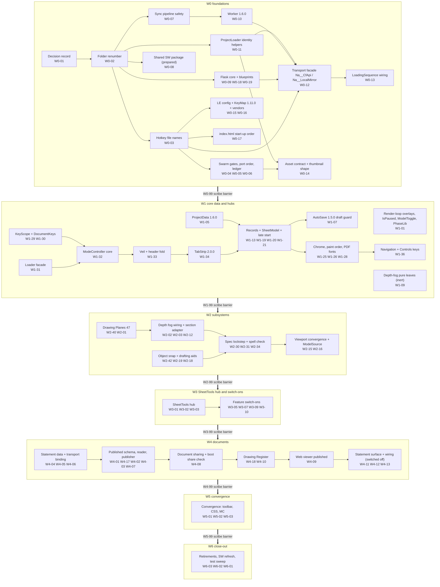

---

### C.3 The system dependency DAG

Each box is a system: a group of K3 packages (ids inside the box). An arrow A -> B means at least one package of B depends on a package of A in `parity/data/wp_canonical.json` `depends_on`, directly or through packages not drawn; the lifted graph (41 systems, 103 edges) is transitively reduced to 36 edges and is acyclic. The thick arrows are K3 rule R11: wave n+1 starts only after wave n's Parity Scribe package (`Wn-99`) has finished. Generated by `parity/report/tools/r3_system_dag.py` from the same data K3 validates (K3 section 13: topological sort of 164 packages, 0 errors); K3's own graph is per package, this one per system. Scribes, the TV lane (WT, DR-36) and W5/W6 internals are not drawn.

**What the chains mean for wiring.**

| Chain | Why it is ordered | Kind |
|---|---|---|
| DEC -> REN -> everything | the renumber (W0-02) runs alone because it rewrites every specifier, CSS `@import` and config path string; all later paths are K2 target paths | true dependency |
| REN -> SYNC -> WORKER -> FACADE <- FLASK, PLID; FACADE -> LSEQ | the facade's bodies call the new Flask routes and feature-detect the new worker routes; the loading sequence initialises the facade and registers the loaded data with it. No feature transport (catalogue g) can land before W0-12, and R8 holds new R2 content until Adam runs W0-07 | true dependency |
| KEYN -> CFG, IDX, GATE, FACADE | W0-03 renames the hotkey files (FR-12, FR-13) and touches files the next packages also edit: the LE config and KeyMap (W0-15), `VV/index.html` (W0-17), `SpecPdf__.js` (W0-12); the gates (W0-04) lint the final names | rename dependency, then hot-file serialisation |
| KEYS, LOADER -> MC -> VEIL -> TABS -> MODEL | KeyScope (W1-29) and the loader facade (W1-31) come before the ModeController realignment; after it the Loader, ModeController and TabStrip hot files are edited in serial order and W1-21's late start (deleting `Na__LeLoad__AnnounceProjectLoad`) lands last on the Loader | partly hot-file serialisation (Loader, ModeController, TabStrip) |
| PDATA -> MODEL -> AUTO, PAINT -> NAV | ProjectData 1.6.0 (W1-05) before the records and the late start; AutoSave 1.5.0 (W1-07) needs `Na__DrawData__IsLoaded` and the late start; Navigation (W1-36) edits files W1-28 also edits | true dependency, then hot-file serialisation |
| PLANES -> FOG | the section adapter's four calls (W2-02) and the fog wiring (W2-03) need the drawing planes | true dependency |
| FOG -> SPEC | W2-34 edits the CSS index after W2-03 | hot-file serialisation (CSS index) |
| SNAP -> SPEC | W2-31 depends on W2-29 (the Patterns panel and hatch ready chain), which depends on the snap switch-over W2-19 | true dependency, through W2-29 |
| SPEC -> VP | W2-16 depends on W2-35 (the Specification Scrapbook), which needs W2-30, W2-31 and W2-34 | true dependency, through W2-35 |
| HUB -> ON | features switch on through the SheetTools hub | true dependency |
| STMTD -> PUB -> SHARE -> REG -> VIEWER -> STMT | W4-07 edits the SheetModel after W4-06; then the Loader, ModeController and TabStrip pass from sharing to the Register, the viewer and the statement wiring in turn | mostly hot-file serialisation |

---

### C.4 The VV adapter seams

A seam is the one place where VV keeps its own body behind TV's path and names. Every seam follows one pattern: TV's file path, file name and exported names; VV's body; a PORT NOTE "Parity: diverged (identical names and signatures, different <what>)" (K2 H3, X3); a line in the Port Record; and a test that pins the shared contract. Section R0's permanent-divergence table (PD-xx) says why each seam exists; this table gives the wiring contract a porter codes against.

| Id | Seam | Where (K2 target) | TV contract -> VV body | Exactly what differs | Owner | DR | R0 |
|---|---|---|---|---|---|---|---|
| S1 | Transport facade | `VVM/80__CloudflareIntegration/Na__CloudflareIntegration__ApiClient__.js` (FR-16), `VVM/03__AppUtils/Na__AppUtils__LocalProjectMirror__.js` (FR-17), two ProjectLoader helpers | all 33 `Na__CfApi__*` and 8 `Na__LocalMirror__*` names with TV's signatures and return shapes; detail below | the worker, the auth key, the R2 prefix, the project identity, the local server and its header; no TV code | W0-11, W0-12 (W0-13 wires it) | DR-27, DR-28, DR-29, DR-30 | PD-03 |
| S2 | Brand and NA content | the ported file's config keys and identity tokens | module code verbatim; TV's key, VV's value (K2 V1); token swaps for identity (K2 H1, C1, B2, K3, K4); NA-only features land off | banner `VALEVISION3D - `; console `[ValeVision3D <System>]`; storage keys `ValeVision3D__AuthoringUnlocked`, `Na__ValeVision__StatementDraft__<id>`, IndexedDB `ValeVision3D__ProjectedLinework`; model categories `ValeVision__<Category>`; sibling files `ValeVision__*__.json` through config; no `window.TrueVision__*` read (S11 below); never `NaProjectPortal`, `30__TrueVision__AppContent`, `/na-apps/...` (PDF.js comes from VV vendor 07), `/q/`, `/s/`; QR off, Hub section excluded, Standard Scrapbook empty, Custom Scrapbook not seeded | every package; W0-15 (config values), W0-16 (vendors) | DR-43, DR-12, DR-21 | PD-12, PD-13, PD-15 |
| S3 | Title block | `LE/10__Core__SheetSurface` title-block renderers and the LE AppConfig | `TitleBlock__Modern__` reads the logo stand-in text from config, so the module is byte-identical; Classic uses Vale's scan | VV-only key `LayoutEditor__TitleBlock__LogoFallbackText` (offered to TV, DR-42 (9)); Classic image = Vale's scan (md5 59777a65, FR-20, copied by W0-16); the Document ID row switched on with VV register values; `LayoutEditor__TitleBlock__QrCellEnabled` false; PDF file names on the document code (S10) | W1-22, W0-16 | DR-43, DR-11, DR-12 | PD-14 |
| S4 | Section adapter and the sign convention | `VVM/40__System__DrawingViewCore/Na__DrawView__SectionAdapter__.js` (today 42) over `VVM/41__System__CrossSectionView/` | TV's 13 exports, all present in both (`Na__DrawView__SectionAdapter__GetActivePlaneId, GetPlaneDefinition, IsCutting, ReapplyClipping, Release, RemovePlane, RenderOverlay, SetActivePlane, SetPlaneDistanceMm, SetPlaneHeightMm, SuspendLiveTool, UpsertHorizontalPlane, UpsertVerticalPlane`); TV 1.0.0 (270 lines) wraps `41__System__SectionCutEngine/Na__SectionCut__Engine__.js`, VV 1.2.0 (497 lines) wraps `Na__CrossSectionView__SystemLogic.js`; W2-02 adds the four calls TV code otherwise makes to TV 41 | VV bodies over the Cross Sections tool; NAMESPACE `Na__DrawSection` (TV `Na__DrawView__SectionAdapter`); sign: TV writes `positionMm = +plane.constant` (`TVM/41__System__SectionCutEngine/Na__SectionCut__Serialize__.js:185-194`), VV writes `-s.plane.constant` (`VVM/41/Na__CrossSectionView__SystemLogic.js:1502`) and applies a position as `normal * position` (:1540-1541): the number means the same cut in both, the engines store `plane.constant` with opposite signs. The per-scene entries differ (VV `CrossSection__SceneBinding__*`, TV camelCase; S12-V01), so TV 41 `SceneData` and `Serialize` are never ported; the section block reaches ProjectData through `Na__DrawData__RegisterSectionBlockProvider` | W2-02 (VV), WT-02 (TV pass-throughs) | DR-26, DR-41, DR-42 | PD-02 |
| S5 | Lazy loader facade | `VVM/LE/01__Core__Loader/Na__LayoutEditor__Loader__.js` (VV-only folder; TV reserves LE/01) | TV callers import editor modules statically; VV answers through `Na__LeLoad__<Verb>(...)` = `Na__LeLoad__WithEditor(editor => editor.mode.Na__LeMode__<Verb>(...), quiet)` (`Loader:388`; e.g. `OpenSpecification`, :606-608) | literal `import()` only (`ImportEditor` :244-251, `ImportTabs` :434-435, Dev :472) so G1 still walks the editor; pre-load answers from the raw block (`RawRecords` :171, `IsAvailable` :503-507); every copied constant has a `CheckNames(editor)` row (:284); stylesheets through `Na__LeLoad__STYLESHEETS` (:125); W1-21 deletes `AnnounceProjectLoad` (:307). The additions per entry point are catalogue (a3) | W1-31, W1-33, W1-34, W4-08, W4-09 | DR-24 | PD-05 |
| S6 | Composer render route | `VVM/40__System__DrawingViewCore/Na__DrawView__RenderPreset__.js` (FR-09; today `42/Na__DrawView__ComposerPreset__.js`) | TV's eight exports `Initialize(context), Enter(options), Exit(), ApplyStyles(styles), RenderFrame(camera), IsActive(), GetCamera(), GetExportOverrides()` | VV body drives the EffectComposer; NAMESPACE `Na__DrawPreset`; `Enter` takes the same `{ camera, styles }` object in both (VV's SnapshotRenderer adds `edgeWidthPx`, VV :502); VV's `RenderFrame()` gains TV's optional `camera` argument in W0-02, because TV's SnapshotRenderer passes one (TV :938; K2 TargetMaps :248-249); VV's `Initialize` context is `{ renderer, scene, camera, pipelineRef }`. Fog: `Na__ElevFog__RenderOverlay` once after `composer.render()` and before `drawOverlay` inside `RenderFrame`, never in the loading sequence; `GetExportOverrides` gains a fog-only member that VV's TiledRenderer calls per tile before the section overlay; TiledRenderer gains an opt-in `renderFrame` callback route for SnapshotRenderer's fog (reverses TV TiledRenderer's PORT NOTE on purpose) | W0-02, W2-03, W2-12 | DR-04, DR-15, DR-32 | PD-01 |
| S7 | Layout Mode switch | `VVM/40/Na__DrawView__ProjectData__.js` (key), LE ModeController, Loader, TabStrip | TV: the strip shows when the editor is enabled and a sheet exists (TV TabStrip :316) | VV-only key `LayoutEditor__DrawingsData__LayoutModeEnabled` (absent = off) with `Na__DrawData__GetLayoutModeEnabled()` / `SetLayoutModeEnabled(enabled)` (ProjectData :323-334); `Na__LeMode__IsAvailable()` = config enabled and switch on and at least one sheet (ModeController :327-330), `IsLayoutModeOn()`, `SetLayoutMode(enabled)` (leaves an open sheet first, :347-354); loader twins `Na__LeLoad__IsAvailable`, `IsLayoutModeOn`, `SetLayoutMode` (:503-513, :614-620); TV's TabStrip 2.0.0 is ported with `IsAvailable` in place of TV's test; the stale comment at ProjectData :319-321 is corrected; 7 VV-only exports and 5 label keys stay | W1-05, W1-31, W1-34, W2-17; re-decided W4-09 | DR-25 | PD-05 |
| S8 | 3D key handler gate | `VVM/03__AppUtils/Na__AppUtils__ValeVision__HotkeyHandler__.js` (twin of TV `10/Na__Hotkeys__Manager.js`) | TV's KeyScope contract (`Na__KeyScope__Is`, `IsTypingTarget`, `ControlKeepsKey`) | VV keeps its handler, root key `Na__ValeVision__HotkeysDictionary` and `ValeVision__*` actions; it gains only the KeyScope guard; file names are TV's (FR-12, FR-13) | W0-03, W1-29 | DR-33 | PD-11 |
| S9 | Data-path gate | Assets `CanUpload`, folder-50 Persistence bake-before-save, `R2AssetUpload` | TV gates on `Na__DevGate__IsAuthoringEnabled()` (TD01) | VV gates on `Na__AppUtils__IsRunningOnLocalhost()` (`ProjectLoader.js:303-307`; Persistence `:596-597`); `R2AssetUpload` returns a silent skip off localhost and never throws (TV contract) | W0-14 | DR-31 | PD-07 |
| S10 | Document code | `Na__DrawData__GetDocumentCode()` (VV-only export of ProjectData) | TV's `?project=` is a bare code (`?project=XX00`, TV ProjectLoader :81-86); VV's `?project=` token can be `2026/3047__Doous`, which would print `2026/3047__Doous_T01_D01` (S07a-V01, DR-11) | projectCode of the loaded document (through `Na__CfApi__GetLoadedProjectData()`), falling back to the master-index entry; `Na__DrawData__GetProjectCode()` stays the transport token; one marked seam each in SheetRecords' DrawingNumber default, SpecPdf number, `Na__LePdf__Filename`, Register__Pdf and Sheet Images until TV adopts the accessor | W1-12 | DR-11 | - |
| S11 | Project display name | `Na__CfApi__GetProjectDisplayName()` (VV-only facade export) | TV reads `window.TrueVision__Pwa__ProjectContext` (SpecPdf :141, SpecDocument :161, Register__Pdf :213, Panel__ScrapbookParametric :290, Statement TrueVisionHub :206; K3 section 11) | reads root `projectName` / `displayName` / `projectNameAlias` of the loaded data; one marked line per reader | W0-12 | DR-27 (K2 K4) | PD-12 |
| S12 | Unsaved-work flag | AutoSave publishes; WCP registrar reads | TV `window.TrueVision__Pwa__HasUnsavedWork` (TV AutoSave :566; TV registrar :59, :133-134, :167) | neutral `window.Na__Pwa__HasUnsavedWork` from `Na__LeAuto__HasUnsavedWork`; the AutoSave line is re-applied after W1-07's whole-file take | W0-08, W1-07 | DR-07 | PD-04 |
| S13 | Thumbnail call shape | `Na__PresentationMode__Thumbnail__CaptureAndUpload` | TV `(sceneId, targetWidthPx)` (TV renderer :261) | VV `(sceneId, projectCode, showToast)` (VV renderer :229) also accepts TV's shape (a number second argument is the width), so Update All Thumbnails works; the three-argument form stays byte-compatible | W0-14 | DR-27 | - |
| S14 | Snapping shim | `LE/30__System__SheetTools/Na__LayoutEditor__Snapping__.js` (FR-14, deleted by FR-15) | TV kept `Snapping__.js` 1.5.0 as a short-lived re-export until its last importer was repointed to ObjectSnap (TV `28__System__ObjectSnap/Na__LayoutEditor__ObjectSnap__.js:60-63`) | VV's shim imports only `__Search__` and `__State__`, declares `TONE_VERTEX`, `TONE_DIMENSION`, `TONE_VIEWPORT` locally (never the controller, to stay cycle-free); deleted by W3-08 | W2-19, W3-08 | DR-05 | - |
| S15 | ProjectRecord facts | `LE/07__Core__SheetData/Na__LayoutEditor__ProjectRecord__.js` | TV reads NA Project Admin documents and a PlanVision fallback over the CfApi admin/plans locations | VV body: `clientDrawingName` and `siteAddress` from the project root through `GetLoadedProjectData()`; `AdminFileLocation` / `PlansFileLocation` answer null | W1-12 | DR-27 | PD-19 |
| S16 | Statement identity | Statement data, transport and drafts | TV's `{code}` comes from its bare `?project=` code (TV ProjectLoader :81-86) | `{code}` = the document code (S10), never the `?project=` folderId with its `/` (S07b-V02); drafts `Na__ValeVision__StatementDraft__<id>`; index name from config | W4-06 | DR-11, DR-29 | PD-12 |
| S17 | Share links | `LE/66__Feature__DocumentSharing` | TV's code pattern and NA base | `CODE_PATTERN` replaced by a project-token pattern admitting `/`, `_`, `-`, `.` and the three space-containing folders; NA base and "Noble Architecture" fallback replaced; document keys and `?open=` verbatim; never a bare code while codes collide | W4-07, W4-08 | DR-23 | PD-15 |
| S18 | Published reader URLs | `52__System__Layout__PublishedDocuments/Na__PubDoc__Urls__.js` | R2 first live, repository first on localhost, no retry on a 404 | the localhost first URL must be 404-honest and the live URL is built from the configured R2 base, never through `ResolveAssetUrl` (catalogue g1, C.5) | W4-17 | DR-22, DR-29 | - |
| S19 | Site-plan store | `LE/21` site-plan Store (dormant) | TV reads `cdn.noble-architecture.com/NaProjectPortal` | facade names and VV identity; TV folder names inside VV's prefix; manifest stems `TrueVision__SitePlan__` -> `ValeVision__SitePlan__` on read, both accepted (S04a-V04) | W2-14 | DR-08, DR-29 | - |
| S20 | Cross Section Dev ids | `VV/index.html:855-866`, 41 DevControls :79-83 | TV 48 placeholder uses `naCrossSectionDev*` | VV renames its own ids to `naCrossSectionToolDev*`, so TV's 48 file ports byte for byte | W2-05 | DR-26 | PD-17 |
| S21 | Plan and elevation mode controllers | `VVM/42__System__FloorPlanViews`, `VVM/45__System__ElevationViews` (targets) | TV 1.1.0 controllers call 41 directly | VV keeps its 1.2.2 / 1.1.1 controllers (SectionAdapter, RenderPreset, MaterialPreset, Transitions); adds only TV's fog-source hook (W2-03) and the `returnToOrbit` option (W1-04); VV-only menu features re-applied in TV's 2.x editors (W2-04, W2-05) | W1-04, W2-03, W2-04, W2-05 | DR-32 | PD-06 |
| S22 | Tab-code leaf | `LE/07__Core__SheetData/Na__LayoutEditor__DrawingCode__.js` (VV-only leaf) | TV keeps its tab-code rules inside SheetRecords | the loader needs tab codes before the editor loads (`Na__LeLoad__GetShortCode`, `GetDrawingNumber`, Loader :547-548); SheetRecords 1.39.0 is taken whole with its imports of the leaf kept and `Na__LeRec__SheetShortCode` exported until W1-21; offered to TV (WT-10) | W1-19, W1-21 | DR-24, DR-42 | PD-05 |
| S23 | Rename restamp route | `VVM/40__System__DrawingViewCore/Na__DrawView__RenameDrawing__.js` (today 42) | TV lazily imports `LE/20__System__Viewports/Na__LayoutEditor__Viewport3d__.js` for `Na__LeVp3d__RestampForScene` (TV :126-138) and renames section keys through TV 41 (`Na__SectionCut__SceneData__.js`, :118) | VV imports `Na__LeLoad__PrepareRestamp(sceneId)` (async) and `Na__LeLoad__RestampForScene(sceneId)` from the loader (VV :121; Loader :671, :681), so no editor module is pulled in, and `Na__SectSceneData__RenameSceneKey` from its own 41 (VV :120); TV's StageHolders, StageFloorPlan and StageElevation are re-applied on this route | W1-06 | DR-24, DR-41 | PD-05 |

**S1 in detail - the facade contract.** TV signatures and return shapes from `TVM/80__CloudflareIntegration/Na__CloudflareIntegration__ApiClient__.js` (exports :1184-1218) and `TVM/03__AppUtils/Na__AppUtils__LocalProjectMirror__.js` (exports :435-444); VV bodies per S12 b.4 and K3 W0-12. Every function resolves `{ ok:false, error }` and never throws.

| TV name (signature -> result) | VV body | What differs from TV |
|---|---|---|
| `Initialize(workerBaseUrl)` (sync, :131) | `async Initialize()`, awaited by VV's LoadingSequence after the master index (W0-13): fetches `/api/editor-config` on localhost, reads `/api/editor/health` once for `{ version, routes }`, caches the folderId | async and argument-free; off localhost resolves `{ configured:false }` |
| `IsConfigured()` -> boolean (:144) | `Boolean(config && folderId)` | false off localhost and whenever the master index has no entry for the URL token (writes refused) |
| `GetProjectContext()` -> `{ projectFolder, yearCode, projectCode }` (:168) | `{ projectFolder:'3047__Doous', yearCode:'2026', projectCode:'3047', folderId:'2026/3047__Doous' }` | 4-digit year, extra `folderId`; identity only from the URL token through the master index |
| `SetLoadedProjectData(d)`, `GetLoadedProjectData()` (:152, :160) | in-memory; set by W0-13 before the drawings dispatch; kept current after every successful merge | none (VV must also apply a merge-keys `set`/`remove` to the in-memory copy, as TV's :361, :376 do) |
| `BuildContentCdnUrl(folder, year, rel)` (:208) | `${R2Base}/${year}/${folder}/${rel}` | VV prefix; no `30__TrueVision__AppContent` level |
| `ReadProjectData()` -> `{ ok, data, missing }` (:294) | worker `GET .../project` when listed, else CDN no-store | route and transport only |
| `WriteProjectData(doc)` (:311) | existing save route (needs `projectCode`, bumps the manifest) | not used by TV modules outside the client |
| `MergeAndSaveKeys(partial)` queued (:349) | merge-keys when listed, else whole-document save over a fresh Flask base (localhost) or the loaded copy | the merge moves to the server; `drawingsBase` guard optional (DR-30) |
| `DeleteProjectKeys(names)` (:369) | merge-keys `{ remove }` | `remove` must accept `valeVision_Camera__DefaultPosition` |
| `WriteThumbnailWebp(sceneId, blob)` -> `{ ok, relUrl }` (:410) | existing `/assets` | route only |
| `WriteProjectAsset(rel, payload, type)` -> `{ ok, relUrl, publicUrl }` (:452) | existing `/assets`, later `files/upload` | same three-root guard |
| `ProjectFileLocation(name)` -> `{ key, cdnUrl, repoUrl }` or null (:616) | allow-list `ValeVision__DrawingNotes__.json`, `ValeVision__StatementDocs__.json`; `repoUrl = new URL('../Whitecardopedia/Projects/' + folderId + '/' + rel, AppRootUrl)` with `AppRootUrl = new URL('../../', import.meta.url)` | file names and URL roots (correct on Flask and on the GitHub Pages sub-path) |
| `ReadProjectFile(name)` -> `{ ok, data, missing }`, `WriteProjectFile(name, doc)` (:634, :735) | `/drawing-notes` or `files/read`; `files/write` (before the deploy, `/drawing-notes` POST) | routes |
| `StatementFileLocation(path)`, `ReadStatementFile(path)` -> `{ ok, text, missing }`, `WriteStatementFile(path, payload, type)` -> `{ ok, publicUrl, key, path }` (:651, :722, :684) | TV's segment, suffix and depth rules verbatim; root `10__StatementDocs/`; `files/*` | root folder and routes |
| `AdminFileLocation(name)`, `PlansFileLocation(name)` (:566, :600) | always `null` | VV has no admin or PlanVision files |
| `SHEET_IMAGES_DIR`, `SHEET_IMAGES_ARCHIVE` | `'05__Layout__DrawingDocs__Images'`, `'00__Archive'` | same values (DR-29) |
| `SheetImageLocation(folder, file)`, `SheetImagesPrefix()`, `ListSheetImages()`, `UploadSheetImage(folder, file, blob)`, `CopySheetImage(from, to, file)`, `DeleteSheetImage(folder, file)` (:790-971) | TV regexes; `files/list`, `files/upload`, `files/copy` (fallback CDN read + upload, as TV), `files/delete` | routes; managed-name delete enforced on the server too |
| `PublishedLocation(rel)`, `PublishedPrefix(docId)`, `ListPublished(docId)`, `UploadPublished(rel, blob)`, `DeletePublished(rel)` (:1027-1154) | TV rules verbatim, archive refused; `files/*`; TV's two cache policies | routes; one-document delete scope enforced on the server |
| `GetProjectDisplayName()` | VV-only additive export (S11) | - |
| `Na__LocalMirror__MergeKeys(partial, { drawingsBase })` -> `{ ok, skipped, error, conflict?, drawings?, backup? }` queued (:230) | fresh `GET /api/projects/<folderId>` -> merge -> `POST` with `X-ValeVision-Drawings-Base` (`'none'` for null) | route addressing: TV `/api/projects/<code>?project-folder=&year=` with files under `na-project-portal/<yy>-Projects/<folder>/30__TrueVision__AppContent/` (:131-149); VV `/api/projects/<folderId>` with `Whitecardopedia/Projects/<yyyy>/<folder>/project.json`; header `X-ValeVision-*` (TV `X-TrueVision-Drawings-Base`, :108) |
| `Na__LocalMirror__DrawingsFingerprint()` -> `{ ok, skipped, unsupported, error, drawings }` (:278) | `GET /api/projects/<folderId>/drawings-fingerprint` | TV reads a JSON 404 as "project not found" (:289-291); VV must read today's JSON 404 from `get_project` (`server.py:408-418`) as `unsupported`, or saves would be refused until W0-09 lands |
| `Na__LocalMirror__WriteSiblingFile(name, doc)` | `POST /api/projects/<folderId>/files/<name>`; before W0-09, the notes file through `/drawing-notes` | route |
| `Na__LocalMirror__StatementTree()`, `WriteStatementFile(path, text)`, `MakeStatementFolder(path)`, `MoveStatement(from, to)`, `DeleteStatement(path)` | `/api/valevision/statements/*` | route prefix; service name `'whitecardopedia-local-dev'` (TV `'na-projectvision-local-dev'`, :107) |
| `Na__AppUtils__GetProjectFolderFromUrl()`, `Na__AppUtils__GetYearFromUrl()` (ProjectLoader) | `'3047__Doous'`, `'2026'`; null until the master index has settled; `?project-folder=` and `?year=` still honoured | 4-digit year and no `'26'` default (TV :101-103): a guessed year would send writes to a wrong prefix |

---

### C.5 Source conflicts resolved

| Conflict | Sources | Resolution and how |
|---|---|---|
| Local-server probe for ported modules | K3 W2-34 text says "/api/check-localhost probe"; K1 DR-28 (A) adds `/api/health` with service `whitecardopedia-local-dev` and changes one SERVICE constant per module | Follow DR-28 (A): K1 is the decision record and W0-09 lands `/api/health` long before W2-34; TV's probe sites are single constants (`SpellCheck__Dictionary__.js:97`, `SheetImages__Store__.js:62`, `LocalProjectMirror__.js:107`). VV's existing ScrapbookCustom transport keeps `/api/check-localhost` (VV :84, an adaptation already shipped, S06a :255). K3's W2-34 wording needs aligning (C.6) |
| Where the reader finds published files on localhost | K3 W4-17 gives `http://127.0.0.1:8000/Projects/{folderId}/06__...`; K3 W0-19 says nothing reads through `serve_static` | Read `server.py`: `/Projects/...` matches only the catch-all, which answers `index.html` with 200 for a missing file (:956-977), breaking the reader's "a 404 is an answer" rule (S08 :170-173); `/Whitecardopedia/<path>` answers real JSON 404s (:899-909). Use `/Whitecardopedia/Projects/{folderId}/...` (the facade's `repoUrl` form) or have W0-19 make `/Projects/` 404-honest |
| Does Flask pick up new routes without a restart? | K3 W0-09 risk line: "Flask does not reload routes (restart needed)"; S12 b.6: `debug=True`, routes load on save | Read the code: `app.run(..., debug=True)` (`server.py:1007-1011`), started by `python server.py` (`start_server.bat:33`), so Werkzeug's reloader restarts on a source change. A restart is needed only for a server started another way; not tried at runtime |
| Does the worker need "JSON 404 for unknown /api/*"? | K3 W0-10 lists it as new work | Read `index.js`: unmatched routes already answer JSON 404 (:221-225); the real gap is that any POST under `/api/editor/projects/` falls into the generic save route (:211-219) and is refused only for lacking `projectCode` (`ProjectEditor__.js:221-225`). The fix is W0-10's folderId validation plus the facade's capability check (S12 b.5 verifier) |
| TV worker origin policy | `wrangler.toml` has a production override (`ENVIRONMENT = "production"`, :47-50) | `deploy.bat` runs a plain `wrangler deploy`, so the top-level `development` value applies and any origin is echoed (`Main__.js:168-171`), as S12 says. Irrelevant to VV beyond "never copy" |
| FolderId pattern for the new routes | S08's stricter pattern vs the rename handler's | the rename pattern (`ProjectRename__.js:84`): S08's would refuse the three space-containing 2025 projects (S08-V06, S12 b.5 census) |
| Year default | S12 first proposed `'2026'`; its verifier corrected it to null | null until resolved: a guessed year sends writes to a wrong prefix; TV's `'26'` default (TV ProjectLoader :103) is a TV-layout convenience |
| Upload gate | TV Assets and Persistence gate on DevGate; VV's DevGate PORT NOTE keeps the data path on the hostname test | DR-31 item 2: the hostname test (seam S9); an unlocked live session would otherwise render, then fail the upload |
| Transport ownership | per-feature VV clients (S07b, S08: `R2StatementDocs`, `R2PublishedDocs`) vs one facade (S12) | DR-27 (A): one facade; no per-document client is created (K3 W0-19); `R2DrawingNotes` retires in W2-33 once the specification transport ports verbatim onto the facade (W2-30, K3 section 11) |
| "No file under VVM imports 80__CloudflareIntegration" | older slice acceptance line vs DR-27 | replaced by G6 (K3 :29, section 11) |
| Fog overlay placement | WP-S09-08 put a fog call in the loading sequence; S02b-F41 inside `RenderFrame` | inside `RenderFrame` (W2-03; catalogue a2): a loading-sequence call draws the fog two or three times per frame |
| VV North listeners after a whole-file take | S09-F39 says re-add VV-only listeners; DR-32 says drop VV's compass listeners | DR-32 for North only: TV's overlays registry replaces them (W1-11; catalogue e3) |
| Late start | VV loader re-announces `'loaded'`; TV's SheetModel late start | W1-21 deletes `Na__LeLoad__AnnounceProjectLoad` and takes TV's late start (checklist step 3b) |
| F = Zoom Fit | S09-F06's verifier note | not a regression (catalogue f4) |
| Folder numbers in S09's tables | S09 used VV's numbers 42..47 | superseded by the W0-02 renumber: this section uses K2 target paths throughout |

### C.6 Open issues

| Issue | Why it matters | Next step |
|---|---|---|
| K3 W2-34 still names the `/api/check-localhost` probe | contradicts DR-28 (A) and adds a code seam where a constant would do | align the W2-34 text with DR-28 (A) before the package is handed out |
| W4-17's localhost URL reads through the catch-all | a missing published file would answer `index.html` with 200 and the reader would show a parse failure instead of the "not published" mask | pick `/Whitecardopedia/Projects/...` in W4-17 or a real 404 under `/Projects/` in W0-19 |
| K3 W0-09's "restart needed" risk line | it contradicts the code (`debug=True`) | confirm on Adam's machine; the line can then go |
| The worker's merge-keys guard uses prefix families while `ProjectData__EditorOwnedKeys` lists exact keys (S12 b.5, b.7) | a listed key outside the families would be refused by the worker; an unlisted key inside a family would pass the worker but be dropped by the sync | W0-10 derives its families from the list, or its tests cover both directions |
| SectionAdapter's four new export names | W2-02 defines them; TV's pass-throughs (WT-02) need DR-36 (b) | fix the names in W2-02 and record them for WT-02 |
| R2 state not verified | whether the sync purge has already deleted thumbnails or snapshots, which worker version is deployed (so whether `/drawing-notes` is live), whether `ALLOWED_ORIGIN` names the GitHub Pages origin, Cloudflare body and CPU limits (S12 "Still unverified") | Adam checks before W0-07 is applied and before the first raw upload |
| Which service-worker file the deployed site registers | `WebApps/live_sw.js` is a stale copy (token `2026-09-10-6`); K3 section 14 lists this too | confirm before W0-08 is handed to Adam |
| Adam-only actions gate the transport | W0-07 sync fix (R8), the worker deploy (W0-10), the shared token bump (DR-07), the Layout Mode re-decision (W4-09, DR-25), TV-side fixes (DR-36: WT-02, DR-41's sign fix, DR-42 offers) | Section F schedules them |
| Static scans | the event and shared-surface counts come from static scans that miss listeners registered from arrays or unresolved constants (S09-V04) | G1, G2 and the per-package grep acceptance remain the proof |
| Not run | nothing in this section was run in a browser, against the Flask server or against the worker; line numbers are at TV `b2aa9151` and VV `7b4e593a` (W0-02 changes VV paths; lines move only where it rewrites a header or PORT NOTE) | Adam tests in the app (checklist step 14) |
| K3 section 14 items that touch wiring | the devlog version step (patch vs minor, decided in W0-01) and the K3-proposed names used here (`Na__CfApi__GetProjectDisplayName`, the VV-only tests and verifiers) | answered in W0-01 |
