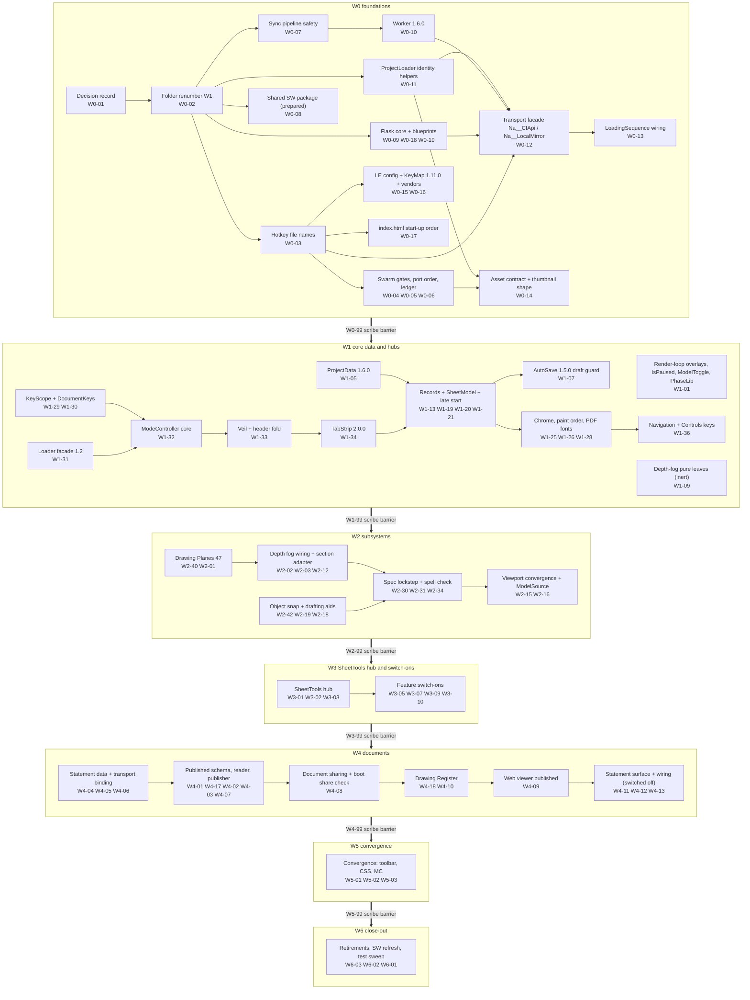

```mermaid
flowchart TD
    subgraph W0["W0 foundations"]
        DEC["Decision record<br>W0-01"]
        REN["Folder renumber W1<br>W0-02"]
        KEYN["Hotkey file names<br>W0-03"]
        GATE["Swarm gates, port order, ledger<br>W0-04 W0-05 W0-06"]
        SYNC["Sync pipeline safety<br>W0-07"]
        SW["Shared SW package (prepared)<br>W0-08"]
        FLASK["Flask core + blueprints<br>W0-09 W0-18 W0-19"]
        WORKER["Worker 1.6.0<br>W0-10"]
        PLID["ProjectLoader identity helpers<br>W0-11"]
        FACADE["Transport facade Na__CfApi / Na__LocalMirror<br>W0-12"]
        LSEQ["LoadingSequence wiring<br>W0-13"]
        ASSET["Asset contract + thumbnail shape<br>W0-14"]
        CFG["LE config + KeyMap 1.11.0 + vendors<br>W0-15 W0-16"]
        IDX["index.html start-up order<br>W0-17"]
    end
    subgraph W1["W1 core data and hubs"]
        RLOOP["Render-loop overlays, IsPaused, ModelToggle, PhaseLib<br>W1-01"]
        PDATA["ProjectData 1.6.0<br>W1-05"]
        AUTO["AutoSave 1.5.0 draft guard<br>W1-07"]
        MODEL["Records + SheetModel + late start<br>W1-13 W1-19 W1-20 W1-21"]
        KEYS["KeyScope + DocumentKeys<br>W1-29 W1-30"]
        LOADER["Loader facade 1.2<br>W1-31"]
        MC["ModeController core<br>W1-32"]
        VEIL["Veil + header fold<br>W1-33"]
        TABS["TabStrip 2.0.0<br>W1-34"]
        NAV["Navigation + Controls keys<br>W1-36"]
        PAINT["Chrome, paint order, PDF fonts<br>W1-25 W1-26 W1-28"]
        FOGL["Depth-fog pure leaves (inert)<br>W1-09"]
    end
    subgraph W2["W2 subsystems"]
        PLANES["Drawing Planes 47<br>W2-40 W2-01"]
        FOG["Depth fog wiring + section adapter<br>W2-02 W2-03 W2-12"]
        VP["Viewport convergence + ModelSource<br>W2-15 W2-16"]
        SNAP["Object snap + drafting aids<br>W2-42 W2-19 W2-18"]
        SPEC["Spec lockstep + spell check<br>W2-30 W2-31 W2-34"]
    end
    subgraph W3["W3 SheetTools hub and switch-ons"]
        HUB["SheetTools hub<br>W3-01 W3-02 W3-03"]
        ON["Feature switch-ons<br>W3-05 W3-07 W3-09 W3-10"]
    end
    subgraph W4["W4 documents"]
        PUB["Published schema, reader, publisher<br>W4-01 W4-17 W4-02 W4-03 W4-07"]
        SHARE["Document sharing + boot share check<br>W4-08"]
        REG["Drawing Register<br>W4-18 W4-10"]
        VIEWER["Web viewer published<br>W4-09"]
        STMTD["Statement data + transport binding<br>W4-04 W4-05 W4-06"]
        STMT["Statement surface + wiring (switched off)<br>W4-11 W4-12 W4-13"]
    end
    subgraph W5["W5 convergence"]
        CONV["Convergence: toolbar, CSS, MC<br>W5-01 W5-02 W5-03"]
    end
    subgraph W6["W6 close-out"]
        CLOSE["Retirements, SW refresh, test sweep<br>W6-03 W6-02 W6-01"]
    end
    DEC --> REN
    REN --> KEYN
    REN --> SYNC
    REN --> SW
    REN --> FLASK
    REN --> PLID
    KEYN --> GATE
    KEYN --> FACADE
    KEYN --> CFG
    KEYN --> IDX
    GATE --> ASSET
    SYNC --> WORKER
    FLASK --> FACADE
    WORKER --> FACADE
    PLID --> FACADE
    PLID --> ASSET
    FACADE --> LSEQ
    PDATA --> MODEL
    MODEL --> AUTO
    MODEL --> PAINT
    KEYS --> MC
    LOADER --> MC
    MC --> VEIL
    VEIL --> TABS
    TABS --> MODEL
    PAINT --> NAV
    PLANES --> FOG
    FOG --> SPEC
    SNAP --> SPEC
    SPEC --> VP
    HUB --> ON
    PUB --> SHARE
    SHARE --> REG
    REG --> VIEWER
    VIEWER --> STMT
    STMTD --> PUB
    W0 ==>|W0-99 scribe barrier| W1
    W1 ==>|W1-99 scribe barrier| W2
    W2 ==>|W2-99 scribe barrier| W3
    W3 ==>|W3-99 scribe barrier| W4
    W4 ==>|W4-99 scribe barrier| W5
    W5 ==>|W5-99 scribe barrier| W6
```
<!-- systems 41, lifted edges 103, after reduction 36, acyclic yes -->
